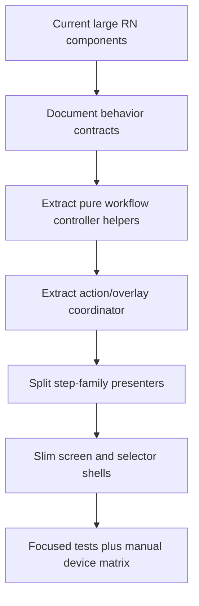

# Plan: Mobile Invoice Form Architecture Refactor

## Type
Feature

## Status
Proposed

## Created Date
2026-06-19

## Last Updated
2026-06-19

## Goal Or Problem
The mobile sales invoice form has accumulated too much workflow, layout, modal, and domain coordination logic in a few large React Native components. Recent recurring regressions around inline workflow `Proceed`, sticky workflow controls, footer hiding, Moulding selection, Door Size, and HPT handoff indicate that behavior is coupled across component boundaries that are hard to reason about and hard to validate.

## Current Context
- `apps/expo-app/src/features/sales/invoice-form/components/workflow-step-selector.tsx` is about 2,061 lines and currently owns workflow step selection, component grid rendering, Moulding quantity controls, Door Size modal wiring, HPT handoff, custom component action positioning, sticky header publication, inline/overlay mode differences, and Proceed visibility/rendering.
- `apps/expo-app/src/features/sales/invoice-form/components/invoice-form-screen.tsx` is about 905 lines and owns form shell, recovery, footer, sticky workflow header, inline Proceed overlay, customer/detail routing, save actions, and scroll/keyboard orchestration.
- `apps/expo-app/src/features/sales/invoice-form/components/line-item-card.tsx` and `apps/expo-app/src/features/sales/invoice-form/store/use-invoice-form-store.ts` are also over 1,000 lines each, increasing the blast radius of edits.
- Shared domain helpers under `packages/sales/src/sales-form` are a useful boundary, but the mobile UI still mixes state derivation, mutations, step routing, and presentation in large components.
- Existing focused tests cover some pure helpers, but React Native shell interactions still depend heavily on manual device testing.

## Proposed Approach
Refactor incrementally around explicit boundaries instead of rewriting the sales form. Treat the existing behavior as the compatibility target, extract pure state machines and small UI controllers behind tests, then slim the large components into composition shells.

The target architecture should separate:
- workflow route/state derivation
- component selection and grouped-row mutations
- floating/sticky action coordination
- step-family editors
- modal ownership
- screen shell/keyboard/footer orchestration

Do not introduce a new global framework. Prefer package-owned pure helpers, existing store actions, and focused React Native components with narrow props.

## Visual Plan

## Implementation Steps
- Inventory current responsibilities and write behavior contracts for inline selector, overlay selector, Door, Moulding, HPT, Custom, footer, sticky header, and item sheet flows.
- Extract a pure workflow selection controller from `workflow-step-selector.tsx` that returns active step facts, selected counts, visible components, proceed visibility, and next action intent.
- Extract a screen-owned action coordinator for footer, Proceed, Custom, sticky header, and keyboard-safe offsets with one data contract and no React node handoff from children.
- Move Door Size, Moulding grid/qty controls, Custom action, and HPT inline handoff into dedicated step-family components that receive controller state and dispatch typed intents.
- Keep shared package mutations in `@gnd/sales/sales-form-core`; move any remaining business derivation out of React components when it affects save/pricing/routing behavior.
- Add focused tests for controller outputs and action coordinator behavior before deleting old branches.
- Run a manual device matrix for Door multi-select, Moulding multi-select, HPT add door, Custom component, sticky search header, footer hide/reveal, item sheet, edit reopen, and quote mode.

## Affected Files Or Areas
- `apps/expo-app/src/features/sales/invoice-form/components/workflow-step-selector.tsx`
- `apps/expo-app/src/features/sales/invoice-form/components/invoice-form-screen.tsx`
- `apps/expo-app/src/features/sales/invoice-form/components/items-step.tsx`
- `apps/expo-app/src/features/sales/invoice-form/components/line-item-card.tsx`
- `apps/expo-app/src/features/sales/invoice-form/store/use-invoice-form-store.ts`
- `apps/expo-app/src/features/sales/invoice-form/steps/`
- `packages/sales/src/sales-form/`
- `brain/features/mobile-invoice-form.md`

## Acceptance Criteria
- `workflow-step-selector.tsx` becomes a small orchestration component rather than the owner of every step-family behavior.
- Inline and overlay workflow modes use the same tested state derivation and only diverge at presentation/layout boundaries.
- Proceed visibility and placement are determined by a single action coordinator contract and do not require child components to pass React nodes upward.
- Door, Moulding, HPT, Custom, Service, and Shelf flows have step-family components or controllers with focused tests.
- Regressions in one step family do not require edits across unrelated footer, sticky header, modal, or screen shell code.

## Test Plan
- Focused unit tests for workflow state derivation, selected counts, proceed visibility, route advancement, and action offsets.
- Focused tests for Door/Moulding/HPT grouped-row mutations through shared sales-form helpers.
- Existing native UI boundary and sales-form-core native-safety tests remain passing.
- Manual Expo device matrix for create/edit invoice and quote flows across Door, Moulding, HPT, Custom, Service, Shelf, item sheet, footer hide/reveal, and keyboard input behavior.

## Risks / Edge Cases
- Incremental extraction can accidentally change persisted `formSteps` or grouped-row metadata shape.
- The old web workflow and mobile workflow share package helpers but not presentation assumptions; extraction must not import web UI into Expo.
- Keyboard, sticky header, and footer overlays are platform-sensitive on Android and iOS.
- Existing dirty worktree and ongoing mobile sales-form changes may make refactor sequencing difficult.

## Open Questions
- TODO: Decide whether this refactor should start with the action coordinator or the workflow state controller.
- TODO: Define the manual device matrix owner and minimum device/OS coverage.
- TODO: Decide target maximum line count or responsibility budget for each resulting component.

## Linked Task
- Task Title: Mobile Invoice Form Architecture Refactor
- Task File: brain/tasks/roadmap.md
