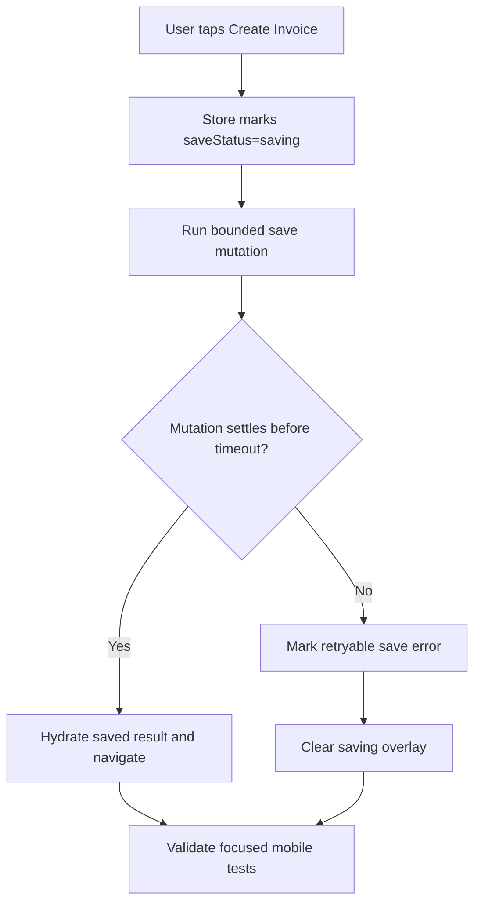

# Plan: Mobile Invoice Save Stuck

## Type
Bug Fix

## Status
Done

## Created Date
2026-06-23

## Last Updated
2026-06-23

## Goal Or Problem
Mobile invoice creation can remain stuck on `Saving invoice...` when the save request or follow-up save path does not settle. Users need the create/save flow to either complete or return to a retryable error state.

## Current Context
The Expo invoice form saves through `apps/expo-app/src/features/sales/invoice-form/components/invoice-form-screen.tsx`, `useInvoiceFormActions`, and the `newSalesForm.saveDraft` / `newSalesForm.saveFinal` tRPC mutations. The API already bounded post-save queue work for inventory sync and document warmups, but document snapshot expiration still ran before the response and the mobile overlay was driven by React Query mutation pending state, so a slow post-save path or client-side hung mutation could keep the UI blocked.

## Proposed Approach
Added a bounded mobile save await path and drive the visible saving overlay from the invoice form store's save state. If a save request does not settle within the mobile timeout, the form is marked with a retryable save error so the overlay clears and the user can try again.

## Visual Plan

## Implementation Steps
- Done: Added a focused mobile save timeout helper with tests.
- Done: Wrapped draft/final save awaits with the helper.
- Done: Bounded server-side sales-document snapshot expiration as best-effort post-save work.
- Done: Routed Expo tRPC mutations through an unbatched HTTP link so saves do not wait on unrelated batched queries.
- Done: Used store `saveStatus` for the saving overlay and footer disabled state.
- Done: Updated Brain feature/progress notes.
- Done: Ran focused tests for the helper and existing invoice store/save coverage.

## Affected Files Or Areas
- apps/expo-app/src/features/sales/invoice-form/components/invoice-form-screen.tsx
- apps/expo-app/src/features/sales/invoice-form/lib/mobile-save-timeout.ts
- apps/expo-app/src/features/sales/invoice-form/lib/mobile-save-timeout.test.ts
- apps/expo-app/src/trpc/client.tsx
- apps/api/src/db/queries/new-sales-form.ts
- brain/api/contracts.md
- brain/features/mobile-invoice-form.md
- brain/progress.md

## Acceptance Criteria
- Done: A hung mobile invoice save no longer leaves the UI permanently blocked on `Saving invoice...`.
- Done: Slow document/cache invalidation no longer blocks the save response until the mobile client timeout.
- Done: Mobile save mutations no longer share a tRPC batch with concurrent queries.
- Done: Successful save behavior remains unchanged.
- Done: Save failures show a retryable footer error.

## Test Plan
- Passed: `bun test apps/expo-app/src/features/sales/invoice-form/lib/mobile-save-timeout.test.ts apps/expo-app/src/features/sales/invoice-form/store/use-invoice-form-store.test.ts apps/api/src/db/queries/new-sales-form-post-save.test.ts`
- Passed: `bunx biome check apps/expo-app/src/features/sales/invoice-form/lib/mobile-save-timeout.ts apps/expo-app/src/features/sales/invoice-form/lib/mobile-save-timeout.test.ts`

## Risks / Edge Cases
- Retrying after a network timeout could race an original request that later reaches the server; this fix should prefer visible recovery while preserving the existing server save contract.
- Mobile manual device QA is still needed to prove behavior against real network interruption.

## Open Questions
- TODO: Confirm whether the user saw the hang on a physical device, emulator, or Expo web preview for manual QA follow-up.

## Linked Task
- Task Title: Mobile Invoice Save Stuck
- Task File: brain/tasks/done.md
