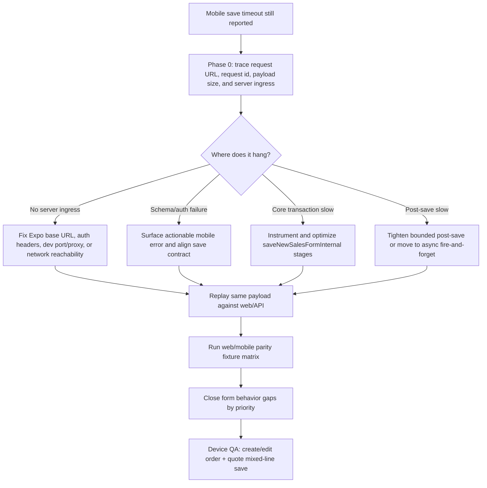

# Plan: Mobile Invoice Web Parity And Save Reliability Gap Closure

## Type
Bug Fix

## Status
Phase 0 observability and mobile save failure UX implemented; runtime/device replay remains pending

## Created Date
2026-06-23

## Last Updated
2026-06-23

## Goal Or Problem
Mobile invoice/quote creation still times out with `Cannot finish saving this invoice. Check your connection and try again.` after prior client and post-save timeout hardening. The mobile form also remains a native implementation beside the web `new-sales-form`, so save reliability and form behavior need a parity-driven closure plan instead of another isolated timeout patch.

## Current Context
- Mobile saves call `actions.buildSavePayload(...)` from `apps/expo-app/src/features/sales/invoice-form/store/use-invoice-form-store.ts`, then `newSalesForm.saveDraft` / `saveFinal` through `apps/expo-app/src/features/sales/invoice-form/api/use-invoice-form-actions.ts`.
- Mobile wraps the save request in `runMobileInvoiceSaveRequest(...)` with a 30 second timeout in `apps/expo-app/src/features/sales/invoice-form/lib/mobile-save-timeout.ts`.
- Expo tRPC mutations currently use unbatched `httpLink` in `apps/expo-app/src/trpc/client.tsx`, while queries remain batched.
- API save functions in `apps/api/src/db/queries/new-sales-form.ts` still await `saveNewSalesFormInternal(...)` before bounded post-save tasks run. Therefore the remaining mobile timeout can still come from request routing/connectivity, payload validation, the core transaction, DB lock/contention, or an unobserved server error before the bounded post-save section.
- Web `apps/www/src/components/forms/new-sales-form/new-sales-form.tsx` has richer save orchestration: queued autosave, manual save lock, save/close/save/new branches, stale handling, toast feedback, route transition, print/PDF pre-save flushes, and inventory-configuration post-save work.
- Web `InvoiceOverviewPanel` reconciles customer profile, billing/shipping address, tax code, tax rate, payment method, credit card fee display, delivery, payment terms, dates, and credit-limit context. Mobile has native Details/Costs/Review steps and shared core summary helpers, but not all web actions or post-save effects are represented.
- Existing Brain parity docs already flag unresolved new-sales-form gaps around route fallback, override precedence, dependency pricing, grouped workflows, legacy costing, tax/labor/credit-card charge behavior, customer profile repricing, and full fixture proof.

## Proposed Approach
Treat save reliability as Phase 0 and block parity polish on hard evidence from the actual mobile save path. Add request/stage observability, replayable payload capture, and API stage timing first. Then close web-vs-mobile form gaps in shared package helpers or native-mobile adapters, with fixture parity tests for every high-risk workflow.

The implementation should avoid increasing the mobile timeout as the primary fix. A 30 second timeout firing means either the request cannot reach the expected API, the server cannot return the save result fast enough, or the core save transaction is blocked. The plan must produce a request id, URL target, payload size, server ingress confirmation, stage timings, and transaction timing for each failed save attempt before changing business behavior.

## Visual Plan

## Implementation Steps
- Add mobile save diagnostics behind a dev flag: **implemented**
  - log the resolved tRPC base URL from `getBaseUrl()`
  - generate a client save attempt id
  - record save mode, sales type, payload size, line count, workflow family counts, and elapsed time
  - surface whether the timeout happened before or after any response/error
- Add API save diagnostics for `newSalesForm.saveDraft` and `saveFinal`: **implemented**
  - accept/pass a client request id through tRPC headers or payload metadata
  - log ingress, schema parse completion, settings lookup, summary recalculation, transaction start/end, row write stages, post-save task start/end, and response return
- Map classified mobile save failures to actionable retry, reload, sign-in, validation, timeout, and server-error copy while retaining stale status for conflicts: **implemented**
  - include elapsed milliseconds and sales id/order id when available
- Verify mobile runtime target:
  - confirm development device uses the intended GND `www`/API proxy port from `brain/system/overview.md`
  - show the resolved API URL in a dev-only mobile diagnostics row or console log
  - confirm preview builds intentionally use `EXPO_PUBLIC_BASE_URL`
  - document whether the failed device is hitting local LAN, the production-env local smoke profile, or production
- Capture and replay the failing payload:
  - store a sanitized failed save payload snapshot locally in dev
  - add a script or narrow test that posts the same payload through `saveNewSalesFormInternal`
  - compare mobile payload with web `toSaveDraftInput(...)` for the same fixture
- Fix the save bottleneck based on evidence:
  - if request routing fails, fix base URL/proxy/env handling and add a regression check
  - if validation fails, align mobile error handling with web stale/validation toasts and avoid generic connection copy
  - if transaction is slow, stage-optimize the exact DB block rather than moving data-loss-sensitive writes out of transaction blindly
  - if post-save still delays responses, return persisted save result before optional cache/document/inventory warmups
- Close parity gaps in priority order:
  - shared save contract and post-save effects
  - metadata/details behavior
  - customer/profile/tax reconciliation
  - core costing/pricing parity
  - workflow routing and grouped line-item parity
  - quote/order lifecycle actions and saved-record actions
  - validation, recovery, and device QA coverage

## Full Gap Matrix

### P0 Save Reliability And Observability
- Gap: Mobile shows only a generic timeout message after 30 seconds; it does not prove whether the request reached API, failed auth/schema validation, got stuck in the core transaction, or waited on post-save work.
- Web Parity Target: Web save paths show specific save/stale failures and run through manual-save locks, autosave flushes, toasts, navigation, and post-save configuration flows.
- Plan: Add request id, resolved URL, payload summary, server ingress, stage timing, and replayable sanitized payload capture before changing timeout behavior.
- Evidence Areas: `invoice-form-screen.tsx`, `mobile-save-timeout.ts`, `client.tsx`, `base-url.ts`, `new-sales-form.ts`.

### P0 Core API Transaction Timing
- Gap: Post-save tasks are bounded, but `saveNewSalesFormInternal(...)` remains a single awaited transaction without stage timings. The persistent timeout likely lives before the bounded post-save section unless the app is not running the latest API.
- Web Parity Target: Both web and mobile should receive the persisted result promptly once revenue data is committed.
- Plan: Instrument settings lookup, normalization, order create/update, line soft-delete/recreate/update, grouped row writes, HPT writes, extra costs, payment/tax metadata writes, and transaction commit.
- Evidence Areas: `apps/api/src/db/queries/new-sales-form.ts`.

### P0 Runtime Target / Connection Parity
- Gap: Mobile base URL depends on Expo host URI and port env; preview builds use `EXPO_PUBLIC_BASE_URL`. A device can appear healthy while hitting the wrong local port, stale dev server, the production-env local smoke profile, or production.
- Web Parity Target: Web runs in the browser against the current app/API stack; mobile must make its target explicit in development.
- Plan: Add a dev-only visible/logged API target and verify phone, Metro, web, and API/proxy ports before further save fixes.
- Evidence Areas: `apps/expo-app/src/lib/base-url.ts`, `apps/expo-app/src/trpc/client.tsx`, `brain/system/overview.md`.

### P1 Save UX And Post-Save Effects
- Gap: Mobile has Save Draft/Create and route replacement after create, but not web's save-close, save-new, print/PDF pre-save flush, post-save inventory configuration modal, broad cache invalidation, and toast-specific result copy.
- Web Parity Target: Saved mobile forms should update downstream lists/details and give the same result confidence as web.
- Plan: Add mobile cache invalidation/refetch for dashboard/orders/quotes after save, distinguish draft/final/stale/network/server errors, and decide which web saved-record actions belong on mobile.
- Evidence Areas: `new-sales-form.tsx`, `use-auto-save.ts`, `invoice-form-screen.tsx`, `use-invoice-form-actions.ts`.

### P1 Customer, Address, Profile, And Tax Metadata
- Gap: Web resolves customer billing/shipping addresses, profile options, profile payment-term defaults, tax code/rate, credit limit, and dealer profile card in the overview panel. Mobile covers customer selection, resolved customer effects, profile repricing, tax profile rate sync, and details editing, but the UI does not expose the same address/profile/credit-limit controls.
- Web Parity Target: Selecting or changing a customer/profile should produce the same persisted customer id, billing id, shipping id, payment term, tax code, tax rate, and repriced line totals.
- Plan: Add parity fixtures for customer selection/change/default profile/tax-code changes and decide whether mobile needs an explicit profile/address selector or read-only parity with web.
- Evidence Areas: `InvoiceOverviewPanel`, `CustomerSelectorDialog`, `CustomerStep`, `DetailsStep`, `invoice-form-screen.tsx`.

### P1 Costing, Tax, Labor, CCC, And Extra Costs
- Gap: Shared costing now supports legacy-strategy credit card charge and derived labor, but historical parity docs still mark full legacy CostingClass parity as unresolved. Mobile Cost step edits discount, percent discount, delivery, labor, and custom costs but presents fewer controls and depends on shared recompute timing.
- Web Parity Target: Web and mobile should save identical subtotal, taxable subtotal, tax, discount, labor, delivery, other costs, CCC, and grand total for the same payload.
- Plan: Create golden summary fixtures for credit card vs non-card, taxable/non-taxable service rows, moulding labor, shelf rows, delivery taxability, flat labor, discount percent, and custom taxable/non-taxable costs.
- Evidence Areas: `packages/sales/src/sales-form/domain/costing.ts`, `CostsStep`, `InvoiceOverviewPanel`, `calculate-summary.ts`.

### P1 Workflow Routing And Component Selection
- Gap: Web package workflow has route fallback, redirect handling, component edit actions, image attachment, supplier/base-cost editing, custom component placement, and selectable ordering. Mobile implements many of these natively through shared helpers, but the large selector/screen architecture has recurring regressions and lacks one authoritative parity fixture suite.
- Web Parity Target: Selecting the same workflow components on web and mobile should produce identical `formSteps`, selected UID metadata, custom markers, redirect decisions, and line totals.
- Plan: Build web/mobile payload comparison fixtures for Item Type, Door, Door Size, HPT, Moulding, Service, Shelf, custom component, redirect-disabled, and dependency-priced steps.
- Evidence Areas: `item-workflow-panel.tsx`, `workflow-step-selector.tsx`, `line-item-card.tsx`, `packages/sales/src/sales-form/ui/workflow/*`.

### P1 Door Size And House Package Tool
- Gap: Mobile has native HPT editors, supplier-sensitive rows, add-door routing, base/custom/add-on handling, no-handle/swing flags, and keyboard-safe inputs. Web still has richer modal/edit controls and prior parity docs require full supplier/variant proof.
- Web Parity Target: Door/HPT payloads and totals should match for selected door, supplier, size, LH/RH, base cost edits, add-on/custom overrides, no-handle, and swing cases.
- Plan: Add golden HPT packets with supplier-specific size pricing, missing price, base-cost override, custom clear-to-auto, add door, remove door, and reopened edit cases.
- Evidence Areas: `house-package-tool-panel.tsx`, `door-size-qty-dialog.tsx`, `house-package-tool-editor.tsx`, `house-package-tool-workflow-step.tsx`.

### P1 Moulding Grouped Rows
- Gap: Mobile supports multi-select, protected final row, calculator, thumbnail preview, add-on/custom bottom sheet, and grouped row persistence. Remaining risk is exact parity for labor, costing, row identity, calculator output, and reopen/save round-trip against web.
- Web Parity Target: Same selected moulding rows should save identical `meta.mouldingRows`, HPT row identities, quantities, add-on/custom values, totals, and legacy sibling records.
- Plan: Add web/mobile grouped moulding replay fixtures, including calculator apply, custom clear, add/remove, reopen edit, and final-row remove guard.
- Evidence Areas: `moulding-rows-editor.tsx`, `workflow-moulding-line-item-editor.tsx`, `workflow-row-patches.ts`, `new-sales-form.ts`.

### P1 Service Grouped Rows
- Gap: Mobile service rows support add/remove, qty, unit price, taxable, production, and totals. Web has package UI with checkbox/toggle behavior and grouped persistence. Exact tax/production/labor behavior needs fixture proof.
- Web Parity Target: Same service rows should save identical `meta.serviceRows`, row taxability, production flags, quantities, prices, totals, and legacy sibling rows.
- Plan: Add service fixtures for taxable/non-taxable mixes, production flag changes, zero qty, row add/remove, and reopen/save.
- Evidence Areas: `service-rows-editor.tsx`, `workflow-service-line-item-editor.tsx`, `service-line-items-editor.tsx`.

### P2 Shelf Items
- Gap: Mobile intentionally uses a simplified recent/search picker and flat selected-row editor. Web has category/product index and package shelf controls. Persisted `shelfItems` should be identical, but category browse UX and selected product details are not full web parity.
- Web Parity Target: Same shelf product selection/edit/delete should save identical product ids, category metadata, quantities, prices, custom price semantics, totals, and hidden/archived behavior.
- Plan: Add shelf fixtures for recent blank search, typed search, edit product, delete product, custom unit price, category subtitle, and reopen/save.
- Evidence Areas: `shelf-rows-editor.tsx`, `workflow-shelf-line-item-editor.tsx`, `shelf-inline-items-editor.tsx`.

### P2 Quote/Order Lifecycle And Saved-Record Actions
- Gap: Mobile has quote-aware labels/routes and order/quote dashboards, but web has broader saved-record actions: payment, print, PDF, history, stock/inventory configuration, sales menu actions, and route-specific close/new flows.
- Web Parity Target: Mobile should either support or explicitly defer each saved-record action with a documented reason.
- Plan: Create a capability matrix for Save Draft, Create/Finalize, Save & Close, Save & New, Print, Download PDF, Payment, History, Inventory configuration, Delete/Archive, and Quote conversion.
- Evidence Areas: `SalesFormFloatingActions`, `SalesFormHeaderActions`, `SalesFormShell`, mobile footer/header/review routes.

### P2 Recovery, Autosave, And Conflict Handling
- Gap: Web has queued autosave and flush-on-unmount; mobile has local recovery and manual save but no queued autosave parity. Mobile stale/version conflict handling exists at store level but needs device proof and user-visible copy parity.
- Web Parity Target: Dirty edits, stale records, reload/reopen, and failed saves should be recoverable without duplicate writes or silent data loss.
- Plan: Add mobile recovery/conflict fixtures and decide whether mobile gets autosave or an explicit manual-save-only contract.
- Evidence Areas: `use-auto-save.ts`, `local-recovery.ts`, `use-invoice-form-store.ts`.

### P2 Architecture And Test Coverage
- Gap: Mobile behavior is spread across large React Native components and native step editors; existing tests cover many helpers but not a full web/mobile payload matrix or device save story.
- Web Parity Target: Shared business behavior should live in `@gnd/sales/sales-form-core` or package helpers with mobile-native UI as presentation only.
- Plan: Pair this bug-fix plan with the existing architecture refactor plan after Phase 0, then migrate repeated parity-sensitive derivation into package-level helpers and golden tests.
- Evidence Areas: `brain/plans/2026-06-19-feature-mobile-invoice-form-architecture-refactor.md`.

## Affected Files Or Areas
- `apps/expo-app/src/features/sales/invoice-form/components/invoice-form-screen.tsx`
- `apps/expo-app/src/features/sales/invoice-form/store/use-invoice-form-store.ts`
- `apps/expo-app/src/features/sales/invoice-form/api/use-invoice-form-actions.ts`
- `apps/expo-app/src/features/sales/invoice-form/lib/mobile-save-timeout.ts`
- `apps/expo-app/src/features/sales/invoice-form/lib/calculate-summary.ts`
- `apps/expo-app/src/features/sales/invoice-form/components/details-step.tsx`
- `apps/expo-app/src/features/sales/invoice-form/components/costs-step.tsx`
- `apps/expo-app/src/features/sales/invoice-form/components/workflow-step-selector.tsx`
- `apps/expo-app/src/features/sales/invoice-form/steps/`
- `apps/expo-app/src/lib/base-url.ts`
- `apps/expo-app/src/trpc/client.tsx`
- `apps/www/src/components/forms/new-sales-form/`
- `apps/api/src/db/queries/new-sales-form.ts`
- `apps/api/src/schemas/new-sales-form.ts`
- `packages/sales/src/sales-form/`
- `brain/features/mobile-invoice-form.md`
- `brain/api/contracts.md`

## Acceptance Criteria
- A failed mobile save attempt can be traced with a single request id from mobile button press through API ingress or confirmed network miss.
- The actual timeout source is identified with stage timing evidence before business behavior changes are made.
- Mobile save no longer times out for a representative create invoice payload containing customer, details, one workflow item, and costs.
- Mobile save no longer times out for mixed-line payloads containing HPT doors, service rows, moulding rows, and shelf rows.
- Mobile returns specific user-facing errors for validation, stale/conflict, auth/network, and server failures instead of treating every long save as a connection issue.
- Web and mobile save payloads match for agreed golden fixtures or differences are documented as intentional mobile-only UX decisions.
- Summary totals match between web and mobile for credit-card CCC, tax, labor, delivery, discounts, and custom costs.
- Customer/profile/tax changes produce matching persisted metadata and repricing behavior.
- Grouped HPT, moulding, service, and shelf rows reopen and resave without losing legacy identity fields.

## Test Plan
- Unit tests:
  - mobile save diagnostics/request-id helper
  - base URL resolution for dev, preview, localhost rewrite, and missing host
  - mobile save error classification
  - shared summary golden fixtures
- API tests:
  - replay sanitized mobile payload through `saveNewSalesFormInternal`
  - assert stage timing hooks do not alter save payload
  - assert post-save tasks cannot delay response beyond their configured bound
- Package parity tests:
  - web `toSaveDraftInput` vs mobile `toSalesFormSaveDraftPayload` for the same record
  - customer/profile/tax metadata changes
  - HPT, moulding, service, shelf grouped row round-trip
- Manual device QA:
  - create order on physical Android/iOS device against local dev stack
  - create quote on physical Android/iOS device
  - edit existing saved order/quote and resave
  - save mixed invoice with HPT, service, moulding, shelf, custom cost, credit card payment method
  - verify dashboard/order/quote lists refresh after save

## Risks / Edge Cases
- Increasing the mobile timeout could hide the real bug and leave users waiting longer.
- A phone may be connected to a stale dev/prod target even when Metro is current.
- Logging full payloads can leak customer/order data; diagnostics must sanitize and stay dev-only unless explicitly designed for production observability.
- Moving transaction work outside `saveNewSalesFormInternal` without proof could create partially saved invoices.
- Golden parity fixtures can expose existing web/new-sales-form legacy gaps that are broader than mobile alone.
- Current dirty worktree and active sales/inventory workstreams may overlap with the new-sales-form save and inventory configuration paths.

## Open Questions
- TODO: Capture the failing device's resolved API URL and whether it is local dev, the production-env local smoke profile, preview, or production.
- TODO: Capture whether API logs show ingress for the timed-out mobile request.
- TODO: Decide whether mobile should implement web Save & Close / Save & New or document manual save-only parity.
- TODO: Decide whether mobile should expose billing/shipping/profile selectors or keep those fields derived from customer selection.
- TODO: Decide whether mobile autosave is desired after save reliability is proven.

## Linked Task
- Task Title: Mobile Invoice Web Parity And Save Reliability Gap Closure
- Task File: brain/tasks/roadmap.md
