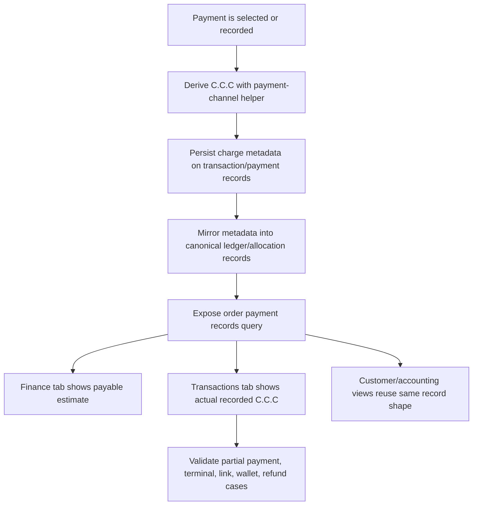

# Plan: Sales Payment C.C.C Record Visibility

## Type
Feature

## Status
Proposed

## Created Date
2026-06-24

## Last Updated
2026-06-24

## Goal Or Problem
The newer payment system treats credit-card convenience charge (C.C.C) as a payment-channel charge instead of an order-stored charge. Operators need a clear place to see C.C.C information and a reliable API/query path to retrieve the actual recorded C.C.C details for payments, especially when card, link, terminal, wallet, partial payment, and overpayment flows are involved.

## Current Context
- `brain/decisions/ADR-011-derived-ccc-payment-channel-charge.md` establishes that C.C.C is derived for payable/display totals and belongs to payment/checkout/terminal transaction metadata or ledger records once an actual payment is recorded.
- `packages/sales/src/payment-system/domain/payment-channel-charge.ts` computes C.C.C and builds `paymentCharges[]` metadata with `salesAmount`, `feeAmount`, and `customerChargeAmount`.
- `apps/api/src/db/queries/sales-payment-processor.ts` calculates payment charge metadata for direct, link, and terminal payment flows. Terminal `SquarePayments.meta` and external `CustomerTransaction.meta` can carry the charge metadata.
- `packages/db/src/schema/sales.payment-system.prisma` defines canonical payment-system records: `PaymentLedgerEntry`, `PaymentAllocation`, and `PaymentProjection`.
- `packages/sales/src/payment-system/infrastructure/canonical-mirror.ts` mirrors legacy `SalesPayments` into canonical payment tables, but currently only writes source/sales payment identifiers into canonical metadata.
- Current sales overview surfaces already include `finance` and `transactions` tabs. `SalesOverviewFinanceTab` shows selected payment option and payment progress, while `SalesOverviewTransactionsTab` delegates to the legacy customer transaction table.
- Existing transaction reads are still based on `CustomerTransaction` plus `SalesPayments`, so they can show legacy payments but do not yet expose canonical ledger/projection rows or normalized C.C.C fee details.

## Proposed Approach
Expose C.C.C at two levels:

- Estimated/payable C.C.C: show the currently selected payment method, C.C.C percentage, estimated C.C.C, and payable amount in checkout/payment preview areas such as the sales overview Finance tab and payment processor modal.
- Actual recorded C.C.C: show immutable payment records after payment completion in the sales overview Transactions tab, customer Transactions tab, and sales accounting/payment history surfaces. These records should come from canonical `PaymentLedgerEntry` / `PaymentAllocation` / `PaymentProjection` when available, falling back to legacy `CustomerTransaction` / `SalesPayments` / `SquarePayments` metadata while the cutover remains transitional.

Add a focused protected query for order payment records that returns a display-ready timeline and summary. The query should prefer canonical payment-system tables, include C.C.C detail from `meta.paymentCharges[]`, and normalize legacy metadata into the same shape. It should not mutate order totals or reintroduce stored C.C.C on `SalesOrders`.

## Visual Plan

## Implementation Steps
- Define the display contract:
  - Summary: base invoice total, selected payment method, C.C.C percentage, estimated C.C.C, estimated payable amount, recorded principal, recorded C.C.C, total customer charged, allocated amount, refunded/voided amount, and amount due.
  - Records: payment id, ledger entry id, legacy sales payment id, customer transaction id, Square payment id, payment method, status, occurred date, principal amount, C.C.C amount, customer charged amount, allocation rows, refund/void markers, author, and metadata source.
- Preserve C.C.C metadata during payment writes:
  - Pass `paymentChargeMeta` into the external `SalesPayments.meta` created by `recordLegacySalesPayment`.
  - Ensure wallet-only payments do not show C.C.C.
  - Ensure terminal/link/customer transactions keep `paymentCharges[]`, `salesAmount`, `feeAmount`, and `customerChargeAmount`.
- Extend the canonical mirror:
  - Include normalized charge metadata in `PaymentLedgerEntry.meta` and `PaymentAllocation.meta`.
  - Keep idempotency/retry behavior safe so repeated mirrors do not duplicate displayed records.
  - Rebuild `PaymentProjection` without counting C.C.C as order principal due unless a payment record explicitly allocates principal to the order.
- Add an API/query surface:
  - Prefer `salesPaymentProcessor.orderPaymentRecords({ salesOrderId })` or a dedicated payment-system router if one already exists by implementation time.
  - Return canonical ledger/projection data when present.
  - Fall back to legacy transaction/payment records for older orders and partially migrated environments.
  - Include a source flag such as `canonical`, `legacy`, or `mixed` for operator/debug clarity.
- Update sales overview UI:
  - Finance tab: add a compact C.C.C/payable estimate section beside payment progress when the selected method applies C.C.C.
  - Transactions tab: add a payment-record timeline or enriched transaction table columns showing principal, C.C.C, customer charged, method, status, and source.
  - Avoid forcing users to open print preview just to inspect C.C.C.
- Update customer/accounting surfaces:
  - Reuse the normalized payment record shape in the customer Transactions tab and sales accounting transaction table where practical.
  - Keep table-first surfaces scan-friendly, with details available through existing transaction/payment overview modals.
- Add print/preview consistency checks:
  - Confirm sales print/PDF continues deriving displayed invoice totals from base order amount plus applicable payment-channel C.C.C.
  - Confirm recorded payment history shows actual payment C.C.C, not merely the current selected method estimate.
- Document contracts and permissions after implementation.

## Affected Files Or Areas
- `packages/sales/src/payment-system/domain/payment-channel-charge.ts`
- `packages/sales/src/payment-system/application/record-legacy-sales-payment.ts`
- `packages/sales/src/payment-system/infrastructure/canonical-mirror.ts`
- `packages/sales/src/payment-system/contracts/*`
- `apps/api/src/db/queries/sales-payment-processor.ts`
- `apps/api/src/trpc/routers/sales-payment-processor.route.ts`
- `apps/www/src/components/sales-overview-system/tabs/finance-tab.tsx`
- `apps/www/src/components/sales-overview-system/tabs/transactions-tab.tsx`
- `apps/www/src/components/sheets/customer-overview-sheet/transactions-tab.tsx`
- `apps/www/src/actions/get-customer-tx-action.ts`
- `apps/www/src/components/tables/sales-accounting/*`
- `brain/api/contracts.md`
- `brain/api/endpoints.md`
- `brain/features/sales-payment-v2-checkout.md`
- `brain/decisions/ADR-011-derived-ccc-payment-channel-charge.md`

## Acceptance Criteria
- Operators can see estimated C.C.C before collecting a card/link/terminal payment.
- Operators can see actual recorded C.C.C after a payment is completed.
- Sales overview Finance tab distinguishes base invoice total, estimated C.C.C, estimated payable total, collected principal, and outstanding balance.
- Sales overview Transactions tab shows payment records with principal, C.C.C, customer charged amount, method, status, and source.
- Customer Transactions and sales accounting surfaces can retrieve or display the same normalized C.C.C payment record details.
- Canonical ledger entries preserve `paymentCharges[]` metadata for new card/link/terminal payments.
- Legacy orders without canonical records still show best-effort C.C.C details from `CustomerTransaction.meta`, `SalesPayments.meta`, or `SquarePayments.meta`.
- Wallet-only payments do not show a C.C.C fee.
- Partial payments show C.C.C against the actual external payment amount, not the full invoice total unless the full invoice was externally paid.
- Stored `SalesOrders.grandTotal` and `amountDue` remain base order totals excluding derived C.C.C.

## Test Plan
- Unit tests:
  - C.C.C metadata normalization from canonical ledger meta.
  - C.C.C metadata fallback from `CustomerTransaction.meta`, `SalesPayments.meta`, and `SquarePayments.meta`.
  - Wallet-only payments return zero C.C.C.
  - Partial external payments calculate C.C.C from the external payment amount.
- API tests:
  - `orderPaymentRecords` returns canonical records and projection summary for a completed card payment.
  - `orderPaymentRecords` falls back to legacy records when canonical tables are unavailable or empty.
  - Terminal payment session metadata persists charge details before completion and resolves after payment application.
- UI tests:
  - Finance tab renders estimated C.C.C only for C.C.C-applicable methods.
  - Transactions tab renders recorded principal/C.C.C/customer charged amounts.
  - Empty and legacy fallback states are understandable.
- Manual QA:
  - Record cash/check payment and confirm no C.C.C.
  - Record credit-card/link/terminal payment and confirm C.C.C appears in payment history.
  - Record partial payment and confirm C.C.C is based on the paid amount.
  - Print/preview the invoice and confirm display totals stay consistent with ADR-011.

## Risks / Edge Cases
- Existing payments may have no `paymentCharges[]` metadata, so old records need best-effort inference or an explicit `unknown/not recorded` state.
- Current canonical mirror metadata does not yet preserve C.C.C details, so UI work before mirror updates could show incomplete canonical records.
- Terminal payments can be created before they are completed; pending records should not be shown as collected principal until settlement/application succeeds.
- Overpayments may split between order principal and wallet credit; C.C.C should be tied to the external charge, not double-counted as invoice principal.
- Refunds/voids must not make displayed C.C.C look like active collected revenue.

## Open Questions
- TODO: Should historical records without `paymentCharges[]` infer C.C.C from payment method and amount, or show `Not recorded` unless exact metadata exists?
- TODO: Should the primary tRPC surface live under `salesPaymentProcessor`, `sales`, or a new payment-system router?
- TODO: Should mobile sales order detail show payment-record C.C.C in this slice, or wait until the web sales overview contract is stable?

## Linked Task
- Task Title: Sales Payment C.C.C Record Visibility
- Task File: brain/tasks/roadmap.md
