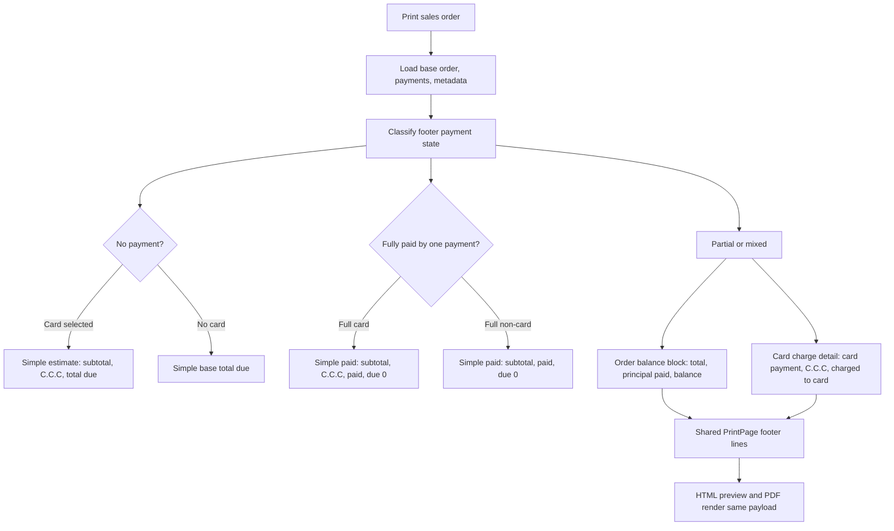

# Plan: Sales Print C.C.C Partial Payment Footer

## Type
Feature

## Status
Done

## Created Date
2026-06-24

## Last Updated
2026-06-24

## Goal Or Problem
Sales print/PDF footer lines need to represent C.C.C correctly now that C.C.C is optional and calculated at payment time when a credit-card/link/terminal option is selected. The current print footer derives C.C.C from the remaining `amountDue`, which is acceptable for an unpaid card-estimate print but becomes ambiguous after partial or mixed payments. Partial payment documents must clearly distinguish order principal, paid principal, remaining order balance, and any card-specific C.C.C charged separately.

## Current Context
- `brain/decisions/ADR-011-derived-ccc-payment-channel-charge.md` says C.C.C is a derived payment-channel charge, not a stored order charge. `SalesOrders.grandTotal` and `SalesOrders.amountDue` remain base order totals excluding C.C.C.
- `brain/decisions/ADR-007-sales-print-single-source-of-truth.md` says sales print behavior must be changed in `packages/sales/src/print/*` first; PDF/HTML templates consume the shared print payload and should not duplicate business rules.
- `brain/decisions/ADR-006-sales-document-html-preview-and-pdf-download-split.md` says HTML preview and PDF download are paired renderers that share the same `PrintPage` contract.
- `brain/features/sales-pdf-system.md` documents `packages/sales/src/print/compose/footer.ts` as the footer composer and `packages/pdf/src/sales-v2` as the template layer.
- `brain/plans/2026-06-24-feature-sales-payment-ccc-record-visibility.md` tracks the related payment-record visibility work for actual recorded C.C.C data.
- Current `composeFooter` calculates a due C.C.C from `sale.amountDue` and prints `Total Due` as `amountDue + due C.C.C`.
- Current `composeMeta` calculates header `total` from `sale.grandTotal + full-order C.C.C` and header `balanceDue` from `sale.amountDue + due C.C.C`.
- Current `FooterData` is a flat `lines[]` contract. That can still render the footer, but the composer needs a clearer internal payment/footer state before emitting lines.

## Proposed Approach
Introduce a print-payment footer state helper under `packages/sales/src/print/compose/` that classifies invoice print output into these cases:

- `unpaid-card-estimate`: no successful principal payment exists, selected payment method applies C.C.C. Footer may remain simple: base subtotal/tax/cost lines, `C.C.C`, and `Total Due`.
- `unpaid-no-card`: no successful payment exists and selected method does not apply C.C.C. Footer remains simple with base total due.
- `paid-single-full-card`: exactly one successful full-principal card/link/terminal payment covers the order. Footer may remain simple: subtotal, C.C.C, paid, total due zero.
- `paid-single-full-non-card`: exactly one successful non-card payment covers the order. Footer remains simple without C.C.C.
- `partial-or-mixed`: successful payments exist but the order is not fully paid, or payment methods/charge records are mixed. Footer must split into order-balance lines and card-charge detail lines.

Keep `SalesOrders.grandTotal` and `amountDue` as principal-only values. Do not add historical card C.C.C into order totals or remaining due. For partial/mixed payments, show C.C.C only as a payment charge detail.

## Visual Plan

## Implementation Steps
- Add focused print payment helpers:
  - Create a helper such as `packages/sales/src/print/compose/payment-footer-state.ts`.
  - Normalize successful payments from `sale.payments` into principal payment rows.
  - Detect whether the selected payment method applies C.C.C using the existing `calculatePaymentChannelCharge` / payment-channel helper.
  - Extract recorded C.C.C metadata from payment records when available, aligning with `paymentCharges[]`, `salesAmount`, `feeAmount`, and `customerChargeAmount` from the payment-system plan.
  - Fall back to deriving estimated C.C.C only for unpaid/full-balance estimates, not for historical partial-payment records without charge metadata unless that policy is explicitly approved.
- Define footer state outputs:
  - Base totals: subtotal, tax, labor, extra costs, delivery, principal order total.
  - Principal payments: successful `SalesPayments.amount` rows only.
  - Recorded card-charge details: card principal amount, C.C.C amount, customer card charge amount, method, payment date/source.
  - Remaining principal balance: `sale.amountDue`.
  - Estimated card amount due: only for unpaid or currently selected remaining-balance card payment estimate.
- Update `composeFooter`:
  - Preserve existing base cost/tax/extra-cost line composition.
  - For unpaid card-selected records, keep simple rows:
    - `Subtotal`
    - tax/labor/extra costs as applicable
    - `C.C.C`
    - `Total Due`
  - For fully paid single card payments, keep simple rows:
    - `Subtotal`
    - tax/labor/extra costs as applicable
    - `C.C.C`
    - `Paid`
    - `Total Due` = `$0.00`
  - For partial/mixed payments, emit clear rows:
    - `Order Total`
    - `Paid Toward Order`
    - `Balance Due`
    - spacer/section-style row if the current `FooterLine` contract can support it, otherwise use labels such as `Card Payment`, `C.C.C on Card Payment`, `Charged to Card`
  - Avoid using `sale.amountDue + C.C.C` as `Total Due` after partial/mixed payments unless that line is explicitly labeled as an estimated card charge on the remaining balance.
- Update `composeMeta`:
  - Header `total` should reflect the same footer state:
    - unpaid card estimate may show full card-payable total
    - fully paid single card may show total charged
    - partial/mixed should show base order total or principal balance, not a blended C.C.C balance
  - Header `balanceDue` for partial/mixed should be the remaining principal balance unless explicitly renamed/extended in the print contract.
  - Paid stamp/date should use the latest successful payment date or a deterministic rule, not the first payment row by accident.
- Consider extending the print contract:
  - Option A: keep `FooterData.lines[]` flat and emit clear labels.
  - Option B: add optional `FooterLine.kind?: "amount" | "section" | "note"` or `FooterData.paymentBreakdown` for cleaner rendering.
  - Prefer Option A for the first slice unless PDF/HTML layout needs a section separator that flat lines cannot express cleanly.
- Update PDF and HTML templates only as needed:
  - `packages/pdf/src/sales-v2/shared/html-template.tsx`
  - `packages/pdf/src/sales-v2/templates/template-1/blocks/footer-block.tsx`
  - `packages/pdf/src/sales-v2/templates/template-2/blocks/footer-block.tsx`
  - Keep these components dumb: render labels/values/optional section rows; no C.C.C calculations.
- Update tests:
  - Expand `packages/sales/src/print/get-print-data.test.ts` with unpaid card estimate, full single card payment, partial card payment, partial card plus cash, full cash payment, and quote cases.
  - Add helper-level tests for footer state classification.
  - Confirm no print test expects `SalesOrders.grandTotal` to include C.C.C.
  - Add renderer smoke coverage only if a contract change affects template rendering.
- Coordinate with payment-record visibility:
  - This print plan can derive unpaid estimates immediately from order metadata.
  - For actual historical C.C.C after partial payment, prefer the payment-record metadata work from `brain/plans/2026-06-24-feature-sales-payment-ccc-record-visibility.md`.
  - If implementation lands before recorded metadata exists, show partial/mixed principal balances now and leave actual card-charge detail as best-effort or omitted until metadata is reliable.

## Completion Notes
- Added shared print payment state classification in `packages/sales/src/print/compose/payment-footer-state.ts`.
- Updated `composeFooter` and `composeMeta` so unpaid card estimates, full single card payments, full non-card payments, and partial/mixed payments render consistent principal/C.C.C semantics.
- Updated print query financial includes so payment `transaction.meta` and `squarePayments.meta` are available for recorded C.C.C extraction.
- Added focused print-data tests for unpaid card estimate, full single card payment, and partial card plus cash payment.
- Ambiguous shared transaction metadata whose recorded base amount does not match the current payment row is ignored for per-order C.C.C display to avoid overstating C.C.C on multi-order payments.
- Follow-up: overview DTO `costLines` now use the same helper, and unpaid card-selected breakdowns explicitly show `Order Due Amount`, `C.C.C`, and `Total Due With C.C.C` across overview, preview, and print.

## Affected Files Or Areas
- `packages/sales/src/print/compose/footer.ts`
- `packages/sales/src/print/compose/meta.ts`
- `packages/sales/src/print/compose/payment-footer-state.ts`
- `packages/sales/src/print/types.ts`
- `packages/sales/src/print/query.ts`
- `packages/sales/src/print/get-print-data.test.ts`
- `packages/pdf/src/sales-v2/shared/html-template.tsx`
- `packages/pdf/src/sales-v2/templates/template-1/blocks/footer-block.tsx`
- `packages/pdf/src/sales-v2/templates/template-2/blocks/footer-block.tsx`
- `brain/features/sales-pdf-system.md`
- `brain/api/contracts.md`
- `brain/decisions/ADR-011-derived-ccc-payment-channel-charge.md`

## Acceptance Criteria
- Unpaid order with card selected can print simple footer lines showing base amount, C.C.C estimate, and total card-payable due.
- Unpaid order without card selected does not show C.C.C.
- Fully paid single card order can print simple footer lines showing base amount, C.C.C, paid, and total due `$0.00`.
- Fully paid single cash/check/wallet order does not show C.C.C.
- Partial card payment print distinguishes order principal from card charge:
  - order total remains base sales total
  - paid toward order equals principal paid
  - balance due equals remaining principal
  - C.C.C is shown only in a card charge detail line/block when recorded or explicitly estimated for the current payment action
- Partial card plus cash payment print shows cash as principal payment and does not apply C.C.C to cash.
- Header `balanceDue`, footer `Balance Due`, and footer `Total Due` do not contradict each other.
- HTML preview and PDF download render the same footer semantics from the shared `PrintPage` payload.
- Production and packing-slip modes remain footer-free.
- Existing quote/invoice print routes continue using `print.salesV2`; no CTA-local print logic is introduced.

## Test Plan
- Unit/helper tests:
  - classify unpaid card estimate
  - classify unpaid non-card
  - classify fully paid single card
  - classify fully paid single non-card
  - classify partial card
  - classify partial card plus cash
  - classify overpayment/wallet-credit without double-counting C.C.C
- Print data tests:
  - Assert footer rows for `$5,000` unpaid card selected at 3.5%:
    - `C.C.C = $175.00`
    - `Total Due = $5,175.00`
  - Assert footer rows for `$5,000` with one `$5,000` card principal payment at 3.5%:
    - `C.C.C = $175.00`
    - `Paid = ($5,175.00)` or `Paid Toward Order = ($5,000.00)` depending chosen copy
    - `Total Due = $0.00`
  - Assert footer rows for `$5,000`, `$2,500` card principal, `$1,000` cash:
    - `Order Total = $5,000.00`
    - `Paid Toward Order = ($3,500.00)`
    - `Balance Due = $1,500.00`
    - card detail shows C.C.C only on `$2,500.00` if recorded/derivable.
  - Assert `meta.balanceDue` for partial/mixed is `$1,500.00`, not `$1,552.50`.
- Template smoke tests:
  - HTML footer renders all provided lines in order.
  - PDF template footer handles any optional separator/section line if the contract is extended.
- Manual QA:
  - Preview invoice before payment.
  - Preview invoice after one full card payment.
  - Preview invoice after one partial card payment.
  - Preview invoice after card plus cash payments.
  - Download PDF and compare footer to HTML preview.

## Risks / Edge Cases
- Historical card payments may not have exact C.C.C metadata. Inferring old C.C.C from payment method and amount could misstate a legal/payment record, so this needs a clear policy.
- The existing footer renderer assumes the last line is the highlighted total. Section separators or dual total blocks may need a small rendering contract extension.
- Header `meta.total` has historically included full-order C.C.C for card-selected records; changing it for partial/mixed prints may affect customer expectations.
- Dealer pricing surfaces alter `grandTotal` and `amountDue` for customer-facing dealer prints; the same state machine must operate after dealer pricing resolution.
- Refunds, voids, and overpayments need explicit handling so C.C.C is not presented as outstanding order principal.

## Open Questions
- Resolved: Full single card payment prints `Paid` as the total charged to card, including C.C.C.
- Resolved: Partial payment prints do not infer C.C.C unless payment metadata can be matched safely to the payment row.
- Resolved: Quote/unpaid prints keep C.C.C as an estimate only when a C.C.C-applicable payment option is selected.
- Resolved: `FooterData.lines[]` remains flat for this implementation.

## Linked Task
- Task Title: Sales Print C.C.C Partial Payment Footer
- Task File: brain/tasks/roadmap.md
