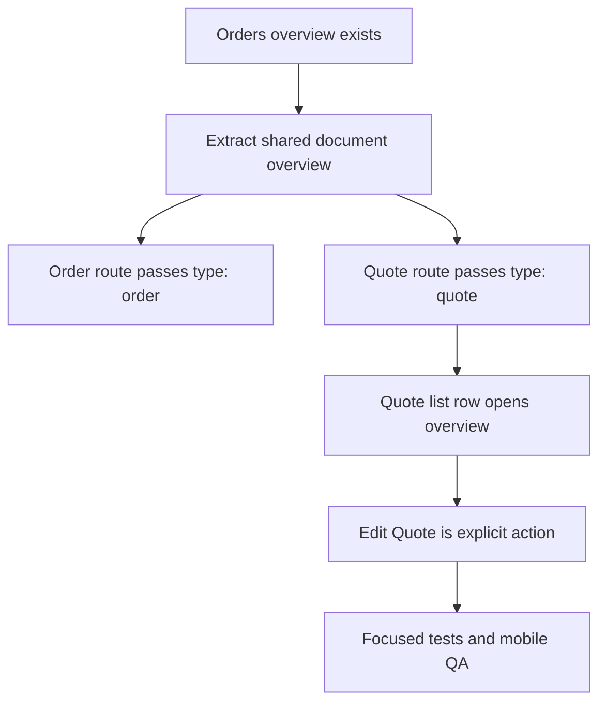

# Plan: Mobile Quote Overview Reuse

## Type
Bug Fix

## Status
Done

## Created Date
2026-06-28

## Last Updated
2026-06-28

## Goal Or Problem
Mobile quote rows opened the quote edit form directly, while the website quote table opens a quote overview and keeps editing as an explicit action. Mobile quote list cards also reused invoice-oriented due/progress copy that was not needed on the quote list surface.

## Current Context
- `apps/expo-app/src/features/sales/components/sales-document-list-screen.tsx` shared the mobile Orders and Quotes list behavior.
- Quote list rows previously required a saved slug and routed to `/(sales)/invoices/[slug]` in quote mode.
- `apps/expo-app/src/features/sales/components/sales-order-detail-screen.tsx` already provided the mobile order overview UI.
- `sales.getSaleOverview` already accepts `salesType: "quote"`, so no API, schema, or database change is needed.

## Proposed Approach
Reuse the existing mobile order overview structure for quotes by making the overview type-aware. Route quote list row taps to a new quote overview route by quote number, and keep the quote form behind an explicit `Edit Quote` action when a slug exists. Keep the list-card component shared while applying quote-specific labels that omit remaining-due and payment-progress copy.

## Visual Plan

## Implementation Steps
- Add a mobile quote detail route at `/(sales)/quotes/[quoteNo]`.
- Make the order overview component reusable for `order` and `quote` document types.
- Update quote list row navigation to use quote overview routes instead of edit routes.
- Adjust shared quote list-card labels to show quote total without remaining-due or payment-progress footer copy.
- Add focused helper coverage for quote overview routes, edit-route slug gating, and quote/order ledger labels.

## Affected Files Or Areas
- `apps/expo-app/src/app/(sales)/quotes/[quoteNo].tsx`
- `apps/expo-app/src/features/sales/components/sales-order-detail-screen.tsx`
- `apps/expo-app/src/features/sales/components/sales-document-list*`
- `apps/expo-app/src/features/sales/components/sales-invoice-list-card-*`
- `brain/features/mobile-invoice-form.md`
- `brain/progress.md`

## Acceptance Criteria
- Tapping a quote row opens the mobile quote overview, not the quote form.
- Quote overview reuses the order overview layout and exposes `Edit Quote` only when a slug exists.
- Quote list cards no longer render `Remaining Due` or payment-progress footer copy.
- Order list and order overview behavior remain unchanged.

## Test Plan
- Run `bun test apps/expo-app/src/features/sales/components/sales-document-list.test.ts`.
- Run focused Biome on touched Expo sales files.
- Manual QA on mobile: Sales Dashboard > Quotes opens list, row opens overview, `Edit Quote` opens the form, and Orders still open order overview.

## Risks / Edge Cases
- Legacy quote rows without an order number cannot open an overview and should remain disabled.
- Quote overview uses the existing summary overview contract; full quote line-item detail is not introduced in this slice.
- Existing unrelated mobile sales-form worktree changes should remain untouched.

## Open Questions
- None.

## Linked Task
- Task Title: Mobile Quote Overview Reuse
- Task File: brain/tasks/done.md
