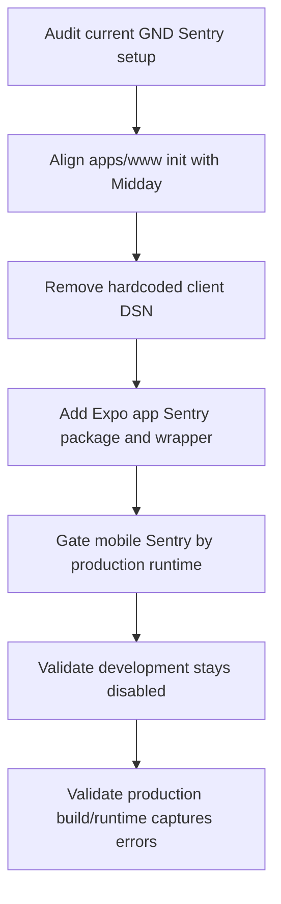

# Plan: Production-Only Sentry For Web And Mobile App

## Type
Bug Fix

## Status
Implemented

## Created Date
2026-07-02

## Last Updated
2026-07-20

## Goal Or Problem
Sentry should be disabled in local/development runtimes and enabled in production across the Next.js web app and Expo mobile app. The current web client initializes Sentry unconditionally with a hardcoded DSN, while the Expo app does not have Sentry wiring yet.

## Current Context
- `apps/www` already depends on `@sentry/nextjs` and has `next.config.mjs`, `sentry.server.config.ts`, `sentry.edge.config.ts`, `src/instrumentation.ts`, `src/instrumentation-client.ts`, and `src/app/global-error.tsx`.
- `apps/www/next.config.mjs` only applies `withSentryConfig` in production, matching the broad Midday pattern.
- `apps/www/sentry.server.config.ts` and `apps/www/sentry.edge.config.ts` guard initialization with `process.env.NODE_ENV === "production"`, but do not set `environment` or `enabled` inside `Sentry.init`.
- `apps/www/src/instrumentation-client.ts` initializes Sentry on every client load and uses a hardcoded DSN instead of `process.env.NEXT_PUBLIC_SENTRY_DSN`.
- Midday reference: `/Users/M1PRO/Documents/code/_kitchen_sink/midday/apps/dashboard` keeps Sentry config files loaded but sets `dsn`, `environment`, and `enabled: process.env.NODE_ENV === "production"` in client/server/edge init, and applies source-map upload only in production.
- Al-ghurobaa reference: `/Users/M1PRO/Documents/code/al-ghurobaa/apps/expo-app` uses `@sentry/react-native`, an app-local `src/lib/sentry.ts`, `initSentry()` in `src/app/_layout.tsx`, `Sentry.wrap(RootLayout)`, the Expo config plugin, and Sentry-aware Metro config.

## Proposed Approach
Align the web app with Midday by using environment-based DSNs and explicit `enabled` flags in all Sentry init points, while preserving production-only source-map upload in `next.config.mjs`. Add Expo app Sentry using the al-ghurobaa shape, but make production the default enabled runtime so development builds stay silent even when a DSN is present.

## Visual Plan

## Implementation Steps
- Update `apps/www/src/instrumentation-client.ts` to use `process.env.NEXT_PUBLIC_SENTRY_DSN`, `environment: process.env.NODE_ENV`, and `enabled: process.env.NODE_ENV === "production"`; keep replay sampling production-friendly.
- Update `apps/www/sentry.server.config.ts` and `apps/www/sentry.edge.config.ts` to use the Midday-style `environment` and `enabled` fields instead of relying only on an outer production guard.
- Keep `apps/www/next.config.mjs` production-only `withSentryConfig`, and consider adding Midday's release/source-map cleanup options when `SENTRY_RELEASE` or `GIT_COMMIT_SHA` is available.
- Confirm `apps/www/src/app/global-error.tsx` remains production-only for manual exception capture.
- Add `@sentry/react-native` to `apps/expo-app` and wire the Expo config plugin in `apps/expo-app/app.config.ts` using `SENTRY_ORG` and `SENTRY_PROJECT_MOBILE` or `SENTRY_PROJECT`.
- Add `apps/expo-app/src/lib/sentry.ts` based on al-ghurobaa, using `EXPO_PUBLIC_SENTRY_DSN`, production-only default enablement, optional debug override, app variant/environment tagging, and Expo update tags.
- Wrap the Expo root layout in `Sentry.wrap(RootLayout)` and call `initSentry()` once before app render in `apps/expo-app/src/app/_layout.tsx`.
- Merge `@sentry/react-native/metro` with the existing NativeWind/custom singleton resolver in `apps/expo-app/metro.config.js`.
- Update `apps/expo-app/scripts/update-preview.mjs` only if mobile source-map upload is intended for preview/production OTA releases.

## Affected Files Or Areas
- `apps/www/src/instrumentation-client.ts`
- `apps/www/sentry.server.config.ts`
- `apps/www/sentry.edge.config.ts`
- `apps/www/next.config.mjs`
- `apps/www/src/app/global-error.tsx`
- `apps/expo-app/package.json`
- `apps/expo-app/app.config.ts`
- `apps/expo-app/metro.config.js`
- `apps/expo-app/src/app/_layout.tsx`
- `apps/expo-app/src/lib/sentry.ts`
- `apps/expo-app/scripts/update-preview.mjs`
- `bun.lock`
- Environment variables: `NEXT_PUBLIC_SENTRY_DSN`, `EXPO_PUBLIC_SENTRY_DSN`, `SENTRY_ORG`, `SENTRY_PROJECT`, `SENTRY_PROJECT_MOBILE`, `SENTRY_AUTH_TOKEN`, optional `SENTRY_RELEASE`

## Acceptance Criteria
- Local `bun run dev --filter www` does not initialize or send browser, server, edge, request, or global-error events to Sentry.
- Production `apps/www` initializes Sentry on client, server, and edge when `NEXT_PUBLIC_SENTRY_DSN` is present.
- Web Sentry DSN is not hardcoded in source.
- Local `bun run dev --filter expo-app www` / development Expo builds do not initialize or send events to Sentry by default.
- Production mobile builds initialize Sentry when `EXPO_PUBLIC_SENTRY_DSN` is present.
- Expo app root is wrapped with Sentry error handling without changing navigation or provider order.
- Source map upload remains production-only and does not run during local development.

## Test Plan
- Run `bun run --filter @gnd/www typecheck`.
- Run `bun run --filter @gnd/expo-app typecheck` if available, otherwise run the narrowest Expo TypeScript check used by the package.
- In development, temporarily trigger the existing web Sentry example route or a controlled client error and verify no Sentry network request/event is sent.
- In a production-env local smoke (`bun run dev --prod --filter www api` or production build equivalent), verify Sentry initialization sees `enabled: true` when DSNs are configured.
- Start the Expo app in development and verify the Sentry init guard exits before `Sentry.init`.
- For production/preview mobile release validation, run the project's existing EAS update/build dry run where available and confirm source-map upload behavior matches the selected release policy.

## Risks / Edge Cases
- If `process.env.NODE_ENV` is not `production` for preview builds, preview builds will stay disabled unless explicitly allowed.
- The Expo Metro config already has a custom resolver; Sentry's Metro wrapper must be composed without losing the existing NativeWind and singleton-package behavior.
- Missing DSNs should result in no-op behavior, not runtime crashes.
- `onRequestError` and router transition exports should remain compatible with Next.js even when Sentry is disabled.
- Source-map upload requires valid `SENTRY_AUTH_TOKEN`, org, and project values only in production/release workflows.

## Decisions
- Only production web deployments and production Expo builds send Sentry events. Preview and local/development environments do not receive the DSNs/enabled flag needed to send.
- Web releases use `SENTRY_RELEASE`, then `VERCEL_GIT_COMMIT_SHA`, then `GIT_COMMIT_SHA`; uploaded source maps are deleted from the deployment artifact.
- Web and mobile use separate Sentry projects under `gnd-52`: `gnd-prodesk-web` and `gnd-prodesk-mobile`.
- The Expo production build profile explicitly selects the EAS `production` environment and `APP_VARIANT=production`.

## Implementation Evidence
- Web client/server/edge initialization now uses environment DSNs, explicit production enablement, and `0.1` trace sampling.
- The hardcoded legacy web DSN was removed.
- `withSentryConfig` remains production-only and now has release tagging, production source-map upload credentials, current debug-log tree shaking, and post-upload source-map deletion.
- Expo now uses `@sentry/react-native`, the Expo config plugin, Sentry-aware Metro serialization composed with the existing NativeWind singleton resolver, one-time initialization, Expo update tags, and `Sentry.wrap(RootLayout)`.
- Vercel Production contains the new web DSN, organization, web project slug, and organization build token.
- Expo Production contains the mobile DSN, enable/debug flags, organization, mobile project slug, and secret build token.
- Root and app-local `.env.local` files are explicitly disabled for mobile telemetry; production env files contain the matching production values.

## Validation Evidence
- Production Expo config import resolved `gnd-52` / `gnd-prodesk-mobile`.
- Metro config import confirmed the Sentry serializer and the composed custom resolver.
- Production Next config import completed without Sentry deprecation warnings.
- Sentry, Vercel, and Expo dashboards were inspected after writes and showed the expected projects, production scopes, and masked secrets.
- No dev server, full build, broad typecheck, or synthetic production error was run.

## Linked Task
- Task Title: Production-Only Sentry For Web And Mobile App
- Task File: brain/tasks/roadmap.md
