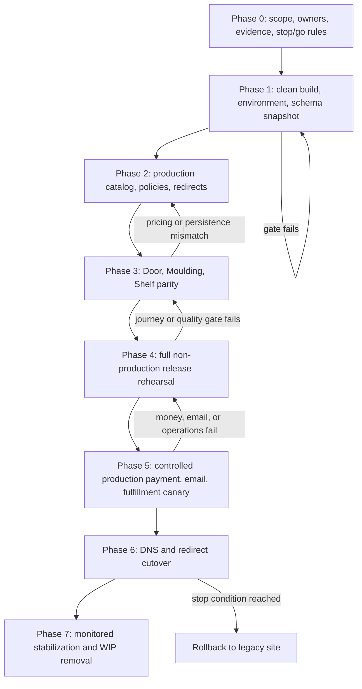

# Plan: Storefront Public Launch Readiness

## Type
Feature

## Status
Proposed

## Created Date
2026-07-22

## Last Updated
2026-07-22

## Goal Or Problem
Move the implemented GND storefront from local sandbox readiness to a safe,
observable, and reversible public replacement for `gndmillwork.com`. Close the
remaining production catalog, Door/Moulding/Shelf parity, real payment/email,
physical fulfillment, release-quality, legacy redirect, and DNS cutover gates
without creating a second sales, pricing, payment, or fulfillment system.

## Current Context
- `apps/storefront` already provides database-backed catalog, product
  configuration, cart, wishlist, customer authentication, checkout, account,
  orders, invoices, contact/custom-quote intake, CMS pages, sitemap, and robots.
- The public API is allowlisted; identity, ownership, configuration validation,
  pricing, checkout idempotency, and order creation are server-authoritative.
- Storefront checkout creates canonical `SalesOrders` records with
  `salesChannel = "storefront"` and hands them to existing staff, payment,
  inventory, production, dispatch, document, and notification workflows.
- The storefront schema has been pushed to development and production. Before
  cutover, the applied production shape still needs a read-only verification and
  deployment snapshot.
- A complete local Door purchase reached Square sandbox settlement, invoice
  generation, customer/admin paid state, and office-sales-editor handoff.
- Email provider delivery was skipped locally with `SKIP_EMAIL=1`; Moulding and
  Shelf Item parity fixtures, real Square/email rehearsal, physical fulfillment,
  a clean release build/typecheck/lint gate, approved content/policies, and
  monitored DNS/redirect cutover remain open.
- Canonical references:
  `.brain/features/storefront-ecommerce-replacement.md`,
  `.brain/reports/2026-07-20-storefront-midday-conformance.md`, and
  `.brain/tasks/in-progress.md`.
- Phase 1 execution evidence now includes READY preview deployment
  `dpl_9d1gkWTDKzuEdCP4wgvi2tnzXqTw`. Storefront build configuration matches
  the `www` Next.js/Turbopack build baseline, Prisma generation runs during
  Vercel install, and protected-preview smokes pass for the homepage, robots,
  dynamic database-backed sitemap, login, and verification routes. The shared
  `DATABASE_URL` was synchronized from `www` across the storefront's three
  Vercel environments. This does not complete Phase 1: the wider environment
  audit, broad quality gate, provider-mode diagnostic, read-only production
  schema snapshot, and production endpoint verification remain open.

## Proposed Approach
Use a gated release-candidate sequence. First establish a reproducible build and
production configuration baseline. Next curate production content and publish
one representative Door, Moulding, and Shelf Item offer. Prove office/storefront
configuration and persistence parity for those fixtures before rehearsing the
complete customer-to-operations journey. Only after a controlled real Square
payment, real email delivery, and physical fulfillment rehearsal pass should DNS
move. Every phase produces durable evidence and has a stop/go gate; failures
return to the owning phase rather than being waived during cutover.

## Visual Plan

## Implementation Steps

### Phase 0 - Launch contract and evidence ledger
Dependencies: none.

1. Name one accountable owner each for catalog/content, sales configuration,
   Square/payment, email/auth, fulfillment, infrastructure/DNS, and launch
   approval. Record deputies and the communication channel used during cutover.
2. Define the initial public catalog scope. At minimum select one production-safe
   Door, one Moulding, and one Shelf Item offer with known office-form fixtures.
3. Decide and document launch policies: guest checkout remains enabled or
   account-required; supported fulfillment methods; service area; tax policy;
   card charge policy; cancellation/refund boundary; and support escalation.
4. Create a release evidence index under
   `.brain/reports/storefront-launch/<release-id>/` containing commands, build
   hashes, screenshots, sanitized transaction identifiers, content signoffs,
   parity results, redirect results, rollback rehearsal, and final approval.
5. Define measurable stop/go and rollback thresholds for payment creation,
   duplicate orders/payments, checkout errors, email failures, 5xx rate, and
   customer-support incidents. Use `TODO:` until business owners approve exact
   values; do not invent thresholds during cutover.

Validation and gate:
- Owners, catalog scope, policy decisions, release ID, evidence location,
  approval authority, and rollback thresholds are written and approved.
- No production content publication, real charge, or DNS change occurs before
  this gate passes.

### Phase 1 - Reproducible release baseline and production configuration
Dependencies: Phase 0.

1. Capture the current `@gnd/storefront`, `@gnd/api`, `@gnd/sales`, `@gnd/jobs`,
   and relevant shared-package typecheck/build diagnostics. Separate storefront
   dependency-cone failures from unrelated repository debt, while retaining the
   existing broad release requirement in the evidence ledger.
2. Fix the known production-build blocker in
   `apps/api/src/db/queries/inbound-receiving.ts` and then repair remaining
   release-baseline diagnostics without weakening TypeScript or Next.js build
   checks.
3. Replace the obsolete `next lint` storefront script with the repository's
   supported scoped lint command. Make storefront lint, typecheck, focused tests,
   and production build explicit release commands.
4. Verify the Vercel project root is `apps/storefront` and audit production
   environment presence without printing secret values. Required groups include
   `STOREFRONT_APP_URL`, a durable `STOREFRONT_GUEST_SECRET` or approved auth
   secret, NextAuth/auth settings, production Square application/location/token
   settings, Resend/email sender settings, Trigger/jobs settings, storage/image
   settings, database connectivity, and the internal application URL used by
   staff handoffs.
5. Confirm sandbox and production Square modes cannot be confused. Add a
   startup/release diagnostic that reports provider mode and location identity
   without exposing credentials.
6. Read-only verify the production storefront tables, indexes, and
   `SalesOrders.salesChannel`; preserve a schema/deployment snapshot. Do not run
   a broad destructive push or accept unrelated data-loss changes.
7. Verify the deployed storefront origin serves the allowlisted tRPC endpoint as
   JSON and that SSR uses the storefront origin rather than the internal WWW
   origin.

Validation and gate:
- Storefront lint, typecheck, focused tests, and production build pass from a
  clean checkout using the approved production-mode command.
- The agreed broad typecheck gate is green, or the launch approver explicitly
  revises the recorded gate before implementation continues.
- Production environment, schema, provider mode, app origin, and deployment
  snapshot checks pass with no secrets captured in evidence.

### Phase 2 - Production catalog, merchandising, policies, and redirects
Dependencies: Phase 1 and Phase 0 policy decisions.

1. In the internal Storefront workspace, create/approve category hierarchy,
   catalog overlays, public titles/descriptions, primary/gallery media, sort
   order, and navigation for the initial catalog.
2. Publish representative Door, Moulding, and Shelf Item offers. For each offer,
   configure the canonical Dyke root, customer-visible steps/components, hidden
   defaults, required/skip rules, availability (`IN_STOCK`, `MADE_TO_ORDER`, or
   `BACKORDER`), lead-time range, fulfillment message, and browse-only behavior.
3. Review all customer-visible prices and messages. Confirm no supplier cost,
   internal component, private route, unsupported service claim, placeholder
   image, stale date, or test customer/order appears publicly.
4. Publish approved homepage, navigation/footer, service/contact content,
   custom-quote content, shipping/pickup, warranty, returns/refunds,
   privacy/cookies, terms, and accessibility policy pages through Pages &
   Sections/Settings.
5. Inventory every legacy `gndmillwork.com` route and map it to a new canonical
   route or explicit retirement. Include home, shop, door families, moulding
   families, hardware, shipping/delivery, contact, account, terms, privacy,
   returns, product URLs, and category URLs.
6. Validate canonical URLs, metadata, structured product/breadcrumb data,
   Open Graph media, sitemap entries, robots behavior, no-index behavior for
   draft/private pages, and the redirect map in preview/staging.

Validation and gate:
- Business/content owner signs off the initial catalog and every required policy.
- The three representative offers can be opened from admin and configured on
  the public preview without unpublished dependencies.
- Automated redirect checks have no loops, chains beyond the approved limit,
  unexpected 404s, or redirects to private/admin routes.

### Phase 3 - Canonical Door, Moulding, and Shelf Item parity
Dependencies: Phase 2 fixtures and Phase 1 green baseline.

1. Define deterministic office/storefront fixture inputs for all three product
   families, including customer/profile, route/root, selections, dimensions,
   quantity, add-ons, delivery/tax/card policy, and expected normalized values.
2. Add focused tests at `packages/sales` for route projection, hidden defaults,
   visible requirements, component compatibility, decimal pricing, and
   normalized configuration snapshots.
3. Add API integration tests for add/update/reprice/restore/checkout promotion.
   Assert source identities, configuration version/hash, Door/HPT rows,
   Moulding rows, Shelf rows, line totals, order totals, and
   `salesChannel = "storefront"`.
4. Run the same fixture through the office sales form and storefront. Compare
   customer-safe selections, canonical relationships, sell prices to the cent,
   tax/delivery/card totals, and persisted order snapshots. Record any deliberate
   presentation-only difference; do not accept unexplained money or persistence
   differences.
5. Browser-test variant switching, required/hidden steps, image gallery,
   configuration editing, cart repricing, unavailable selections, quantity
   boundaries, wishlist restoration, and office-sales-editor handoff for each
   family.

Validation and gate:
- Door, Moulding, and Shelf Item parity fixtures pass automatically and in the
  browser.
- Each checkout candidate reopens in the office sales editor with equivalent
  canonical lines, specialized rows, schedule/configuration, and totals.
- Any price mismatch, missing relationship, or customer-selectable invalid
  component blocks Phase 4.

### Phase 4 - Full non-production release rehearsal and quality matrix
Dependencies: Phase 3.

1. Rehearse admin publish/unpublish and draft visibility with each storefront
   permission role; verify carts, wishlists, orders, inquiries, and audit events
   remain permission-scoped.
2. Run both guest and account journeys: browse/search/category, configure, add to
   cart, edit, remove, save to wishlist, guest-to-account merge, address entry,
   checkout, Square sandbox payment, confirmation, account order detail, invoice,
   and staff order handoff.
3. Exercise pending, failed, cancelled, duplicate callback, replay, retry, price
   change, unavailable offer, expired guest/session, and abandoned checkout
   paths. Prove exactly-once order/payment behavior and correct cart locking or
   restoration.
4. Use the real email provider in a non-customer rehearsal with controlled
   recipients. Verify signup/verification, password reset, assigned-rep review,
   order confirmation, payment receipt, and observable failure records.
5. Verify customer-visible status projection for stock, made-to-order,
   backorder, production, fulfillment, pickup/delivery, cancellation, and refund
   states without exposing internal-only operational data.
6. Run the supported desktop/mobile browser matrix, keyboard and screen-reader
   checks, WCAG 2.1 AA/contrast/focus/form-error checks, Core Web Vitals and
   bundle/query budgets, authorization/price-tampering tests, rate-limit/spam
   tests, load smoke, sitemap/robots/structured-data checks, and 404 monitoring
   smoke.
7. Rehearse application rollback and data-safe recovery while preserving orders,
   payments, and inquiry records created during the rehearsal.

Validation and gate:
- The release evidence index contains a passing end-to-end matrix with no open
  severity-1 or severity-2 commerce, security, accessibility, or operations
  defects.
- Email delivery, idempotency/replay, rollback, monitoring, and customer/staff
  visibility have observable evidence.
- A named launch approver promotes the exact tested commit/deployment to the
  production-canary phase.

### Phase 5 - Controlled production canary and physical fulfillment
Dependencies: Phase 4 approval. This phase requires explicit authorization from
the payment, fulfillment, and launch owners because it creates a real order and
charge.

1. Freeze the release candidate and content set. Confirm Square is in production
   mode, email is not skipped, the canary customer/recipient is controlled, and
   the selected amount/product can be refunded or otherwise reconciled.
2. Complete one low-risk real transaction for each operationally distinct path
   required at launch. At minimum, complete one representative storefront order;
   reuse the Phase 3 fixtures where practical rather than inventing a new route.
3. Confirm assigned-rep notification/email, staff review, payment link, real
   Square settlement, payment ledger state, `$0.00` or correct residual balance,
   invoice/receipt, customer account state, and Storefront Orders state.
4. Carry the canary through real stock allocation or production, fulfillment,
   dispatch/pickup/delivery, and terminal customer-visible status. Record the
   handoffs and identify any manual operational step that needs a runbook.
5. If made-to-order/backorder is public at launch, rehearse one such lifecycle or
   keep those offers browse-only/unpublished until their rehearsal passes.
6. Verify monitoring and alerts for request errors, checkout failures, payment
   creation/settlement, duplicate protection, email failures, jobs, and support
   escalation. Perform the approved refund/cancellation verification if it is
   part of the launch policy.

Validation and gate:
- Real charge, real email, canonical order, customer/staff visibility, invoice,
  and physical fulfillment all pass with reconciled evidence.
- No duplicate order/payment exists and no unexplained balance or configuration
  difference remains.
- Launch owner signs the DNS go/no-go record. A failed canary returns to Phase 4;
  it is not waived.

### Phase 6 - DNS, legacy redirects, and public traffic cutover
Dependencies: Phase 5 signed go decision and an available rollback owner.

1. Capture final DNS, Vercel domain, TLS, redirect, environment, deployment,
   database, and provider snapshots. Confirm the previous production target can
   be restored without data loss.
2. Put catalog/content changes under a short launch freeze. Notify sales,
   customer service, production, fulfillment, and finance of the launch window
   and escalation path.
3. Attach the production domain to `apps/storefront`, enable the approved legacy
   redirect map, and verify TLS, apex/WWW behavior, canonical host, cookies,
   auth callbacks, Square redirects, sitemap, robots, and representative deep
   links from external networks/devices.
4. Run immediate production smokes without creating unnecessary real charges:
   browse, search, configure, cart, login/signup callback, contact/custom quote,
   policy pages, account protection, API isolation, and payment-link creation up
   to the approved safe boundary.
5. Monitor the agreed payment, error, latency, 404/redirect, email/job, and
   conversion dashboards continuously during the launch window. Apply the
   documented stop conditions; do not troubleshoot money/data corruption under
   unrestricted live traffic.

Validation and gate:
- Public DNS resolves only to the intended storefront, legacy URLs behave per
  the signed redirect inventory, critical journeys pass, and all monitors are
  receiving production data.
- If a rollback threshold is reached, restore the prior traffic target while
  preserving/reconciling all storefront records created after cutover.

### Phase 7 - Stabilization and release closure
Dependencies: successful Phase 6.

1. Run formal launch checkpoints after the initial launch window and at the
   business-approved 24-hour and 72-hour points. Reconcile orders, payments,
   emails, inquiries, customer accounts, and operational handoffs.
2. Review zero-result searches, 404s, abandoned carts/checkouts, failed emails,
   payment retries, support requests, performance, and inventory/production
   exceptions; assign defects with severity and owner.
3. Remove the Storefront `WIP` navigation badge only after the release owner
   closes every launch-blocking criterion.
4. Update the storefront feature status, Brain task state, production runbook,
   redirect inventory, and final evidence links. Record durable architecture or
   policy changes in an ADR if implementation required them.
5. Move deferred capabilities such as reviews, comparison, recently viewed,
   recommendations, coupons/promotions, and newsletter marketing into separate
   post-launch plans unless the business explicitly promotes one into launch
   scope.

Validation and gate:
- Payment/order reconciliation is clean, no unresolved launch-severity defect
  remains, operations accept the handoff, the WIP badge is removed, and the
  plan/task are marked Done with final evidence links.

## Affected Files Or Areas
- `apps/storefront`: public routes, auth, cart/account/order UI, metadata,
  sitemap/robots, configuration, release scripts, and deployment settings.
- `apps/www/src/app/(sidebar)/storefront`: Categories, Catalog, Carts &
  Wishlists, Orders, Inquiries, Pages & Sections, and Settings administration.
- `apps/api/src/db/queries/storefront-*.ts` and
  `apps/api/src/trpc/routers/storefront-*.ts`: public/admin API orchestration,
  checkout, account, ownership, rate limits, and release diagnostics.
- `packages/sales/src/storefront-*.ts`: canonical configuration, pricing,
  catalog, order projection, and parity fixtures/tests.
- `packages/jobs/src/tasks/storefront`: lifecycle and confirmation email jobs.
- `packages/notifications`, `packages/email`, `packages/square`, and sales
  payment/document/inventory/fulfillment integrations used by the storefront.
- `packages/db`: read-only production shape verification; schema changes are not
  anticipated unless a defect proves one is required.
- Vercel project/environment, Square production application, email provider,
  Trigger/jobs, DNS, monitoring, analytics, and the legacy redirect inventory.
- `.brain/features/storefront-ecommerce-replacement.md`, `.brain/tasks/*`,
  `.brain/progress.md`, release evidence reports, and an ADR only if a durable
  implementation decision changes.

## Acceptance Criteria
- Production catalog and policy content are approved and representative Door,
  Moulding, and Shelf Item offers are published without private/test data.
- Storefront/office parity is proven for all three product families, including
  canonical relationships and totals to the cent.
- A controlled production Square payment creates exactly one canonical order
  and payment; customer/staff views, balance, invoice, and receipt agree.
- Real authentication and email flows work, including verification, reset,
  assigned-rep review, confirmation, receipt, and failure visibility.
- A representative order completes the real fulfillment lifecycle and exposes
  correct customer-safe status.
- Storefront lint, typecheck, tests, production build, browser, security,
  accessibility, performance, SEO, redirect, and rollback gates pass.
- Production schema/environment snapshots, monitoring, alerting, stop conditions,
  and reconciliation procedures are recorded without secret leakage.
- DNS and legacy redirects are cut over reversibly; post-launch reconciliation
  is clean; the WIP badge is removed only after release closure.

## Test Plan
- Unit: storefront policy projection, hidden/default/required rules, availability,
  decimal money, status projection, guest identity, and redirect helpers.
- Contract/API: authorization matrix, customer/guest ownership, price tampering,
  cart merge/reprice, offer publication, idempotent checkout, callback replay,
  order promotion, and account order scoping.
- Integration: Door/Moulding/Shelf persistence parity, specialized row creation,
  inventory sync handoff, payment settlement, document generation, email jobs,
  and customer/staff status consistency.
- Browser: public discovery through checkout/account plus admin publish/review and
  office-editor handoff on supported desktop/mobile browsers.
- Non-functional: WCAG 2.1 AA, keyboard/screen reader, performance budgets,
  image/query/bundle limits, rate limits, honeypot/abuse, load smoke, metadata,
  sitemap/robots, structured data, redirects, and 404 monitoring.
- Operations: schema/env verification, sandbox rehearsal, controlled production
  charge, real email, physical fulfillment, refund/cancellation as policy
  requires, monitoring/alerts, reconciliation, DNS cutover, and rollback drill.

## Risks / Edge Cases
- Unrelated monorepo type debt can obscure storefront regressions. Capture the
  baseline once, repair the known build blocker first, and retain focused
  dependency-cone gates while the agreed broad gate is made green.
- Production and sandbox Square configuration can be confused. Require an
  explicit provider-mode diagnostic and two-person canary confirmation.
- Publishing an offer with hidden invalid dependencies can create impossible
  configurations. Block publication/release on all three canonical parity
  fixtures and readiness diagnostics.
- Catalog edits between payment and fulfillment can change presentation. Keep
  the persisted configuration/pricing snapshot authoritative for the order.
- DNS rollback does not undo orders/payments already written. Roll back traffic,
  never commerce records; reconcile all post-cutover records explicitly.
- Email delivery can succeed asynchronously after the UI reports a failure or
  vice versa. Use the durable attempt ledger/provider result and idempotent send
  semantics during reconciliation.
- Made-to-order/backorder promises can outrun operational readiness. Keep those
  offers browse-only or unpublished until their lifecycle rehearsal passes.
- Existing user changes in the dirty worktree may overlap Brain files. Keep plan
  edits additive and do not rewrite unrelated task or progress history.

## Open Questions
- TODO: Name launch, catalog, payment, email/auth, fulfillment, DNS, and final
  approval owners.
- TODO: Select the exact Door, Moulding, and Shelf Item production fixtures and
  define the initial public catalog boundary.
- TODO: Confirm guest checkout versus account-required policy; the current
  implementation supports guest and account journeys.
- TODO: Approve fulfillment/service area, tax, card charge, cancellation/refund,
  returns, warranty, privacy/cookie, and accessibility policy copy.
- TODO: Approve measurable stop/go and rollback thresholds.
- TODO: Choose the controlled production transaction customer, amount, Square
  location, assigned sales rep, and physical fulfillment method.
- TODO: Approve the complete legacy URL redirect inventory and analytics/error
  monitoring dashboards used for launch.
- TODO: Confirm whether the broad whole-monorepo typecheck remains a hard launch
  gate in addition to the storefront dependency cone.

## Linked Task
- Task Title: Storefront Public Launch Readiness
- Task File: `.brain/tasks/roadmap.md`
