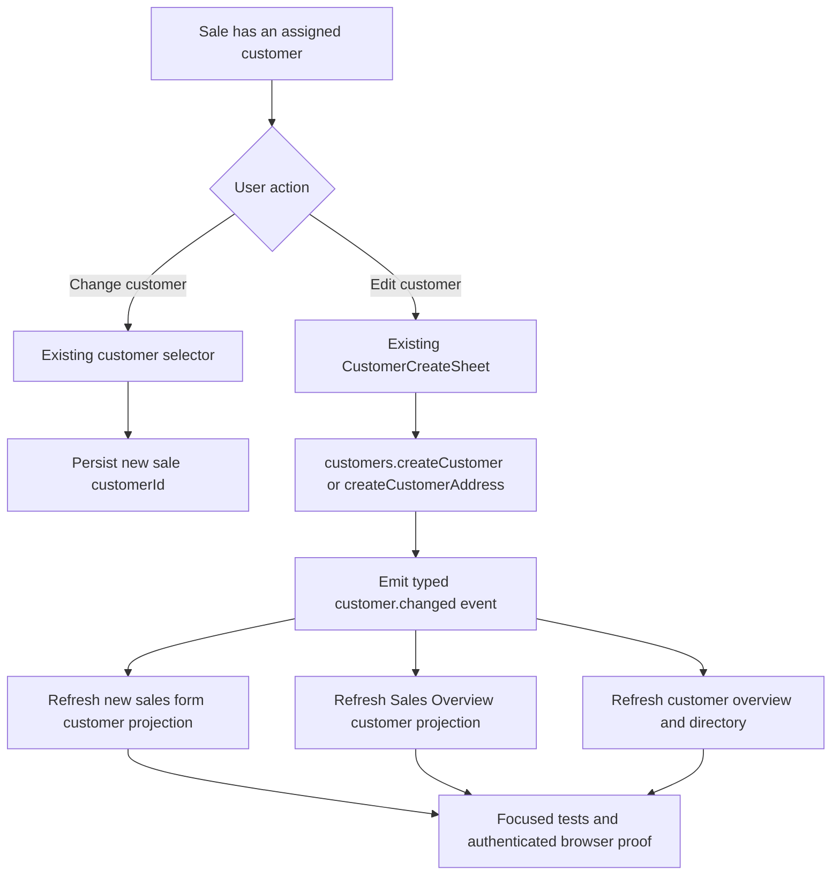

# Plan: Sales Customer Editing From Form And Overview

## Type
Bug Fix

## Status
Done

## Created Date
2026-07-23

## Last Updated
2026-07-23

## Goal Or Problem
Allow an authorized user to edit the customer attached to a sale directly from
the new sales form and Sales Overview, without navigating to the customer
directory or relying on the legacy sales form.

## Current Context
- The new sales form customer card exposes `Change`, which opens the customer
  selector and can replace the sale's `customerId`.
- New-form save already persists a changed `customerId`, profile, billing
  address, and shipping address through `newSalesForm.saveDraft` /
  `newSalesForm.saveFinal`.
- The shared new-form customer card has no `Edit customer` contract, and the
  customer selector exposes customer creation but not editing of the selected
  customer.
- The legacy sales form already opens the global customer form with
  `customerForm=true` and the current `customerId`; this is the reusable
  behavior to preserve rather than creating another customer editor.
- Current and compatibility Sales Overview customer sections open the
  read-only customer overview sheet. They do not open the customer edit sheet.
- `customers.createCustomer` and `customers.createCustomerAddress` are not
  registered in the WWW query-event catalog, so an update does not currently
  guarantee that the sales form, Sales Overview, customer overview, and
  customer directory refresh together.
- No database or Prisma change is expected.

## Proposed Approach
Reuse the existing global `CustomerCreateSheet` as the single customer editor.
Add a shared edit-customer action that opens it with the selected customer id,
then publish a typed `customer.changed` query event after a successful customer
or address update. The event should refresh customer reads and every sales
surface that projects customer details. Keep `Change customer` separate from
`Edit customer`: changing updates the sale association, while editing updates
the currently associated customer record.

Use one reusable Sales Overview customer action across the current overview
tab, the v2 tab, and the legacy compatibility sheet so behavior does not depend
on which overview surface opened. Gate the action through the existing
sales-form/customer edit capability and customer ownership/read-only rules.

## Visual Plan

## Implementation Steps
1. Add a red regression contract for the reported behavior.
   - Cover both distinct actions on the new-form customer card: `Change` and
     `Edit`.
   - Cover the Sales Overview customer edit action and the current customer id
     passed to the global customer sheet.
   - Cover post-mutation refresh targets so the test fails if a successful edit
     leaves stale customer data on either sales surface.
2. Extend the shared customer-card/action contract.
   - Add an `onEditCustomer` affordance to
     `packages/sales/src/sales-form/ui/overview/customer-overview-card.tsx`.
   - Render it only when a customer is selected and customer editing is
     permitted.
   - Keep `Edit` and `Change` visually and behaviorally distinct.
3. Wire new-form customer editing.
   - In the WWW new sales form, open the existing customer sheet with
     `customerForm=true` and `customerId=record.form.customerId`.
   - Move customer-form payload reconciliation out of the selector-only
     boundary if necessary so edits refresh the selected customer's display,
     profile, tax, billing, and shipping metadata even when the selector dialog
     is closed.
   - Preserve the sale's current `customerId` after editing the profile.
4. Add Sales Overview customer editing.
   - Build one reusable customer edit action/section consumed by the current
     overview v1, overview v2, and the legacy compatibility general tab.
   - Open the same global customer sheet with the sale's current customer id.
   - Hide or disable the action for missing, dealer-owned/read-only, or
     otherwise unauthorized customers.
5. Add coherent query refresh behavior.
   - Add a typed `customer.changed` event and map
     `customers.createCustomer` / `customers.createCustomerAddress` to it.
   - Refresh `customers.getSalesCustomer`,
     `customers.getCustomerOverviewV2`, `sales.customersIndex`,
     `newSalesForm.resolveCustomer`, and Sales Overview detail projections.
   - Prefer the existing query-event registry over component-local broad cache
     clearing; use customer or sale scope where the mutation/caller can provide
     it.
6. Validate security and data integrity.
   - Confirm server-side customer ownership rules prevent office users from
     editing dealer-owned/read-only customers even if a URL is crafted.
   - Confirm editing contact/profile/address data does not change the assigned
     sale customer, totals, payments, inventory, production, or documents.
7. Run focused and browser validation.
   - Run the new regression tests, existing customer form tests, new sales form
     customer-resolution tests, query-event tests, targeted Biome, and filtered
     WWW/API typechecks.
   - In an authenticated browser, create or use a representative sale; edit the
     customer's name/contact/address from the sales form and verify immediate
     refresh without changing the assigned customer.
   - Repeat from Sales Overview and verify the overview, customer overview, and
     reopened sales form all show the saved values without a manual reload.
   - Verify dealer-owned/read-only behavior and both order and quote surfaces.

## Affected Files Or Areas
- `packages/sales/src/sales-form/ui/overview/customer-overview-card.tsx`
- `apps/www/src/components/forms/new-sales-form/sections/invoice-overview-panel.tsx`
- `apps/www/src/components/forms/new-sales-form/sections/customer-selector-dialog.tsx`
- `apps/www/src/components/forms/customer-form/*`
- `apps/www/src/components/sheets/customer-create-sheet.tsx`
- `apps/www/src/components/sales-overview-system/tabs/overview-tab.tsx`
- `apps/www/src/components/sales-overview-system/tabs/overview/v2.tsx`
- `apps/www/src/components/sheets/sales-overview-sheet/general-tab.tsx`
- `apps/www/src/lib/query-events/registry.ts`
- `apps/www/src/lib/query-events/*test.ts`
- Customer mutation ownership checks under `apps/api/src/db/queries/customer.ts`
  and `apps/api/src/trpc/routers/customer.route.ts`
- `.brain/features/sales-form-system-hardening.md`
- `.brain/features/query-invalidation-events.md`
- `.brain/sales-overview-system-architecture-plan.md`

## Acceptance Criteria
- A selected customer in the new sales form has both `Edit` and `Change`
  actions.
- `Edit` opens the existing customer form prefilled for the selected customer;
  `Change` continues to open customer selection.
- Saving a customer edit keeps the same customer assigned to the sale and
  updates the visible customer name/contact/profile/address without a manual
  page reload.
- Sales Overview exposes `Edit customer` and refreshes its customer details
  after save without routing to the sales form.
- Current, v2, and legacy compatibility Sales Overview surfaces behave
  consistently.
- Unauthorized or dealer-owned/read-only customer edits are blocked in both UI
  and server behavior.
- Existing sale totals, payments, inventory, production, and document state are
  unchanged by a customer profile edit.
- Focused automated coverage and authenticated order/quote browser proof pass.

## Test Plan
- Shared customer card test for separate edit/change callbacks and disabled
  states.
- New sales form test for edit query params, same-customer preservation, and
  refreshed customer/profile/address projection.
- Sales Overview v1/v2/legacy contract test for the shared edit action and
  current customer id.
- Query-event registry/executor tests for customer mutation mappings and all
  dependent query families.
- API test for dealer-owned/read-only customer update rejection.
- Authenticated browser scenarios for order and quote edits from both entry
  points, including refresh/reopen checks.

## Risks / Edge Cases
- Customer form success is currently communicated through shared URL payload
  state; leaving reconciliation inside the selector dialog could make edits
  work only while that dialog is mounted. Mitigation: move reconciliation to a
  stable form boundary or a reusable hook.
- Customer profile or tax changes can trigger sale repricing. Mitigation:
  editing customer contact/address data must not implicitly change the sale's
  selected pricing profile; require an explicit profile action for repricing.
- A customer edit can affect many sales that display the same customer.
  Mitigation: use a domain-level customer event with complete dependent query
  coverage instead of refreshing only the initiating sale.
- Multiple Sales Overview implementations can drift. Mitigation: share the edit
  action and test all registered/compatibility surfaces.
- Dealer-owned customer visibility is stricter than office customer visibility.
  Mitigation: enforce ownership on the server and treat UI gating as a
  convenience, not the authorization boundary.

## Open Questions
- The first implementation will expose one full `Edit customer` action using
  the existing customer sheet. Separate shipping and billing quick actions can
  remain a later enhancement if real workflow evidence requires them.

## Linked Task
- Task Title: Sales Customer Editing From Form And Overview
- Task File: `.brain/tasks/done.md`

## Completion Evidence
- The shared new-sales-form customer card exposes distinct, accessible `Edit`
  and `Change` actions. `Edit` opens the existing prefilled customer sheet;
  `Change` retains the existing customer-selector behavior.
- Customer-sheet completion reconciles the selected customer's display,
  contact, and primary address metadata while preserving the sale pricing
  profile, terms, tax code, distinct shipping address, and assigned customer id.
- Current v1, v2, and compatibility Sales Overview customer sections consume
  one shared edit action. The action requires `editSalesCustomers`, is hidden
  for dealer/read-only sales, and consumes only its matching completion payload.
- Customer and address mutation routes independently require
  `editSalesCustomers` and retain their dealer-ownership rejection.
- `customer.changed` now refreshes customer directory/overview/form queries and
  sales projections after customer or customer-address saves.
- Existing server ownership guards for dealer-owned customers and addresses are
  protected by focused regression tests.
- Validation passed 40 focused tests / 86 assertions, focused Biome, API and
  sales package typechecks, scoped diff checks, and authenticated browser proof
  on office order `08890PC`. Browser proof opened prefilled editors from Sales
  Overview and the new sales form without submitting or changing customer data.
  The broad WWW typecheck retains the documented unrelated repository baseline;
  filtered output showed no new production diagnostic from this feature. The
  complete repository test run finished with 2,113 passing, 1 skipped, and 25
  existing unrelated failures; none were in the focused customer-editing set.
- Independent review found no documented-standards violations. Its two P1 spec
  findings were corrected before handoff: permission enforcement now uses
  `editSalesCustomers` at the UI and API boundaries, and same-customer
  reconciliation no longer changes sale pricing metadata.
