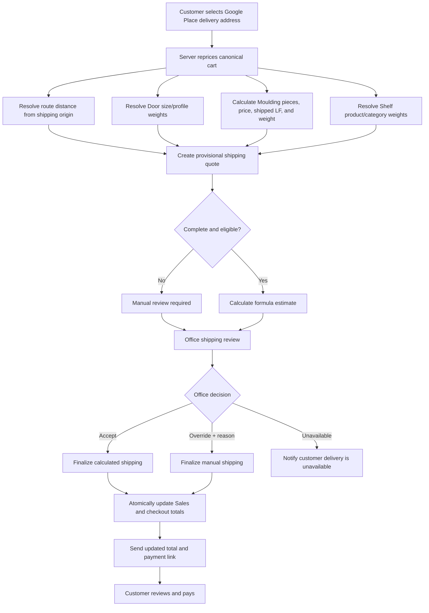

# Plan: Storefront Product-Aware Shipping Quotes

## Type
Feature

## Status
Implemented Locally

## Created Date
2026-07-23

## Last Updated
2026-07-23

## Implementation Record

V1 and the requested confidence-gated V2 are implemented locally. The shared
domain, versioned policy/quote persistence, Google address and route API,
Moulding length-first storefront configuration, checkout estimate, office
review/override, notification, and payment-link guard are complete.

Production activation remains pending business calibration of origin, weights,
rates, service/capacity limits, and V2 confidence gates. The active local policy
was not changed during browser testing.

Validation: 9 focused tests / 37 assertions, API/Sales/DB typechecks,
Prisma generation, local schema push, targeted Biome/diff checks, and local
  browser smoke of the admin and storefront surfaces. Review hardening also
  locks payment-started quotes, binds checkout to the active policy and
  canonical Google address, prevents linked-quote supersession, rate-limits
  previews, and requires all V2 safety gates. Normal migration replay is
blocked by the pre-existing `20260722180000_master_password_usage_audit`
shadow-database ordering failure; no destructive reset was performed.

## Goal Or Problem
Replace the storefront's address-independent flat delivery charge with an
office-reviewed shipping quote that uses a validated customer destination,
driving distance, and estimated shipment weight derived from canonical Door,
Moulding, and Shelf Item selections. Preserve an explicit office override and
manual-quote path before any payment link is sent.

## Current Context
- Storefront settings currently support pickup, delivery, one flat delivery
  rate, and an optional free-delivery subtotal threshold.
- Storefront checkout currently accepts manually entered address fields and
  calculates delivery without using the address.
- Google Places autocomplete and Place Details groundwork exists, but it is not
  exposed through the dedicated storefront API or used by checkout.
- Storefront Door configuration already preserves canonical dimension,
  component, handing, and quantity in normalized HPT door rows.
- The shared sales-form moulding calculator already implements requested linear
  feet plus waste, whole-piece rounding, and piece-price totals through
  `calculateMouldingQuantity`; the storefront does not yet expose that
  length-first moulding workflow.
- Shelf selections preserve product, child/parent category, quantity, and unit
  price, but no shipping weight is configured.
- Storefront orders already wait in `ORDER_CREATED` for an employee to verify
  the order and send the payment link. The current verification action cannot
  review or revise shipping.
- Existing `ShippingConfiguration` tables and `packages/sales/src/shipping.ts`
  are disconnected scaffolding. Their calculator and API are commented out and
  should not be activated as-is.
- Canonical storefront architecture remains governed by
  `.brain/features/storefront-ecommerce-replacement.md` and ADR-017.

## Proposed Approach
Build a versioned shipping-quote domain shared by storefront checkout and the
office review surface. The customer selects a Google Place destination, the
server resolves the route and product-derived weight evidence, and a
deterministic policy produces a provisional estimate. V1 always requires an
authorized employee to accept or override that estimate before payment.

### Weight source hierarchy

#### Doors
Use reusable Door Shipping Weight Profiles rather than one global size-only
table. A profile represents a meaningful construction class such as hollow
core, solid core, exterior/fiberglass, or another admin-defined class.

Resolve each door row in this order:
1. component-and-size weight override;
2. assigned weight-profile size entry;
3. global size fallback;
4. unmapped/manual-review state.

Each size entry may also carry an optional fixed handling surcharge. This
supports size-sensitive handling without incorrectly replacing the
distance-based trip charge with a complete per-door delivery price.

Door weight:

```text
doorWeightLb = quantity × resolvedWeightLb(component, dimension)
```

#### Mouldings
Reuse `calculateMouldingQuantity` for both office and storefront:

```text
pieces = ceil((requestedLinearFeet / pieceLengthFeet) × (1 + wastePct / 100))
shippedLinearFeet = pieces × pieceLengthFeet
productPrice = pieces × pieceUnitPrice
mouldingWeightLb = shippedLinearFeet × resolvedLbPerLinearFoot
```

Resolve pounds per linear foot from a product override, then category default,
then global fallback. Weight must use shipped whole-piece footage rather than
requested footage. Piece length must also feed a configurable long-item
surcharge or manual-review threshold because a long profile can require a
different vehicle even when its weight is low.

#### Shelf items
Resolve pounds per unit from:
1. product override;
2. child-category default;
3. parent-category default;
4. global fallback;
5. unmapped/manual-review state.

```text
shelfWeightLb = quantity × resolvedWeightPerUnitLb
```

#### Chargeable shipment weight

```text
estimatedWeightLb =
  sum(doorWeightLb + mouldingWeightLb + shelfWeightLb)

chargeableWeightLb =
  roundUp(estimatedWeightLb × packagingMultiplier, weightRoundingIncrement)
```

The quote must retain every contributing line, source level, and confidence
state (`OVERRIDE`, `PROFILE`, `CATEGORY_DEFAULT`, `GLOBAL_DEFAULT`, or
`UNMAPPED`) so office staff can understand the estimate.

### Recommended V1 formula

Use a transparent base-trip plus weight-distance formula:

```text
routeMiles = oneWayDrivingMiles × roundTripMultiplier
excessWeightUnits =
  max(0, chargeableWeightLb - includedWeightLb) / weightUnitLb

calculatedShipping =
  baseDispatchFee
  + routeMiles × baseVehicleRatePerMile
  + routeMiles × excessWeightUnits × weightDistanceRate
  + fixedHandlingSurcharges

provisionalShipping =
  clamp(calculatedShipping, minimumCharge, optionalMaximumCharge)
```

Apply service-area eligibility before any free-delivery rule. If the destination
is outside the configured maximum route distance, the route cannot be resolved,
the shipment exceeds configured vehicle capacity, or a required weight is
unmapped, the quote becomes `MANUAL_REVIEW_REQUIRED`; it must never silently
fall back to zero.

The formula coefficients must be settings, not constants. Initial values should
be calibrated from actual or reconstructed deliveries rather than invented
during implementation.

### V1 office-reviewed lifecycle
1. Customer chooses Delivery and selects an address through Google Places
   autocomplete.
2. The server resolves/validates the selected place, calculates driving
   distance from the configured origin, reprices the cart, derives line-level
   shipping weight, and creates a provisional shipping quote.
3. The storefront shows the amount as an estimate requiring office review.
4. The canonical Sales Order is created without a payment link and the assigned
   sales rep receives the existing review notification.
5. Storefront Orders exposes a shipping review panel containing destination,
   route distance, line-level weight sources, total chargeable weight, formula
   breakdown, missing mappings, and provisional charge.
6. An authorized employee may:
   - accept the calculated amount;
   - override the amount with a required reason;
   - mark delivery unavailable;
   - keep the order pending while requesting more information.
7. Acceptance or override atomically updates the canonical Delivery extra cost,
   Sales Order totals/amount due, storefront checkout totals, payment-channel
   charge, immutable quote revision, and audit event.
8. Only the finalized revision can create a payment link. The customer receives
   a shipping-finalized notification and sees the updated breakdown in order
   detail before paying.
9. Shipping becomes locked after payment-link creation. A later revision must
   explicitly supersede/cancel the prior payable state before producing a new
   link.

### Later automation
After V1 has enough accepted-versus-overridden quote evidence:
- report override rate and average/median adjustment by distance and weight;
- tune formula coefficients and weight profiles;
- allow automatic approval only for complete, high-confidence quotes inside
  configured distance, weight, amount, and product-family bounds;
- retain mandatory review for unmapped, oversized, long-item, out-of-area, or
  formula-disabled orders;
- consider multiple fulfillment origins, vehicle classes/capacity, actual
  packed-weight feedback, and carrier/LTL quotes.

## Visual Plan


## Implementation Steps

### Phase 0 - Calibration and policy decisions
1. Select representative historical Door, Moulding, Shelf Item, mixed-cart,
   near-distance, far-distance, and oversized deliveries.
2. Record sanitized route miles, approximate item weights, vehicle/driver cost,
   charged delivery amount, and known office adjustments.
3. Decide origin, one-way versus round-trip policy, service radius, capacity,
   free-delivery behavior, and delivery taxability.
4. Choose initial formula coefficients and acceptable review variance. Keep all
   unresolved values as `TODO:` rather than inventing production pricing.

### Phase 1 - Shipping policy and weight configuration
1. Add first-class, versioned shipping policy, origin, rate, weight profile,
   category default, product override, and quote/revision schema.
2. Add Storefront Settings sections for:
   - calculation enabled/disabled;
   - mandatory office review;
   - origin Google Place;
   - service radius and route behavior;
   - base, mileage, weight-distance, minimum, maximum, free-delivery, packaging,
     capacity, long-item, and fallback settings;
   - Door weight profiles and size entries;
   - Moulding category/product pounds per LF;
   - Shelf category/product pounds per unit.
3. Add readiness diagnostics for missing mappings and invalid/overlapping
   settings.
4. Audit every settings mutation and preserve policy versions used by quotes.

### Phase 2 - Canonical product shipping projection
1. Add shared shipping projection contracts in `packages/sales`.
2. Parse canonical door dimensions and map every normalized door row to its
   weight profile/override.
3. Expose the shared length-first moulding calculator in storefront and persist
   requested LF, piece length, waste, whole pieces, shipped LF, quantity, and
   canonical price.
4. Resolve moulding pounds per LF and long-item evidence.
5. Resolve shelf weight through product/category fallback.
6. Return line-level source/confidence evidence and manual-review blockers.

### Phase 3 - Google address and shipping quote API
1. Expose restricted, rate-limited storefront address autocomplete using
   session tokens.
2. Resolve Place Details or Address Validation server-side and store the
   permitted canonical address/place identity.
3. Call Google Routes server-side for driving distance from the configured
   origin.
4. Add a quote endpoint keyed by cart version, configuration hashes, policy
   version, origin, destination, and address identity.
5. Make quotes expiring, idempotent, and invalidated by cart, address, policy,
   or product-weight changes.
6. Keep provider credentials and authoritative coordinates off the client.

### Phase 4 - Office shipping review and customer handoff
1. Replace the one-click `Verify & send link` action with a structured review
   panel for delivery orders.
2. Show provisional amount, route, item weights, confidence, missing mappings,
   formula, and canonical Sales totals.
3. Add accept, override-with-reason, unavailable, and pending-information
   actions under `editStorefrontOrders`.
4. Finalize the Delivery extra cost and all dependent totals atomically before
   payment-link creation.
5. Add customer order-detail state and email/in-app notification for shipping
   pending, finalized, revised, or unavailable.
6. Prevent stale quote/payment-link reuse and record immutable revisions.

### Phase 5 - Evidence and controlled automation
1. Add quote acceptance/override analytics without exposing customer address
   details unnecessarily.
2. Compare provisional and final delivery charges by distance, weight,
   product family, and missing-weight reason.
3. Recalibrate settings from reviewed evidence.
4. Introduce optional automatic approval behind explicit confidence and safety
   thresholds only after business acceptance.

## Affected Files Or Areas
- `packages/db/src/schema/storefront.prisma`
- `packages/db/src/schema/shipping.prisma`
- `packages/db/src/schema/sales.prisma`
- `packages/sales/src/shipping.ts` or a replacement product-aware shipping
  domain under `packages/sales/src/`
- `packages/sales/src/sales-form/ui/workflow/moulding-calculator.ts`
- `apps/api/src/db/queries/google-place.ts`
- `apps/api/src/db/queries/storefront-commerce.ts`
- `apps/api/src/db/queries/storefront-checkout.ts`
- `apps/api/src/schemas/storefront-checkout.ts`
- `apps/api/src/trpc/routers/storefront-public.route.ts`
- `apps/api/src/trpc/routers/storefront-admin.route.ts`
- `apps/storefront/src/app/(dashboard)/checkout/client.tsx`
- `apps/storefront/src/components/address-autocomplete.tsx`
- `apps/storefront/src/components/storefront/product-configurator.tsx`
- `apps/storefront/src/components/storefront/order-detail-client.tsx`
- `apps/www/src/components/storefront/storefront-operations-panels.tsx`
- Storefront transactional notifications/email templates
- `.brain/database/`, `.brain/api/`, `.brain/features/`, and ADR documentation
  required by the final implementation

## Acceptance Criteria
- Storefront delivery calculation uses a server-resolved Google Place
  destination and driving distance rather than free-text address fields alone.
- Every Door row resolves weight from component-size override, assigned profile,
  global fallback, or an explicit unmapped state.
- Storefront Moulding accepts requested LF and reuses the shared whole-piece,
  waste, and price calculation; shipping weight uses shipped whole-piece LF.
- Shelf weight resolves from product, child category, parent category, global
  fallback, or an explicit unmapped state.
- The provisional quote exposes a reproducible line-level weight and formula
  breakdown with policy/version identity.
- Missing mappings, route failures, capacity breaches, and out-of-area
  destinations cannot produce a zero or automatically payable delivery charge.
- V1 requires office acceptance or an audited override before a payment link is
  sent.
- Finalization atomically updates the canonical Delivery extra cost, Sales
  totals/amount due, checkout totals, and payment-channel charge.
- The customer can see that shipping is pending review and later sees the
  finalized/revised total before paying.
- Paid or payment-pending shipping cannot be silently edited.

## Test Plan
- Unit-test dimension parsing, Door weight-profile precedence, Moulding
  length/piece/weight calculations, Shelf category fallback, packaging
  rounding, formula calculations, clamps, free-delivery eligibility, and
  manual-review blockers.
- Property-test formula monotonicity: increasing eligible distance or
  chargeable weight must not reduce the charge before an explicit cap/free rule.
- API-test customer ownership, Place/session validation, rate limits, route
  failures, idempotent quotes, stale cart/address/policy rejection, and
  credential isolation.
- Integration-test Door, Moulding, Shelf, and mixed carts from configuration
  through provisional quote, Sales Order, office acceptance/override, updated
  totals, notification, payment link, settlement, and order detail.
- Test concurrent/stale office decisions and payment-link creation so only one
  finalized quote revision wins.
- Browser-test desktop/mobile address selection, Moulding LF entry, estimate
  presentation, office review, override reason, customer updated-total display,
  and payment handoff.
- Reconcile a representative historical-delivery fixture set before enabling
  production calculation.

## Risks / Edge Cases
- Door size alone is not enough to estimate hollow-core, solid-core, exterior,
  and complete-unit weights accurately; weight profiles and overrides are
  required.
- Weight alone does not represent length, volume, fragility, or vehicle fit.
  Long mouldings and oversized orders require separate handling/capacity rules.
- Moulding weight must use shipped whole pieces, not only customer-requested LF.
- A formula calibrated without real delivery evidence can look precise while
  being economically wrong.
- Google route/provider failures must leave the order reviewable rather than
  blocking or undercharging it.
- Address/provider retention and attribution must follow the applicable Google
  Maps Platform terms.
- Delivery taxability is a business/legal policy decision and cannot remain an
  accidental hard-coded non-taxable assumption.
- Editing canonical Sales totals after a payment link exists creates stale
  payable amounts; quote revisions and payment-link locking are mandatory.
- Existing commented shipping scaffolding sums enabled methods and has
  simplified zone/dimensional logic; activating it directly would create
  ambiguous or incorrect prices.

## Open Questions
- TODO: Confirm the initial shipping origin Google Place and whether mileage is
  billed one-way, round-trip, or by a configurable multiplier.
- TODO: Identify the initial Door weight profiles and source weight values.
- TODO: Decide whether global Door size fallback is allowed in production or
  whether missing profile mappings always require manual review.
- TODO: Set Moulding category/product pounds-per-LF defaults and the piece-length
  threshold that requires a different vehicle or surcharge.
- TODO: Set Shelf category defaults and determine which products require direct
  overrides.
- TODO: Calibrate base dispatch, included weight, mileage, weight-distance,
  packaging, minimum, maximum, capacity, and handling settings from actual
  deliveries.
- TODO: Decide whether free delivery can apply to product-aware shipping and,
  if so, whether it is restricted by distance/weight/confidence.
- TODO: Confirm delivery taxability and whether tax is destination-derived.
- TODO: Confirm customer messaging for provisional estimates, manual quotes,
  delivery unavailable, and revised totals.
- TODO: Confirm which employee roles may override shipping and whether a second
  approval is needed above an amount/variance threshold.

## Linked Task
- Task Title: Storefront Product-Aware Shipping Quotes
- Task File: `.brain/tasks/roadmap.md`
