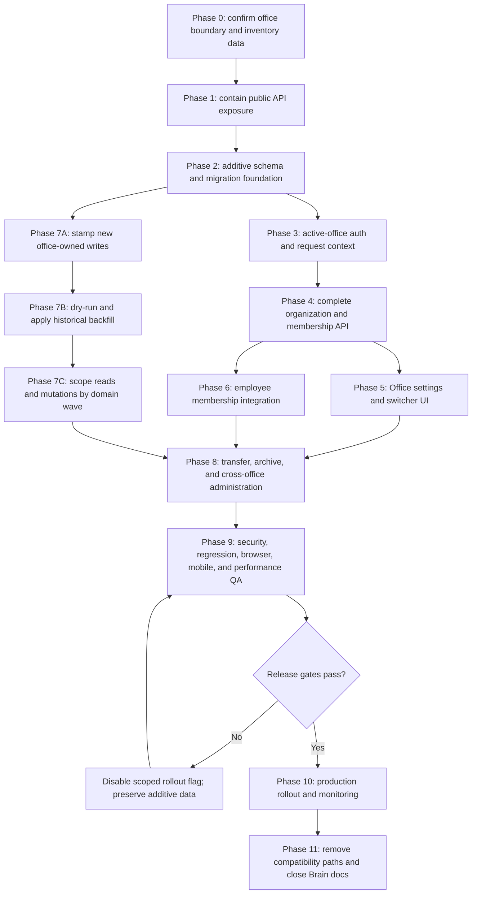

# Plan: Office Organization Management And Operational Scoping

## Type
Feature

## Status
Proposed

## Created Date
2026-07-29

## Last Updated
2026-07-29

## Goal Or Problem
Turn the dormant `Organization` model and employee Office selector into a
secure, complete office-management system. Super Admins must be able to manage
offices and employee memberships, employees must operate inside a verified
active office, and office-owned operational records must be isolated without
breaking the existing single-office production behavior.

## Current Context
- `packages/db/src/schema/organization.prisma` defines `Organization` and
  relations to projects, homes, sales, employee role rows, and work orders, but
  `primary` is nullable and the model has no complete lifecycle contract.
- `ModelHasRoles` already includes `organizationId`, but auth/session builders
  select `roles[0]` without resolving an active organization.
- `SalesOrders.orgId`, `Projects.orgId`, `Homes.organizationId`, and
  `WorkOrders.orgId` exist, but application reads and writes do not currently
  use them as an authorization or data-scoping boundary.
- `orgs.getOrganizationProfile` and `orgs.createOrganizationProfile` use
  `publicProcedure`; the list returns a hard-coded `employeesCount: 0`, includes
  soft-deleted rows, and create returns no organization record.
- The dashboard uses the organization list only to display Office in the
  employee form/table. The previous create/edit/switch Office component was
  removed in the June 2026 cleanup because it was incomplete.
- There is no dedicated organization feature contract, ADR, permission
  contract, migration plan, test suite, or release gate in Project Brain.
- Current auth supports both Better Auth web/mobile sessions and legacy
  sessions. Any active-office design must preserve both until legacy auth is
  retired.

## Proposed Approach
Use a staged, additive rollout with two product milestones:

1. **Office Administration:** secure CRUD/lifecycle APIs, real counts, employee
   memberships, and a Super Admin settings surface. This milestone does not
   silently change existing operational query visibility.
2. **Operational Office Scoping:** add verified active-office context, stamp new
   records, backfill historical ownership, scope reads/writes in reviewed domain
   waves, then expose office switching.

Recommended domain contract:

- An Organization represents an operational GND office, not an independent
  legal tenant.
- A user may have one or more office memberships and one role per membership.
- A normal user operates in exactly one verified active office per session.
- Super Admin may choose a specific office or an explicit `All Offices` mode;
  ordinary users never receive an all-office query path.
- Customer identities, product/catalog configuration, customer pricing
  profiles, inventory stock, and global settings remain company-global in the
  first release. Sales, community projects, and work orders become
  office-owned. Derived children inherit ownership through their canonical
  parent instead of duplicating organization columns unnecessarily.
- Dealer/storefront-origin records receive an office through an explicit
  fulfillment-office policy, never from an unauthenticated request or an
  arbitrary client-supplied id.
- Existing production behavior remains the compatibility baseline until each
  domain passes its migration and isolation gate.

Phase 0 must confirm this contract and record it in an ADR before schema or
scoping implementation begins.

## Visual Plan

## Implementation Steps

### Phase 0 - Product Contract, Architecture Decision, And Baseline Audit
Dependencies: none.

1. Confirm whether Office is an operational partition as recommended or merely
   employee metadata. Stop the scoping phases if the decision is metadata-only.
2. Create an ADR covering:
   - organization versus legal-tenant semantics;
   - global versus office-owned domains;
   - active-office selection and `All Offices` behavior;
   - role and permission resolution per membership;
   - parent-owned organization inheritance;
   - dealer/storefront fulfillment-office assignment;
   - archive, reassignment, and deletion policy.
3. Build a read-only inventory matrix for every query, mutation, job, export,
   cache key, event, notification, and document path that reads or writes:
   - `SalesOrders`;
   - `Projects` and `Homes`;
   - `WorkOrders`;
   - employee roles/memberships.
4. Produce a database baseline report containing:
   - active and soft-deleted organizations;
   - primary-organization candidates;
   - employees with zero, one, or multiple organization role rows;
   - null, valid, and invalid organization ids on direct owner records;
   - candidate ownership sources and ambiguous records.
5. Decide the compatibility and rollout flags. Recommended flags:
   `organizationAdminEnabled`, `organizationWriteStampingEnabled`, and
   domain-specific read-scoping flags rather than one irreversible global flag.
6. Define two deterministic QA organizations, users, roles, and overlapping
   record fixtures for isolation tests.

Validation and exit gate:
- ADR is Approved.
- Ownership matrix and baseline report are reviewed.
- Every ambiguous ownership class has a manual-resolution policy.
- Release A and Release B scope is explicitly accepted.

### Phase 1 - Immediate API Security Containment
Dependencies: Phase 0 may still be in review; this phase is independently
releasable and should be prioritized.

1. Change organization reads and mutations from `publicProcedure` to protected
   procedures.
2. Require Super Admin for create/update/primary/archive/restore operations.
   Allow non-admin list/current reads only when required by an authenticated
   employee workflow.
3. Add normalized Zod schemas:
   - trim office names;
   - enforce name length;
   - normalize nullable address and phone;
   - reject client-controlled primary changes outside the dedicated mutation.
4. Filter `deletedAt` by default and define explicit archived-list behavior.
5. Return the created record and remove unused variables and commented
   mutation/backfill code.
6. Add focused tests proving anonymous, customer, dealer, and ordinary office
   users cannot mutate organizations.

Validation and exit gate:
- Permission-boundary tests pass.
- Existing employee Office selector still loads for authorized users.
- No unauthenticated organization metadata or mutation path remains.

### Phase 2 - Additive Schema And Domain Foundation
Dependencies: Phase 0 ADR.

1. Correct and extend `Organization`:
   - use a canonical Prisma primary key;
   - make `primary` non-null with a default;
   - keep soft deletion;
   - add normalized unique identity such as `slug` or `code` only if the ADR
     requires stable human-facing identifiers;
   - add indexes for active/primary listing.
2. Treat `ModelHasRoles` as the initial user-office membership authority unless
   the Phase 0 audit proves it cannot safely support one role per user per
   office. If it cannot, add an explicit `OrganizationMembership` model and
   migrate current rows additively.
3. Add active-organization persistence per authenticated session. Prefer
   `activeOrganizationId` on both Better Auth and legacy session records if
   Better Auth additional session fields are supported cleanly; otherwise add
   one session-selection table keyed by the actual session id and auth surface.
4. Add or reuse durable audit storage for create, update, set-primary, archive,
   restore, membership change, office switch, and record transfer. Reuse the
   existing history/activity infrastructure before adding a new audit table.
5. Decide duplicate organization ownership:
   - `Projects` owns community organization;
   - `Homes` should inherit through Project unless an independently owned home
     is a real supported case;
   - `SalesOrders` and `WorkOrders` retain direct ownership.
6. Add compound indexes needed by the reviewed scoped queries, for example
   organization plus deletion/status/date/sort fields. Do not add speculative
   indexes without query evidence.
7. Generate and execute migrations only through repository commands:
   `bun run db:generate`, `bun run db:migrate`, and `bun run db:push`.
8. Keep migration changes additive until production ownership backfill and
   read-scoping are proven. Do not immediately make historical `orgId` fields
   required.

Validation and exit gate:
- Prisma validation/generation pass.
- Migration is replayable in an isolated database.
- Existing single-office data remains readable before flags are enabled.
- Session schema works for web and mobile authentication.

### Phase 3 - Active-Office Authentication And Request Context
Dependencies: Phase 2.

1. Replace all `roles[0]` authorization assumptions with deterministic
   membership resolution for the active organization.
2. Extend web/mobile session projections and dashboard auth state with:
   - active organization summary;
   - authorized organization memberships;
   - active role and permission set;
   - explicit Super Admin all-office capability.
3. Extend `TRPCContext` with verified organization context. Never trust a raw
   client `organizationId` without membership verification.
4. Introduce reusable middleware/helpers:
   - authenticated organization context;
   - active membership required;
   - Super Admin global context;
   - entity-belongs-to-active-organization assertion.
5. Implement office switching as a server mutation that:
   - verifies membership or Super Admin authority;
   - updates only the current session;
   - rebuilds active role/permissions;
   - invalidates server/client caches and route data;
   - records audit evidence.
6. Define safe fallbacks:
   - one membership: auto-select it;
   - multiple memberships without selection: select the explicit default or
     require selection;
   - no membership: deny operational access and show a recovery screen;
   - archived/removed membership: clear selection and require a valid office.
7. Revoke or refresh affected sessions after membership, role, or permission
   changes.

Validation and exit gate:
- Forged organization ids are rejected.
- Two concurrent sessions can hold different active offices.
- Switching one session does not silently switch another device.
- Web, mobile token, legacy auth, and Super Admin paths have focused coverage.

### Phase 4 - Complete Organization And Membership API
Dependencies: Phases 2-3.

1. Replace the legacy profile-shaped API with explicit contracts:
   - `orgs.list`;
   - `orgs.get`;
   - `orgs.create`;
   - `orgs.update`;
   - `orgs.setPrimary`;
   - `orgs.archive`;
   - `orgs.restore`;
   - `orgs.switchActive`;
   - `orgs.dependencySummary`;
   - membership list/add/update/remove/default operations.
2. Keep a temporary compatibility alias for
   `getOrganizationProfile` until employee/dashboard callers migrate.
3. Return real summary counts using bounded aggregate queries: active
   employees, sales, projects, and work orders.
4. Enforce exactly one active primary organization transactionally. The
   database should prevent duplicate identity, while primary uniqueness is
   enforced by one transaction because MySQL partial unique indexes are not
   portable.
5. Use optimistic concurrency through `updatedAt` or an explicit revision on
   edits to avoid silent lost updates.
6. Make archive non-destructive:
   - block the primary office;
   - block the current session's active office;
   - return dependency counts;
   - require memberships and direct owner records to be transferred first.
7. Make hard deletion unavailable in normal UI/API. If permanent cleanup is
   ever needed, keep it as a separately reviewed repair tool.
8. Ensure all mutations return the affected organization/membership and publish
   the appropriate typed query-invalidation event.

Validation and exit gate:
- CRUD/lifecycle, transaction rollback, concurrency, permissions, counts, and
  audit tests pass.
- Compatibility callers and new callers receive stable typed contracts.

### Phase 5 - Dashboard Office Administration And Switcher
Dependencies: Phase 4. The implementer must use
`vercel-react-best-practices` and `agency-engineering` with the Frontend
Developer specialist before coding or reviewing this phase.

1. Add a Super Admin `/settings/offices` route and sidebar link.
2. Follow the Midday route architecture already used in the repository:
   - thin server route;
   - lean office summary prefetch;
   - Suspense/error boundary;
   - table or list section responsible for detail queries;
   - URL-driven sheet/modal state.
3. Build an Offices table using the existing Tables-2 core:
   - office name and primary badge;
   - active employee count;
   - direct sales/project/work-order counts;
   - contact fields;
   - created/updated state;
   - edit, set-primary, archive/restore, and transfer-preflight actions.
4. Add create/edit and archive/transfer sheets under the established global
   sheet architecture. Show server dependency summaries before destructive
   lifecycle changes.
5. Add a sidebar office switcher only for users with multiple memberships.
   Keep a stable current-office indicator for single-membership users.
6. Show explicit loading, switching, empty-membership, archived-office, stale
   revision, and mutation failure states. Do not optimistically show access
   before server confirmation.
7. On switch success, invalidate the full organization-sensitive query cache,
   revalidate server-rendered route data, and navigate to a safe route if the
   current entity does not belong to the new office.
8. Keep `All Offices` visually distinct, Super Admin-only, and opt-in rather
   than the default selection.

Validation and exit gate:
- Responsive desktop/mobile browser proof passes.
- Keyboard navigation and accessible names are verified.
- No cross-office data remains visible after switching and cache invalidation.

### Phase 6 - Employee Membership And Role Integration
Dependencies: Phases 3-5.

1. Replace the employee form's single Office field with membership management:
   - one or more offices;
   - one role per office;
   - explicit default office;
   - clear validation when no valid membership exists.
2. Refactor `saveEmployee` so it no longer deletes all role rows and recreates
   one row blindly. Apply membership diffs transactionally.
3. Preserve global employee identity/profile fields while resolving role and
   role permissions from the active office membership.
4. Decide and implement user-specific permission semantics. Recommended first
   release: global employee-specific overrides remain global and are documented;
   office-specific overrides require a separate reviewed schema rather than
   overloading the legacy composite permission key.
5. Add Office and optional All Offices filtering to Employees, restricted by
   the viewer's membership/global authority.
6. Refresh employee counts and invalidate/revoke sessions after membership
   changes.
7. Prevent removing a user's last membership without an explicit access-revoke
   action or replacement membership.

Validation and exit gate:
- Create/edit employee tests cover single and multiple memberships.
- Role resolution changes after an office switch.
- Membership removal immediately blocks subsequent requests for that office.
- Existing employee actions and permission-grid behavior remain intact.

### Phase 7 - Operational Data Ownership, Backfill, And Scoping Waves
Dependencies: Phases 2-4. Each domain wave is independently gated.

#### Phase 7A - Stamp New Writes
1. Stamp organization ownership server-side for all new direct owner records.
   Ignore/reject arbitrary client ownership except privileged transfer APIs.
2. Use active organization for authenticated office-created sales, projects,
   and work orders.
3. Use the ADR-defined fulfillment office for dealership and storefront
   records.
4. Make homes inherit project ownership and assert parent consistency if the
   legacy duplicate home organization field remains temporarily.
5. Include organization identity in background-task payloads, idempotency keys,
   events, notifications, query-invalidation scopes, exports, and document
   generation context when those outputs are office-sensitive.

#### Phase 7B - Historical Ownership Migration
1. Implement a bounded, resumable dry-run/apply migration tool with immutable
   evidence output.
2. Backfill only deterministic classes automatically:
   - direct existing valid ownership;
   - project-to-home inheritance;
   - unambiguous employee/default-office ownership where the ADR allows it.
3. Do not silently assign ambiguous records to the primary office. Export them
   for explicit operator mapping.
4. Apply reviewed mappings in batches with idempotency, before/after counts,
   transaction rollback, and checkpoint cursors.
5. Re-run the report until invalid ids and in-scope null ownership reach zero.

#### Phase 7C - Scope Reads And Mutations
Apply in this order, with a flag and isolation test gate per wave:

1. **HRM and organization settings:** memberships, employee lists, role
   resolution, office counts.
2. **Sales:** order/quote lists, summaries, dashboards, Sales Overview,
   accounting, payments, documents, production, dispatch, inventory demand,
   exports, notifications, and background tasks. Children inherit through the
   sale instead of receiving arbitrary duplicated organization ids.
3. **Community:** projects, homes/units, invoices, jobs, templates where
   applicable, customer service, reports, and dashboards. Global templates and
   builders remain global unless Phase 0 explicitly reclassifies them.
4. **Work orders:** lists, assignments, schedules, exports, and notifications.
5. **Mobile, dealership, and storefront integrations:** apply the same server
   ownership assertions; never rely on hidden client filters.
6. **Caches and saved UI state:** include active organization in server cache
   keys, persisted table/page-tab keys where data differs by office, and
   real-time/event channels.

For each wave:
- add organization predicates to list/count/summary/detail and mutations;
- verify entity ids cannot bypass the predicate;
- verify nested relation and export/document paths;
- test Super Admin specific-office and `All Offices` behavior;
- measure query plans and add only evidence-backed indexes;
- enable the wave only after the backfill gate is clean.

Validation and exit gate:
- Two-office isolation matrix passes for every enabled domain.
- No write can create a cross-office parent/child relationship.
- Null-ownership compatibility reads are removed after migration acceptance.

### Phase 8 - Transfer, Archive, And Cross-Office Administration
Dependencies: Phases 4, 6, and the relevant Phase 7 domain wave.

1. Implement explicit office-to-office transfer workflows for memberships and
   supported direct owner records.
2. For high-risk records such as sales with payments, inventory allocations,
   production, dispatch, or documents, define a conservative transfer policy:
   either audited full-aggregate transfer or blocked transfer after a terminal
   boundary. Never update only `SalesOrders.orgId` while leaving dependent
   operational state inconsistent.
3. Provide dependency preview, dry run, affected counts, reason, confirmation,
   actor, source, target, and immutable audit evidence.
4. Require transfers before archive and recheck dependencies transactionally at
   confirmation time.
5. Add Super Admin cross-office reporting as an explicit aggregate query path,
   not by omitting organization predicates from ordinary queries.
6. Define primary-office reassignment and recovery if the current primary must
   be archived.

Validation and exit gate:
- Transfer rollback and concurrent-change tests pass.
- Archived offices cannot receive new records or be selected.
- Cross-office reporting cannot be called by ordinary users.

### Phase 9 - Full Validation, Security Review, And Operational Rehearsal
Dependencies: all implemented phases intended for the release.

1. Run focused unit and integration suites for:
   - schemas and normalization;
   - auth/session membership resolution;
   - organization middleware;
   - API permission matrix;
   - CRUD/lifecycle/primary invariants;
   - employee membership diffs;
   - domain scoping and entity-id bypass attempts;
   - transfer and backfill idempotency.
2. Add regression tests preventing organization procedures from returning to
   `publicProcedure`.
3. Run browser QA with two ordinary users and one Super Admin:
   - create/edit office;
   - assign memberships;
   - switch offices;
   - navigate lists and direct detail URLs;
   - use All Offices;
   - archive/restore and transfer preflight;
   - validate stale-tab/cache behavior.
4. Validate mobile session and switching behavior if mobile switching ships;
   otherwise prove the mobile app receives a deterministic allowed office.
5. Verify exports, PDFs, notifications, task runs, and deep links cannot leak
   another office's data.
6. Run migration rehearsal against a production-shaped copy, record query
   plans, batch duration, lock behavior, and rollback evidence.
7. Run `bun run typecheck`, affected package typechecks, focused Biome/lint,
   focused tests, and the narrowest relevant production build.
8. Complete an independent security/standards review before enabling read
   scoping in production.

Validation and exit gate:
- No P0/P1 security or data-integrity findings remain.
- Migration and rollback rehearsal are signed off.
- Browser/mobile matrix and all scoped package checks pass.

### Phase 10 - Production Rollout, Monitoring, And Rollback
Dependencies: Phase 9.

1. Deploy additive schema and secured API with all new scoping flags off.
2. Enable Office Administration for Super Admin and verify production CRUD,
   counts, audit evidence, and membership behavior.
3. Enable new-write stamping and monitor null-ownership creation.
4. Run production dry-run ownership report; review and apply only approved
   batches.
5. Enable read scoping one domain wave at a time, starting with HRM and ending
   with high-risk Sales operational paths.
6. Enable the switcher only after every route reachable from the sidebar has a
   reviewed behavior for office changes.
7. Monitor:
   - authorization failures by route and organization;
   - null/invalid ownership;
   - cross-office assertion failures;
   - switch failures and stale-session recovery;
   - query latency and cache cardinality;
   - background task and notification organization mismatches.
8. Rollback by disabling the affected read-scope/switcher flag while retaining
   additive organization data and server write stamps. Do not roll back through
   destructive schema removal.
9. Keep a primary-office compatibility fallback only for the defined rollback
   window, then remove it after stable monitoring.

Validation and exit gate:
- All domain flags remain stable through the agreed observation window.
- No new null ownership or cross-office access incident occurs.
- Product owner accepts Release A and Release B behavior.

### Phase 11 - Cleanup And Documentation Closure
Dependencies: stable Phase 10 observation window.

1. Remove `getOrganizationProfile` compatibility naming and dead organization
   UI/API code.
2. Remove null-ownership compatibility branches and rollout flags whose rollback
   windows have expired.
3. Decide whether direct historical duplicate ownership fields such as
   `Homes.organizationId` can be removed in a separately replayable migration.
4. Update:
   - `.brain/features/office-organization-management.md`;
   - `.brain/api/endpoints.md`;
   - `.brain/api/contracts.md`;
   - `.brain/api/permissions.md`;
   - `.brain/database/schema.md`;
   - `.brain/database/relationships.md`;
   - `.brain/database/migrations.md`;
   - the Phase 0 ADR;
   - task and progress ledgers.
5. Record final rollout evidence, remaining limitations, and operator recovery
   procedures before marking the plan Done.

## Affected Files Or Areas
- `packages/db/src/schema/organization.prisma`
- `packages/db/src/schema/schema.prisma`
- `packages/db/src/schema/community.prisma`
- `packages/db/src/schema/sales.prisma`
- `packages/db/src/schema/account.prisma`
- `packages/db/src/schema/web.better-auth.prisma`
- `packages/jobs/src/schema.prisma`
- `packages/auth/src/better-auth/www.ts`
- `packages/auth/src/better-auth/www-session.ts`
- `packages/auth/src/utils.ts`
- `apps/api/src/trpc/init.ts`
- `apps/api/src/trpc/middleware/*`
- `apps/api/src/db/queries/organization.ts`
- `apps/api/src/trpc/routers/organization.route.ts`
- `apps/api/src/db/queries/hrm.ts`
- reviewed Sales, Community, Work Order, reporting, export, notification, and
  job routers/query modules
- `apps/dashboard/src/app/(sidebar)/settings/offices/*`
- `apps/dashboard/src/components/settings/*`
- `apps/dashboard/src/components/sidebar-links.ts`
- `apps/dashboard/src/components/modals/employee-form-modal.tsx`
- `apps/dashboard/src/components/tables-2/employees/*`
- new `apps/dashboard/src/components/tables-2/offices/*`
- dashboard global sheets/providers and auth state
- `apps/mobile` auth/settings/navigation if office switching ships on mobile
- `.brain/features`, `.brain/api`, `.brain/database`, `.brain/decisions`,
  `.brain/tasks`, and `.brain/progress.md`

## Acceptance Criteria
- Organization list/create/update/primary/archive/restore APIs are authenticated,
  authorized, validated, audited, and covered by focused tests.
- Exactly one active primary office exists.
- Soft-deleted offices are excluded from normal reads and cannot receive new
  records or memberships.
- Super Admin can manage offices and memberships through `/settings/offices`.
- Employees with multiple memberships can switch their active office; ordinary
  employees cannot select an unauthorized office or All Offices.
- Active role and permissions are resolved deterministically for the selected
  membership.
- Employee membership edits are transactional and do not delete unrelated
  office roles.
- New office-owned sales, projects, and work orders are stamped server-side.
- Historical direct owner records are backfilled or explicitly classified; no
  ambiguous row is silently assigned.
- Reviewed Sales, Community, Work Order, export, document, notification, cache,
  and background-task paths enforce the same organization boundary.
- Direct entity ids, stale tabs, cached queries, and deep links cannot reveal or
  mutate another office's records.
- Super Admin cross-office reporting is explicit and permission-gated.
- Archive and transfer workflows show dependencies and preserve aggregate
  consistency.
- Database migration, production rollout, monitoring, and rollback evidence are
  recorded in Brain.

## Test Plan
- Static regression: organization routes do not use `publicProcedure`.
- Schema tests: name normalization, nullable contact fields, primary invariant,
  archived-state restrictions, session active-office fields.
- Permission tests: anonymous, customer, dealer, ordinary employee,
  single-office manager, multi-office employee, Super Admin specific office,
  and Super Admin All Offices.
- API tests: CRUD, real counts, optimistic concurrency, archive/restore,
  dependency blocking, switching, membership diffs, session invalidation, and
  audit writes.
- Isolation tests: two organizations with overlapping users, statuses, dates,
  and record numbers; verify list, count, summary, detail, mutation, export,
  document, notification, and task behavior.
- Migration tests: dry-run determinism, invalid foreign keys, ambiguous rows,
  resumable batches, idempotent apply, rollback, and before/after reconciliation.
- Browser tests: responsive Offices settings, forms/sheets, employee
  memberships, switcher, All Offices, direct URLs, stale tabs, error states,
  archive/transfer preflight, and accessibility.
- Mobile tests: token session projection, selected-office persistence, switch or
  deterministic single-office behavior, revoked-membership recovery.
- Performance tests: scoped list/count/summary query plans, office-switch cache
  invalidation time, and backfill batch lock/duration.
- Repository validation: focused tests and Biome, affected package typechecks,
  `bun run typecheck`, narrow production build, `git diff --check`, and Brain
  documentation impact check.

## Risks / Edge Cases
- **Cross-office data leakage:** one missed detail/export/job query can bypass a
  filtered list. Mitigate with entity assertion helpers, route inventory, static
  tests, and two-office integration fixtures.
- **Historical null or ambiguous ownership:** automatic primary-office fallback
  can corrupt ownership. Mitigate with dry-run classification and reviewed
  operator mapping.
- **Auth role ambiguity:** current `roles[0]` behavior is nondeterministic for
  multiple memberships. Replace it before enabling switching.
- **Session inconsistency:** Better Auth, legacy web, and mobile tokens may
  disagree. Use one verified resolver contract and session-specific selection
  tests.
- **Cache leakage after switching:** old React Query/server cache data may remain
  visible. Include organization in sensitive keys and invalidate/revalidate on
  switch.
- **Background task leakage:** queued work can execute after a user changes
  office. Persist canonical organization identity in task payloads and recheck
  the owned entity at execution.
- **Unsafe organization archive/transfer:** changing only a parent id can split
  operational aggregates. Require dependency preview and domain-aware transfer.
- **Scope explosion:** making all existing global data office-owned would create
  a risky tenancy rewrite. Keep customer/catalog/inventory/settings global until
  separately approved.
- **Dirty migration history:** existing database drift can block normal
  migration commands. Rehearse in isolation and do not reset or manually bypass
  migration history without explicit approval.
- **Performance regression:** scoped counts can add query/index cost. Use bounded
  summaries, reviewed query plans, and evidence-backed indexes.

## Open Questions
- TODO: Confirm the recommended operational-boundary contract versus
  employee-metadata-only scope.
- TODO: Provide the production office list and identify the intended primary
  office.
- TODO: Decide the fulfillment-office rule for dealership and storefront sales.
- TODO: Confirm whether any non-Super-Admin role may manage its own office or
  memberships.
- TODO: Confirm whether employee-specific permission overrides stay global in
  the first release.
- TODO: Decide whether mobile users need an office switcher or a fixed default
  membership for the first release.
- TODO: Classify customer identities, builders, templates, tax rules, pricing
  profiles, and settings as global or office-owned; the recommendation is
  global initially.
- TODO: Define which active/paid/produced/fulfilled Sales records may be
  transferred between offices, if any.
- TODO: Resolve every ambiguous historical ownership class after the Phase 0
  baseline report.

## Linked Task
- Task Title: Office Organization Management And Operational Scoping
- Task File: `.brain/tasks/roadmap.md`

