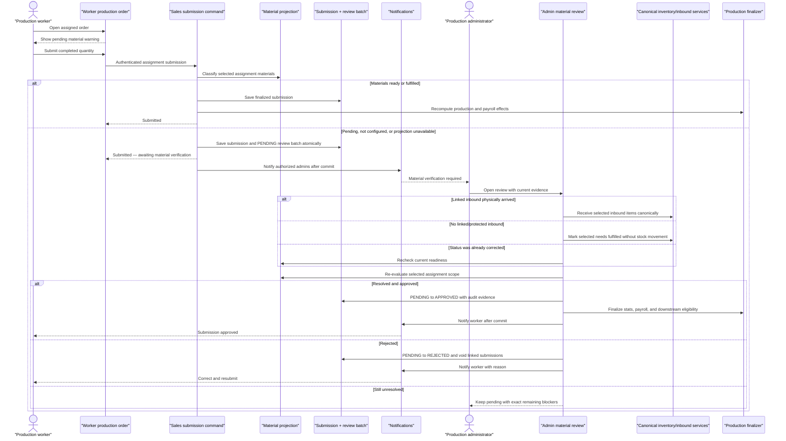

# Plan: Production Worker Submission Material Verification And Admin Approval

## Type
Feature

## Status
Implemented

## Created Date
2026-07-29

## Last Updated
2026-07-30

## Implementation Outcome

Implemented on 2026-07-30. Assignment and submission are nonblocking, worker
identity is server-derived, unresolved submissions enter an admin material
review, mixed canonical inventory resolutions are supported, and pending work
is separated from finalized production/payroll/packing/dispatch truth.
Authenticated browser QA on order `09068PC` confirms the pending-material
warning is visible and the submission control remains enabled. Focused
production coverage passes 65 tests / 234 assertions.

## Goal Or Problem
Allow an assigned production worker to submit completed work even when the
inventory-backed material projection still reports pending inbound, unavailable
stock, allocation review, missing configuration, or a temporary projection
failure. The submission must be accepted rather than blocked. When material
evidence is unresolved, the system must clearly warn the worker, record the
submission as awaiting material verification, notify authorized production
administrators, and provide an audited approval workflow that repairs the
underlying inventory state through canonical inbound receiving or manual
need-fulfillment operations.

The workflow must handle the common operational lag where material physically
arrived or was used, but the sales rep or administrator forgot to update the
inbound or inventory-need status. It must also preserve inventory truth,
prevent duplicate worker submissions, and prevent unverified production from
silently becoming payroll-, dispatch-, or order-completion truth.

## Current Context
- ADR-035 already makes production assignment independent of inventory
  readiness. Workers and administrators can see material status, open inbound
  quantity, expected dates, and unavailable projection states on the production
  board and expanded order detail.
- `submitAll` remains a strict readiness gate today through
  `shouldEnforceProductionReadinessGate` and
  `assertProductionReadinessForSale` in the `update-sales-control` Trigger task.
  This is the boundary this plan changes.
- The main worker UI submits through `update-sales-control`, but legacy direct
  submission paths still exist in:
  - `apps/dashboard/src/actions/submit-sales-assignment.ts`;
  - `submitItemAssignmentAction`;
  - both legacy `submitAssignmentDta` copies.
  The implementation must prevent those paths from bypassing review semantics.
- `OrderProductionSubmissions` currently has no approval lifecycle. All active,
  non-deleted rows are treated as submitted production by sales-control,
  production list totals, assignment progress, and downstream delivery logic.
- The worker detail projection in
  `packages/sales/src/production-v2/application/get-production-order-detail-v2.ts`
  already returns assignment submissions and fail-open material evidence.
- The existing assignment-progress UI subtracts every active submission from
  remaining assignment quantity. That behavior is useful for preventing a
  duplicate submission while an admin review is pending.
- One legacy direct submission action creates payroll immediately. Pending
  review must not create payroll; the existing unique
  `Payroll.productionSubmissionId` relation can provide idempotent approval-time
  finalization.
- Existing canonical inventory correction paths already cover both scenarios
  required by the product:
  - `receiveInboundShipment` records item receipt, stock movement, demand
    receipt, component recomputation, and shipment progress;
  - `fulfillSalesInventoryNeedsManuallyInTransaction` marks eligible needs
    fulfilled without fabricating physical stock, while protecting linked or
    partially received inbound demand under ADR-036.
- Updating an inbound header to `completed` is not sufficient evidence because
  the header-only status path does not perform item receipt, stock movement, or
  demand allocation. Approval must call the canonical receipt operation.
- Notification infrastructure supports typed channels, explicit recipients,
  channel subscribers, in-app activity, and clickable deep-link actions.
- Production read routes are protected. Administrative review writes need a
  stricter mutation boundary than general production viewing.
- The repository worktree contains active unrelated changes. Implementation
  must preserve and rebase around them rather than overwrite them.

## Assumptions
- “Submission is subject to approval” means the worker's work record is saved
  immediately, but final production completion and its downstream effects wait
  for approval.
- A pending-review submission consumes the assignment's remaining submittable
  quantity so the worker cannot submit the same quantity twice.
- Pending-review quantity is shown separately from approved/finalized quantity.
  It does not create payroll, complete the production item/order, or become
  dispatchable.
- Material verification is scoped to the assignments and item quantities in
  the submission action, not unrelated production lines on the same order.
- Material state `pending`, `not_configured`, or `unavailable` routes the
  submission to review. A confirmed ready/fulfilled state finalizes normally.
- An administrator must make an explicit, audited resolution choice. The system
  never guesses that an inbound arrived and never invents physical stock.
- V1 supports partial and mixed material evidence by letting the admin resolve
  each blocker using the appropriate canonical operation before approving.
- Rejection remains available for incorrect work or incorrect quantities. It
  releases the submitted quantity so the worker can correct and resubmit.
- Existing submissions with no review relation remain finalized for backward
  compatibility; no historical backfill is required.

## Proposed Approach
Replace the hard submission gate with a fail-open classification and durable
review lifecycle owned by `@gnd/sales`.

At submission time, the server derives the authenticated worker's selected
assignments, snapshots their current material evidence, and classifies the
submission:

- `finalized`: all relevant material components are ready or fulfilled;
- `pending_material_review`: material is pending, not configured, or the
  projection cannot be loaded.

Both outcomes save the worker's submission. A pending outcome creates one
review batch and links every submission row created by the action to that
batch. The batch owns the material snapshot, revision, reviewer decision, and
resolution evidence. Pending rows count as reported work for duplicate
prevention, but not as finalized production for stats, payroll, packing,
dispatch, or order completion.

The admin production workspace gains a bounded `Material Review` queue and a
review panel. The panel shows the worker, submitted quantities, exact material
blockers, linked inbounds, and current evidence. The admin chooses one or more
canonical resolutions:

1. `Recheck current status`: approve without inventory mutation only when a
   fresh server evaluation is already ready.
2. `Record linked inbound receipt`: receive the selected linked inbound items
   through `receiveInboundShipment`, including the confirmed good/issue
   quantities.
3. `Mark needs fulfilled without inbound`: use a component-scoped version of
   the ADR-036 manual fulfillment service for eligible needs with no protected
   shipment or receipt evidence.
4. `Reject submission`: record a required reason, exclude/void the linked
   submission rows, recompute progress, and let the worker resubmit.

Approval revalidates the material snapshot, applies the selected correction
inside the appropriate transaction boundary, recalculates readiness, finalizes
the linked submissions, recomputes sales-control stats, creates any deferred
payroll idempotently, and writes Sales History evidence. Notification delivery
and query invalidation occur after commit and cannot turn a committed
submission or decision into a failure.

This approach supersedes the ADR-035 statement that `submitAll` remains strict.
Assignment and worker submission are both non-blocking; unresolved submission
evidence is controlled by a durable admin review rather than a pre-write gate.

## Visual Plan

## Implementation Steps

### Phase 0 - Lock Product Semantics And Supersede The Strict-Gate Decision
1. Add a new ADR that supersedes the `submitAll` clause in ADR-035 while
   preserving the assignment decision:
   - assignment never depends on material readiness;
   - worker submission is always accepted when assignment/quantity validation
     passes;
   - unresolved material evidence creates admin review;
   - only approved/finalized submission quantity affects final production,
     payroll, packing, dispatch, and order completion.
2. Define the review lifecycle:
   - `PENDING`;
   - `APPROVED`;
   - `REJECTED`;
   - `CANCELLED` for administrative deletion, assignment deletion, or terminal
     order cleanup.
3. Define material-classification reasons:
   - `AWAITING_INBOUND`;
   - `ALLOCATION_REVIEW`;
   - `BLOCKED`;
   - `NOT_CONFIGURED`;
   - `PROJECTION_UNAVAILABLE`.
4. Confirm the quantity semantics:
   - reported quantity = approved + pending review;
   - finalized quantity = approved + legacy/no-review submissions;
   - rejected/cancelled quantity is excluded from both active totals.
5. Confirm the authorization matrix:
   - worker submit: authenticated ownership of the active assignment;
   - review read: `viewProduction` or `editProduction`;
   - approve/reject: `editProduction`;
   - inbound receipt or manual fulfillment: `editProduction` plus the
     permission required by the underlying inventory operation.
6. Confirm notification recipients:
   - active employees with configured admin channel membership;
   - optionally the active order sales rep;
   - no client-supplied recipient and no hard-coded fallback user.

Dependencies:
- None.

Decision point:
- Recommended: pending review blocks only downstream finalization, never the
  worker submission or the rest of the worker's queue.

Validation:
- ADR, lifecycle table, quantity table, and permission matrix agree before
  schema work starts.

### Phase 1 - Add The Durable Submission Review Schema
1. Add a Prisma enum such as `ProductionSubmissionReviewStatus` with
   `PENDING`, `APPROVED`, `REJECTED`, and `CANCELLED`.
2. Add `SalesProductionSubmissionReview` under
   `packages/db/src/schema/sales.prisma` with:
   - `id`;
   - `salesOrderId`;
   - `submittedById`;
   - `status`;
   - `classificationReason`;
   - server-generated `idempotencyKey`;
   - JSON assignment scope containing assignment ids, item ids, control UIDs,
     and submitted quantity matrix;
   - JSON material snapshot containing only safe component, quantity, inbound,
     readiness, and expected-date evidence;
   - `materialRevision`;
   - nullable reviewer id, decision note, and resolution JSON;
   - `submittedAt`, `reviewedAt`, `cancelledAt`, `createdAt`, and `updatedAt`;
   - post-commit notification diagnostic timestamps/errors if the existing
     notification outbox does not already provide equivalent evidence.
3. Add nullable `materialReviewId` to `OrderProductionSubmissions` and a
   one-to-many relation from one review batch to all rows created by one worker
   submission action.
4. Add indexes:
   - `(status, submittedAt)`;
   - `(salesOrderId, status)`;
   - `(submittedById, status)`;
   - `materialReviewId` on submissions;
   - unique `idempotencyKey`;
   - unique `(materialReviewId, assignmentId)` submission membership to fence
     concurrent retries.
5. Keep legacy/current finalized submissions compatible:
   - `materialReviewId = null` means no material approval was required;
   - linked `APPROVED` reviews are finalized;
   - linked `PENDING`, `REJECTED`, or `CANCELLED` reviews are not finalized.
6. Generate and apply the additive migration only with `bun run db:migrate`
   and `bun run db:push`; do not hand-author migration SQL.
7. Update `.brain/database/schema.md`,
   `.brain/database/relationships.md`, and `.brain/database/migrations.md`.

Dependencies:
- Phase 0 lifecycle decision.

Validation:
- Prisma validation and generation pass.
- Migration diff is additive.
- Existing rows require no backfill and retain current behavior.

### Phase 2 - Create One Canonical Submission Classification Service
1. Add an `@gnd/sales` module such as
   `packages/sales/src/production-submission-review/` with separate commands
   for classification, submission persistence, review projection, decision,
   and finalization.
2. Implement `classifyProductionSubmissionMaterials`:
   - accept the database handle, sales order id, authenticated worker id, and
     server-derived assignment selections;
   - verify active assignment ownership and non-terminal order state;
   - verify requested quantities do not exceed remaining reported quantity;
   - derive selected control UIDs and sales item ids from the database;
   - load only material evidence relevant to those selections;
   - return `finalized` when every relevant component is ready/fulfilled;
   - return `pending_material_review` for every unresolved state;
   - treat projection/sync failure as `PROJECTION_UNAVAILABLE`, not a worker
     submission failure.
3. Do not call the current throwing `assertProductionReadinessForSale` from the
   submission path. Retain it only for callers that explicitly need strict
   preflight behavior, or replace it with a non-throwing classifier.
4. Build a deterministic material revision from:
   - order and selected assignment identity;
   - component ids and current quantities;
   - demand/shipment ids, statuses, and received quantities;
   - allocation evidence;
   - assignment/submission baseline quantities.
5. Bound and sanitize JSON snapshots so no secrets, unrestricted notes, or
   customer contact data are persisted.
6. Add unit tests for ready, awaiting inbound, partial inbound, allocation
   review, missing components, projection failure, mixed items, unrelated
   blocked lines, stale assignments, and excessive quantities.

Dependencies:
- Phase 1 schema.

Decision point:
- The server must classify only the submitted assignment scope. Unrelated
  materials on the same order may remain pending without forcing this
  submission into review.

Validation:
- Classification never mutates inventory.
- Every unresolved or unreadable material state returns a review classification
  instead of throwing a readiness error.

### Phase 3 - Persist Worker Submissions Without Blocking
1. Refactor `submitAllTask` and `submitAssignmentsAction` so one canonical
   command:
   - validates assignment ownership and quantities;
   - classifies material evidence;
   - creates a review batch when required;
   - creates every submission row with the review id in one transaction;
   - returns a typed result with `state`, `reviewId`, submitted quantity, and
     blocker summary.
2. Ensure generated assignment-and-submit rows created inside `submitAll` use
   the same review batch and cannot bypass classification.
3. Replace the hard gate in
   `packages/jobs/src/tasks/sales/update-sales-control.ts`:
   - remove submission-time `assertProductionReadinessForSale`;
   - let the canonical command classify and persist;
   - keep assignment behavior unchanged.
4. Consolidate or adapt every legacy direct write:
   - `apps/dashboard/src/actions/submit-sales-assignment.ts`;
   - `submitItemAssignmentAction`;
   - both `submitAssignmentDta` copies.
   No production submission may call
   `orderProductionSubmissions.create/createMany` directly outside the
   canonical domain command, except controlled tests/migrations.
5. Make Trigger retries idempotent using the command idempotency key and
   assignment/quantity baseline. A retry returns the existing submission
   result rather than creating duplicates.
6. Return worker-facing outcomes:
   - `submitted`;
   - `submitted_pending_material_review`;
   - `already_submitted`;
   - ordinary validation errors unrelated to inventory.
7. Commit notification work after the transaction. Notification failure is
   logged/retryable and never rolls back the saved submission.

Dependencies:
- Phase 2 classification.

Validation:
- Regression tests inspect all current submission paths.
- Pending material, not-configured material, and projection failure all save the
  correct submission and review batch.
- Concurrent/double-click tests create one logical submission.

### Phase 4 - Separate Reported Work From Finalized Production
1. Introduce shared predicates in `@gnd/sales`:
   - `isActiveReportedSubmission`;
   - `isFinalizedProductionSubmission`;
   - `isPendingMaterialReviewSubmission`.
2. Update `getSaleInformation`, sales-control analytics, assignment-progress
   calculations, production list summaries, dashboards, and order detail:
   - reported quantity includes pending + finalized submissions;
   - finalized quantity excludes pending/rejected/cancelled review batches;
   - remaining worker quantity subtracts active reported quantity;
   - worker/admin UI exposes pending-review quantity separately.
3. Update `resetSalesAction` and `prodCompleted` projection so pending reviews
   cannot mark a line or order complete.
4. Audit every query that currently filters only `deletedAt: null` on
   `OrderProductionSubmissions`; update completion-sensitive consumers to join
   review status.
5. Prevent packing, delivery, and dispatch creation from consuming a pending
   review submission. Add server-side guards in addition to UI filtering.
6. Defer automatic payment review that currently runs after production
   completion until the submission is finalized.
7. Defer payroll creation for pending reviews. On normal ready submissions,
   preserve current timing. On approval, create payroll once using the unique
   `productionSubmissionId`.
8. Decide deletion behavior:
   - deleting a pending submission cancels its review batch when no active
     linked rows remain;
   - deleting an approved submission uses existing reversal/delete behavior and
     records review-aware history.

Dependencies:
- Phase 3 canonical persistence.

Validation:
- Quantity matrix tests cover qty/LH/RH submissions.
- Pending work cannot be duplicated, completed, paid, packed, or dispatched.
- Approval makes the same quantity finalized exactly once.
- Rejection releases the quantity for resubmission.

### Phase 5 - Add Protected Review Queries And Commands
1. Add protected, bounded API contracts:
   - `sales.productionSubmissionReviews` for the admin queue;
   - `sales.productionSubmissionReviewDetail` for one review;
   - `sales.reviewProductionSubmission` for approve/reject.
2. Queue query filters:
   - status;
   - date range;
   - worker;
   - sales order/order number;
   - material reason;
   - pagination/cursor with a conservative page cap.
3. Review detail must return:
   - order and worker display identity;
   - submitted assignment/item quantities;
   - original material snapshot;
   - fresh current material evidence;
   - material revision comparison/staleness;
   - linked inbound shipment/item candidates;
   - eligible manual-fulfillment component ids;
   - allowed admin actions derived by the server.
4. Decision input must include:
   - review id;
   - expected review status/revision;
   - `approve` or `reject`;
   - required decision note for rejection;
   - explicit resolution selections for approval.
5. Never accept sales order id, worker id, assignment ownership, recipients, or
   arbitrary component/inbound ids without resolving and constraining them from
   the review on the server.
6. Enforce:
   - authenticated review reads;
   - `editProduction` for approve/reject;
   - the canonical inventory mutation permission for each selected resolution.
7. Use optimistic concurrency. A stale review returns refreshed evidence and
   requires the admin to confirm the new baseline.
8. Document contracts and permissions in `.brain/api/endpoints.md`,
   `.brain/api/contracts.md`, and `.brain/api/permissions.md`.

Dependencies:
- Phases 1-4.

Validation:
- API tests prove permission denial, assignment/order spoof prevention, stale
  revision handling, bounded pagination, and safe error payloads.

### Phase 6 - Implement Canonical Admin Resolution And Approval
1. Build `resolveAndApproveProductionSubmissionReview` in `@gnd/sales`.
2. Re-read the review, linked submissions, assignments, and current material
   evidence before applying any resolution.
3. Support `recheck_current_status`:
   - perform no inventory mutation;
   - approve only if the fresh scoped projection is ready/fulfilled.
4. Support `receive_linked_inbound`:
   - constrain inbound shipment/item ids to the review's current blockers;
   - require admin-confirmed good/issue quantities;
   - call `receiveInboundShipment`, not header-only status update;
   - retain stock movement, demand receipt, issue, shipment progress, and
     component recomputation behavior from the inventory domain.
5. Support `mark_needs_fulfilled_without_inbound`:
   - extend ADR-036 manual fulfillment with an optional, validated component-id
     scope;
   - allow only components belonging to the review/order;
   - preserve protected linked/partially received inbound rules;
   - record `noPhysicalStockChange=true`;
   - never increment stock, allocation, or received quantity.
6. Allow a mixed review to apply multiple resolution entries when some
   components have linked inbound and others do not.
7. After resolution, re-evaluate the exact submission scope:
   - if ready/fulfilled, atomically transition `PENDING -> APPROVED`;
   - if blockers remain, keep `PENDING` and return the exact unresolved list;
   - if the projection fails after mutation, keep `PENDING` for retry.
8. Finalize approval:
   - recompute sales-control item/order stats;
   - create deferred payroll idempotently;
   - run completion-dependent payment review only now;
   - expose the production quantity to packing/dispatch;
   - write one Sales History event with before/after revisions, resolution
     details, reviewer, affected inbound/component ids, and
     `noPhysicalStockChange` evidence where applicable.
9. Implement rejection:
   - require a note;
   - atomically transition `PENDING -> REJECTED`;
   - soft-delete or otherwise void linked submissions using the canonical
     submission cancellation path;
   - recompute assignment and sales stats;
   - do not mutate inventory.
10. Make repeated approve/reject calls idempotent and return the existing final
    decision.

Dependencies:
- Phase 5 API boundary.
- Existing inventory receipt and manual fulfillment services.

Decision point:
- Recommended: approval is not allowed while scoped blockers remain. The admin
  must either record the receipt, mark eligible needs fulfilled, or leave the
  review pending.

Validation:
- Transaction tests prove no partial review decision when a resolution fails.
- Receipt tests prove stock/demand movement occurs once.
- Manual fulfillment tests prove no physical stock movement.
- Approval/rejection/finalization are idempotent.

### Phase 7 - Add Typed Admin And Worker Notifications
1. Add typed channels:
   - `sales_production_submission_material_review`;
   - `sales_production_submission_approved`;
   - `sales_production_submission_rejected`.
2. Admin-review payload contains only safe navigation/display fields:
   `reviewId`, `salesId`, `orderNo`, worker id/name, submitted quantity, material
   reason, blocker count, and submitted time.
3. Route admin review to deduplicated active configured production
   administrators and, if confirmed in Phase 0, the order sales rep.
4. Approval/rejection routes only to the submitting worker. Rejection includes
   a short safe decision message, not internal inventory metadata.
5. Register all channels in notification schemas, channel configuration,
   services/templates, and `notification-center.ts`.
6. Deep links:
   - admin: `/sales-book/productions/v2` with the order expanded and
     `materialReviewId`;
   - worker: `/production/dashboard/v2` with the assigned order expanded.
7. Queue notifications after commit. Persist or log delivery diagnostics so
   retrying notification work never repeats the domain decision.
8. Add a pending-review age reminder/escalation task only if operations needs
   it after V1 metrics. Do not add recurring noise in the first slice.

Dependencies:
- Phase 5 review identity and Phase 6 decision results.

Validation:
- Notification schema, recipient, transformation, deep-link, and duplicate
  delivery tests pass.
- No client can choose an admin recipient.

### Phase 8 - Update The Worker Production Experience
1. Reuse `ProductionMaterialsNotice` and the existing expanded production item
   detail; do not add a parallel worker page.
2. Before submission:
   - ready material: keep the normal submission control;
   - unresolved material: show an amber notice that submission is allowed but
     will require admin verification;
   - material projection unavailable: show the same non-blocking review warning
     without claiming a specific shortage.
3. The confirmation dialog must state:
   - the work will be submitted now;
   - it will be marked `Awaiting material verification`;
   - the admin will verify inbound/availability;
   - the worker should not submit the same work again.
4. After submission:
   - display `Submitted — awaiting material verification`;
   - show submitted quantity and time;
   - disable duplicate quantity submission because reported quantity is already
     consumed;
   - keep other assigned items/orders usable.
5. After approval:
   - display normal submitted/completed state;
   - refresh assignment, production queue, material, and dashboard queries.
6. After rejection:
   - display the admin reason;
   - restore the rejected quantity to the submission controls;
   - provide a clear `Correct and resubmit` action.
7. Handle Trigger and notification delay honestly. The immediate task result is
   authoritative; notifications are supplementary.
8. Ensure mobile/375px layouts keep warning, quantities, status, and submission
   controls usable without document-level horizontal overflow.

Dependencies:
- Phases 3, 4, and 7.

Validation:
- Component tests cover ready, pending, not configured, unavailable, awaiting
  review, approved, rejected, duplicate click, and task failure.
- Authenticated browser QA proves the worker is never blocked by material state.

### Phase 9 - Add The Admin Material Review Workspace
1. Extend the existing `/sales-book/productions/v2` workspace:
   - add a `Material Review` summary count;
   - add a pending-review filter/tab;
   - add a compact row badge/column for review status and age.
2. Lazy-load review detail only when the admin opens the order/review.
3. Review panel sections:
   - worker and submission summary;
   - original material evidence at submission;
   - current material evidence and revision change;
   - linked inbound shipment/item receipt form;
   - eligible no-inbound need-fulfillment selections;
   - remaining blockers;
   - decision note and approve/reject controls;
   - audit timeline.
4. Resolution UX rules:
   - preselect nothing that mutates inventory;
   - show outstanding quantities but require admin confirmation;
   - never equate a header `completed` status with received stock;
   - disable protected manual-fulfillment components and explain why;
   - show partial/mixed evidence per component.
5. Keep the primary production queue available if review/material enrichment
   fails. Render the review surface as an independent loading/error boundary.
6. Invalidate production queue/detail/dashboard, review queue/detail, sales
   overview, inbound, inventory, allocation, and notification queries after a
   successful decision through the typed query-event registry.
7. Preserve the live Tables-2 sales-production shell, compact density, table
   ownership of scroll, and existing worker/admin route behavior.

Dependencies:
- Phases 5-7.

Validation:
- Admin component tests cover each resolution type, mixed blockers, stale
  revisions, unauthorized users, mutation failure, and success.
- Desktop and mobile browser QA prove review navigation and decision usability.

### Phase 10 - Observability, Reconciliation, And Recovery
1. Add structured logs/metrics for:
   - submissions finalized immediately;
   - submissions routed to review by reason;
   - projection failures;
   - pending-review age;
   - approvals by resolution type;
   - rejections;
   - stale revision retries;
   - notification failures;
   - duplicate/idempotent command hits.
2. Add a bounded reconciliation task for pending reviews:
   - re-evaluate current material evidence;
   - never auto-approve solely because readiness became ready;
   - mark `ready_for_admin_approval` in the projection or notify admins that
     the review can now be approved;
   - cancel reviews whose order/assignment/submission was legitimately removed.
3. Add a repair command for administrators/Super Admin that:
   - detects pending reviews with missing links or inconsistent quantities;
   - defaults to dry-run;
   - uses expected baselines for any repair;
   - writes Sales History evidence.
4. Add alerting for reviews pending longer than the agreed service target.
5. Preserve review and resolution snapshots as audit evidence even if later
   inventory records change.

Dependencies:
- Core lifecycle implemented.

Validation:
- Sweep and repair tests are bounded, idempotent, and cannot mutate inventory
  or approve work without explicit authority.

### Phase 11 - End-To-End Validation And Rollout
1. Build fixtures for:
   - ready materials;
   - linked inbound fully arrived but not recorded;
   - partial linked inbound;
   - no inbound and eligible manual fulfillment;
   - protected linked demand;
   - missing material configuration;
   - projection failure;
   - two workers on separate assignment scopes;
   - handled LH/RH and ordinary quantity assignments.
2. Primary scenario:
   - worker opens an assigned pending-material order;
   - warning says submission remains available;
   - worker submits once;
   - UI reports awaiting material verification;
   - admin receives one notification and opens the review;
   - admin records canonical inbound receipt;
   - readiness recomputes;
   - admin approves;
   - worker receives approval;
   - production completion/payroll/downstream eligibility happen once.
3. No-inbound scenario:
   - worker submits;
   - admin chooses scoped manual fulfillment;
   - no stock movement is written;
   - eligible needs become fulfilled;
   - approval finalizes production.
4. Rejection scenario:
   - admin rejects with reason;
   - inventory is unchanged;
   - pending quantity is released;
   - worker corrects and resubmits.
5. Isolation/security:
   - worker B cannot see worker A's review details;
   - unrelated order materials do not route worker A's submission to review;
   - view-only admins cannot approve;
   - ids and recipients cannot be spoofed;
   - pending submissions cannot be packed/dispatched.
6. Run:
   - focused domain, DB-query, API, notification, job, and UI tests;
   - `bun run db:generate`;
   - `bun run db:migrate`;
   - `bun run db:push`;
   - package typechecks for DB, Sales, Inventory, Notifications, Jobs, API, and
     Dashboard;
   - targeted Biome and `git diff --check`;
   - the narrowest relevant builds.
7. Roll out additively:
   - deploy schema and read compatibility first;
   - deploy canonical submission classification and review APIs behind a
     server-side feature flag;
   - deploy admin queue and notification configuration;
   - enable worker non-blocking submission for a controlled cohort;
   - verify pending/approval/payroll/dispatch metrics;
   - enable globally and remove the old strict `submitAll` gate.
8. Update Brain feature/API/database docs, task state, progress, and the new ADR
   as each rollout phase advances.

Dependencies:
- All prior phases.

Validation:
- Production-like authenticated browser evidence for worker and admin roles.
- No unresolved high-severity findings from domain, permission, inventory, or
  code review.
- Rollback disables new routing without deleting review or submission evidence.

## Affected Files Or Areas
- `.brain/decisions/` for the new submission-review ADR
- `.brain/features/production-readiness-override.md`
- `.brain/features/sales-production-workspace.md`
- `.brain/features/inventory-backed-sales-fulfillment.md`
- `.brain/api/endpoints.md`
- `.brain/api/contracts.md`
- `.brain/api/permissions.md`
- `.brain/database/schema.md`
- `.brain/database/relationships.md`
- `.brain/database/migrations.md`
- `packages/db/src/schema/sales.prisma`
- generated Prisma migration/schema artifacts
- `packages/sales/src/production-submission-review/` (new)
- `packages/sales/src/production-readiness-gate.ts`
- `packages/sales/src/sales-control/actions.ts`
- `packages/sales/src/sales-control/tasks.ts`
- `packages/sales/src/sales-control/get-sale-information.ts`
- `packages/sales/src/sales-production.ts`
- `packages/sales/src/production-v2/application/get-production-order-detail-v2.ts`
- `packages/sales/src/manual-fulfill-sales-inventory-needs.ts`
- `packages/inventory/src/application/inbound/inbound-demand.ts`
- `packages/jobs/src/tasks/sales/update-sales-control.ts`
- `packages/jobs/src/schema.ts`
- `packages/notifications/src/channels.ts`
- `packages/notifications/src/schemas.ts`
- `packages/notifications/src/notification-center.ts`
- notification services/templates for the three new channels
- `apps/api/src/trpc/routers/sales.route.ts`
- `apps/api/src/trpc/routers/inventories.route.ts`
- `apps/dashboard/src/components/production-v2/materials-status.tsx`
- `apps/dashboard/src/components/production-v2/shared.tsx`
- `apps/dashboard/src/components/tables-2/sales-production/*`
- `apps/dashboard/src/lib/query-events/registry.ts`
- legacy dashboard submission actions/data access pending consolidation

## Acceptance Criteria
- A production worker can submit assigned work when materials are ready,
  pending inbound, unavailable, not configured, or temporarily unreadable.
- Inventory state never causes the worker submission command to fail after
  ordinary assignment/quantity validation succeeds.
- The worker sees a clear warning before submitting unresolved work and a clear
  awaiting-review state afterward.
- Pending-review quantity cannot be submitted twice.
- Pending-review quantity does not finalize production, payroll, packing,
  dispatch, or order completion.
- Authorized admins see a bounded review queue and receive a typed notification.
- Admin review shows original and current material evidence plus staleness.
- Linked inbound arrival is corrected only through canonical inbound receipt.
- No-inbound availability is corrected through audited ADR-036 manual
  fulfillment without physical stock movement.
- Mixed material blockers can be resolved safely in one review.
- Approval finalizes the submissions and downstream effects exactly once.
- Rejection records a reason, leaves inventory unchanged, and permits
  correction/resubmission.
- View-only or unrelated users cannot approve, reject, or mutate inventory.
- Notification failure never reverts a committed submission or decision.
- Existing historical submissions remain finalized without backfill.
- Assignment remains independent of inventory readiness.

## Test Plan
- Domain tests:
  classification, revisioning, quantity semantics, idempotency, state
  transitions, stale evidence, approval, rejection, and cancellation.
- Database tests:
  additive schema compatibility, indexes, review/submission relations, unique
  idempotency, and transaction rollback.
- Inventory tests:
  canonical receipt once, partial receipt, issues, protected demand, scoped
  manual fulfillment, and no-physical-stock-change evidence.
- Sales-control tests:
  reported versus finalized quantity, stats, order completion, automatic
  payment review, deletion, and legacy compatibility.
- Payroll/dispatch tests:
  no pending payroll, idempotent approval payroll, no pending packing/delivery,
  and approved downstream eligibility.
- API/permission tests:
  worker ownership, admin role boundaries, underlying inventory permission,
  spoof prevention, bounded queries, and stale expected revision.
- Trigger/job tests:
  retry idempotency, notification failure isolation, reconciliation bounds, and
  feature-flag rollout.
- Notification tests:
  typed schemas, recipient derivation, templates, notification-center actions,
  deep links, and duplicate suppression.
- Dashboard tests:
  warning copy, confirmation, pending/approved/rejected states, admin queue,
  resolution forms, query invalidation, and responsive behavior.
- Browser tests:
  authenticated worker/admin primary, no-inbound, rejection, partial/mixed,
  and mobile-width flows.

## Risks / Edge Cases
- Pending submissions currently look completed everywhere that counts all
  non-deleted rows.
  - Mitigation: central finalized/reported predicates and an audit of every
    production-submission consumer before rollout.
- A worker may double-click or a Trigger task may retry.
  - Mitigation: server idempotency key plus baseline-guarded transaction.
- An admin may approve stale evidence after another inventory update.
  - Mitigation: expected revision, fresh projection, and explicit reconfirmation.
- Marking only an inbound header completed can create false readiness.
  - Mitigation: approval uses `receiveInboundShipment` item receipt exclusively.
- Manual availability can corrupt physical stock truth.
  - Mitigation: reuse ADR-036, scope it to validated components, protect linked
    receipt evidence, and record `noPhysicalStockChange=true`.
- Approval may create payroll or stats twice.
  - Mitigation: state transition guard, unique production-submission payroll
    relation, and idempotent finalizer.
- Material projection failure could create an unreviewable queue item.
  - Mitigation: persist a `PROJECTION_UNAVAILABLE` review, keep the production
    queue available, and let admins retry/recheck without blocking the worker.
- One order can contain multiple workers and unrelated material blockers.
  - Mitigation: snapshot and re-evaluate only the submitted assignment scope.
- A pending submission might leak into packing/dispatch through legacy reads.
  - Mitigation: server-side downstream guards plus static regression scans for
    direct submission consumers.
- Rejection may conflict with already delivered or paid work.
  - Mitigation: pending rows are never dispatchable or payable; reject is
    disabled if an invariant violation is detected and routed to repair.
- Notification configuration may leave no admin recipient.
  - Mitigation: recipient diagnostics, visible queue independent of
    notifications, and an operational alert for unassigned reviews.
- The repository has duplicate legacy app/app-deps implementations.
  - Mitigation: consolidate to the shared command and add a no-direct-write
    regression test.

## Open Questions
- Confirm whether the order sales rep should receive the admin-review
  notification in addition to configured production administrators.
- Confirm the exact existing inventory permission to require for inbound
  receipt; if none is explicit today, add one before exposing receipt through
  production review.
- Confirm the pending-review service target for escalation, recommended:
  four business hours.
- Confirm whether approval should support an optional admin attachment/photo in
  V1 or defer it.
- Confirm whether a rejected submission should be soft-deleted immediately or
  retained active with an explicit rejected status. Recommended: retain the
  review audit and void/soft-delete the linked submission rows through the
  canonical cancellation path.

## Linked Task
- Task Title: Production Worker Submission Material Verification And Admin Approval
- Task File: .brain/tasks/roadmap.md
