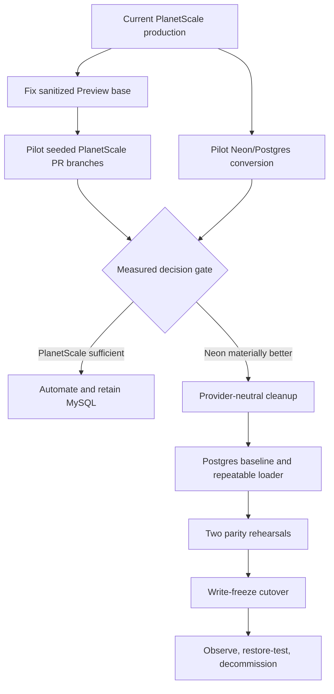

# PlanetScale MySQL to Neon Postgres Migration Plan

## Type

Feature

## Status

Proposed

## Created Date

2026-08-04

## Last Updated

2026-09-03

Owner: Platform / Data Migration
Scope: Move the GND system of record from PlanetScale/Vitess MySQL to Neon Postgres while preserving application behavior and retaining Prisma as the phase-1 data-access contract.

## Goal Or Problem

Move all production database schema, data, runtime consumers, migration tooling,
and operational workflows from PlanetScale MySQL to Neon Postgres through a
repeatable, validated, and reversible cutover. Do not bundle auth, file storage,
or unrelated product rewrites into the database-provider migration.

## Current Context

The 2026-09-03 decision review found that GND should not migrate only to solve
Preview. The existing sanitized PlanetScale `preview` development branch is
about 25 MiB and can be used as the seed source for short-lived data-bearing PR
branches. Production is 292 tables and about 677 MiB including indexes; the
current Preview branch has 290 tables and is missing `SalesCompletionRecord`
and `SalesTaxLedgerEntry`, so schema-parity automation is required even if GND
stays on PlanetScale.

The same review confirmed that Neon remains the stronger strategic target when
copy-on-write per-PR databases, Postgres capabilities, future RLS, and provider
portability are requirements. Neon's Free tier is appropriate for the pilot and
small sanitized Preview data, not the current full production allocation, which
is above its published 0.5 GB/project allowance.

See
`.brain/reports/2026-09-03-planetscale-vs-neon-postgres-migration-review.md`
for the full comparison, live metadata, code inventory, and decision gates.

## Proposed Approach

Run a two-track decision pilot before approving production migration:

1. Prove PlanetScale Preview v2 using sanitized development-branch Data
   Branching, schema parity, Vercel credential injection, and automatic cleanup.
2. Prove a disposable Neon/Postgres conversion with the same sanitized data,
   then compare branch lifecycle, compatibility, performance, and real cost.
3. If Neon wins the evidence-based gate, execute the phased provider-neutral
   cleanup, Postgres baseline, data loader, two rehearsals, write-freeze cutover,
   and 2–4 week observation period below.

## Visual Plan

## Assumptions and Decisions to Confirm

- "PlanetBase" means the current PlanetScale/Vitess MySQL database.
- Prisma remains the canonical ORM for phase 1.
- A controlled write-freeze window is acceptable. If near-zero downtime is a
  hard requirement, add a separate CDC/delta-replication workstream after the
  source primary-key and update/delete capture feasibility audit.
- Preserve `relationMode = "prisma"` during the initial engine cutover. Restore
  physical Postgres foreign keys incrementally after orphan audits and
  stabilization rather than changing referential behavior during the move.
- Use separate Neon projects for production and non-production isolation;
  branches inside the non-production project support rehearsal and preview
  workflows.
- Runtime traffic uses a pooled Neon connection. Migration, import/export,
  diagnostics, and administrative work use a direct connection.
- Production is currently about 677 MiB across 292 tables; the largest allocated
  tables are recorded in the linked review. Write rate, acceptable downtime,
  and deployment owners still need to be measured/assigned before setting the
  final cutover window.

## Repository Findings That Shape the Plan

- Prisma currently targets `mysql` and uses `relationMode = "prisma"`.
- The split Prisma schema contains 292 models and 90 enums.
- Native MySQL annotations include 623 `@db.Timestamp`, 450 `@db.VarChar`,
  157 `@db.Json`, 91 `@db.Text`, 54 `@db.Decimal`, 39 `@db.DateTime`,
  15 `@db.LongText`, one `@db.UnsignedBigInt`, and one `@db.Char` occurrence.
- 133 models do not declare a Prisma `@id`/`@@id`; many rely on `@unique` IDs.
  Do not silently promote all of these to primary keys during the engine move.
- There are 285 SQL migration files split between
  `packages/db/src/migrations` (131) and
  `packages/db/src/schema/migrations` (154), both locked to MySQL. Historical
  replay is already broken by ordering and drift issues.
- `apps/dashboard/db.load` proves an earlier pgloader experiment exists, but it
  drops/creates target objects and applies broad timestamp casts. It must not be
  used unchanged for production.
- MySQL-specific runtime code includes payment canonical-mirror upserts and
  `information_schema` checks, supplier JSON updates using `JSON_SET` /
  `JSON_EXTRACT`, and the MySQL-only local sync engine.
- Better Auth adapters in web and dealership declare `provider: "mysql"`.
- The generated Trigger/jobs Prisma schema also targets MySQL, and Trigger's
  Prisma extension currently uses `DATABASE_URL` as its direct URL.
- Local development, Docker, environment profiles, tests, seed scripts, and
  `db:sync` contain MySQL/PlanetScale assumptions.
- Raw Prisma SQL appears in 22 non-test source files, and 274 string-filter
  occurrences across 57 files require deliberate case/collation parity testing.
- The shared sibling `local-infra-kit` already contains a Postgres sync engine
  used by other profiles; GND can adopt it rather than rebuilding sync from zero.

## Implementation Steps

### Phase 0 — Charter, Owners, and Change Control

1. Approve the exact boundary: PlanetScale MySQL to Neon Postgres only.
2. Name an incident commander, database migration owner, application owner,
   domain validation owners, deployment owner, and rollback decision owner.
3. Record required RPO, RTO, maximum write-freeze duration, maintenance-window
   constraints, and rollback thresholds.
4. Freeze unrelated schema work for the rehearsal/cutover period or require
   every new schema change to be implemented in both the MySQL and converted
   Postgres migration branches.
5. Create an ADR covering target topology, Prisma ownership, connection roles,
   migration-history reset/baseline, initial `relationMode`, and rollback.

Exit gate: the charter and ADR are approved; owners and the schema-freeze rule
are explicit.

### Phase 1 — Source Inventory and Data-Risk Audit

1. Capture a credential-free PlanetScale inventory:
   - MySQL/Vitess version, region, charset, and collations;
   - all tables, columns, indexes, unique keys, effective primary keys, and
     auto-increment values;
   - row counts, estimated sizes, largest tables, and normal/peak write rates;
   - scheduled jobs, background writers, webhooks, payment callbacks, and
     operational scripts that can write during cutover.
2. Build a 292-table manifest containing migration order, key columns, row
   count, byte estimate, timestamp policy, JSON policy, and parity checks.
3. Audit source values that Postgres may reject or interpret differently:
   - zero/invalid dates and out-of-range timestamps;
   - invalid JSON, SQL `NULL` versus JSON `null`, and stringified JSON;
   - booleans outside `0/1`;
   - unsigned bigint values above signed Postgres range;
   - decimals outside target precision/scale;
   - duplicate values under the intended case/collation policy;
   - orphan relations, dangling polymorphic references, and nullable/default
     inconsistencies;
   - identifiers or text with invalid encoding.
4. Inventory every Prisma client, raw SQL statement, generated schema, CLI,
   test fixture, seed, report, and environment consumer.
5. Measure a representative PlanetScale dump and restore to estimate final
   freeze duration. Do not set the maintenance window from table size guesses.

Exit gate: the manifest covers every table and writer; blocking bad-data cases
have an owner and remediation rule; final-load time has a measured estimate.

### Phase 2 — Neon Target Architecture

1. Select a Neon region colocated with the latency-critical production runtime
   after measuring where dashboard/API/storefront/jobs execute.
2. Provision separate production and non-production Neon projects. Create
   disposable non-production branches for migration rehearsals.
3. Define roles and secrets:
   - least-privilege pooled runtime role;
   - direct migration/import role;
   - read-only validation/observability role;
   - break-glass admin role with audited access.
4. Standardize the environment contract:
   - `DATABASE_URL`: pooled runtime connection;
   - `DIRECT_URL`: non-pooled Prisma migrations and admin/data tools;
   - optional explicit shadow connection only if the approved Prisma workflow
     requires one.
5. Size initial compute for the bulk load and cutover rather than normal idle
   traffic. Define autoscaling, scale-to-zero, statement timeout, connection
   timeout, and pool limits separately for production and preview.
6. Configure the restore/history window and require a tested restore drill
   before production cutover.

Exit gate: applications can connect with the runtime role, Prisma migration
commands can connect with the direct role, and restore has been rehearsed.

### Phase 3 — Prisma Schema and Migration-History Conversion

1. Work on a dedicated migration branch while production remains on MySQL.
2. Change the datasource provider to `postgresql`, keeping Prisma as the public
   application contract.
3. Translate native types deliberately:
   - map MySQL `Json` to Postgres `jsonb` unless a documented reason requires
     plain `json`;
   - map `LongText` to `Text`;
   - preserve `VarChar`, `Char`, and `Decimal` sizes where they express real
     constraints;
   - replace unsigned bigint semantics with a signed-safe type plus validation
     after confirming live maxima;
   - classify each date/time field as an instant (`timestamptz`) or local
     business time (`timestamp`) rather than mass-converting all 662 annotated
     date/time fields;
   - preserve zero fractional precision where external comparisons depend on
     it.
4. Preserve exact quoted table and column names for phase 1 so existing Prisma
   model mappings and imported data remain aligned.
5. Review enums, defaults, `now()`, `@updatedAt`, autoincrement sequences,
   index lengths, unique behavior, and nullable columns against Postgres.
6. Keep `relationMode = "prisma"` initially. Produce an orphan report for every
   modeled relation and a later physical-foreign-key candidate list.
7. Review the 133 no-primary-key models. Preserve current behavior for cutover,
   but identify tables that require a real primary key for reliable operations,
   CDC, or future foreign keys.
8. Archive the two MySQL migration histories as historical artifacts and
   establish one active Postgres migration directory. Generate a reviewed
   `0_init`/baseline migration from the converted schema; do not replay the 285
   MySQL migrations against Neon.
9. Apply the baseline to an empty disposable Neon branch, run Prisma validate
   and generate, introspect/diff it back, and prove the diff is empty.
10. Regenerate `packages/jobs/src/schema.prisma` from the converted source and
    update Prisma/Trigger configuration to use the direct migration URL where
    appropriate.

Exit gate: a fresh Neon branch can be built from the Postgres baseline with an
empty schema diff and generated clients for all consumers.

### Phase 4 — Application and Tooling Compatibility

1. Replace MySQL SQL with Postgres-safe SQL or Prisma operations:
   - `ON DUPLICATE KEY UPDATE` / `VALUES(col)` becomes `ON CONFLICT ... DO
     UPDATE` or a Prisma upsert;
   - `DATABASE()` and MySQL `information_schema` casing becomes a Postgres
     catalog/`to_regclass` check;
   - `JSON_SET` / `JSON_EXTRACT` becomes a safe `jsonb` update/filter or an
     application-level Prisma update;
   - audit timestamp functions and identifier quoting.
2. Update both Better Auth Prisma adapters from MySQL to PostgreSQL and run
   login, session refresh, magic-link/OAuth, logout, and dealership auth tests.
3. Replace PlanetScale host-name detection in the dashboard with an explicit,
   non-secret environment label.
4. Rebuild `packages/db/src/local-sync.ts` around Postgres metadata, quoting,
   conflict handling, sequence reset, and safety checks, or retire it in favor
   of an approved Postgres copy workflow. Do not leave MySQL reset/delete SQL
   reachable against Neon.
5. Update shared `local-infra-kit` profiles, root DB commands, Docker/local DB
   setup, Adminer replacement if needed, app READMEs, fixture defaults, tests,
   and environment examples.
6. Update app and job connection management for Neon pooling. Audit long-lived
   workers and background tasks for connection leaks and reconnect behavior.
7. Run targeted tests for all changed raw SQL and database utilities, followed
   by repository typecheck and the narrowest relevant builds.

Exit gate: dashboard, API, dealership, storefront, jobs, and required mobile
backend flows boot and perform reads/writes on a Neon rehearsal branch with no
known MySQL-only path remaining.

### Phase 5 — Repeatable Data Loader

1. Use a PlanetScale manual backup and `pscale database dump` as the immutable
   source artifact for rehearsals and the final freeze export.
2. Restore the dump into a disposable intermediate MySQL instance when needed
   for stable pgloader input, or use a read-only secure source proxy after
   proving it is reliable. Never point transformation experiments at the live
   writer credentials.
3. Apply the reviewed Prisma Postgres baseline to an empty Neon branch first.
4. Use a version-controlled, secret-free pgloader/data-import configuration in
   **data-only** mode. Do not reuse `apps/dashboard/db.load` unchanged and do
   not let pgloader invent the canonical schema.
5. Encode explicit casts and cleanup rules for timestamps, booleans, JSON,
   enums, unsigned values, binary data, and invalid source values.
6. Load in dependency-safe batches, record per-table duration/count/errors,
   and make retry behavior deterministic.
7. Reset every Postgres sequence to at least `MAX(id) + 1` and smoke-create then
   roll back a row for each sequence-backed table.
8. Run `ANALYZE` after each full load; defer optional secondary indexes only if
   measured load time requires it and the post-load index run is scripted.

Exit gate: the same loader can rebuild a fresh Neon branch twice with identical
manifests and no manual SQL edits.

### Phase 6 — Data and Business-Parity Validation

1. Compare every table using exact counts plus stronger checksums/aggregates
   for critical columns; counts alone are insufficient.
2. Validate keys, sequences, unique constraints, null counts, min/max values,
   timestamp ranges, enum distributions, and JSON parseability.
3. Run domain invariants with named owners:
   - Sales: order/quote counts, status distributions, totals, amount due,
     customer links, production and dispatch quantities.
   - Payments/finance: successful/refunded totals, wallet balances,
     allocations, projections, review queues, and reconciliation reports.
   - Inventory: stock totals, movements, allocations, inbound demand,
     receiving, and sales-line projections.
   - Contractor/payroll: immutable-ledger row count and legacy-versus-ledger
     equality, payment and payout totals.
   - Auth: users, accounts, sessions, verification tokens, and successful
     session lifecycle tests.
   - Documents/notifications/jobs: metadata ownership, active references,
     scheduled jobs, diagnostics, and pending work.
4. Run full staging smoke workflows and representative mutation tests, not
   read-only page loads.
5. Compare query latency and plans for the most important routes. Add indexes
   only from measured Postgres plans.
6. Require two consecutive successful rehearsals; the final rehearsal uses the
   exact production command versions and runbook.

Exit gate: zero unexplained critical mismatches, all P0/P1 workflows pass, and
the measured cutover fits the approved window.

### Phase 7 — Production Cutover Preparation

1. Freeze schema changes and merge the migration branch only after the final
   rehearsal is signed off.
2. Prepare production secrets without switching traffic; verify every app,
   job, and administrative environment is represented.
3. Create a fresh PlanetScale manual backup and verify it can restore to a new
   PlanetScale branch. Create a Neon pre-cutover restore point/branch.
4. Pause or queue all writers during maintenance: web/API mutations,
   background jobs, imports, syncs, cron, payment/webhook consumers, and manual
   admin scripts.
5. Publish exact go/no-go thresholds, including import errors, parity mismatch,
   auth failure, payment mismatch, inventory mismatch, elevated application
   errors, and latency/connection saturation.
6. Rehearse secret rollback and application redeployment without touching
   production data.

Exit gate: runbook, communications, backups, secrets, owners, thresholds, and
rollback commands are approved and timed.

### Phase 8 — Production Cutover Runbook

1. Enter maintenance/read-only mode and stop all background writers.
2. Drain in-flight requests and record the source consistency checkpoint.
3. Create the final PlanetScale backup/dump after writes are stopped.
4. Apply the canonical baseline to a fresh Neon production branch and run the
   final data-only load.
5. Reset sequences, run `ANALYZE`, execute the full automated parity manifest,
   and have domain owners approve critical financial/inventory checks.
6. Switch every runtime to the pooled Neon URL and every migration/admin path
   to the direct URL; deploy all apps/jobs as one coordinated release.
7. Run production smoke tests while writes remain closed: auth/session, sales
   read, payment/finance read, inventory read, documents, notifications, and
   job connectivity.
8. Open a small set of controlled writes, validate their database effects, then
   reopen normal traffic and jobs.
9. Mark PlanetScale read-only and keep it intact through the observation
   window.

Rollback rule:

- Before Neon writes are opened, rollback is a credential/deployment switch
  back to the frozen PlanetScale source.
- After Neon accepts writes, a simple connection-string rollback would lose or
  fork data. At that point either roll forward on Neon or execute a separately
  rehearsed reverse-delta procedure before returning to PlanetScale.

### Phase 9 — Stabilization and Decommissioning

1. For the first hour, monitor continuously: error rate, auth failures,
   connection wait/exhaustion, transaction failures, slow queries, CPU/memory,
   and key business mutations.
2. Repeat financial, sales, inventory, and contractor parity checks at 1 hour,
   24 hours, 72 hours, and the end of the observation window.
3. Tune Postgres indexes/query shapes, pooling, autoscaling, timeouts, and
   worker concurrency from observed evidence.
4. Test Neon point-in-time restore and document actual RPO/RTO.
5. Remove PlanetScale credentials and MySQL-only dependencies only after a
   2–4 week clean observation window and an approved archival export.
6. After stabilization, separately plan:
   - physical foreign keys using orphan cleanup and staged validation;
   - real primary keys for safe no-PK tables;
   - Postgres-native search/indexing, JSONB indexes, and reporting;
   - preview database branches and CI migration checks.

Exit gate: the observation window is clean, restore is proven, archived source
artifacts are retained per policy, and PlanetScale decommission is approved.

## Indicative Timeline

- Week 1: charter, source inventory, size/write-rate measurements, ADR.
- Weeks 2–3: Prisma schema conversion, Postgres baseline, application/raw-SQL
  compatibility.
- Week 4: repeatable loader and first complete Neon rehearsal.
- Weeks 5–6: parity automation, domain QA, performance fixes, second rehearsal.
- Week 7: final rehearsal, runbook approval, and production cutover.
- Weeks 8–10: observation, tuning, restore drill, and decommission decision.

This is a planning range, not a commitment. Add 2–4+ weeks if the database is
large enough that the measured full load misses the maintenance window, or if
near-zero downtime/CDC is required.

## Affected Files Or Areas

- `packages/db/src/schema/*.prisma`, Prisma configuration, generated clients,
  and the active/archive migration directories.
- `packages/db/src/local-sync.ts`, Preview seed tooling, root DB commands, and
  the sibling `local-infra-kit` GND profile.
- Raw SQL across API, Sales, Inventory, DB, and operational scripts.
- Better Auth adapters and Trigger.dev Prisma build/runtime configuration.
- Local Docker database services plus Vercel, Trigger.dev, API, dashboard,
  dealership, storefront, and mobile-backend environment contracts.
- Sales, payment, inventory, production, dispatch, contractor/accounting,
  auth, documents, notifications, and job parity validation.

## Acceptance Criteria

Go only when all are true:

- Fresh Neon schema diff is empty against the converted Prisma datamodel.
- Two full loads complete repeatably inside the approved window.
- All 292 table manifest rows reconcile with no unexplained critical mismatch.
- Sales/payment/inventory/contractor invariants are signed off.
- Auth and background jobs pass full lifecycle tests.
- Runtime and direct connection roles are proven and least-privileged.
- Backup restore and pre-write rollback are rehearsed.
- No unowned writer can bypass maintenance mode.

No-go if any financial mismatch, inventory quantity mismatch, auth/session
failure, missing writer, sequence collision, loader nondeterminism, or
unrehearsed rollback remains.

## Test Plan

- Validate/generate the converted Prisma schema and require an empty schema
  diff on a fresh Neon branch.
- Run focused unit/integration coverage for every converted raw-SQL and search
  path, then the broad repository typecheck and relevant application builds.
- Run the 292-table structural/data manifest plus financial, inventory, sales,
  contractor, auth, document, notification, and job invariants.
- Smoke every P0/P1 read and mutation workflow against each rehearsal branch.
- Load-test pooled runtime connections, long-lived workers, scale-to-zero wake,
  and the highest-value query plans.
- Complete two full end-to-end rehearsals and a restore/rollback drill using
  the final commands and owners.

## Risks / Edge Cases

- **Engine semantics change:** classify types/defaults/collation/time zones
  explicitly and validate live values before conversion.
- **Broken legacy migration history:** create one reviewed Postgres baseline;
  retain but do not replay MySQL history.
- **Missing physical keys/constraints:** preserve behavior for cutover, audit
  orphans, and harden incrementally after stabilization.
- **MySQL-only raw SQL:** maintain a tracked inventory with focused tests and a
  zero-occurrence compatibility scan before cutover.
- **Financial or inventory corruption:** use domain-specific invariants and
  named signoff, not row counts alone.
- **Long downtime:** measure full dump/load early; tune batching/index timing;
  escalate to a separate CDC/delta design only if the measured window fails.
- **Connection exhaustion/cold starts:** pooled runtime connections, direct
  administrative connections, bounded worker concurrency, and load tests.
- **Split-brain rollback:** keep writes closed until validation completes and
  distinguish pre-write rollback from post-write recovery explicitly.
- **Concurrent product work:** schema freeze or mandatory dual-engine patches
  during the migration branch lifetime.

## Look-Ahead Opportunities (Not Part of Initial Cutover)

- Restore database-enforced foreign keys where the data is clean.
- Add primary keys to operational tables that currently rely only on unique
  identifiers.
- Replace MySQL-era sync/dump utilities with Postgres-native copy and branch
  workflows.
- Add JSONB GIN/expression indexes only for measured query patterns.
- Use Neon branches for preview/test databases with expiry and sanitized data.
- Add CI checks that rebuild the database from the baseline and run migration
  drift/unsafe-lock analysis before deployment.
- Establish periodic restore drills and documented RPO/RTO ownership.

## Open Questions

- TODO: Export the current PlanetScale cluster size, monthly cost, branch list,
  and development-branch-hour consumption from the authenticated console.
- TODO: Define the maximum acceptable production write-freeze and required
  RPO/RTO; these decide snapshot migration versus a separate CDC workstream.
- TODO: Choose Neon Launch versus Scale from measured compute, storage, egress,
  restore, SLA, and network-security requirements.
- TODO: Assign migration, domain-signoff, deployment, incident-command, and
  rollback owners.
- TODO: Approve whether Preview uses only the sanitized non-production project
  or permits exceptional tightly controlled production children.

## References

- `.brain/reports/2026-09-03-planetscale-vs-neon-postgres-migration-review.md`
- `.brain/research/2026-09-03-planetscale-vitess-vs-neon-postgres-vendor-research.md`
- `packages/db/src/schema/schema.prisma`
- `packages/db/prisma.config.ts`
- `packages/db/src/migrations`
- `packages/db/src/schema/migrations`
- `packages/db/src/local-sync.ts`
- `packages/sales/src/payment-system/infrastructure/canonical-mirror.ts`
- `apps/api/src/db/queries/sales-form.ts`
- `apps/dashboard/db.load`
- `packages/jobs/src/schema.prisma`
- `.brain/planetscale-to-supabase-migration-checklist.md`
- `.brain/database/schema.md`
- `.brain/database/relationships.md`
- `.brain/database/migrations.md`

## Linked Task

- Task Title: PlanetScale to Neon Postgres Migration
- Task File: `.brain/tasks/2026-09-03-planetscale-to-neon-postgres-migration.md`
