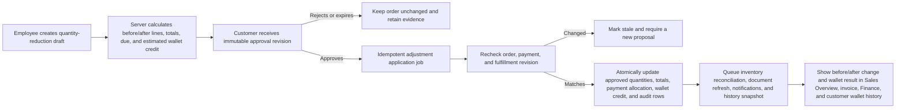

# Plan: Customer-Approved Sales Quantity Reduction And Wallet Credit

## Type

Feature

## Status

Proposed - Implementation Not Started

## Created Date

2026-08-04

## Last Updated

2026-08-04

## Objective

Add a governed post-sale adjustment workflow that lets an authorized employee
propose lower quantities for selected items on an existing order, obtain and
retain customer approval, apply the exact approved revision, show that an item
changed from its original quantity to its approved quantity in Sales Overview,
sales history, and the current invoice, and credit only the resulting customer
overpayment to the customer's wallet. The workflow must preserve payment,
inventory, production, dispatch, document, and audit correctness under retries
and concurrent edits.

## Assumptions

- "A customer paid for a sale" means an existing Sales Order may be unpaid,
  partially paid, or fully paid when the customer asks to reduce quantities.
- "Note at the insight" means the change must be visible in the Sales Overview
  activity/insight experience and on the revised invoice. If a different
  reporting surface was intended, the same adjustment read model can feed it.
- This is a post-sale commercial adjustment, not a product-return/RMA flow.
  Quantity already shipped or fulfilled is out of scope and must use a future
  return workflow.
- The first release supports quantity decreases only. It does not increase a
  quantity, swap products, reprice unrelated lines, issue cash/card refunds, or
  change the customer.
- The revised order total is calculated by the canonical sales-form costing
  engine. The implementation must not estimate the credit as only
  `quantity reduced * displayed unit price`, because discounts, tax, delivery,
  grouped-line rounding, and other costs can change the actual order delta.
- The order principal remains C.C.C-exclusive under ADR-016. A historical card
  convenience charge is not automatically converted into wallet credit unless
  a separately approved fee-refund policy is added.
- Wallet credit is the revised order's new overpayment, not automatically the
  full order-value reduction. Unpaid value first reduces `amountDue`; only value
  already applied above the revised principal is moved to the wallet.
- The existing legacy sales-payment and customer-wallet records remain the
  operational compatibility source while the canonical payment-system mirror
  is still being adopted. The new application service must keep both views
  reconciled rather than creating a third money path.
- A customer approval may be captured through a secure, expiring approval link
  or recorded by an employee with the approver's name, channel, timestamp, and
  evidence note. The approval source must always be explicit.
- The exact supported item families must be confirmed in Phase M0. Any grouped
  door, HPT, moulding, shelf, or service line whose quantity cannot be changed
  through the canonical sales aggregate is blocked rather than partially
  updated through raw Prisma writes.

## Detailed Execution Plan

### Recommended Domain Flow

### Financial Settlement Policy

Use the payment-system projection and decimal-safe helpers for all money. Let:

- `beforeTotal` = current C.C.C-exclusive order principal;
- `afterTotal` = canonical recalculated principal after approved quantities;
- `netAppliedBefore` = successful order payment applications less prior
  refunds/voids/deallocations;
- `orderValueReduction = beforeTotal - afterTotal`;
- `afterDueBeforeCredit = max(afterTotal - netAppliedBefore, 0)`;
- `walletCredit = max(netAppliedBefore - afterTotal, 0)`;
- `netAppliedAfter = netAppliedBefore - walletCredit`;
- `afterDue = max(afterTotal - netAppliedAfter, 0)`.

The customer must see both `orderValueReduction` and `walletCredit`, because
they are not always the same.

| Before state | Example | Result |
| --- | --- | --- |
| Unpaid | Total falls from $1,000 to $800; paid $0 | Due falls to $800; wallet credit $0 |
| Partially paid below revised total | Total falls to $800; paid $600 | Due falls to $200; wallet credit $0 |
| Partially paid above revised total | Total falls to $800; paid $900 | Due becomes $0; wallet credit $100 |
| Fully paid | Total falls from $1,000 to $800; paid $1,000 | Due remains $0; wallet credit $200 |

### Phase M0 - Product Rules, Baseline, And Acceptance Matrix

1. Confirm the product boundary with Sales, Finance, Inventory, Production, and
   Dispatch owners before schema work:
   - eligible order types and lifecycle statuses;
   - whether a quote can use the workflow or only an order;
   - which top-level and grouped item families can be reduced safely;
   - whether a line may be reduced to zero or must be removed explicitly;
   - whether produced-but-unshipped goods are blocked or sent to an internal
     disposition review;
   - whether customer approval is link-only, employee-recorded, or both;
   - whether an approval should auto-apply or wait for a final employee action.
2. Recommend the following first-release rules:
   - orders only;
   - active, non-cancelled, non-fulfilled orders;
   - no new quantity below delivered, packed, consumed, completed-production,
     or otherwise irreversible operational quantity;
   - automatically handle only mutable inventory demand/allocation residue;
   - block unsupported grouped line families with an exact explanation;
   - auto-apply after customer approval only when the original employee still
     has both order-edit and payment-edit authority;
   - wallet credit only; external-provider refunds remain a separate action.
3. Build a line-family matrix from live application shapes:
   - ordinary `SalesOrderItems.qty`;
   - inventory-backed `LineItem.qty` and component multiplication;
   - door left/right/total quantities;
   - HPT total-door quantities;
   - moulding, shelf, service, delivery, labor, and custom lines;
   - lines with discounts, percentage discounts, tax, and customer-profile
     pricing.
4. For each family, document:
   - the authoritative quantity field;
   - dependent rows that must change;
   - the canonical costing adapter to call;
   - production/dispatch/inventory floors;
   - print label and approval-page presentation;
   - whether it is enabled in release one.
5. Create non-production acceptance fixtures covering unpaid, partially paid,
   fully paid, wallet-paid, mixed-payment, taxed, discounted, inventory-backed,
   production-started, partially dispatched, and unsupported grouped orders.
6. Decision gate: do not start schema work until the supported line-family
   matrix and irreversible-quantity policy are approved. This prevents a safe
   ordinary-line implementation from silently corrupting complex sales rows.

### Phase M1 - Durable Adjustment And Approval Schema

1. Add a focused Prisma schema file, for example
   `packages/db/src/schema/sales.adjustment.prisma`, with explicit enums and
   models rather than storing the entire workflow only inside `SalesOrders.meta`.
2. Add `SalesOrderAdjustment` as the workflow aggregate. Recommended fields:
   - stable id and human-facing adjustment number;
   - `salesOrderId`, customer/wallet snapshot identifiers, currency;
   - type `QUANTITY_REDUCTION`;
   - status: `DRAFT`, `PENDING_CUSTOMER`, `APPROVED`, `APPLYING`, `APPLIED`,
     `APPLIED_WITH_REVIEW`, `REJECTED`, `EXPIRED`, `CANCELLED`, `STALE`, or
     `FAILED`;
   - source order version and a deterministic source revision hash covering
     quantities, pricing inputs, payment projection, and irreversible
     operational quantities;
   - before/after canonical sales snapshots and before/after money projections;
   - order-value reduction, projected wallet credit, final wallet credit,
     reason, internal note, customer-facing note;
   - requested/submitted/applied actor ids and timestamps;
   - idempotency key, failure summary, inventory/document follow-up state;
   - optional resulting wallet transaction id and history-snapshot reference.
3. Add `SalesOrderAdjustmentLine` as immutable line-level evidence after submit:
   - adjustment id;
   - stable sales item id plus canonical line-family/target identity;
   - description/SKU/configuration snapshot;
   - original quantity, approved quantity, and reduction quantity using a
     quantity-safe decimal scale;
   - original/new unit display values, authoritative line totals, tax, and
     total delta using money-safe decimals;
   - reversible operational quantity snapshot and validation result.
4. Add append-only `SalesOrderAdjustmentApproval` attempts:
   - approval revision and status;
   - approval mode (`CUSTOMER_LINK` or `EMPLOYEE_RECORDED`);
   - token hash only, expiry, consumed/revoked/superseded timestamps;
   - customer approver name/email snapshot, decision timestamp, optional
     rejection reason;
   - employee recorder id and required evidence note for recorded approvals;
   - privacy-bounded request evidence such as masked IP/user-agent metadata only
     if approved by the existing privacy policy.
5. Make submitted revisions immutable. Editing a rejected, expired, or stale
   proposal creates a new revision or adjustment and supersedes the old
   approval token; it never rewrites historical evidence.
6. Add indexes for order/status, customer/status, approval token hash,
   expiration, idempotency, and created date. Document logical relationships
   explicitly because this project uses Prisma relation mode.
7. Use `Decimal(12,2)` for persisted money snapshots and a suitable decimal
   quantity scale; convert to numeric API values at the boundary. Continue to
   use the shared `decimal.js-light` `ROUND_HALF_UP` domain helpers.
8. Generate and apply the Prisma migration through the repository commands,
   not a hand-authored migration. Update database Brain docs in the same slice.

### Phase M2 - Sales Adjustment Domain Package

1. Create a focused boundary under
   `packages/sales/src/adjustment-system/` with contracts, domain policy,
   application services, repository/query adapters, and focused tests.
2. Keep app entrypoints thin. The package owns:
   - eligibility and lifecycle guards;
   - quantity target adapters;
   - before/after revision construction;
   - canonical repricing;
   - irreversible-quantity floors;
   - stale-revision hashing;
   - due/wallet-credit calculation;
   - idempotent application orchestration.
3. Extract or reuse the new-sales-form persistence/costing functions needed to
   produce and apply a server-owned next aggregate. Do not call a tRPC route
   from another route and do not duplicate the costing engine inside the
   adjustment package.
4. Implement `previewQuantityReduction(...)`:
   - load the complete current order aggregate server-side;
   - accept only sales item identities and requested lower quantities;
   - reject negative, equal, increased, unknown, deleted, or unsupported lines;
   - calculate operational minimums from production, packing, dispatch,
     allocation, inbound, receipt, and consumption evidence;
   - apply supported quantity adapters to an in-memory aggregate;
   - recalculate the complete order using canonical sales costing;
   - calculate due and wallet outcomes from the canonical payment projection;
   - return item-by-item before/after values, order totals, due, wallet credit,
     warnings, and blockers.
5. Implement a deterministic `sourceRevisionHash` over only material source
   evidence. Include the new-sales-form version, quantity/configuration/pricing
   inputs, net payment application, and irreversible operational floors. A
   payment, order, or fulfillment change after submission must make the
   approval stale.
6. Implement `submitQuantityReduction(...)` to persist the exact preview and
   lines transactionally, issue one approval revision, and prevent multiple
   active proposals for the same order unless product owners explicitly allow
   parallel non-overlapping adjustments.
7. Implement `recordAdjustmentDecision(...)` as an append-only, idempotent
   decision. Duplicate link clicks return the existing decision; a second,
   conflicting decision is rejected.
8. Implement `applyApprovedQuantityReduction(...)` as the only write path for
   the feature. It must use a guarded transaction and never trust totals,
   customer ids, wallet ids, or line descriptions from the browser.

### Phase M3 - Payment And Wallet Application Service

1. Extend `packages/sales/src/payment-system/application/` with one explicit
   operation, such as `applySalesAdjustmentWalletCredit`, called by the
   adjustment service inside the same database transaction.
2. Recompute the current canonical order payment projection at apply time.
   Compare it with the approved payment revision. If it differs, mark the
   adjustment `STALE`; do not silently apply a different wallet outcome than
   the customer approved.
3. When `netAppliedBefore <= afterTotal`:
   - create no wallet credit transaction;
   - leave payment applications unchanged;
   - recompute `SalesOrders.amountDue` to the reduced balance.
4. When `netAppliedBefore > afterTotal`:
   - calculate the exact excess as `walletCredit`;
   - deallocate that excess from the order through canonical negative
     adjustment/refund allocations;
   - preserve source-payment history by splitting the deallocation across
     eligible successful payment applications in a documented deterministic
     order;
   - write compatibility negative `SalesPayments` rows so legacy due and
     Finance projections agree;
   - create exactly one positive `CustomerTransaction` wallet credit through
     `createLegacyWalletCreditTransaction`, with source
     `sales-quantity-adjustment`, adjustment id, order id/number, before/after
     totals, and actor evidence;
   - mirror the change to `PaymentLedgerEntry` and `PaymentAllocation` with the
     adjustment id as the idempotency key/source reference;
   - store the wallet transaction id and final credit amount on the adjustment.
5. Resolve customer and wallet ownership from the order in the transaction.
   Never accept a client-selected wallet. If the order has no valid canonical
   customer/wallet relationship, block submission or move the adjustment to an
   explicit Finance review state before customer approval.
6. Treat wallet credit as an internal liability transfer, not as a Square/card
   refund. If the business later wants money returned to the original tender,
   add a separate disbursement choice with provider confirmation and its own
   failure/retry state.
7. Make all financial writes idempotent by adjustment id. A retried job must
   observe the applied status/wallet transaction and return the prior result
   without adding a second negative payment or wallet credit.
8. After the transaction, run the payment reconciliation projection and expose
   any mismatch as a Resolution Center case rather than hiding it.

### Phase M4 - Atomic Apply Transaction And Operational Guards

1. In one database transaction:
   - atomically claim an `APPROVED` adjustment as `APPLYING`;
   - re-read the order, current form version, customer/wallet, payment
     projection, production, packing, dispatch, and inventory evidence;
   - recompute and compare the source revision hash;
   - mark `STALE` and exit without order/money writes if evidence changed;
   - enforce that every new quantity is at or above the current irreversible
     operational floor;
   - apply only the stored approved after-snapshot through the shared sales
     persistence boundary;
   - recompute and persist subtotal, tax, grand total, amount due, and related
     pricing rows;
   - execute the payment/wallet service from Phase M3;
   - write a structured `SalesHistory` entry containing adjustment id,
     customer-approval mode, actor, per-line old/new quantities, totals, due,
     and wallet credit;
   - mark the adjustment `APPLIED` with final before/after projections.
2. Do not include slow provider calls, email, PDF generation, or broad inventory
   reconciliation inside the transaction.
3. If mutable inventory allocation/demand rows can be safely reduced as part of
   the same domain write without increasing lock scope materially, do so through
   existing package policy. Otherwise make the order/money transaction the
   authority and run the existing inventory reconciliation job immediately
   after commit.
4. Protected inventory residue, received inbound, picked/consumed stock,
   submitted production, packed quantities, or dispatch evidence must never be
   deleted by a generic save. Block before approval where possible; if a race
   appears after approval, mark the adjustment stale or applied-with-review and
   create an explicit operational resolution case according to the approved M0
   policy.
5. Add a bounded retry for transactional write conflicts. Business conflicts
   such as stale revision or irreversible quantity are not transient retries.

### Phase M5 - API Contracts And Authorization

1. Add Zod schemas under `apps/api/src/schemas/sales-adjustments.ts` for:
   - eligibility/preview;
   - draft creation/update;
   - submit for customer approval;
   - staff-recorded approve/reject;
   - list/detail/status;
   - retry apply and cancel/supersede.
2. Add a thin protected tRPC router under
   `apps/api/src/trpc/routers/sales-adjustments.route.ts` and register it in
   `_app.ts`. Routers validate, authorize, and call package services; they do
   not implement pricing or wallet rules.
3. Permission contract:
   - read requires the existing Sales Overview/order read boundary;
   - draft/submit/cancel requires `editOrders`;
   - any proposal that can create wallet credit also requires
     `editOrderPayment` before it is sent to the customer;
   - employee-recorded customer approval requires both capabilities and a
     required evidence note;
   - retrying an approved financial apply requires both capabilities;
   - the server revalidates the stored authorizing employee at apply time. If
     access was revoked, move to internal review instead of letting a public
     approval bypass current employee authorization.
4. Add narrowly scoped public approval endpoints using an opaque token. Store
   only a token hash, enforce expiry/revocation/revision/customer scope, use
   constant-time verification, and return only the exact customer-facing
   adjustment snapshot.
5. The public decision endpoint may record customer approval, but it does not
   directly grant `editOrders` or `editOrderPayment`. It triggers the protected
   internal application workflow associated with the already-authorized
   proposal.
6. Return typed conflict reasons such as `ORDER_CHANGED`, `PAYMENT_CHANGED`,
   `FULFILLMENT_CHANGED`, `UNSUPPORTED_LINE`, `BELOW_OPERATIONAL_FLOOR`,
   `WALLET_UNAVAILABLE`, and `APPROVAL_EXPIRED` so the UI can explain the next
   action without parsing error strings.

### Phase M6 - Background Jobs And Post-Commit Side Effects

1. Add an idempotent Trigger task under
   `packages/jobs/src/tasks/sales/apply-sales-adjustment.ts` whose payload
   contains only adjustment id and authorized actor context. The task reloads
   all records through packages/queries.
2. Approval writes status synchronously and then triggers the apply job. If
   dispatch fails, keep the adjustment in an actionable `APPROVED` state and
   expose Retry; do not report the order as changed.
3. Extend the inventory sync task source enum with `adjustment` and enqueue
   `sync-sales-inventory-line-items` after a successful apply. Record the run
   id/status on the adjustment or task diagnostic ledger.
4. After successful apply, queue:
   - immutable sales history snapshot creation;
   - current invoice/packing/production document snapshot expiration;
   - invoice and relevant operational document warmups;
   - customer wallet-credit receipt;
   - sales rep, Finance, Inventory, Production, and Dispatch notifications when
     relevant;
   - payment reconciliation/resolution checks.
5. Side-effect failure must not roll back a committed order/wallet transaction.
   Persist retryable state and surface failures in the task monitor and
   adjustment detail.
6. Use package notification contracts rather than direct app-local provider
   calls. Customer messages include order/adjustment number, approved lines,
   revised total/due, and wallet credit, but omit internal notes and private
   approval-request metadata.

### Phase M7 - Staff Experience Using Midday Structure

1. Add `Adjust quantities` from Sales Overview/order actions rather than
   encouraging employees to use the normal edit form after payment.
2. Use a URL-addressable, on-demand sheet or focused modal registered through
   the existing global-sheet pattern. Keep the Sales Overview route and opening
   query thin.
3. Compose the staff flow from smaller sections:
   - eligibility and blocker banner;
   - selectable current item list;
   - new-quantity inputs showing operational minimums;
   - customer-facing reason;
   - before/after line comparison;
   - total, paid, revised due, and wallet-credit preview;
   - approval method and recipient;
   - final confirmation.
4. Clearly label the two financial outcomes:
   - `Order value reduced by ...`;
   - `Refunded to wallet ...` or `No wallet refund; the unpaid balance was
     reduced`.
5. Add a lazy `Adjustments` section/detail sheet to Sales Overview. Load a small
   summary on open and fetch line, approval, payment, and job detail only when
   the adjustment is opened.
6. Render statuses and next actions for pending approval, rejected, expired,
   stale, applying, applied, applied with review, and failed. Provide Copy
   approval link, resend, cancel, supersede, retry, and inspect-resolution
   actions only where authorized.
7. Add specific empty, loading, conflict, and retry states. Mobile must have no
   document-level horizontal overflow; comparison rows may scroll inside their
   own container.
8. Add the mutation to the central query-event registry. A successful apply
   emits order, payment, customer-wallet, inventory, document, Sales Finance,
   and Sales Overview invalidations with the affected sale scope.

### Phase M8 - Customer Approval Experience

1. Add a minimal public approval page using the existing secure public document
   patterns. It loads only the token-scoped adjustment and does not expose
   internal order ids, costs, margins, employee notes, payment sources, or
   unrelated customer data.
2. Show:
   - order and adjustment number;
   - current versus proposed quantity for each affected line;
   - before/after order total;
   - revised amount due;
   - exact projected wallet credit;
   - customer-facing reason and effective policy;
   - approval expiry.
3. Require an explicit checkbox/statement confirming the customer authorizes
   the listed quantity changes and wallet-credit treatment. Provide Approve and
   Reject actions with clear irreversible wording.
4. After decision, show a durable decision receipt. Refresh/repeat visits return
   the existing decision rather than resubmitting it.
5. If the revision is stale or expired, disable decision controls and tell the
   customer that a new proposal is required. Never show recalculated terms
   under an already-issued approval revision.
6. Validate desktop and mobile accessibility: keyboard flow, screen-reader
   labels, focus after decision, contrast, and no horizontal document overflow.

### Phase M9 - Insight, History, Invoice, Finance, And Wallet Visibility

1. Sales Overview activity/insight copy should read in plain language, for
   example: `Quantity reduced from 10 to 6 for 36 x 80 LH Door — approved by
   customer on Aug 4, 2026. Order value reduced $400.00; $250.00 credited to
   wallet.`
2. Preserve three evidence layers:
   - `SalesOrderAdjustment` is the workflow source of truth;
   - `SalesHistory` contains compact cross-feature audit metadata;
   - the existing `create-sales-history` job stores an immutable post-change
     sales document snapshot.
3. The current invoice prints revised quantities and a bounded adjustment note
   with adjustment number/date, old-to-new quantities, order-value reduction,
   and wallet credit. It must not print employee-only notes, token evidence, IP,
   or user-agent data.
4. Sales history preview exposes the pre/post comparison and links the applied
   adjustment to the resulting history snapshot. Restoring an old history
   snapshot must not silently reverse the wallet credit; any reversal requires
   a new governed adjustment.
5. Customer Overview wallet history displays the credit as
   `Sales quantity adjustment` with order and adjustment number, amount, date,
   and status.
6. Sales Finance includes the negative order allocation and positive wallet
   liability transfer without counting the wallet credit as new external cash.
   Transaction detail exposes the adjustment id and before/after application
   evidence.
7. Customer statements and reports must use the revised invoice principal,
   adjusted payment application, and wallet credit exactly once.

### Phase M10 - Tests And Validation Gates

1. Domain tests:
   - every supported/unsupported line family;
   - reduction to minimum and zero policy;
   - tax, fixed/percentage discounts, delivery/labor, grouped rounding, and
     customer-profile pricing;
   - negative/equal/increased quantities;
   - decimal/fractional quantities if supported;
   - deterministic revision hashes and stale detection.
2. Financial tests:
   - all four settlement examples in this plan;
   - multiple successful payments, prior partial refunds, wallet payments, and
     mixed external/wallet tenders;
   - no credit for unpaid reduction;
   - deallocation never exceeds applied payment;
   - exact one-cent boundaries and half-up rounding;
   - retry creates one wallet credit and one set of negative allocations;
   - legacy due, canonical payment projection, Finance, wallet balance, and
     customer statement agree after apply.
3. Operational tests:
   - mutable allocation/inbound quantities reconcile downward;
   - received, linked, picked, consumed, produced, packed, dispatched, and
     fulfilled floors block or route to review exactly as specified;
   - a fulfillment change after approval makes the revision stale;
   - inventory job failure is retryable without duplicating the commercial or
     wallet transaction.
4. API/security tests:
   - protected reads/writes and combined permission requirements;
   - forged wallet/customer/order ids are ignored or rejected;
   - token hash, expiry, revocation, supersession, single decision, and bounded
     public response;
   - conflicting decisions and replayed apply jobs;
   - revoked employee permission before apply;
   - no private approval evidence in public API, invoice, notifications, logs,
     or telemetry.
5. UI tests:
   - URL-owned sheet state and deep-link restoration;
   - preview labels distinguish order reduction from wallet credit;
   - blockers, stale, expired, rejected, applying, review, and retry states;
   - Sales Overview activity, invoice note, Finance detail, and wallet history;
   - central query invalidation updates all affected surfaces without reload.
6. Run the narrowest package checks first:
   - adjustment/payment domain tests;
   - DB generation/migration validation;
   - API/router tests and typecheck;
   - Jobs tests/typecheck;
   - Dashboard focused tests/typecheck and targeted lint/format;
   - root `bun run typecheck` plus the narrowest relevant build when shared
     contracts and package exports are complete.
7. Browser validation on authenticated desktop and mobile:
   - create and send proposal;
   - customer approve and reject paths;
   - partially paid case with no wallet credit;
   - fully paid case with exact wallet credit;
   - repeat-click/idempotency behavior;
   - stale order/payment/fulfillment behavior;
   - Sales Overview, invoice, customer wallet, and Finance visibility;
   - no console errors or document-level mobile overflow.

### Phase M11 - Rollout, Reconciliation, And Completion Gate

1. Ship behind a server-enforced feature flag or Super Admin pilot. Do not rely
   only on hiding the action in the dashboard.
2. Start with ordinary, fully paid, unproduced/unshipped orders and wallet-only
   credit. Expand line families and lifecycle states only after reconciliation
   evidence is clean.
3. Before enabling production:
   - confirm the adjustment migration is applied;
   - confirm customer-wallet resolution works for pilot customers;
   - confirm canonical payment mirror tables are present or document the exact
     compatibility-only behavior;
   - run the payment reconciliation report and resolve mismatches;
   - confirm customer approval and wallet-credit notifications in a non-live
     environment.
4. During pilot, monitor:
   - adjustments by status and age;
   - stale/conflict rate;
   - apply and side-effect retries;
   - order/payment projection mismatches;
   - wallet-credit amount and duplicate-idempotency checks;
   - inventory/production/dispatch review cases.
5. Require explicit Sales, Finance, and Fulfillment operator acceptance before
   broad release. Keep normal order editing available, but retain a warning or
   block against using it for paid-order quantity reductions once this workflow
   is enabled.
6. Update Brain documentation after implementation:
   - `.brain/features/sales-quantity-adjustments.md`;
   - `.brain/database/schema.md`, `relationships.md`, and `migrations.md`;
   - `.brain/api/contracts.md` and `permissions.md`;
   - `.brain/features/sales-finance.md`,
     `.brain/features/inventory-backed-sales-fulfillment.md`, and
     `.brain/features/sales-history-snapshots.md`;
   - an ADR for the durable adjustment/approval/wallet-deallocation boundary;
   - task and progress ledgers with validation evidence.
7. Completion gate: one customer-approved revision must produce exactly one
   line/totals change, one correct due projection, at most one exact wallet
   credit, durable before/after and approval evidence, reconciled operational
   follow-up, refreshed documents, consistent Finance/customer views, passing
   focused and broad checks, authenticated desktop/mobile proof, and operator
   acceptance.

### Likely File Areas

- `packages/db/src/schema/sales.adjustment.prisma` (new)
- `packages/sales/src/adjustment-system/*` (new domain boundary)
- `packages/sales/src/payment-system/application/*`
- `packages/sales/src/payment-system/infrastructure/canonical-mirror.ts`
- `packages/jobs/src/schema.ts`
- `packages/jobs/src/tasks/sales/apply-sales-adjustment.ts` (new)
- `packages/jobs/src/tasks/sales/sync-sales-inventory-line-items.ts`
- `apps/api/src/schemas/sales-adjustments.ts` (new)
- `apps/api/src/trpc/routers/sales-adjustments.route.ts` (new)
- `apps/api/src/trpc/routers/_app.ts`
- focused API query/orchestration module under `apps/api/src/db/queries/`
- Sales Overview adjustment sheet/activity components under
  `apps/dashboard/src/components/`
- public approval route under `apps/dashboard/src/app/`
- invoice/print composition under `packages/sales/src/print/`
- `apps/dashboard/src/lib/query-events/registry.ts`
- focused DB, Sales, API, Jobs, Dashboard, print, and security tests

## Skills List Used

- `midday`: aligned the plan with Midday's thin route, explicit schema,
  package-owned domain logic, detail-on-demand UI, protected API, and background
  job patterns after inspecting the local Midday invoice/refund implementation.
- `plan`: structured the request as an implementation-ready sequence with
  assumptions, decision gates, validation, risks, and a completion gate.
- Project Brain integration: aligned the design with GND's current sales,
  payment-system, resolution-system, inventory, history, permission, document,
  and query-invalidation contracts.

## Risks And Mitigations

- **Double wallet credit on retry:** use the adjustment id as the financial
  idempotency key, atomically claim status, store the wallet transaction id, and
  test concurrent/replayed jobs.
- **Crediting the full merchandise delta when part was unpaid:** publish and
  test the canonical settlement formula; show order-value reduction and wallet
  credit as separate values in every approval and staff view.
- **Customer approves terms that later change:** hash order, payment, and
  operational revisions; mark changed proposals stale and require a new
  customer decision.
- **Complex grouped sales rows drift:** complete the line-family matrix first,
  use canonical aggregate adapters, and block unsupported families rather than
  raw-writing one quantity column.
- **Quantity below produced/shipped/consumed work:** compute irreversible floors
  before submit and again at apply; use a separate return/disposition workflow
  for already-fulfilled value.
- **Legacy/canonical payment disagreement:** write through the payment-system
  application service, preserve compatibility records, mirror canonical ledger
  entries, and run reconciliation before/between rollout stages.
- **Public token leakage or replay:** persist token hashes only, expire and
  supersede revisions, scope responses narrowly, make decisions idempotent,
  and omit internal/customer-private fields.
- **Public approval bypasses staff permission:** authorize the proposal before
  sending, store the authorizing actor, and revalidate active permissions in the
  apply job.
- **Order updated while approval is pending:** compare deterministic revisions
  inside the apply transaction; never merge the customer-approved snapshot with
  newer edits.
- **Inventory or document jobs fail after commercial commit:** keep commercial
  and wallet writes atomic, persist side-effect status, expose retries, and
  never duplicate the applied adjustment.
- **Invoice/history hides the original value:** persist line-level before/after
  evidence, write structured SalesHistory metadata, and print a bounded
  customer-safe adjustment note.
- **Scope expands into returns or tender refunds:** keep fulfilled items and
  external-provider disbursements outside release one and plan them as separate
  governed workflows.
