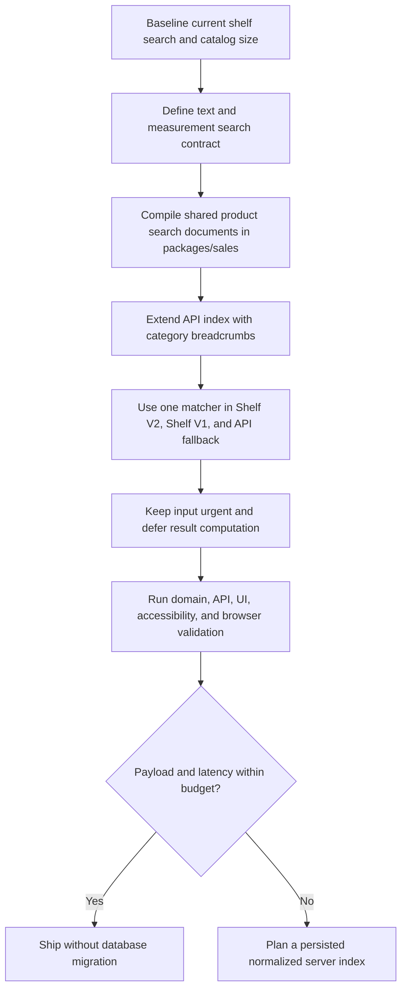

# Plan: New Sales Form Shelf Product Deep Search

## Type
Feature

## Status
Done

## Created Date
2026-08-06

## Last Updated
2026-08-06

## Goal Or Problem
Make Shelf Items product selection in the shared new sales form support fast,
deterministic deep search across reordered product words and door-industry
measurement syntax. A product displayed as `3 0X8 0 POCKET DOOR FRAME BUILT UP
4-9/16` must match a query such as `frame door 4-9 3 0 x 8 0` without making
the operator type the stored title in its original order.

## Current Context
- The live dashboard and dealership forms render the shared workflow from
  `packages/sales/src/sales-form/ui/workflow/sales-form-workflow-panel.tsx`.
- Shelf Items V2 loads a lightweight, 30-minute-cached product index through
  `getNewSalesFormShelfProductIndex` and filters it on the client with
  `searchShelfProductIndex` from
  `packages/sales/src/sales-form/domain/shelf-product-search.ts`.
- The existing helper already lowercases text, replaces punctuation with
  spaces, requires every query token, ignores token order, and ranks title and
  word-prefix matches. The reported example currently matches in a focused
  local replay, and the existing domain tests pass.
- The match is not yet robust enough to define as the product contract:
  one-character tokens such as `x` and `0` can match inside unrelated text,
  duplicate numeric tokens are not structurally enforced, fractions and
  dimensions are not modeled as measurement groups, and category breadcrumbs
  are not present in the cached product index.
- Shelf Items V1 still uses a separate local title-substring filter in
  `shelf-inputs.tsx`; the API fallback used by mobile/non-index consumers still
  uses one SQL `title contains <whole query>` predicate. Those paths can diverge
  from the shared V2 behavior.
- There is active, uncommitted work in `shelf-inputs.tsx` and its focused test
  that bounds the result list to an 18rem scroll region. Implementation must
  retain and build on that work.
- No database schema change is required for the recommended first slice. The
  existing product index is the fastest dashboard/dealership path; catalog
  count and serialized payload size should be measured before considering a
  server-only search index.

## Proposed Approach
Keep one pure search authority in `packages/sales`, but replace incidental
substring behavior with an explicit compiled search document and deterministic
ranking contract. Search documents will contain the product title as the
primary field and parent/child category names as secondary fields. Text words
remain reorderable. Door sizes, `x` separators, mixed-number fractions, quote
marks, hyphens, and the multiplication sign will be parsed into structured
measurement groups so numeric searches are permissive about formatting but do
not match arbitrary digits elsewhere.

The dashboard and dealership will continue to fetch one small cached product
index, compile its searchable representation once per index response, and
filter locally without a request on every keystroke. React will keep the input
state urgent and defer only result recomputation. Shelf Items V1 and the API
fallback will consume the same normalization/ranking primitives so users do not
learn different search grammars on different surfaces.

Use a no-migration-first performance gate. Only introduce a persisted
normalized search column or dedicated server index in a follow-up if measured
catalog size, index payload, or browser search time exceeds the documented
budget. Unit price remains visible but is not a default search field because
price digits are easily confused with dimensions; explicit price search can be
added after operator confirmation.

## Visual Plan

## Implementation Steps

### Phase 0: Pin the search contract and baseline
1. Capture the active product count, `getShelfProductIndex` serialized payload
   size, current first-load timing, and client filtering timing at the real
   catalog size. Repeat with synthetic 1,000- and 5,000-product indexes so the
   implementation has a growth baseline.
2. Add the reported product/query pair as the primary acceptance fixture:
   - product: `3 0X8 0 POCKET DOOR FRAME BUILT UP 4-9/16`
   - category: `Pocket Door Frames`
   - query: `frame door 4-9 3 0 x 8 0`
3. Freeze these matching rules in tests before refactoring:
   - matching is case-insensitive and ignores harmless whitespace differences;
   - ordinary word order is irrelevant, but all substantive query terms must
     match;
   - `x`, `X`, and `×` are equivalent only as measurement separators;
   - hyphens, quote marks, and spacing variants of the same dimension match;
   - `4-9` may prefix-match `4-9/16`, but unrelated `4` and `9` elsewhere do
     not satisfy the measurement group;
   - repeated numeric components in `3-0 x 8-0` are structurally checked;
   - archived products and products under archived categories never match;
   - exact title and title-field matches outrank category-only matches;
   - selected products remain available after the normal result limit.
4. Explicitly exclude typo/fuzzy edit-distance matching from this first slice.
   Product selection affects pricing and fulfillment, so false-positive fuzzy
   matches are riskier than requiring correct product words.

Dependency/decision gate: complete this phase before changing API or UI. If
operators expect price (`145` or `$145`) or product-id search, add those as
separate typed query groups rather than mixing their digits into dimensions.

### Phase 1: Build the shared deep-search domain authority
1. Refactor
   `packages/sales/src/sales-form/domain/shelf-product-search.ts` into small,
   testable primitives:
   - normalize Unicode, case, whitespace, apostrophes/quotes, hyphens, slashes,
     and multiplication symbols;
   - parse ordinary lexical terms separately from measurement groups;
   - compile each product into title terms, normalized title, measurement
     groups, category terms, and stable id/title tie-break values;
   - match the parsed query against compiled entries;
   - rank and cap results deterministically.
2. Extend `ShelfProductSearchIndexItem` with optional category fields or one
   compact `categoryPath` projection. Keep the domain helper independent of
   React, tRPC, Prisma, and app-specific types.
3. Use an explicit ranking tuple, evaluated in this order:
   - exact normalized title;
   - normalized title prefix/contiguous phrase;
   - all exact title words plus exact measurement groups;
   - title word-prefix matches;
   - matches completed with secondary category terms;
   - fewer prefix/substring penalties;
   - normalized title alphabetically;
   - numeric product id.
4. Add a `compileShelfProductSearchIndex` API so product normalization happens
   once per product-index response rather than once per keystroke. Use `Map`
   for stable id lookup and selected-product append behavior.
5. Preserve the current empty-query behavior and configured limits: five
   alphabetical/default rows in the cached web path, 20 typed matches, and any
   selected rows appended once after normal matches.

Validation gate: the expanded domain suite must cover positive variants,
negative numeric collisions, ranking ties, duplicate ids, selected ids, empty
queries, category matches, and the exact reported fixture before integration.

### Phase 2: Enrich the API projection without widening permissions
1. Update `getNewSalesFormShelfProductIndex` in
   `apps/api/src/db/queries/new-sales-form.ts` to return the minimal category
   breadcrumb needed for matching/result context alongside `id`, `title`, and
   `unitPrice`. Reuse the existing active-category visibility rules.
2. Extract a shared shelf-product index projection so the internal
   `newSalesForm` route and the dealer allowlist route return the same searchable
   shape. Apply dealer category visibility before returning or compiling any
   entries so hidden product/category names cannot leak through search data.
3. Keep `getShelfProductDetails` as the on-selection enrichment boundary for
   image and full category details; do not enlarge every index row with fields
   only needed after selection.
4. Bring `searchNewSalesFormShelfProducts` onto the same parser/ranker for
   mobile or adapters without a cached index. Use a bounded coarse database
   candidate query followed by shared in-memory ranking. Measure recall for all
   dimension variants and keep candidate count bounded.
5. If coarse SQL candidate retrieval cannot preserve the contract within the
   latency budget, stop at the decision gate and create a separate schema/API
   plan for a persisted normalized search document. Do not add an unmeasured
   full-table scan or MySQL full-text index: one-character measurement tokens
   and punctuation rules make generic full-text behavior a poor default.
6. Preserve current cache invalidation after shelf product create/update/delete
   so the 30-minute client cache cannot retain an edited title or category.

Validation gate: API tests must prove active/archived visibility, category-path
projection, selected hydration, dealer allowlist isolation, identical ranking
for representative API and client fixtures, and the existing blank/recent
behavior.

### Phase 3: Integrate with the shared React workflow
1. In `sales-form-workflow-panel.tsx`, compile the product index with `useMemo`
   keyed only by the stable query-data reference. Search the compiled entries
   with the shared helper.
2. Keep `ShelfInlineProductCell` input text local and immediate. Feed a
   deferred query into result computation (or wrap only the parent search state
   update in a transition) so typing, focus, arrow navigation, and Escape are
   never blocked by ranking work.
3. Do not debounce or refetch per keystroke in dashboard/dealership. Their one
   cached index request should remain the only network request until the user
   selects a result and requests product details.
4. Replace Shelf Items V1's local `title.includes()` filter in
   `shelf-inputs.tsx` with the same shared matcher, scoped to the already selected
   category product set. Preserve the uncommitted bounded scrolling container
   and its regression test.
5. Show the existing unit price and category breadcrumb in each result so
   similarly named products remain distinguishable. Do not add match
   highlighting in the first slice unless it can preserve accessible names and
   avoid extra render churn.
6. Preserve combobox semantics: focus remains in the input, Up/Down traverses
   ranked results, Enter selects, Escape closes, the empty/searching messages
   remain announced, and the result panel remains height-bounded on desktop and
   mobile widths.
7. Verify the shared change in both dashboard order/quote creation and dealer
   quote creation because both consume the same package-owned workflow.

Validation gate: React/source tests and browser network inspection must show no
request waterfall, no request per keystroke, no stale row selection, no input
lag, no result-list page growth, and no accessibility regression.

### Phase 4: End-to-end validation and rollout
1. Run focused automated validation:
   - `bun test packages/sales/src/sales-form/domain/shelf-product-search.test.ts`
   - the focused Shelf input/editor tests;
   - `bun test apps/api/src/db/queries/new-sales-form.test.ts`;
   - dealer workflow visibility/index tests added for this feature;
   - `bun run --filter @gnd/sales typecheck`;
   - the narrowest API, dashboard, and dealership typechecks that cover touched
     contracts;
   - scoped Biome and `git diff --check`.
2. Perform authenticated browser QA in dashboard and dealership:
   - open a new order/quote and add a Shelf Items row;
   - run the exact reported query and confirm the intended product ranks first;
   - repeat with case, punctuation, `x`/`×`, spacing, and fraction-prefix
     variants;
   - search by reordered words plus a category word;
   - run a negative numeric collision query and verify unrelated products are
     absent;
   - select the product, verify `$145.00` and category context, then verify the
     shelf line total/save payload are unchanged by search;
   - confirm keyboard-only selection, bounded scrolling, and zero console
     errors at desktop and 390px width.
3. Record final real-catalog metrics. Recommended no-migration budgets:
   - the cached index remains a deliberately small first-open payload;
   - compilation happens once per index response;
   - a 5,000-row synthetic typed search completes comfortably below 100ms in
     the test environment;
   - browser typing remains visually immediate under CPU throttling;
   - dashboard/dealership issue no network request per keystroke.
4. If budgets pass, ship as the default matcher with no feature flag because it
   preserves result selection and only broadens/reorders discovery. If budgets
   fail, keep the existing index path and move the persisted-index option into
   a separately approved follow-up rather than silently adding schema work.
5. Update `.brain/features/sales-form-system-hardening.md` with the final search
   grammar, validation evidence, and any deliberate cross-surface differences;
   update API/database Brain docs only if their contracts or schema materially
   change during implementation.

## Affected Files Or Areas
- `packages/sales/src/sales-form/domain/shelf-product-search.ts`
- `packages/sales/src/sales-form/domain/shelf-product-search.test.ts`
- `packages/sales/src/sales-form/ui/workflow/sales-form-workflow-panel.tsx`
- `packages/sales/src/sales-form/ui/workflow/shelf-inline-items-editor.tsx`
- `packages/sales/src/sales-form/ui/workflow/shelf-inputs.tsx`
- `packages/sales/src/sales-form/ui/workflow/shelf-inputs.test.ts`
- `packages/sales/src/sales-form/ui/workflow/workflow-records.ts`
- `packages/sales/src/sales-form/contracts/workflow-data-source.ts`
- `apps/api/src/db/queries/new-sales-form.ts`
- `apps/api/src/db/queries/new-sales-form.test.ts`
- `apps/api/src/trpc/routers/new-sales-form.route.ts`
- `apps/api/src/trpc/routers/dealer-portal.route.ts`
- `apps/dashboard/src/components/forms/new-sales-form/adapters/use-sales-form-workflow-data.ts`
- `apps/dealership/src/components/dealer-sales-form/adapters/use-sales-form-workflow-data.ts`
- `.brain/features/sales-form-system-hardening.md`
- TODO: Identify the narrowest existing dealer workflow visibility/index test
  file during implementation; add one only if no suitable test seam exists.

## Acceptance Criteria
- `frame door 4-9 3 0 x 8 0` returns the intended `3 0X8 0 POCKET DOOR FRAME
  BUILT UP 4-9/16` product and ranks it first for the representative catalog.
- Product words can be entered in any order, with case and harmless punctuation
  differences, while every substantive query group must match.
- Equivalent supported dimension/fraction formatting matches; unrelated titles
  containing isolated `x`, `0`, `4`, or `9` do not match accidentally.
- Product title is weighted above category breadcrumb, and result order is
  deterministic for ties.
- Active product/category visibility and dealer allowlists remain enforced.
- Dashboard and dealership reuse the cached index and perform no network request
  per keystroke; selected product details remain fetched only when needed.
- Shelf V1, Shelf V2, and the API fallback follow the same documented search
  grammar within their visibility scopes.
- Existing product selection, price, quantity, totals, save payloads, cache
  invalidation, and the bounded results scroller remain unchanged.
- Mouse, touch, and keyboard interactions work without console errors or
  perceptible input lag at desktop and narrow widths.
- No database migration is introduced unless the performance decision gate
  fails and a follow-up plan is explicitly approved.

## Test Plan
- Pure domain tests for normalization, parsing, matching, ranking, false
  positives, duplicate/selected ids, limits, and the exact reported fixture.
- API query tests for category enrichment, active visibility, recent/default
  behavior, shared ranking, and selected hydration.
- Dealer route tests proving allowlist filtering occurs before searchable data
  is returned.
- UI tests for V1/V2 matcher integration, immediate input updates, stable
  selected values, loading/empty states, keyboard semantics, and the existing
  bounded scroll contract.
- Synthetic benchmark for 1,000 and 5,000 products plus real-catalog payload and
  browser profiling evidence.
- Authenticated dashboard/dealership order/quote browser matrix, including the
  exact positive case and at least one negative numeric collision case.

## Risks / Edge Cases
- Numeric overmatching: isolated digits and `x` are currently permissive.
  Mitigate by parsing dimensions/fractions as groups and adding negative tests.
- Catalog spelling is inconsistent: titles may mix hyphens, spaces, quote
  marks, `X`, and fractions. Mitigate with Unicode/punctuation normalization
  and real catalog fixtures before locking the grammar.
- Category enrichment can enlarge the index payload. Mitigate with compact
  strings, measured budgets, and on-selection detail hydration.
- Dealer search could leak hidden catalog names if enrichment precedes
  allowlisting. Mitigate by applying visibility before returning the index and
  pinning it in route tests.
- Server fallback and cached client search can drift. Mitigate by sharing the
  parser/ranker and using cross-path contract fixtures.
- Search recomputation can delay controlled inputs on large catalogs. Mitigate
  by compiling once, using `Map` lookups, and deferring non-urgent result work.
- Fuzzy matching can choose a similarly named but wrong product. Keep typo
  tolerance out of the initial feature and revisit only with operator examples.
- Existing uncommitted shelf picker work can be overwritten. Implement on top
  of the bounded scroller and preserve the current focused regression.

## Implementation Outcome
- The package-owned matcher now compiles product titles and compact category
  paths once, separates lexical terms from structured dimensions/fractions,
  ranks exact/prefix/contiguous-title matches before unordered/category matches,
  and preserves selected products after the normal result limit.
- Shelf V1, the shared V2 dashboard/dealership workflow, and the typed API
  fallback use the same matcher. V2 defers result computation while keeping the
  controlled input urgent; stale rows are hidden during the deferred handoff.
- The cached API index and details projection include active parent/child
  breadcrumbs. Dealer data is allowlisted before it is returned. The typed API
  fallback applies active visibility, merges exact, contiguous phrase,
  structured measurement-anchor, and general term/category stages bounded to
  at most 601 unique candidates, then uses the shared structural ranker. A
  1,000-collision regression proves structural anchors retain the intended
  product without a bulk catalog load.
- Unit price remains display-only search context. Typo/edit-distance fuzzy
  matching remains deliberately excluded.
- Focused validation passes 47 tests / 231 assertions. A synthetic 5,000-row
  package benchmark compiled in about 18ms and searched in about 2ms locally,
  below the 100ms budget. Real-catalog payload timing, authenticated browser
  QA, and broad typechecks remain recommended release verification; they were
  not run under the fast Bun monorepo command discipline.
- No database migration or persisted search index was required.

## Linked Task
- Task Title: New Sales Form Shelf Product Deep Search
- Task File: .brain/tasks/done.md
