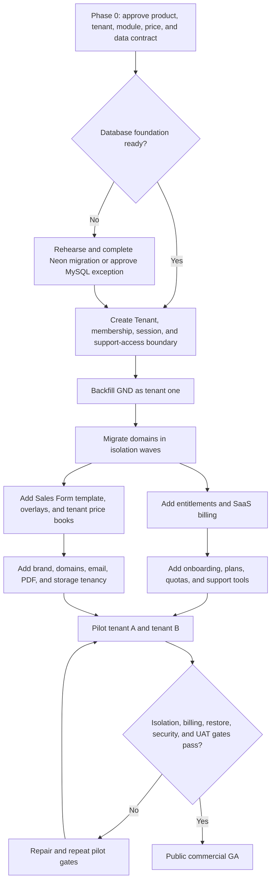

# Plan: Multi-Tenant SaaS Commercialization

## Type
Feature

## Status
Proposed

## Created Date
2026-08-08

## Last Updated
2026-08-08

## Goal Or Problem
Transform the current GND single-company operating system into a commercially
sellable, subscription-funded SaaS platform that multiple independent companies
can use safely. Each customer company must have isolated people, records,
configuration, branding, pricing, documents, email identity, domains, enabled
modules, subscription state, and audit evidence while all customers continue to
run one maintained product codebase.

The public product must preserve the existing shared Sales Form workflow as a
platform template. A tenant starts from the same component and step structure,
then owns its visibility, ordering, labels, additions, price books, taxes,
branding, and publish lifecycle. GND prices and confidential operational data
must never become another tenant's defaults.

This plan also supplies the business rollout, indicative schedule, implementation
architecture, infrastructure direction, build quotation, proposed SaaS packages,
operating costs, launch gates, and decisions required before implementation.

## Current Context
- The repository is already a large Turborepo/Bun product with dashboard,
  dealership, storefront, API, mobile, and jobs surfaces plus shared Sales,
  inventory, documents, PDF, email, notification, payment, and UI packages.
- The new Sales Form is the authenticated default and its configuration/pricing
  engine is progressively shared across dashboard, dealership, mobile, and
  storefront. This is a strong reusable product foundation.
- `Organization` currently represents an intended internal GND office. The
  proposed office plan explicitly says it is not an independent legal tenant.
  `SalesOrders.orgId` and a few other organization links are not yet an
  authoritative company isolation boundary.
- Most database records have no tenant/company foreign key. Customers,
  employees, catalog, inventory, documents, payments, jobs, notifications, and
  settings therefore still assume one operating company.
- `x-tenant-domain` is allowed by development CORS but no canonical hostname to
  tenant resolver or verified tenant request context currently exists.
- Existing dealer ownership is a downstream business relationship, not a SaaS
  tenancy model. A dealer must not be promoted into a tenant authority by
  implication.
- Existing Square flows collect GND/customer operational payments. They are not
  the platform subscription ledger and must remain separate from SaaS billing.
- Resend/React Email, the shared document platform, Vercel Blob, sales PDF
  HTML/PDF renderers, Trigger.dev jobs, Sentry, and Vercel deployments are
  reusable, but all need explicit tenant identity and quota/ownership rules.
- The proposed PlanetScale MySQL to Neon Postgres migration is a separate major
  program. SaaS delivery must sequence it deliberately rather than combine two
  uncontrolled migrations. PostgreSQL row-level security is recommended as
  defense in depth after the application tenant boundary exists.
- Current production migration history already has known drift/order issues.
  Public tenant onboarding must not begin until repeatable schema creation,
  restore, and migration gates pass.

## Proposed Approach

### 1. Product And Company Boundary

Introduce a new top-level `Tenant` (customer company/account) authority.

- A tenant is the legal/customer boundary for data, billing, contracts,
  retention, branding, domains, provider connections, quotas, and exports.
- `Organization` remains an office/location nested inside one tenant.
- A `TenantMembership` joins a global person identity to a tenant and owns the
  tenant role, status, default office, invitations, and access lifecycle.
- Dealer/customer/storefront identities remain domain actors inside a tenant;
  they are not tenant administrators unless explicitly invited as members.
- The existing GND production dataset becomes the first tenant through a
  rehearsed backfill. No historical record is silently assigned where
  ownership is ambiguous.
- The public launch uses a pooled multi-tenant application and database. An
  enterprise dedicated database/deployment can be a later paid topology, not
  the default architecture.

### 2. Request, Authentication, And Isolation Contract

Every authenticated or public request resolves one tenant from a trusted
server-side source:

1. verified custom hostname or platform subdomain;
2. authenticated session's active tenant;
3. signed public document/storefront token already bound to a tenant;
4. explicit platform-admin support context with reason, expiry, and audit.

The browser must never make `tenantId`, `organizationId`, a custom header, or a
hidden form field authoritative. API middleware verifies membership, builds
`TenantContext`, and domain queries/mutations require it. Entity-by-id access
must include the tenant predicate or assert ownership before returning data.

Recommended layers:

- application predicates and tenant-aware repositories in every runtime;
- compound tenant indexes and tenant-inclusive unique keys;
- PostgreSQL row-level security for selected high-risk tables after the Neon
  migration, using a restricted runtime role and transaction-local tenant
  context;
- cache, job, webhook, document, idempotency, analytics, and object-storage keys
  that always include tenant identity;
- automated two-tenant negative tests for every enabled module.

### 3. Shared Sales Form Without Shared Tenant Pricing

Use a versioned base-template plus tenant-overlay architecture.

- `SalesConfigurationTemplate` is the platform-maintained, immutable published
  structure: stable component UIDs, step graph, compatibility rules, item
  types, calculators, and safe starter metadata.
- `TenantSalesConfiguration` pins a tenant to one template revision and owns
  draft/published revision state.
- `TenantComponentOverride` may hide, rename, reorder, default, require, or
  present platform components without changing their stable identity.
- `TenantCustomComponent` allows tenant-only components. Any custom component
  that affects inventory or production must declare a reviewed mapping; an
  unmapped component can remain sales-only.
- `TenantPriceBook`, `TenantPriceBookEntry`, and tenant customer profiles own
  prices, coefficients, taxes, effective dates, and currency. New tenants start
  with unpriced entries or an explicit imported price book. GND costs/sales
  prices are not copied to tenants.
- Published tenant configuration is versioned and snapshotted into each sale so
  historical quotes/orders remain reproducible after later edits.
- Platform template upgrades show a diff and require tenant preview/acceptance.
  Tenant overlays survive upgrades by stable UID; unresolved conflicts block
  publication rather than silently changing live sales behavior.
- Dashboard, dealership, mobile, and storefront consume the same package-owned
  resolver and capability profile. No tenant gets a forked application.

### 4. Feature Selection And Entitlements

Maintain one code-defined feature registry and persisted tenant entitlements.

- Registry entries have a stable key, dependencies, incompatible features,
  navigation capability, API capabilities, billing mapping, lifecycle state,
  and data-retention/export behavior.
- `Plan`, `PlanVersion`, and `PlanFeature` describe sellable bundles.
- `TenantEntitlement` is the server-side access projection produced from the
  active subscription plus approved trials/manual grants.
- `TenantFeatureOverride` supports time-bounded support or negotiated grants
  with actor, reason, and expiry.
- Navigation hiding is presentation only. API, job, export, webhook, and mobile
  boundaries enforce the same entitlement.
- Disabling a module stops new operations but preserves data for read/export or
  retention according to the module contract. It never deletes business data.
- Sell coherent modules instead of dozens of arbitrary checkboxes. Recommended
  modules are Core CRM/Admin, Sales, Inventory, Production, Dispatch/Mobile,
  Dealership, Storefront, Finance, and Communications/Documents.

### 5. SaaS Subscription Billing Versus Tenant Commerce

Create a dedicated platform billing domain using Stripe Billing unless the
client's legal entity/country requires another approved provider.

- Platform ledger: tenant subscription, plan version, seats, add-ons, trials,
  invoices, credits, coupons, tax decision, dunning, cancellation, and access
  state.
- Stripe webhooks are signature-verified, stored idempotently, and processed
  asynchronously. The local subscription projection controls entitlements;
  browsers never unlock features from a checkout redirect alone.
- Provide Checkout and the hosted customer portal first. Avoid building custom
  card collection and billing settings in release one.
- Define grace, `past_due`, suspended, canceled, and read-only/export-only
  behavior before launch. Recommended initial grace is 7 days, followed by
  read-only administration/export access, not immediate destructive lockout.
- Existing Square payments remain operational sale/customer payments. Later,
  each tenant may connect its own merchant through provider OAuth. Never share
  GND merchant credentials or accept raw tenant secrets in ordinary settings.
- Platform revenue and tenant customer revenue use separate models, provider
  accounts, reconciliation, reporting, support permissions, and audit logs.

### 6. Domains, Branding, Email, And Documents

#### Domains

- Every tenant receives `<slug>.<platform-domain>`.
- Paid plans may add verified custom domains. `TenantDomain` owns normalized
  hostname, purpose, provider id, verification challenge, status, canonical
  flag, certificate state, failure, and audit timestamps.
- Hostname resolution happens before application auth and is cached by hostname,
  but the database remains authoritative on cache miss/change.
- Adding a domain proves DNS control before activation. Removing/reassigning a
  domain revokes routing and cached identity before another tenant may claim it.
- Vercel for Platforms is the lowest-friction first implementation because the
  existing apps already deploy to Vercel and it supports wildcard/custom domain
  routing and managed SSL. Cloudflare for SaaS is the scale/edge-control
  alternative if commercial limits, WAF, apex routing, or vendor strategy
  require it.

#### Branding And Email

- `TenantBrand` owns name, logos, colors, address, legal/footer text, locale,
  currency, date/time zone, and document/email defaults.
- Platform security/billing emails come from the platform identity.
- Tenant operational emails use a verified tenant sender domain where enabled,
  otherwise a clearly labeled shared platform sender with tenant reply-to.
- Store tenant domain verification/provider identifiers, not provider secrets.
  Outbound attempts and webhook delivery/bounce/complaint events are tenant
  scoped. Unsubscribe/preference rules distinguish transactional from marketing.
- Release one includes outbound transactional email and reply-to routing. A
  shared inbound mailbox/ticketing product is a separate feature unless the
  client explicitly adds it.

#### PDF And Storage

- Keep the shared print-data and paired HTML/PDF renderer architecture.
- Resolve tenant brand, address, currency, template, and legal footer at a
  versioned document configuration boundary before rendering.
- `StoredDocument` and `SalesDocumentSnapshot` gain tenant ownership; storage
  keys begin with an opaque tenant identifier and never trust a hostname.
- Signed links are tenant bound, expiring, revocable, and audience/purpose
  specific. Document quotas, retention, purge, export, and legal-hold rules are
  plan-aware.

### 7. Infrastructure And Operations

Recommended managed starting topology:

| Concern | Initial service/direction | SaaS requirement |
| --- | --- | --- |
| Web surfaces | Existing Vercel projects | Wildcard/custom hostname routing, preview/staging separation, spend limits |
| API | Existing Hono API deployment | Tenant context middleware, strict CORS/host allowlist, rate limits, webhook routes |
| Database | Complete the approved Neon/Postgres migration before GA, or document MySQL exception | Pooled runtime, direct migrations, PITR, restore drills, RLS defense in depth |
| Cache/rate limit | Existing shared Redis boundary | Tenant-prefixed keys, hostname lookup, distributed limits, purge on access/domain changes |
| Jobs | Existing Trigger.dev package | Tenant in payload, idempotency, concurrency quotas, no tenant-specific project sprawl |
| Files | Existing document platform/Vercel Blob initially | Tenant paths/metadata, private access, quota, lifecycle, malware policy |
| Email | Existing Resend/React Email | Platform versus tenant identity, domain verification, webhook ledger, quotas |
| Billing | Stripe Billing | Signed idempotent webhook ingestion and entitlement projection |
| Operational payments | Existing Square, tenant connection later | OAuth/provider account per tenant; never reuse GND credentials |
| Observability | Existing Sentry/logging | Tenant tags without customer PII, audit trails, alert/runbook ownership |
| Delivery | Turbo/Bun CI and independent app projects | migration checks, tenant-isolation tests, preview/staging, canary and rollback |

Required operational controls before public launch:

- production/staging/dev isolation and sanitized test data;
- tested backups and restore with declared RPO/RTO;
- per-tenant rate limits, storage/email quotas, and abuse controls;
- append-only platform-admin impersonation and support-access audit;
- privacy policy, terms, DPA, subprocessors, retention/deletion/export process,
  incident response, support SLA, and security contact;
- dependency/security scanning, secret rotation, least privilege, webhook replay
  tooling, status page, support/ticket process, and on-call ownership;
- usage/cost telemetry by tenant to prevent unprofitable plans.

### 8. Customer Onboarding And Operating Process

Use a guided B2B onboarding process for the first 10-20 tenants; do not start
with unrestricted self-service signup.

1. Qualification: business type, modules, users, sites, data volume, payment
   provider, sender/domain, regulatory needs, integrations, and success owner.
2. Commercial agreement: selected plan/add-ons, onboarding scope, data
   migration, support level, DPA/terms, renewal, and acceptance criteria.
3. Provisioning: tenant, platform subdomain, owner membership, default office,
   plan version, quotas, and isolated sandbox fixtures.
4. Configuration: brand, offices, roles, module selection, tax/currency/time
   zone, sales template revision, hidden/required components, price book, email,
   documents, domain, and merchant connection.
5. Data migration: map/import users, customers, products/components, opening
   inventory, open orders, and balances through dry-run/reconciliation reports.
6. Training: admin, sales, warehouse/production, finance, and support runbooks.
7. UAT: tenant-owned scripts for quote/order, price, PDF/email, payment,
   inventory/production, permissions, and mobile/domain flows.
8. Go-live: signed checklist, migration freeze, final delta/import, domain/email
   activation, monitoring, and daily review for the first week.
9. Adoption: 30/60/90-day usage and outcome review, configuration changes,
   renewal risk, feature requests, and support metrics.

### 9. Proposed SaaS Packages And Customer Pricing Hypothesis

These are positioning hypotheses to validate with 5-10 prospective companies,
not irrevocable prices.

| Package | Indicative price | Included direction |
| --- | ---: | --- |
| Starter | $299/month | 5 staff, one office, CRM/admin, Sales, shared Sales Form, PDF, platform subdomain, basic email allowance |
| Operations | $699/month | 15 staff, three offices, Starter plus Inventory, Production, Dispatch, branded documents, larger email/storage allowances |
| Business | $1,499/month | 40 staff, Operations plus Dealership or Storefront, custom domain, advanced permissions/reporting, priority support |
| Enterprise | From $2,500/month | Negotiated seats/modules, SSO, SLA, advanced audit/retention, migration/integration work, optional dedicated topology |

Commercial recommendations:

- charge an onboarding/data-migration fee: approximately $1,500 Starter,
  $5,000 Operations, $10,000+ Business, custom Enterprise;
- offer approximately 15% annual prepayment discount, not a permanent free tier;
- use a 30-day guided pilot/demo tenant for qualified buyers;
- price additional staff around $15-$30/user/month and custom domain around
  $49/month when not bundled;
- include sensible transactional email/storage allowances and bill transparent
  overage or require an upgrade;
- avoid transaction-based pricing in release one because manufacturing order
  complexity varies and customers need predictable bills;
- review gross margin quarterly using actual compute, database, email, storage,
  job, and support cost per tenant.

### 10. Delivery Timeline And Staffing

Delivery uses a structured, AI-accelerated engineering workflow with experienced
technical oversight and approximately 32-35 focused development hours per week.
Requirements are decomposed into traceable work packages; production-grade AI
models support analysis, implementation, refactoring, automated testing,
documentation, and review. The workstreams below overlap deliberately while
architecture, tenant isolation, data security, business correctness, provider
integration, and release approval remain human-controlled launch gates.

| Phase | Calendar window | Principal outcome |
| --- | ---: | --- |
| 0. Discovery and product contract | Weeks 1-2 | Tenant/domain matrix, module catalog, commercial decisions, data audit, final estimate |
| 1. Data platform and release foundation | Weeks 1-4 | Repeatable migrations/restores; approved Neon migration/cutover or documented MySQL exception |
| 2. Tenant/auth/isolation foundation | Weeks 2-6 | Tenant/member/session context, GND backfill, scoped platform administration |
| 3. Domain-by-domain tenant migration | Weeks 3-8 | Customers, sales, inventory, production, finance, documents, jobs, caches, exports isolated |
| 4. Entitlements and SaaS billing | Weeks 5-9 | Plans, feature selection, Stripe Checkout/portal/webhooks, dunning/access state |
| 5. Shared Sales Form template/overlay/pricing | Weeks 5-10 | Safe starter template, tenant overrides/custom items, price books, publish/upgrade workflow |
| 6. Brand, domain, email, PDF, storage | Weeks 7-11 | Branded tenant surfaces and verified custom domains/senders/documents |
| 7. Onboarding/import/admin/support | Weeks 8-12 | Guided provisioning, imports, audit, support tools, usage/cost controls |
| 8. Pilot, security, load, and GA | Weeks 10-15 | Two or more pilot tenants, security review, restore/load proof, guided public release |

Some work overlaps after the tenant foundation. Expected elapsed time:

- private pilot readiness: approximately 9-11 weeks with the AI-accelerated delivery model;
- guided public commercial launch: approximately 12-15 weeks;
- lower weekly capacity, delayed decisions, or unavailable AI/provider support
  extends the schedule proportionally;
- add time for unmeasured migration repair, near-zero-downtime database cutover,
  inbound email/ticketing, accounting integrations, SSO, regulatory work, or
  dedicated tenant infrastructure.

Do not market a public launch date until Phase 0 measures the live database,
enumerates tenant ownership for every domain, and confirms delivery capacity.

### 11. Indicative Build Quotation

Currency is USD because exchange rates and provider bills are volatile. Convert
to local currency at the invoice-date rate. This is an architecture-stage budget,
not a signed fixed bid; Phase 0 should produce the statement of work.

| Work package | Indicative amount |
| --- | ---: |
| Discovery, product contract, data/tenant inventory, UX and final SOW | $12,000 |
| Data platform migration/release/backup foundation | $25,000 |
| Tenant model, memberships, auth context, isolation and GND backfill | $30,000 |
| Entitlements, plans, Stripe subscription billing and onboarding admin | $18,000 |
| Shared Sales Form template, tenant overlays, custom components and price books | $35,000 |
| Branding, custom domains, email identity, PDF/document/storage tenancy | $18,000 |
| Import/migration tools, support tooling and pilot onboarding | $12,000 |
| Security, performance, QA automation, production rollout and handover | $20,000 |
| **Target full-program budget** | **$170,000** |

Use a planning envelope of **$150,000-$220,000** until discovery closes unknowns.
A reduced private-pilot package can target **$90,000-$120,000** by limiting
modules, postponing open self-service/custom integrations, supporting one payment
provider, and onboarding only 2-3 managed tenants.

Suggested milestone payments for the $170,000 target:

- 10% kickoff;
- 10% approved discovery/SOW;
- 15% data platform foundation;
- 15% tenant/auth foundation;
- 15% domain isolation acceptance;
- 15% billing/entitlements and Sales Form configuration acceptance;
- 10% domains/email/PDF/import acceptance;
- 5% private pilot acceptance;
- 5% public GA and handover.

Recommended post-launch support is **$3,000-$8,000/month** depending on SLA,
release capacity, incident coverage, and included product work, plus provider
costs. Alternatively budget 15-20% of build cost annually for maintenance,
security updates, compatibility work, and minor improvements. New modules,
bespoke integrations, legal/compliance fees, data cleansing, domain purchases,
provider fees, and 24/7 support are separately scoped.

### 12. Recurring Infrastructure Budget Assumptions

Provider prices change and must be rechecked when contracting. As of 2026-08-08:

- [Vercel Pro](https://vercel.com/pricing) starts at $20 per developer seat/month
  with included usage credit and metered compute, bandwidth, Blob, and build
  overages. Set spend alerts and hard limits.
- [Stripe Billing](https://stripe.com/billing/pricing) pay-as-you-go is 0.7% of
  Billing volume, in addition to payment-processing fees. The hosted portal is
  included; its optional custom domain is separately priced by Stripe.
- [Resend transactional email](https://resend.com/docs/knowledge-base/what-is-resend-pricing)
  lists $20/month for 50,000 emails and $90/month for the Scale 100,000-email
  tier with more sender domains.
- [Trigger.dev](https://trigger.dev/pricing) lists Hobby at $10/month and Pro at
  $50/month with included compute credits, followed by invocation/compute usage.
- [PlanetScale](https://planetscale.com/docs/planetscale-plans) and the proposed
  Neon target must be sized after measured workload; database, backups, read
  replicas/branches, and support should be budgeted separately.
- [Vercel for Platforms](https://vercel.com/kb/guide/nextjs-multi-tenant-application)
  supports a single multi-tenant deployment with wildcard and custom domains,
  automatic certificates, and domain APIs. Confirm plan/domain limits during
  procurement. [Cloudflare for SaaS](https://developers.cloudflare.com/cloudflare-for-platforms/cloudflare-for-saas/)
  is the alternative custom-hostname edge.

Practical early-production provider budget: approximately **$500-$2,000/month**
before payment-processing fees, support labor, and unusually heavy traffic.
Budget **$2,000-$8,000+/month** as tenant count, database size, email, document,
job, observability, and support needs grow. These are reserves, not guaranteed
invoices; per-tenant cost telemetry is a release requirement.

## Visual Plan

## Implementation Steps

### Phase 0 - Discovery, Contract, And Final Statement Of Work
1. Name product owner, technical owner, security owner, migration owner, support
   owner, and commercial decision maker.
2. Inventory every model, endpoint, job, cache, document, file, event, export,
   payment, mobile flow, and public link by proposed tenant ownership.
3. Classify all product capabilities into required core, optional module,
   platform-only, tenant-admin, office-scoped, and later/unsupported.
4. Interview 5-10 target companies and validate package value, willingness to
   pay, onboarding burden, payment/email/domain needs, and missing integrations.
5. Decide target countries, currencies, tax responsibility, data residency,
   support hours, uptime target, RPO/RTO, retention, and legal launch markets.
6. Measure database size/write rate, migration state, current infrastructure
   spend, email volume, storage, job runs, and peak usage.
7. Produce the final statement of work, exclusions, acceptance matrix, staff
   plan, milestone invoice schedule, and risk reserve.

Exit gate: ADR and SOW approved; no unresolved question can materially change
the architecture, price, or launch date.

### Phase 1 - Data Platform And Delivery Foundation
1. Approve and execute the existing PlanetScale-to-Neon plan, or record a
   time-bounded MySQL exception with equivalent application isolation controls.
2. Make schema build/migration/restore repeatable in isolated environments.
3. Establish staging, sanitized fixtures, backup/PITR, restore drill, CI migration
   gate, deployment rollback, secrets inventory, and cost alerts.
4. Add tenant-isolation test fixtures before migrating business domains.

Exit gate: two repeatable database rehearsals, restore proof, and a green
deployment/migration gate.

### Phase 2 - Tenant, Membership, Session, And Platform Administration
1. Add tenant, status, membership, invitation, support access, audit, brand,
   domain, and office ownership foundations.
2. Add active tenant and office to every auth/session surface used by dashboard,
   dealership, storefront, API, mobile, and jobs where applicable.
3. Add verified `TenantContext` middleware and tenant-aware repository helpers.
4. Build platform administration for tenant provision/suspend/reactivate,
   support access, quota view, audit, and safe impersonation.
5. Backfill GND as tenant one through dry-run/apply/reconcile tooling.

Exit gate: forged tenant/office identifiers fail, support access is audited, and
GND works through the new boundary with compatibility flags.

### Phase 3 - Tenant Ownership Migration Waves
Apply write stamping, backfill, read scoping, API/job/cache/export/document
scoping, negative tests, and a reversible flag in each wave:

1. settings, people, roles, permissions, notifications;
2. customers, addresses, profiles, tax, notes;
3. Sales Form catalog/configuration and sales/quotes;
4. inventory, suppliers, stock, inbounds, allocations;
5. production, payroll, dispatch, mobile proof;
6. payments, finance, refunds, wallet, accounting;
7. dealership, storefront, public links, documents, emails;
8. analytics, exports, jobs, events, caches, diagnostics.

Exit gate per wave: two-tenant read/write/export/job isolation matrix passes and
all historical rows have deterministic ownership or an approved exception.

### Phase 4 - Plans, Entitlements, And Subscription Billing
1. Implement registry, plan versions, entitlements, dependencies, overrides,
   quotas, and disable/read-only semantics.
2. Create Stripe products/prices and the local subscription projection.
3. Implement Checkout, customer portal, signed webhook inbox, replay,
   idempotency, dunning, grace, suspension, cancellation, and reconciliation.
4. Apply entitlement guards consistently to web, API, mobile, jobs, exports,
   navigation, and public surfaces.
5. Add billing/support audit and revenue/usage dashboards.

Exit gate: webhook replay and out-of-order tests pass; unpaid/canceled tenants
receive the approved state without data loss; UI cannot bypass API entitlement.

### Phase 5 - Shared Sales Configuration And Tenant Pricing
1. Extract a safe template revision from the existing shared configuration.
2. Remove tenant-confidential price/cost values from starter publication.
3. Add tenant draft/publish, overrides, custom components, price books, imports,
   effective dates, customer profiles, and historical snapshots.
4. Add template diff/upgrade/conflict workflow and rollback.
5. Prove dashboard, dealership, storefront, mobile, PDF, inventory, and
   production resolve the same published configuration contract.

Exit gate: two tenants can configure different visibility, additions, and
prices from the same base without cross-tenant reads or calculation drift.

### Phase 6 - Domains, Brand, Email, PDF, And Storage
1. Implement platform subdomains, custom-domain verification/provider API,
   SSL/status lifecycle, hostname cache, canonical redirect, and revocation.
2. Add tenant brand/config resolution to app metadata, email, HTML/PDF, and
   public pages.
3. Separate platform email from tenant operational email; add sender-domain
   verification, bounce/complaint webhooks, quotas, and delivery audit.
4. Tenant-scope StoredDocument, PDF snapshots, paths, signed links, retention,
   quotas, export, and deletion.

Exit gate: wrong-host and domain-reassignment tests fail closed; branded
email/PDF/public links never expose another tenant's identity or document.

### Phase 7 - Onboarding, Import, Support, And Cost Controls
1. Build guided tenant creation and setup checklist.
2. Add dry-run imports with field mapping, validation, reconciliation, rollback,
   and immutable evidence.
3. Add owner invites, role templates, training fixtures, usage/quota display,
   support diagnostics, status communication, export, and offboarding.
4. Attribute compute/email/storage/job/observability costs to tenant where
   technically possible and establish gross-margin alerts.

Exit gate: a trained operator can provision and reconcile a tenant without a
developer manually editing production data.

### Phase 8 - Pilot, Security, Performance, And Public GA
1. Onboard at least two independent pilot companies with different modules,
   domains, prices, users, and data sets.
2. Run cross-tenant authorization testing, external penetration review, payment
   webhook/reconciliation review, load tests, restore drill, domain/email abuse
   checks, and accessibility/browser/mobile UAT.
3. Exercise suspension, support access, export, deletion request, incident,
   rollback, and provider outage runbooks.
4. Operate pilots for at least 30 days, close P0/P1 issues, validate support and
   infrastructure cost, then approve public GA.

## Affected Files Or Areas
- `packages/db/src/schema/*` and the active migration baseline
- `packages/auth/*`
- `packages/sales/*`, especially shared Sales Form, pricing, print, payment,
  resolution, production, and dispatch boundaries
- `packages/inventory/*`, `packages/community/*`, `packages/settings/*`
- `packages/documents/*`, `packages/pdf/*`, `packages/email/*`,
  `packages/notifications/*`, `packages/jobs/*`, `packages/cache/*`
- `apps/api/*`, including tRPC context, REST/webhooks, CORS, and public routes
- `apps/dashboard/*`, `apps/dealership/*`, `apps/storefront/*`, `apps/mobile/*`
- deployment, database, CI, observability, import/export, support, and runbooks
- `.brain/database/*`, `.brain/api/*`, `.brain/features/*`,
  `.brain/decisions/*`, `.brain/product/*`, and task/progress tracking

## Acceptance Criteria
- At least two live pilot tenants share one codebase but cannot read, mutate,
  export, receive, cache, or infer each other's records, prices, documents,
  domains, provider identities, or analytics.
- GND is migrated as tenant one with reconciled counts and financial/inventory
  invariants and no unexplained ownership.
- Tenants independently select supported modules; entitlement enforcement works
  in API, jobs, mobile, exports, and UI.
- Subscription checkout, portal, webhook replay, plan changes, grace,
  suspension, cancellation, and reconciliation are production proven.
- The shared Sales Form uses one platform template while each tenant can hide,
  reorder, rename, add allowed components, publish revisions, and own all
  prices without GND price leakage.
- Tenant branding, platform/custom domains, sender identity, HTML/PDF, stored
  files, and signed links are isolated and auditable.
- Backups/restores, data export/offboarding, incident/rollback, rate limits,
  quotas, support access, cost attribution, and monitoring pass launch gates.
- Terms/privacy/DPA/subprocessor/retention/support materials are approved for
  the target launch markets.
- Public GA is approved only after 30-day pilot evidence and zero open P0/P1
  tenant-isolation, billing, payment, data-loss, or restore defects.

## Test Plan
- Static tenant-ownership inventory proving every high-risk model and endpoint
  is classified.
- Two-tenant and two-office positive/negative API tests for list, detail,
  mutation, relation traversal, batch, search, export, document, and job paths.
- Hostname/subdomain/custom-domain verification, collision, takeover,
  revocation, cache purge, canonical redirect, and wrong-host tests.
- Auth tests for membership invite/revoke, session tenant/office switching,
  mobile/web parity, support access expiry, and concurrent sessions.
- Subscription webhook signature, duplicate, replay, reordering, missing event,
  reconciliation, dunning, grace, cancellation, and plan-change tests.
- Entitlement dependency, override expiry, UI/API/job parity, module-disable
  read/export behavior, quota, and plan-version tests.
- Golden Sales Form tests for base revision, tenant overlay, custom component,
  price book, profile/tax, publish, upgrade/conflict, sale snapshot, PDF, and
  all consuming surfaces.
- Provider tests for email domain, bounce/complaint, PDF/storage ownership,
  signed links, operational merchant OAuth, and platform/tenant ledger split.
- Migration dry runs and reconciliation for users, customers, sales, inventory,
  documents, payments, and open workflows.
- Load/soak, noisy-neighbor, cache-key, background concurrency, rate-limit,
  restore, failover/provider outage, security, accessibility, and browser/mobile
  pilot UAT.

## Risks / Edge Cases
- A missing tenant predicate on one legacy path can cause a reportable data
  breach. Mitigation: domain inventory, tenant repositories, RLS defense in
  depth, negative tests, and phased flags.
- Database-engine migration plus tenancy migration is too risky as one cutover.
  Mitigation: finish/rehearse the data platform first and preserve separate
  rollback gates.
- Existing unique keys such as phone, email, order number, slugs, and UIDs may
  be globally unique but need tenant-inclusive uniqueness. Migration must audit
  collisions and external identifiers before changing constraints.
- Shared template changes could alter tenant quotes/orders. Mitigation:
  immutable revisions, tenant acceptance, diff/conflict workflow, and order
  snapshots.
- GND pricing/cost or supplier information could leak through seed data, API,
  logs, PDFs, caches, or exports. Mitigation: safe publication schema and
  explicit confidential-field denylist tests.
- Per-tenant arbitrary feature combinations create an untestable support
  matrix. Mitigation: coherent plan modules and declared dependencies.
- Payment confusion between SaaS invoices and tenant sales can corrupt
  accounting. Mitigation: separate providers/accounts/models/ledgers and
  reconciliation ownership.
- Custom-domain reassignment and stale caches can route one company to another.
  Mitigation: proof-of-control, globally unique normalized hostname, provider
  state verification, revocation-before-reuse, and short cache TTL/purge.
- Email reputation may be damaged by one tenant. Mitigation: verification,
  quotas, bounce/complaint handling, tenant suspension, and separate sender
  pools as volume grows.
- One large tenant can exhaust shared database/jobs/storage. Mitigation:
  per-tenant quotas, concurrency, cursor pagination, cost telemetry, and later
  enterprise isolation.
- Legal, tax, data-residency, and payment-provider eligibility vary by market.
  Mitigation: select launch markets in Phase 0 and obtain professional advice.
- The quote can move materially with data cleanup, integrations, compliance,
  SSO, near-zero downtime, or 24/7 SLA. Mitigation: discovery-funded SOW,
  exclusions, contingency, and milestone acceptance.

## Open Questions
- TODO: Confirm target launch countries, currencies, legal billing entity, tax
  responsibility, and whether Stripe can be used by that entity.
- TODO: Confirm whether the client approves the Neon/Postgres migration before
  SaaS GA or prefers a documented MySQL-first pilot.
- TODO: Confirm the first three sellable module bundles and which current GND
  features are platform-only or excluded.
- TODO: Confirm whether a tenant may have multiple offices/warehouses and
  whether inventory is shared or office/warehouse owned.
- TODO: Confirm whether tenants bring Square, Stripe, another merchant, or no
  online customer payment in release one.
- TODO: Confirm whether “email handling” means outbound transactional email
  only or also inbound replies/shared mailbox/ticketing.
- TODO: Confirm data residency, retention, deletion, export, uptime, RPO/RTO,
  support hours, and SSO requirements.
- TODO: Confirm whether platform starter components are licensed/approved for
  redistribution to customer companies and which fields are confidential.
- TODO: Confirm whether custom domains apply to dashboard, storefront, dealer
  portal, public documents, or all surfaces.
- TODO: Confirm expected tenant/user/order/email/storage volume at launch and
  after 12 and 36 months.
- TODO: Validate the proposed SaaS prices and onboarding fees through customer
  interviews before publishing them.
- TODO: Approve project team, delivery model, target budget envelope, and paid
  Phase 0 discovery before presenting a fixed commercial commitment.

## Linked Task
- Task Title: Multi-Tenant SaaS Commercialization
- Task File: .brain/tasks/roadmap.md
