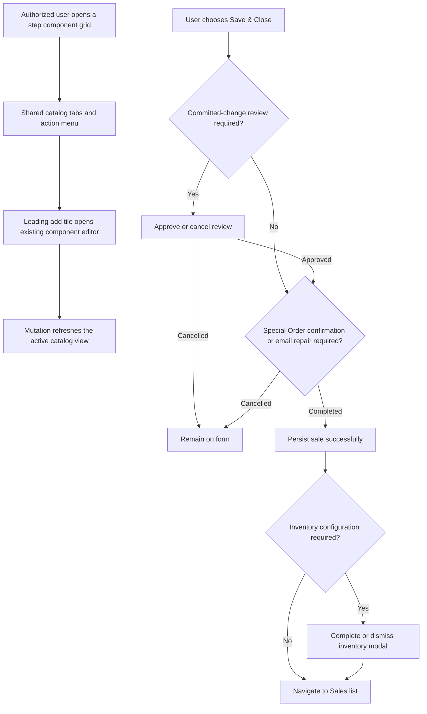

# Plan: New Sales Form Step Picker And Component Creation Parity

## Type
Feature

## Status
In Progress

## Created Date
2026-08-19

## Last Updated
2026-08-20

## Recommended Codex Agent
- Agent: `gpt-5.6-terra`
- Reason: The work is a bounded React/shared-package parity slice with existing components, slots, capabilities, and tests.

## Goal Or Problem
Restore the new sales form's visible floating step search/action surface and complete the missing legacy actions. Users with `can.editSalesComponent` must receive a leading `[ + ]` card for component creation. Garage Door and Exterior Door size rows must offer `In-Swing` and `Out-Swing` instead of an unrestricted LH/RH text field.

## Current Context
- The shared picker already renders `WorkflowComponentToolbar`, and the toolbar already measures its component boundary to switch between fixed and anchored modes. Field reports indicate it is missing at runtime, so diagnose its boundary/scroll/empty/loading behavior before replacing it.
- The floating toolbar clipping defect is repaired by portaling fixed mode to `document.body`, but authenticated browser proof remains open.
- `WorkflowStepComponentPanel` exposes a partial menu, but its `Tabs` submenu currently lists workflow steps instead of the legacy Default / Custom / Hidden catalog views. The default `ItemWorkflowPanel` host also omits the explicit component-management permission and create handler, so the leading `[ + ]` tile and `Component` menu action remain absent there.
- Dashboard workflow administration is currently role-derived (`Admin`/`Super Admin`) in `workflow-capabilities.ts`; the requested authority is the explicit `editSalesComponent` permission and must be enforced server-side as well as in the UI.
- Door size and HPT surfaces currently use free-text swing inputs with `LH/RH` placeholders.
- `Save & Close` loses its navigation intent when a committed-change review interrupts the save. Special Order classification/customer-email repair and post-save inventory configuration already have continuation behavior, but all confirmation paths need one explicit contract: retain the requested action, complete every required modal, save successfully, then navigate exactly once.

## Proposed Approach
Keep the shared `packages/sales` workflow surface as the UI authority. Complete the menu/catalog-view contract, wire both dashboard hosts through `auth.can.editSalesComponent`, and reuse the existing component admin dialog/mutations for the leading create tile. Keep custom catalog configuration separate from custom sale-value entry. Add one reusable door-swing choice resolver/control so desktop/mobile layouts and HPT rows use the same Garage/Exterior semantics without changing unrelated door families.

For save actions, keep one pending `SaveIntent` through pre-save review, Special Order classification/customer-email repair, persistence, and post-save inventory configuration. A cancelled or failed step clears or retains the flow without navigation as appropriate; successful completion performs the requested Close/New navigation once, after the final modal resolves.

## Visual Plan

## Implementation Steps
1. Add failing tests for toolbar visibility while the active picker boundary intersects the window or a nested scroll container, including short grids, long grids, loading-to-loaded transition, empty search results, resize, and the dashboard footer offset.
2. Fix `WorkflowComponentToolbar`/`StepComponentPicker` so the search/action bar remains visible above the form footer while the active component picker is in view, anchors at the grid end, does not cover the final row, and unregisters listeners/observers cleanly.
3. Complete the action menu contract in legacy order: catalog `Tabs` (Default / Custom / Hidden), workflow `Steps`, Select All only for multi-select steps, Pricing or Door Size Variants when applicable, Component when creation is authorized, Refresh, and `Enable Custom`/`Disable Custom` derived from the active step state.
4. Add catalog-view state, counts, and filtering using canonical component metadata. Keep archived/deleted components excluded and verify the API DTO exposes visibility accurately instead of assigning one hard-coded value.
5. Extend shared workflow capabilities/slots with an explicit create-component action. Render an accessible leading `[ + ]` tile as the first grid item only when `canEditWorkflowComponents` is derived from `auth.can.editSalesComponent` and a create handler is present. Reuse the existing component detail/admin dialog and save mutation; do not create a second persistence path.
6. Pass `canEditSalesComponent`, `onCreateComponent`, and the narrower details capability through the default `ItemWorkflowPanel` host. Keep dealership/storefront consumers free of internal catalog actions.
7. Separate the custom catalog configuration toggle from the custom sale-value editor so labels and actions describe the behavior they invoke.
8. Preserve `SaveIntent` across committed-change review and resume the remaining Special Order, save, inventory-configuration, and navigation stages after approval. Cancelled confirmations and save failures must not close; successful Close must navigate exactly once after every modal resolves.
9. Add `editSalesComponent` to the canonical permission list/session typing and keep API workflow-component writes protected by the same permission. Keep price editing behind its existing stronger boundary unless the user separately changes it.
10. Introduce a shared swing-option resolver for Garage Door and Exterior Door workflow families. Render a select/radio control with labels `In-Swing` and `Out-Swing` across the door-size dialog and HPT table/card layouts, preserving the canonical persisted values used by legacy records. Leave other configured swing flows unchanged.
11. Add keyboard, focus, responsive, permission-denial, and save-continuation coverage. Confirm dashboard and dealership package consumers do not gain internal component-management controls by default.

## Files To Touch

Reuse:
- `packages/sales/src/sales-form/ui/workflow/workflow-component-toolbar.tsx`
- `packages/sales/src/sales-form/ui/workflow/workflow-component-grid.tsx`
- `apps/dashboard/src/components/forms/new-sales-form/sections/use-workflow-component-admin.tsx`

Extend / Update:
- `packages/sales/src/sales-form/ui/workflow/step-component-picker.tsx`
- `packages/sales/src/sales-form/ui/workflow/workflow-step-component-panel.tsx`
- `packages/sales/src/sales-form/ui/workflow/sales-form-workflow-panel.tsx`
- `packages/sales/src/sales-form/ui/workflow/sales-form-engine-panel.tsx`
- `packages/sales/src/sales-form/contracts/workflow-capabilities.ts`
- `packages/sales/src/sales-form/contracts/form-slots.ts`
- `packages/sales/src/sales-form/ui/workflow/modals/door-size-qty-dialog.tsx`
- `packages/sales/src/sales-form/ui/workflow/house-package-tool-panel.tsx`
- `apps/dashboard/src/components/forms/new-sales-form/sections/dashboard-sales-form-workflow-panel.tsx`
- `apps/dashboard/src/components/forms/new-sales-form/sections/workflow-capabilities.ts`
- `apps/dashboard/src/components/forms/new-sales-form/new-sales-form.tsx`
- `apps/dashboard/src/components/forms/new-sales-form/sections/sales-change-review-sheet.tsx`
- `packages/utils/src/constants.ts`
- `apps/api/src/trpc/routers/sales.route.ts`

Create only if the existing door helpers cannot host it cleanly:
- A small package-owned swing option/control module beside `door-utils.ts`.

Avoid:
- Do not add an app-local floating toolbar beside the shared one.
- Do not grant pricing, supplier, redirect, archive, or section-override authority merely because component creation is allowed.
- Do not hard-code Garage/Exterior detection in multiple React components.

## Acceptance Criteria
- The floating search/action bar is visible whenever the active step component grid is visible and stays above the sales-form footer on desktop and mobile widths.
- Search filters cards without losing the toolbar when there are zero matches.
- The action menu contains the applicable legacy actions and shows the correct Enable/Disable Custom label.
- `can.editSalesComponent === true` shows the leading `[ + ]` card and opens the existing component creation flow; false hides it and the API rejects unauthorized writes.
- A created component appears after mutation/refetch and can be selected without reloading the page.
- Save & Close preserves its intent through committed-change review, Special Order classification, required customer-email repair, and inventory configuration; it remains on-screen after any cancellation/failure and closes exactly once only after the last required confirmation and successful save.
- Garage Door and Exterior Door size rows offer only `In-Swing` and `Out-Swing`; save/reopen preserves the selection.
- Dealership users do not receive internal component-management controls.

## Test Plan
- Focused package toolbar/picker/render tests, including nested scroll and cleanup cases.
- `bun test apps/dashboard/src/components/forms/new-sales-form/sections/workflow-capabilities.test.ts`
- Add API permission-boundary tests for workflow component create/edit mutations.
- Add a focused Save & Close continuation regression test covering review -> Special Order/email -> save -> inventory -> navigation, plus cancellation and failure paths.
- `bun run test:new-sales-form-migration`
- `bun run --filter @gnd/sales typecheck`
- `bun run --filter @gnd/api typecheck`
- `bun run --filter @gnd/dashboard typecheck`
- Authenticated browser proof with authorized and unauthorized users at mobile and desktop widths.

## Brain Update Requirements
- Update `.brain/features/new-sales-form-component-management.md` and `.brain/new-sales-form-missing-features-execution-plan.md` after implementation.
- Update `.brain/api/permissions.md` for the `editSalesComponent` boundary.
- Update `.brain/progress.md`; no database schema document update is expected.

## Lower-Agent Readiness
- Implementation scope is clear: Yes
- File boundaries are clear: Yes
- Acceptance criteria are observable: Yes
- Required checks are listed: Yes
- Brain update requirements are listed: Yes
- Ready for handoff: Yes

## Completion Report Requirements
Report changed files, checks run, browser evidence, Brain docs updated, unresolved issues, and any acceptance criteria skipped.

## Risks / Edge Cases
- A timed toolbar position measurement can become stale after the async component query changes grid height; tests must cover that transition.
- Existing swing values may use multiple spellings/casing. Normalize for display without rewriting unrelated saved values.
- Permission visibility without matching server authorization would be a security bug.
- Resuming immediately from an async adjustment with a stale React closure could reopen the same review or overwrite the applied server version; continuation must use the refreshed canonical record.
- Multiple modal callbacks can race or double-fire; navigation must be idempotent and occur only once.

## Open Questions
None. Use `editSalesComponent` as the canonical permission name requested by the user.

## Linked Task
- Task Title: New Sales Form Step Picker And Component Creation Parity
- Task File: `.brain/tasks/backlog.md`
