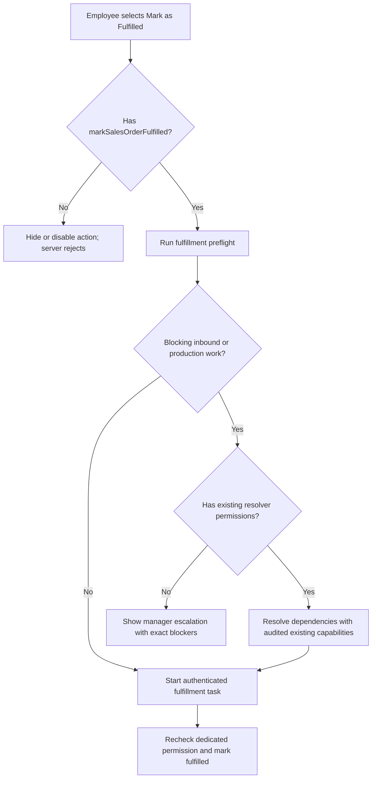

# Plan: Add A Dedicated Mark Sales Order Fulfilled Permission

## Type
Bug Fix

## Status
Done

## Created Date
2026-08-20

## Last Updated
2026-08-24

## 2026-08-24 Permission Naming Revision

The completed behavior now uses `viewMarkSalesOrderFulfilled`, persisted as
`view mark sales order fulfilled`, so `Mark Sales Order Fulfilled` follows the
normal View column in role and employee permission editors. Edit remains
unavailable and does not grant general order-edit authority. The prior
`markSalesOrderFulfilled` / `mark sales order fulfilled` form is retained only
as a compatibility alias; legacy grants migrate when the role or employee is
next saved.

## Intake
- Intake File: .brain/intake/2026-08-20-pablo-sales-po-fulfillment-and-status-feedback.md
- Intake Item: Donovan cannot mark an order fulfilled because the flow reports missing inventory permission.

## Goal Or Problem
Employees who are explicitly granted the dedicated `markSalesOrderFulfilled`
permission must be able to complete the Mark as Fulfilled workflow without
receiving an unrelated inventory-permission error. The permission must not
grant general order editing, inventory administration, inbound receiving,
production approval, or unrelated dispatch authority.

## Current Context
- ADR-025 requires every operational mutation to repeat a server-side capability check and derive the actor from the authenticated session.
- `.brain/api/permissions.md` currently defines inventory fulfillment writes for `editOrders`, `editPickup`, `editDelivery`, or `viewPacking`; none is an exact capability match for the Sales Orders Mark as Fulfilled action.
- `.brain/features/sales-order-status-actions.md` documents the Sales Orders Mark Fulfilled preflight, dependency resolver, monitored task, and permission-sensitive inventory work.
- `apps/dashboard/src/components/sales-menu.tsx` exposes the Fulfilled action, runs `inventories.salesInventoryMarkAsPreflight`, optionally resolves dependencies, then triggers `update-sales-control`.
- `apps/api/src/trpc/routers/inventories.route.ts` has several different permission sets: fulfillment operator, manual inventory fulfillment, availability override, and dependency resolution.
- `apps/dashboard/src/actions/trigger-task.ts` authenticates the actor for `update-sales-control` but does not visibly select an action-specific fulfillment capability before dispatch.
- `packages/utils/src/constants.ts` supports action-specific permissions through `EXTRA_PERMISSION_SCOPES`; role and per-employee grants are merged into the authenticated session.
- The exact endpoint returning Donovan's production error still needs to be captured, but his intended access can now be expressed directly instead of inferred from another operational role.

## Proposed Approach
Add `markSalesOrderFulfilled` as a first-class action permission with the admin
label `Mark Sales Order Fulfilled`. Grant it explicitly to the appropriate role
or employee, including Donovan once his intended responsibility is confirmed.
Use it consistently for Sales Orders action visibility, fulfillment preflight,
ordinary dependency continuation, task dispatch, and the terminal fulfillment
write. Keep higher-risk dependency resolution additive: receiving inbound
materials and approving production still require their existing permissions in
addition to `markSalesOrderFulfilled`. Existing broad permissions must not
implicitly grant the new action, except Super Admin through the established
implicit permission behavior.

## Visual Plan

## Implementation Steps
- Add `markSalesOrderFulfilled` to the canonical permission constants, generated session permission type, role permission options, and per-employee permission options using the existing idempotent permission-record synchronization path.
- Confirm the admin-facing label is `Mark Sales Order Fulfilled` and that Super Admin retains implicit access through `generatePermissions`.
- Record Donovan's role, merged user-specific permissions, office scope, and expected operational responsibility without exposing unrelated employee data; grant the dedicated permission to his role or employee record only after that confirmation.
- Reproduce Mark Fulfilled on the reported order or a safe equivalent and capture the exact UI error, tRPC procedure/action, task diagnostic, and whether inventory blockers were present.
- Build a permission matrix for direct fulfillment, ordinary automatic continuation, and fulfillment requiring manager-only inbound receipt or production approval.
- Gate the Fulfilled action in `sales-menu.tsx` with `markSalesOrderFulfilled`; do not apply this permission to Production completed or cancellation actions.
- Apply the dedicated check when `salesInventoryMarkAsPreflight` receives `action: "fulfilled"`, in ordinary fulfillment continuation mutations, and before `trigger-task` accepts `update-sales-control` with `markAsCompleted`.
- Recheck the authenticated actor's dedicated permission at the terminal task/domain boundary so direct task invocation cannot bypass the action permission.
- Keep manager-only dependency resolution strict where it performs inbound receipt, manual availability, or production approval; require both the dedicated fulfillment permission and the existing resolver capabilities, then return a precise escalation message when only the latter are missing.
- Ensure `editOrders`, `editPickup`, `editDelivery`, and `viewPacking` alone do not authorize Mark as Fulfilled. Do not change their authority for other existing inventory/dispatch operations.
- Add table-driven API and task tests for the dedicated grant, Super Admin, each former broad permission without the dedicated grant, no-permission denial, and additive resolver requirements before writes.
- Add dashboard tests showing the action and error states for allowed, blocked, and dependency-manager cases.
- Validate one authorized non-Super-Admin employee and one unauthorized employee in the authenticated runtime.

## Affected Files Or Areas
- `packages/utils/src/constants.ts`
- `packages/auth/src/utils.ts`
- `packages/auth/src/better-auth/www-session.ts`
- `apps/dashboard/src/actions/get-role-form.ts`
- `apps/api/src/db/queries/hrm.ts`
- `apps/dashboard/src/components/sales-menu.tsx`
- `apps/dashboard/src/actions/trigger-task.ts`
- `apps/dashboard/src/actions/production-submission-auth.test.ts`
- `apps/api/src/trpc/routers/inventories.route.ts`
- `apps/api/src/trpc/routers/sales.route.ts`
- `packages/jobs/src/tasks/sales/update-sales-control.ts`
- `packages/sales/src/sales-status-mark-as-resolution.ts`
- `packages/sales/src/manual-fulfill-sales-inventory-needs.ts`
- Employee role/user-specific permission configuration and session invalidation flow
- Task run diagnostics for `update-sales-control`

## Acceptance Criteria
- `Mark Sales Order Fulfilled` is available in role and per-employee permission management and hydrates as `can.markSalesOrderFulfilled` after session refresh.
- An employee with `markSalesOrderFulfilled` can run Mark as Fulfilled when the order has no dependencies requiring higher authority.
- An operator with `markSalesOrderFulfilled` who cannot receive inbound or approve production sees a precise dependency/manager escalation message instead of a generic inventory-permission failure.
- An employee without `markSalesOrderFulfilled` cannot see an enabled action and is rejected server-side before any task or domain write, even if they have `editOrders`, `editPickup`, `editDelivery`, or `viewPacking`.
- The task actor id/name and audit evidence come only from the authenticated session.
- No code path grants inventory configuration, inbound receiving, production approval, packing administration, or general order editing merely to solve fulfillment access.
- Donovan succeeds after the dedicated permission is granted and his session permission snapshot is refreshed.

## Test Plan
- Add table-driven permission tests covering `markSalesOrderFulfilled`, Super Admin, each former broad operational permission without the dedicated grant, additive resolver permissions, and no permission.
- Verify role-level and employee-specific grant hydration before and after session refresh.
- Run focused Sales status/preflight/manual-fulfillment and API router permission suites.
- Run the trigger-task authentication regression and focused job task tests.
- `bun --filter @gnd/sales typecheck`
- `bun --filter @gnd/api typecheck`
- Run focused Dashboard typecheck/Biome checks and `git diff --check`.
- Authenticated browser proof with one permitted non-Super-Admin account and one denied account; capture task diagnostics and final order/dispatch status.

## Brain Update Requirements
- Update `.brain/api/permissions.md`, `.brain/api/contracts.md`, `.brain/features/sales-order-status-actions.md`, `.brain/features/inventory-backed-sales-fulfillment.md`, `.brain/tasks/*`, and `.brain/progress.md`. Add an ADR only if the accepted capability boundary changes from ADR-025 rather than being aligned to it.

## Lower-Agent Readiness
- Implementation scope is clear: Yes
- File boundaries are clear: Yes
- Acceptance criteria are observable: Yes
- Required checks are listed: Yes
- Brain update requirements are listed: Yes
- Ready for handoff: Yes

## Completion Report Requirements
Lower agent must report:
- Changed files
- Checks run
- Brain docs updated
- Unresolved issues
- Any skipped acceptance criteria

## Risks / Edge Cases
- Automatically granting the new permission to roles that currently have `editOrders`, `editPickup`, `editDelivery`, or `viewPacking` would preserve the over-broad coupling; grants must be explicit.
- Some fulfillment cases legitimately require stronger inbound and production permissions; direct fulfillment and dependency resolution must remain distinct.
- User-specific permission changes may not appear until cached sessions are invalidated or refreshed.
- A UI-only fix would leave task and API boundaries inconsistent and insecure.
- Batch Mark Fulfilled must apply the same matrix to every selected order and report partial failure safely.
- The shared preflight and continuation procedures also handle Production completed; action-aware checks must not accidentally require the fulfillment permission for production-only work.

## Open Questions
- Should `markSalesOrderFulfilled` be granted to Donovan individually or to his full operational role? Confirm during rollout; do not automatically grant it to every existing order, pickup, delivery, or packing user.

## Implementation Result
- Revised on 2026-08-24 to register, persist, hydrate, display, and enforce the
  canonical view-prefixed fulfillment capability across role/employee editors,
  Dashboard entry points, API preflight/dispatch, task start, and terminal job
  authorization. Legacy direct grants remain compatible during migration.
- Registered and hydrated `markSalesOrderFulfilled` for role and
  employee-specific grants with implicit Super Admin access.
- Enforced the grant in both Dashboard fulfillment entry points, action-aware
  inventory routes, the fulfillment-only dispatch resolver, protected task
  dispatch, and the terminal background job.
- Added a serializable, narrow dispatch resolver so the dedicated permission
  does not inherit general dispatch creation authority.
- Focused validation passed 48 tests / 357 assertions and scoped Biome checks.
  Changed-file compiler filtering reported no diagnostics. Broad package
  typechecks retain unrelated existing baselines in special-order enrollment,
  email JSX runtime resolution, test matcher typing, and Dashboard sources.
- Authenticated browser proof and the Donovan role/employee grant remain
  rollout steps because no target grant was selected and no deployment was
  requested.

## Linked Task
- Task Title: Add A Dedicated Mark Sales Order Fulfilled Permission
- Task File: .brain/tasks/done.md
