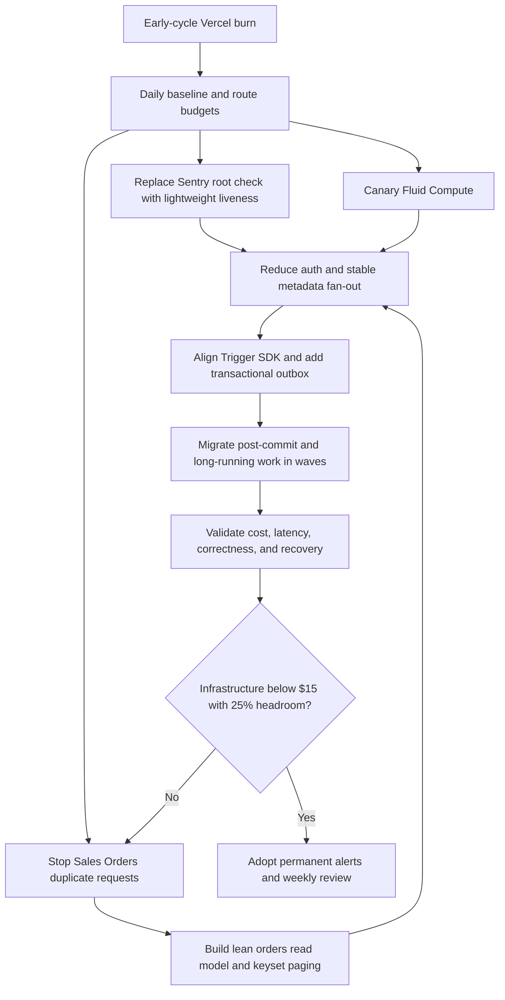

# Plan: Vercel Function Cost Reduction And Trigger Offload

## Type

Feature

## Status

In Progress

## Created Date

2026-08-21

## Last Updated

2026-08-21

## Goal Or Problem

Reduce GND's Vercel infrastructure consumption to a predictable level with at
least 25% monthly credit headroom, remove avoidable function fan-out and
timeouts, and move suitable post-transaction or long-running work to
Trigger.dev without weakening consistency, authorization, or user feedback.

The August 19 through September 19, 2026 billing cycle had already consumed
$3.95 of the $20 infrastructure credit with approximately 29 days remaining.
A simple linear projection from this early-cycle sample is approximately $61
of infrastructure usage, or about $41 of overage after the included credit.
With the current $50 of fixed subscriptions, the projected total is roughly
$91. This projection is anomaly-sensitive and is a warning signal rather than
a forecast commitment.

The repeatable CLI snapshot captured on 2026-08-21 at 07:36 UTC reproduced the
$3.95 infrastructure total. Using the requested two-day historical window, it
reported $1.98/day and a $61.23 simple projection. The estimate is retained as
an anomaly-sensitive warning; the daily monitor and comparable 24-hour and
seven-day route windows must replace it with a stable estimate.

## Current Context

- The Vercel team is `GND SERVER` on Pro under scope `gndprodesk`.
- Current infrastructure usage is $3.95 / $20.00:
  - Function Duration: 16.46 GB-hours / $2.96.
  - Function Invocations: 113.95K / $0.07.
  - Fast Origin Transfer: 479 MB / $0.03.
  - Blob Storage Size: 3 GB / $0.06.
  - Speed Insights Data Points: 2.12K / $0.65.
  - Web Analytics Events: 1.11K / $0.03.
  - Build CPU Minutes: 6 hours / $0.14.
- Fixed subscriptions are separate from infrastructure credit: Pro $20,
  additional team seat $20, and Speed Insights $10.
- Function Duration is the dominant variable charge. Successful functions use
  about 15.3 GB-hours / 92.6%; timed-out functions use about 1.2 GB-hours /
  7.4%.
- The dashboard project `gndprodesk` accounts for approximately 16.4 GB-hours /
  99.9%; `prodesk-api` accounts for about 0.02 GB-hours / 0.1%.
- Dashboard Fluid Compute was disabled at investigation time. The isolated
  preview `dpl_4Zfyx9YpMSUhLEudTMZV9sqqErje` subsequently accepted deployment-
  owned `fluid: true`. Its functions remained on the existing 1 GB project
  override in `iad1`; Fluid did not silently promote them to 2 GB. Production
  remains unchanged until the canary is measured and explicitly promoted.
- `GET /api/health/live` is implemented without auth, database, downstream
  fetch, redirect, or body. The protected preview returned 204 with
  `Cache-Control: no-store` and `x-matched-path: /api/health/live`.
- Vercel's native 75%-of-included-credit notification is already enabled for
  web and email. A daily Codex monitor plus the repository cost-snapshot command
  cover the finer $8/$12/$16/$18 and daily-burn guardrails.
- Recent 12-hour dashboard observability showed approximately 14K invocations:
  - `/api/trpc/[...trpc]`: 2.7K invocations, 1.34 GB-hours, 0.8% errors.
  - `/api/auth-session`: 7.5K invocations, 0.19 GB-hours.
  - `/sales-book/orders`: 393 invocations, 0.089 GB-hours, 0.3% errors.
  - `/login/v2`: 1.6K invocations, 0.073 GB-hours.
  - `/sales-form/edit-order/[slug]`: 1.8K invocations, 0.069 GB-hours.
  - `/sales-rep`: 344 invocations, 0.049 GB-hours.
  - `/api/download/customer-statement`: 3 invocations, 0.013 GB-hours, 100%
    errors.
- A Sentry uptime monitor hits `/` about every 30 seconds. Each check fans out
  through `/`, an internal `/api/auth-session`, a redirect to `/login/v2`, and
  a second `/api/auth-session`: four function invocations per liveness check.
- `sales.getOrders` was called 435 times in 12 hours, including bursts of
  dozens of calls within seconds. A sampled successful call used 4.92 seconds
  and 662 MB; a sampled cursor-40 call used 15.09 seconds and 617 MB and was
  logged as a Vercel timeout. The response appeared to finish around 13.3
  seconds, but the function remained active until the 15-second limit.
- The sales order page server-prefetches the list and summary, while its client
  table also uses an infinite query. The infinite-scroll hook checks for more
  data immediately on effect runs and relies on asynchronously updated React
  fetch state, making eager or duplicate cursor requests plausible.
- `getOrders` loads a broad sales graph and then performs five parallel
  enrichment families plus additional control enrichment. Pagination is
  offset-like (`skip = Number(cursor)`), and summaries execute five count or
  aggregate queries.
- Other frequently repeated tRPC work includes `pageTabs.defaults`,
  `pageTabs.list`, `sales.getStepComponents`, `sales.quotes`, notification
  batches, and `sales.getSaleOverview`.
- The dashboard proxy performs a same-origin `/api/auth-session` fetch for
  every matched page, including public root and login flows. The client session
  provider may fetch the same endpoint again when it is not hydrated.
- Existing Trigger.dev infrastructure is mature and already handles inventory,
  sales, document, email, and reconciliation tasks. There are approximately 30
  `tasks.trigger` call sites outside the jobs package, but the jobs package is
  on Trigger SDK/build/core 4.5.9 while several callers remain on 3.3.17.
- Current `waitUntil` use is limited to sales copy-side inventory/activity work
  and OpenPanel analytics. Several direct email, PDF, reconciliation, and AI
  workflows remain candidates for durable execution.
- ADR-042 already removed blanket protected-sidebar prefetch after the prior
  cycle showed it was amplifying protected page and auth invocations. This plan
  retains that boundary and measures its lasting effect.
- Reference behavior and pricing should be revalidated at implementation time:
  [Vercel Functions usage and pricing](https://vercel.com/docs/functions/usage-and-pricing),
  [Vercel Fluid Compute](https://vercel.com/docs/fluid-compute),
  [Trigger.dev idempotency](https://trigger.dev/docs/idempotency), and
  [Trigger.dev Realtime hooks](https://trigger.dev/docs/realtime/react-hooks/overview).

## Proposed Approach

Use a measured, staged program rather than one large infrastructure change:

1. Establish an auditable daily baseline and explicit cost, timeout, latency,
   and duplicate-request budgets.
2. Remove the proven Sentry uptime fan-out using a truly lightweight liveness
   endpoint and a separate, lower-frequency readiness check.
3. Canary Fluid Compute independently, keeping CPU, region, and query behavior
   stable so its effect can be attributed and rolled back.
4. Eliminate the Sales Orders request storm and reduce the cost of each
   remaining list request with a purpose-built read model and keyset paging.
5. Reduce redundant auth-session and stable-metadata work while preserving
   role changes and authorization semantics.
6. Move only post-commit, retryable, long-running, or artifact-producing work
   to Trigger.dev through an outbox/idempotency pattern. Keep interactive reads
   and authoritative writes synchronous.
7. Align Trigger SDK versions before expanding its workload, then migrate in
   small waves with durable run state and Realtime-driven progress UX.
8. Audit compute/data locality and make a separately measured region decision.
9. Add permanent cost controls and subscription reviews so regressions are
   detected before the end of a billing cycle.

## Visual Plan

## Implementation Steps

1. **Cost snapshot and 12-hour baseline implemented; longer windows continue.**
   Capture the baseline and introduce cost guardrails.
   - Record daily Vercel infrastructure credit, Function Duration, invocation,
     timeout, error, memory, and top-route totals for at least 24 hours before
     each material production change.
   - Preserve per-project attribution so the dashboard cannot be confused with
     the standalone API.
   - Set the operating target to no more than $15 of infrastructure per cycle,
     leaving 25% of the $20 credit as headroom. Use a steady-state daily burn
     target of at most $0.50.
   - Alert at $8, $12, $16, and $18 of infrastructure-credit consumption.
   - Target route timeout rate below 0.5% and create route-level budgets for
     tRPC, auth-session, Sales Orders, document generation, and public shells.
   - Compare 12-hour, 24-hour, and seven-day windows; do not extrapolate a
     deployment or traffic anomaly as normal monthly usage.

2. **Endpoint implemented and preview-verified; Sentry cutover pending.** Remove
   Sentry liveness fan-out.
   - Add dashboard `GET /api/health/live` that performs no authentication,
     database access, external request, redirect, or same-origin fetch.
   - Return 200 or 204 with `Cache-Control: no-store` and a minimal payload.
   - Point Sentry uptime monitoring at this endpoint and reduce the interval
     from 30 seconds to one to five minutes unless the business explicitly
     requires 30-second detection.
   - Use the standalone API's database-backed `/health` only as a lower-
     frequency readiness check, approximately every five minutes.
   - Validate from Vercel logs that one liveness check causes one invocation
     and that Sentry no longer reaches `/`, `/login/v2`, or
     `/api/auth-session`.

3. **Preview canary deployed; measurement and production promotion pending.**
   Run a controlled Fluid Compute canary.
   - Use a preview or controlled production deployment and change only Fluid
     Compute first; do not combine Fluid, CPU size, and region changes.
   - Confirm the effective function size and pricing before rollout, including
     whether the Basic configuration is replaced by a 2 GB Standard shape.
   - Replay Sales Orders initial load and pagination, Sales Overview, quote and
     order editing, customer statement generation, and concurrent auth flows.
   - Watch active CPU, provisioned memory, wall time, cold starts, Prisma
     connections, timeouts, and cost for 12 to 24 hours against the baseline.
   - Keep a documented one-setting rollback. Retain Fluid only if cost and
     reliability improve without connection-pool or shared-state regressions.

4. Stop the Sales Orders request storm before optimizing the database query.
   - Add an in-flight request lock and remember the last requested cursor so a
     cursor cannot be fetched twice concurrently.
   - Replace effect-driven eager loading with a stable intersection sentinel.
     Do not recursively fill the viewport with successive pages on first
     render.
   - Normalize and memoize filter/sort inputs, make server-prefetch and client
     query keys identical, and cancel superseded filter requests.
   - Add regression coverage proving initial render performs one list request
     plus one summary request and each subsequent cursor is requested once.
   - Target at least a 60% reduction in tRPC Function Duration attributable to
     Sales Orders, list p75 below 750 ms, p95 below two seconds, and no timeouts.

5. Build a lean Sales Orders read model.
   - Replace the broad `SalesListInclude` path for the table with a table-
     specific `select` containing only displayed and filtering fields.
   - Remove deep line-item/component and repeated enrichment from interactive
     page reads. Materialize or incrementally maintain lightweight lifecycle,
     inventory, inbound, note-count, payment, and special-order projections.
   - Update projections transactionally when possible. Otherwise enqueue an
     idempotent Trigger task through an outbox and expose last-updated state.
   - Replace numeric offset-like cursors with keyset pagination using
     `(createdAt, id)` or the active stable sort plus `id` as a tiebreaker.
   - Consolidate summary queries or cache their stable result for 30 to 60
     seconds with correct invalidation after writes.
   - Capture representative production-safe query plans before adding indexes;
     add only indexes justified by real filters and ordering.
   - Keep `sales.getOrders` as an interactive request. Do not move this read to
     Trigger.dev because queue latency and eventual results would degrade the
     page rather than solve the query cost.

6. Remove redundant auth and stable metadata work.
   - Add a no-cookie public fast path so `/` and `/login/v2` do not call the
     same-origin auth endpoint when no session can exist.
   - Investigate direct server-side session verification in the proxy boundary
     instead of a second HTTP invocation, while preserving the current role-
     change invalidation behavior.
   - Hydrate the client session provider from the server whenever possible so
     it does not immediately refetch `/api/auth-session`.
   - Review blanket `force-dynamic` usage only for public, login, and redirect
     shells; do not cache user-specific protected content across users.
   - Cache or consolidate stable `pageTabs.defaults`, `pageTabs.list`, and
     `sales.getStepComponents` responses with permission-safe keys.

7. Establish the Trigger.dev migration contract.
   - Align all Trigger SDK, build, and core packages to one compatible version
     before expanding workload; document any v3-to-v4 behavior changes.
   - Keep authoritative database transactions synchronous. In the same
     transaction, write an outbox record describing post-commit work.
   - Dispatch entity IDs and a revision, not large or stale payloads. The task
     must reload canonical data, verify the revision, and be safe to retry.
   - Use explicit globally scoped idempotency keys when cross-run deduplication
     is required; do not depend on a raw-string default whose scope changed in
     Trigger.dev v4.3.1.
   - Persist durable run status, artifact location, attempts, and final error so
     support staff and users can distinguish queued, running, succeeded, and
     failed work.
   - Use existing Trigger Realtime hooks for user-visible progress instead of
     polling a Vercel function.

8. Migrate suitable work in waves.
   - Wave A: replace current `waitUntil` work in sales actions with durable
     inventory synchronization and activity-note tasks. Evaluate client-side
     or batched delivery for non-critical OpenPanel analytics.
   - Wave B: move direct post-transaction email and notification flows for
     special orders, checkout, dispatch, dealer, and storefront actions.
   - Wave C: move customer-statement generation, large sales PDF plus Blob
     generation, AI inbound receiving, bulk enrichment, and reconciliation.
   - For each workflow, define enqueue failure behavior, retry limits, timeout,
     cancellation, idempotency, dead-letter/support recovery, retention, and
     user-visible state before cutover.
   - Keep authentication, authorization, interactive reads, the core sale-save
     transaction, and payment-provider confirmation synchronous.

9. Audit runtime and data locality as a separate experiment.
   - Determine the production database and primary storage regions.
   - Keep dashboard `iad1` when the database is in US East; test `bom1` only if
     measured database round-trip time and overall duration improve.
   - Choose compute location based on database/storage locality, not employee
     location, and avoid changing region during the Fluid canary.

10. Add permanent operational controls.
    - Capture a daily usage snapshot and a weekly top-route leaderboard by
      invocations, Function Duration, error rate, timeout rate, and memory.
    - Alert when daily infrastructure burn exceeds $0.75, one route grows above
      10% of total duration, timeout rate exceeds 0.5%, duplicate cursor
      concurrency is detected, or memory exceeds 80% of the configured limit.
    - Add architecture review triggers for new `waitUntil` work, direct email
      or PDF generation in requests, unbounded list reads, polling, and deep
      relational includes on interactive routes.
    - Review the separate $10 Speed Insights license and $20 additional seat as
      subscription decisions; code optimization will not remove those charges.
    - Revisit ADR-042 and this plan after one full billing cycle with measured
      savings, not projected savings.

## Affected Files Or Areas

- `.brain/decisions/ADR-042-protected-sidebar-prefetch-cost-boundary.md`
- `apps/dashboard/src/app/api/health/live/route.ts` (new)
- `apps/dashboard/src/proxy.ts`
- `apps/dashboard/src/app/api/auth-session/route.ts`
- `apps/dashboard/src/lib/auth/client.tsx` and related server auth utilities
- `apps/dashboard/src/hooks/use-infinite-scroll.ts`
- `apps/dashboard/src/app/(sidebar)/(sales)/sales-book/orders/page.tsx`
- `apps/dashboard/src/components/tables-2/sales-orders/data-table.tsx`
- `apps/api/src/db/queries/sales-orders-v2.ts`
- `apps/api/src/db/queries/sales-actions.ts`
- `packages/events/src/server.ts`
- `packages/jobs/src/tasks/**`
- `packages/jobs/trigger.config.ts`
- Trigger caller package manifests and lockfile
- `apps/dashboard/vercel.json` and `apps/api/vercel.json`
- Vercel dashboard project settings and usage observability
- Sentry uptime-monitor configuration
- Trigger.dev environment, task, and Realtime configuration
- Brain API, feature, architecture, ADR, task, and progress documentation as
  implementation changes land

## Acceptance Criteria

- Vercel infrastructure usage stabilizes at or below $15 per full billing cycle
  under comparable traffic, leaving at least 25% of the $20 credit unused.
- Steady-state infrastructure burn is at most $0.50 per day, with alerts active
  before consumption reaches $8, $12, $16, and $18.
- Sentry liveness produces exactly one lightweight function invocation per
  check and does not invoke root, login, auth-session, or database work.
- Dashboard timeout rate is below 0.5%, and no Sales Orders list request reaches
  the Vercel timeout.
- Sales Orders initial load issues one list and one summary request; each next
  cursor is fetched at most once concurrently.
- `sales.getOrders` p75 is below 750 ms and p95 below two seconds for
  representative production filters, with at least 60% lower associated tRPC
  Function Duration than the captured baseline.
- Fluid Compute has an isolated 12-to-24-hour canary result and a tested
  rollback; it is retained only with measured benefit.
- Every migrated Trigger workflow has an outbox or equivalent durable enqueue,
  explicit idempotency scope, canonical data reload, retry/recovery policy,
  durable run state, and user-visible status where applicable.
- No authoritative sale, payment, inventory, auth, or permission decision is
  made eventually consistent by the migration.
- Trigger package versions are aligned before new migration waves ship.
- Region selection is backed by measured database/storage locality and is not
  bundled with another runtime experiment.
- Fixed subscription decisions for Speed Insights and the additional seat are
  documented separately from application infrastructure savings.

## Sales Order List Read Model Migration Contract (2026-08-21)

- Source authority: `SalesOrders` plus canonical customer/address, control,
  payment-review, note, inventory/inbound, and Special Order relations.
- Projection: one versioned `SalesOrderListProjection` row per sales order.
  Indexed scalar columns support future projection-only filtering; `payload`
  stores the compact final list row, not a commercial snapshot.
- Worker messages contain only `{ salesOrderId, sourceUpdatedAt }`. Trigger
  reloads canonical state and checks the revision both before enrichment and
  before upsert. Stale work is skipped safely.
- Refresh entry points: bounded Trigger backfill and read-miss/sampled-shadow warming.
  The backfill is cursor-bounded and reports `nextCursorId`; it does not recurse
  indefinitely.
- Read modes: `off` (default), `shadow`, and `read`. Shadow comparisons are
  sampled and log ids only. Read mode falls back on missing, stale, wrong-version,
  unsupported, or failed projection reads.
- Freshness: the default five-minute maximum age bounds relation-only changes
  that do not advance `SalesOrders.updatedAt`. Expired rows use legacy output and
  enqueue a canonical rebuild.
- Pagination: created-date sorting uses `(createdAt, id)` keysets. The opaque
  cursor retains the equivalent numeric offset for rollback. Other sorts remain
  offset-based until individual keyset parity is implemented.
- Unsupported scope: `paymentReview=needs_review` remains legacy because its
  distinct latest-payment grouping/order needs a separate projection contract.
- Rollout gates: generate/review an additive migration; align/verify Trigger
  SDK compatibility and add an explicitly global enqueue idempotency key;
  deploy tasks; backfill; run shadow parity; then enable a
  small read cohort and compare p75/p95, timeout, Function Duration, and mismatch
  telemetry. `off` is the one-setting rollback.
- Current migration status: schema code is present, but migration generation is
  intentionally deferred. The dirty worktree already contains an unrelated
  Square-refund Prisma schema and migration, so generating now could couple two
  independently reviewed database changes.
- Current enqueue status: worker execution is revision-safe and repeatable, but
  cross-request Trigger run deduplication is intentionally not enabled while the
  API and jobs packages are on different SDK generations. Default-off rollout
  prevents activation before that gate is closed.

## Test Plan

- Before/after Vercel comparison over equivalent 12-hour, 24-hour, and seven-
  day windows for cost, duration, invocations, errors, timeouts, memory, and top
  routes.
- Sentry monitor test proving `/api/health/live` returns 200/204 without auth,
  cookies, database access, redirects, or downstream fetches; confirm one log
  entry per scheduled check.
- Unit and integration tests for infinite-scroll cursor locking, filter changes,
  request cancellation, query-key equality, end-of-list behavior, and no eager
  viewport waterfall.
- Sales Orders parity tests across permissions, tabs, status filters, search,
  sorting, lifecycle flags, inventory state, payment state, special orders,
  empty results, and concurrent record updates.
- Database query-plan captures for representative high-volume filters before
  and after the read-model work, plus pagination stability under inserts.
- Auth tests for anonymous root/login, authenticated navigation, expired
  sessions, role changes, logout, multi-tab refresh, and protected redirects.
- Fluid canary load tests for Sales Orders, Sales Overview, edit flows,
  statements, and concurrent auth, with Prisma connection monitoring and a
  rollback rehearsal.
- Trigger contract tests for duplicate delivery, retry after partial failure,
  stale revision, enqueue failure, cancellation, timeout, dead-letter recovery,
  artifact persistence, and Realtime reconnect.
- End-to-end tests proving synchronous transactions commit exactly once and
  eventually produce the expected inventory, activity, email, PDF, statement,
  AI, or reconciliation outcome.
- Post-deploy smoke tests and daily usage review for at least seven days, then a
  full-cycle comparison before declaring the cost goal complete.

## Risks / Edge Cases

- Early-cycle linear projection may overstate or understate the final bill if
  the sample includes a release, monitor storm, or unusual traffic.
- Fluid Compute can reduce billed CPU wait time but increase provisioned-memory
  exposure or surface unsafe shared state and Prisma connection behavior.
- A lighter orders projection can drift from source-of-truth tables unless
  updates are transactional, replayable, observable, and periodically checked.
- Keyset pagination must preserve every supported sort; otherwise inserts or
  equal timestamps can create duplicates or omissions.
- Removing eager pagination may change the perceived table experience on tall
  screens and needs an intentional load-more threshold.
- Auth fast paths must never bypass protected authorization or allow stale role
  permissions. Public caching must not leak user-specific content.
- Trigger.dev introduces eventual completion. Without an outbox, a database
  commit can succeed while task dispatch is lost; without idempotency, retries
  can duplicate notifications, documents, or inventory effects.
- Trigger SDK version skew can change idempotency, runtime, or Realtime behavior
  during migration.
- Moving interactive reads to Trigger would add queue latency and polling cost;
  the Trigger boundary must remain post-commit/long-running work.
- Liveness and readiness have different purposes. A database-free liveness
  endpoint cannot prove the database is healthy, while a frequent readiness
  check can recreate the original cost problem.
- A region move can reduce database latency or make it worse and can interact
  with storage, third-party services, and data-residency expectations.
- The $10 Speed Insights license and $20 additional seat remain even if all
  infrastructure optimization targets are achieved.

## Open Questions

- Is a 30-second Sentry detection interval contractually or operationally
  required, or can liveness move to one to five minutes?
- What region hosts the production database and primary Blob/storage data?
- Is the separate $10 Speed Insights subscription still required after the
  current diagnostic period?
- Is the additional $20 team seat still required?
- Is an asynchronous queued/running/download-ready experience acceptable for
  customer statements and large sales documents?
- Should the long-term monthly infrastructure target remain $15, or should GND
  reserve more than 25% of the included credit?
- Which Sales Orders sort modes must support stable keyset pagination on day
  one, and which can be deliberately deferred?

## Linked Task

- `.brain/tasks/in-progress.md` — `Vercel Function Cost Reduction And Trigger Offload`
