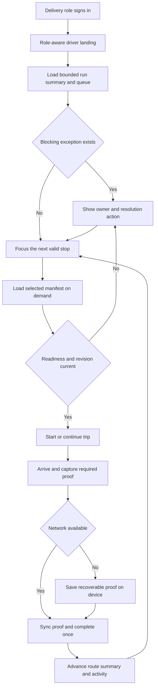

# Driver Dashboard Command Center

## Type

Feature plan.

## Status

Proposed. Design direction selection and implementation have not started.

## Created

2026-08-23.

## Last Updated

2026-08-23.

## Goal / Problem

Replace the current driver-facing dispatch table with a responsive command
center that helps an assigned driver understand the run, identify the next safe
action, recover from weak connectivity, and complete every stop with valid
proof. The dashboard must borrow the calm summary hierarchy of Sales Finance
and the focused attention, quick-action, and activity patterns of the Sales Rep
dashboard without becoming an administrative analytics surface.

The current web route at `/sales-book/dispatch-task` is optimized as a generic
pending-task table. It does not provide a driver-first route summary, readiness
gates, next-stop focus, proof recovery, or a coherent mobile interaction model.
The existing mobile driver work already defines authoritative queue, manifest,
readiness, and lifecycle contracts. The redesign must reuse those contracts
rather than creating a second fulfillment truth.

## Current Context

- Sales Finance contributes the metric strip, exception-first hierarchy, calm
  operational density, and inspectable supporting detail.
- Sales Rep Dashboard contributes the command-center header, focused attention
  panel, quick actions, and recent activity pattern.
- The existing mobile driver surface contributes authoritative due buckets,
  next-stop behavior, typed manifest details, readiness gates, weak-network
  recovery, and one primary action at a time.
- The development-only fulfillment prototype already exposes a responsive
  driver panel at `/sales-book/fulfillment/prototype?surface=driver` and should
  remain the safe review surface until a design direction is approved.
- Existing protected procedures include `dispatch.driverWorkQueue`,
  `dispatch.driverWorkQueueSummary`, and `dispatch.driverManifest`. The web
  dashboard should consume the same server-owned projection used by mobile.
- The mobile driver application remains the canonical field execution surface
  until the responsive web dashboard passes the pilot and cutover gates in this
  plan.

## Proposed Approach

Use one product contract across three selectable visual directions:

1. **Route Command**: a light split command center that balances Finance
   summary density, Sales Rep attention hierarchy, and a prominent next stop.
2. **Dispatch Ledger**: a denser industrial ledger for drivers who scan exact
   quantities, readiness, and delivery windows like a load sheet.
3. **Field Focus**: a dark, phone-first cockpit that keeps one obvious action,
   weak-signal state, and compact route pulse in view.

The chosen direction may remix individual elements, but implementation must
preserve the shared behavioral contract below.

### Shared experience contract

- The first screen answers five questions without opening a detail view: who is
  assigned, how many stops remain, what is next, what blocks departure or
  completion, and whether changes are safely synced.
- The next valid action is visually dominant. Secondary actions cannot compete
  with it.
- Summary counts and route buckets come from the server-owned projection. The
  browser does not derive authoritative readiness or completion state from
  paginated rows.
- Manifest detail loads on demand so the route shell is not blocked by every
  stop's item detail.
- Desktop, tablet, and mobile use the same information and action contracts.
  Layout changes, but status meaning and lifecycle rules do not.
- Every lifecycle mutation rechecks assignment, manifest revision, readiness,
  and role permissions on the server.
- Proof capture remains recoverable when the network drops. The interface must
  distinguish `saved on device`, `syncing`, `synced`, `conflict`, and `retry
  required` rather than presenting a generic success state.
- A driver can request help with the current stop context attached. Help never
  silently bypasses packing, inventory, destination, assignment, or proof
  gates.

### Information architecture

1. **Driver shell**: profile, date or route selector, search where appropriate,
   route map link, and explicit sync state.
2. **Run summary**: assigned, ready, in progress, needs attention, completed,
   planned distance, and estimated finish where the projection supports them.
3. **Next stop command**: customer, order, window, distance, task type,
   readiness checks, primary action, call, map, and help.
4. **Route queue**: Today, All Stops, Exceptions, and Completed filters with
   stable stop order and current-position preservation.
5. **Needs attention**: only issues capable of blocking the run, with a clear
   owner and next resolution action.
6. **Route activity**: compact human-readable events for assignment, load,
   lifecycle, proof, retry, and dispatch assistance.
7. **Stop workspace**: drawer on larger screens and full-height sheet or route
   on phones, containing manifest, destination, proof requirements, notes, and
   lifecycle controls.

### Lifecycle contract

| Current state | Primary action | Required server gate | Result |
| --- | --- | --- | --- |
| Assigned or packing | Review readiness | Assigned-driver scope | Read-only gate detail |
| Ready to load | Verify vehicle load | Exact manifest revision and picked inventory | Load verified |
| Load verified | Start trip | Assignment, readiness, destination, and current revision | In transit |
| In transit | Arrive at stop | Active assigned trip | At stop |
| At stop | Capture proof | Required proof policy | Proof saved locally or synced |
| Proof ready | Complete delivery | Current revision, proof, and idempotent request id | Delivered once |
| Blocked | Request or review help | Authenticated driver and stop context | Dispatch-visible assistance case |

Blocked, stale, reassigned, weak-signal, and retry states are overlays on this
sequence. They must never be collapsed into a false ready or completed state.

## Visual Plan

## Implementation Steps

### 1. Select and lock the visual direction

1. Review Route Command, Dispatch Ledger, and Field Focus at mobile, tablet,
   and desktop widths with at least one active driver and one dispatcher.
2. Record the selected base direction and any approved remixed elements.
3. Freeze the shared information and lifecycle contract before component work.
4. Document typography, spacing, colors, density, shell navigation, drawer or
   sheet behavior, and mobile action placement as reusable tokens and patterns.
5. Keep prototypes non-production and use representative, non-sensitive sample
   data only.

### 2. Establish the role-aware route and shell

1. Decide the canonical post-pilot route, with `/driver` as the preferred short
   route unless the existing sidebar grouping requires a different stable path.
2. Keep the development prototype route available through design review.
3. Route authenticated Delivery users to the driver command center instead of
   the generic Dispatch Management table.
4. Preserve a clearly labeled administrative escape hatch only for roles that
   already have dispatch-management permission.
5. Define loading, empty, no-assignment, unauthorized, offline, and fatal-error
   shell states before connecting the full dashboard.

### 3. Define one shared driver projection

1. Reuse `driverWorkQueue`, `driverWorkQueueSummary`, and `driverManifest` as the
   source of truth. Extend them only when the selected UI needs a field that is
   genuinely server-owned.
2. Add or confirm stable fields for route order, current stop, planned distance,
   delivery window, readiness summary, exception ownership, proof policy,
   manifest revision, sync-relevant lifecycle revision, and activity labels.
3. Preserve existing overdue, today, tomorrow, upcoming, and unscheduled due
   semantics. The UI may focus Today but must not erase overdue work.
4. Return typed unavailable or ambiguous states for legacy items. Never infer
   inventory readiness from missing data.
5. Keep queue-summary requests bounded and load manifest item details only when
   the driver opens a stop.
6. Add contract tests before adding client-side rendering logic.

### 4. Build the dashboard read experience

1. Create a driver dashboard component boundary under the Dashboard app rather
   than embedding the system in the existing generic dispatch table.
2. Implement the shell header and explicit sync indicator.
3. Implement the summary strip with authoritative totals and clear period
   labels.
4. Implement the next-stop command card with readiness checks, call, map, help,
   and one primary action.
5. Implement route filters and preserve the selected stop and scroll position
   when changing filters or returning from detail.
6. Implement the needs-attention panel with issue owner, severity, consequence,
   and resolution action.
7. Implement route activity from server-recognized lifecycle events. Do not log
   customer-sensitive details in client telemetry.

### 5. Build the stop workspace

1. Use a right-side inspector or drawer on desktop and tablet, and a full-height
   sheet or dedicated view on mobile.
2. Show destination, customer contact, delivery window, current assignment,
   manifest revision, exact quantities, readiness, proof requirements, and
   driver-visible notes.
3. Separate summary fields from manifest detail so a long order remains
   scannable.
4. Mark stale data visibly and require refresh before lifecycle actions.
5. Keep call and map deep links explicit and provide a copyable address when a
   mapping application is unavailable.

### 6. Connect guarded lifecycle actions

1. Add load verification, start trip, arrive, proof save, proof retry, and
   complete-delivery actions in lifecycle order.
2. Recheck assigned-driver scope, current dispatch state, exact manifest
   revision, packing or inventory readiness, and proof policy on every write.
3. Give each completion request a stable idempotency key so retries cannot
   consume inventory or complete a delivery twice.
4. Return typed stale-revision, reassigned, blocked, proof-invalid, and already-
   completed outcomes. Map each outcome to a recovery action.
5. Keep manager overrides on manager-authorized surfaces. The driver interface
   can request help but cannot grant its own override.
6. Refresh only the affected stop, summary, and activity data after a successful
   action instead of invalidating unrelated dashboard queries.

### 7. Add weak-network and proof recovery

1. Cache the active route shell and currently opened manifest for temporary
   field use without representing cached data as current server truth.
2. Persist unsynced proof drafts in browser storage suitable for structured
   blobs and metadata. Confirm the exact storage implementation during the
   technical spike.
3. Encrypt or minimize sensitive proof metadata at rest where practical and
   clear it after confirmed sync according to the approved retention policy.
4. Show explicit saved-on-device, syncing, synced, conflict, and retry-required
   states.
5. Resume retries after reconnection and app restart without duplicate
   completion.
6. If the assignment or manifest changed while offline, stop automatic
   completion and guide the driver through a conflict review.
7. Provide a driver-visible way to retry or export diagnostic identifiers
   without exposing customer proof content in logs.

### 8. Make exceptions and help operational

1. Normalize packing shortage, inventory not ready, destination confirmation,
   delivery-window risk, reassignment, stale manifest, proof rejection, and sync
   failure into typed driver-visible exceptions.
2. Attach dispatch id, stop id, assignment revision, and current lifecycle state
   to help requests on the server.
3. Show who owns the next step: driver, warehouse, dispatch, manager, or system.
4. Notify or surface the issue through existing authenticated notification and
   dispatch channels instead of inventing a parallel messaging system.
5. Keep expired or resolved exceptions out of the attention count while
   retaining their activity history.

### 9. Harden accessibility, performance, security, and observability

1. Meet keyboard and screen-reader requirements for tabs, rows, drawers,
   sheets, status announcements, and proof controls.
2. Use at least 44 by 44 pixel touch targets for field actions and ensure status
   meaning is not color-only.
3. Verify no document-level horizontal overflow at 390, 768, and 1440 pixel
   widths. Internal route carousels or tables must have intentional contained
   scrolling.
4. Establish a performance baseline on representative driver hardware before
   setting the final target. The initial target is an interactive cached route
   shell within 1.5 seconds on pilot hardware, subject to measured revision.
5. Avoid route-wide blocking on manifest detail, maps, activity history, or
   proof thumbnails.
6. Record safe operational metrics for queue-load failures, stale revisions,
   action latency, offline saves, sync retries, proof rejection, and duplicate
   prevention. Do not record proof files, addresses, phone numbers, or customer
   notes in analytics.
7. Test assigned-driver, cross-driver, manager, expired-session, and forged-
   identifier boundaries.

### 10. Pilot, cut over, and retain rollback

1. Pilot with a small named set of drivers and dispatchers on reversible local
   or approved preview fixtures before live work.
2. Run shadow comparison against the current mobile queue and manifest for each
   pilot route.
3. Require successful start, arrival, proof, offline retry, duplicate retry,
   stale-revision, reassignment, packing shortage, and completion evidence.
4. Capture driver and dispatcher feedback after each pilot run and fix critical
   friction before expanding the cohort.
5. Change the Delivery-role landing only after the responsive web dashboard
   passes the evidence gates.
6. Keep the previous driver surface reachable behind a feature flag or explicit
   route during the stabilization window.
7. Roll back the landing and mutation controls, without changing canonical
   dispatch data, if error or proof-recovery thresholds regress.
8. Retire the old landing only after the stabilization window and documentation
   handoff are complete.

## Affected Files / Areas

### Existing reference and review surfaces

- `apps/dashboard/src/app/(sidebar)/(sales)/sales-book/fulfillment/prototype/page.tsx`
- `apps/dashboard/src/components/dispatch-admin/workflow-prototype/prototype-driver-panel.tsx`
- `apps/dashboard/src/app/(sidebar)/(sales)/sales-book/dispatch-task/page.tsx`
- `apps/dashboard/src/components/sales-finance/*`
- `apps/dashboard/src/components/sales-rep-dashboard/*`
- `apps/dashboard/src/components/sales-rep-summary-cards.tsx`

### Proposed Dashboard boundaries

- A new canonical driver route, with the exact route path decided in Step 2.
- A new `apps/dashboard/src/components/driver-dashboard/*` feature boundary for
  shell, summary, next-stop command, route queue, attention, activity, stop
  workspace, proof state, and shared view models.
- Existing role-aware navigation and authenticated landing logic.
- Existing query-event invalidation utilities, extended narrowly for affected
  driver queue, summary, manifest, and activity keys.

### Existing mobile, API, and domain truth

- `apps/mobile/src/app/(drivers)/dispatch/index.tsx`
- `apps/mobile/src/features/dispatch/components/*`
- `apps/mobile/src/features/dispatch/lib/driver-work-queue-model.ts`
- `apps/api/src/trpc/routers/dispatch.route.ts`
- `apps/api/src/db/queries/dispatch.ts`
- `packages/sales/src/dispatch-manifest/*`
- `packages/sales/src/sales-fulfillment-plan.ts`
- `packages/sales/src/sales-control/tasks.ts`

### Documentation

- `.brain/features/driver-platform-revival.md`
- `.brain/api/contracts.md` and `.brain/api/permissions.md` if contracts or
  authorization change during implementation.
- `.brain/database/*` only if durable offline-sync or lifecycle persistence
  requires schema changes.
- A new ADR if the canonical web route, offline proof architecture, or rollout
  boundary becomes a durable decision.

## Acceptance Criteria

- A Delivery-role user lands on the approved driver command center after the
  cutover flag is enabled and cannot see another driver's assigned route.
- The first screen shows authoritative summary totals, explicit sync state,
  the next stop, blocking attention, and one primary action.
- Queue totals remain correct when route rows are paginated or filtered.
- Overdue work is explicitly labeled and is not mixed silently into Today.
- Opening a stop loads the typed manifest on demand and preserves route position
  when closed.
- Readiness and manifest ambiguity remain visible. Missing data never appears as
  ready inventory.
- Start, arrive, proof, and completion actions enforce assignment, readiness,
  current revision, and proof requirements on the server.
- Duplicate completion attempts have one terminal effect and do not consume
  inventory twice.
- Proof saved during weak connectivity survives page reload or browser restart,
  reports its true sync state, and resumes safely after reconnection.
- Reassignment or manifest change during an offline interval stops automatic
  completion and presents a conflict recovery path.
- Help requests carry authenticated stop context and expose a clear owner.
- Keyboard, screen-reader, focus, reduced-motion, and 44-pixel touch-target
  checks pass for the complete route.
- The dashboard has no document-level horizontal overflow at 390, 768, or 1440
  pixels.
- No customer address, phone number, note, signature, or proof image is emitted
  to client analytics or diagnostic logs.
- Pilot evidence covers happy path, shortage, stale revision, reassignment,
  offline proof, retry, duplicate retry, and rollback.

## Test Plan

### Pure and package tests

- Queue bucket ordering, next-stop selection, summary totals, exception
  normalization, lifecycle action eligibility, sync-state transitions, and
  activity labeling.
- Manifest revision and legacy or inventory-backed ambiguity behavior.
- Idempotent completion and exact picked-allocation consumption.

### API and authorization tests

- Assigned driver can read and mutate only the assigned route.
- Cross-driver and forged identifiers are rejected.
- Managers retain only their existing authorized override abilities.
- Stale revision, reassignment, packing shortage, unavailable inventory,
  invalid proof, already completed, and expired-session outcomes are typed.
- Summary and queue contracts remain aligned across Dashboard and mobile.

### Component and browser tests

- Loading, empty, assigned, blocked, in-transit, offline, conflict, retry,
  completed, and fatal-error compositions.
- Primary action, filter, stop selection, drawer or sheet, call, map, help, and
  route-position preservation.
- Responsive visual checks at 390, 768, and 1440 pixels, plus representative
  small-height phones.
- Keyboard order, focus return, screen-reader labels, live announcements,
  contrast, reduced motion, and touch targets.
- Route shell performance and absence of unnecessary manifest waterfalls.

### Device and resilience tests

- Online to offline to online proof capture.
- Browser reload and restart with an unsynced proof draft.
- Duplicate tap, request timeout, server success with client timeout, and
  reconnect retry.
- Manifest change or reassignment while offline.
- Low storage, denied camera permission, unsupported file, and interrupted
  upload recovery.

### Pilot evidence

- One reversible assigned route from load verification through proof completion.
- One blocked packing or destination scenario.
- One weak-signal proof scenario.
- One duplicate completion retry proving a single terminal effect.
- One role-landing cutover and rollback rehearsal.

## Risks / Edge Cases

- Web and mobile surfaces can drift if either derives lifecycle truth locally.
  Mitigation: shared server projection, typed contracts, and cross-client tests.
- Weak-network proof storage introduces privacy and retention risk. Mitigation:
  minimize persisted metadata, clear confirmed drafts, and approve the storage
  architecture before implementation.
- A stale assignment can cause the wrong driver to act on a route. Mitigation:
  revision checks on every mutation and conflict handling after reconnection.
- Legacy and inventory-backed lines can coexist. Mitigation: preserve explicit
  typed ambiguity and never infer readiness from absent bindings.
- Dense desktop layouts can become unusable on phones. Mitigation: one shared
  information contract with mobile-specific sheet and contained-scroll
  behavior, verified at real viewport widths.
- A driver-first landing could hide administrative tools from mixed-role users.
  Mitigation: route by capability and retain an authorized, labeled admin link.
- Map deep links vary by device. Mitigation: provider-neutral address actions
  plus a copyable destination fallback.
- Pilot hardware and network conditions may invalidate the initial performance
  target. Mitigation: measure first and revise the numeric target transparently.

## Open Questions

- Which base direction should be selected: Route Command, Dispatch Ledger, or
  Field Focus, and which parts should be remixed?
- Should the canonical post-pilot route be `/driver`, or remain under the Sales
  Book hierarchy for navigation consistency?
- Should Field Focus dark mode be a default, an optional theme, or only a source
  of mobile interaction patterns?
- Do mixed-role Delivery users need an always-visible Dispatch Management link?
- Which map applications and deep-link priority should be supported?
- Which browser storage and retention policy should be approved for unsynced
  proof files?
- What measured pilot thresholds should gate cohort expansion and rollback?

## Linked Task

- Task Title: Driver Dashboard Command Center
- Task File: `.brain/tasks/roadmap.md`
