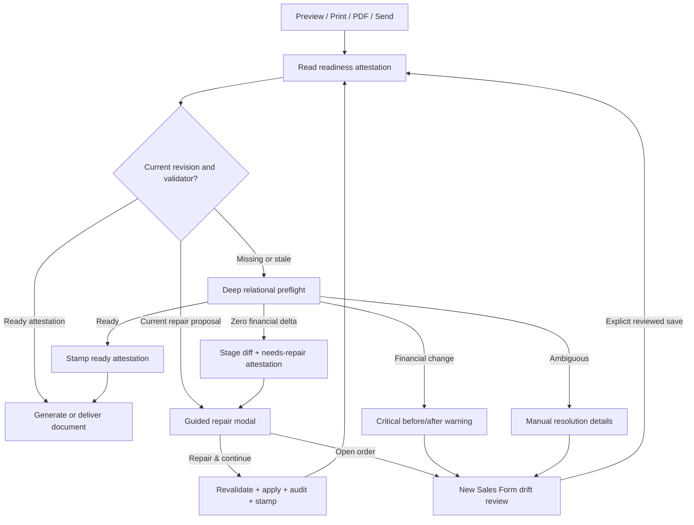

# Plan: Sales Document Preflight And Guided Repair

## Type
Feature

## Status
Proposed

## Created Date
2026-09-01

## Last Updated
2026-09-01

## Goal Or Problem
Every price-bearing Sales document action must detect relational inconsistencies before preview, print, PDF generation, or customer delivery. Repairable inconsistencies should produce a staged, reviewable proposal; zero-commercial-delta proposals may be applied with one confirmation and then resume the original action, while price-changing or ambiguous proposals must route through the new Sales Form with explicit before/after evidence.

## Current Context
- `apps/dashboard/src/modules/sales-print/application/sales-print-service.ts` is the shared client orchestration seam for preview, print, PDF download, and regeneration.
- `apps/api/src/utils/sales-document-access.ts` and `packages/sales/src/pdf-system` resolve and generate the canonical document data.
- Both simple and composed Sales email flows generate or attach Sales documents through notification/job infrastructure and must enforce the same server-side preflight.
- The relational Sales graph is the commercial source of truth under ADR-056. Historical rows can contain active HPT detail whose saved parent quantity/total summaries are missing, zero, duplicated, or contradictory.
- Financial invoice/quote composition currently fails closed on unreconciled door rows or form-step revisions and exposes only a generic client error.
- Order `08574PC` / database id `23288` is the motivating case: five HPT door groups have missing or zero parent summaries, but active line totals plus the remaining lines reproduce the persisted `$9,335.27` subtotal, `$653.47` tax, and `$9,988.74` grand total exactly. The existing relational-repair audit reports no duplicate-door or form-step conflict, so it is a candidate for a zero-commercial-delta repair.
- Existing `ResolutionCase`, `ResolutionFinding`, and `ResolutionAction` records can hold immutable proposals, findings, before/after evidence, actor identity, and lifecycle status without introducing a second repair-storage concept. Their suitability and indexes must be verified before implementation.

## Proposed Approach
Create one deep Sales document preflight and repair module inside `packages/sales` with a small server-owned interface:

1. `evaluateSalesDocumentRepair` loads the current relational graph, derives a candidate repair entirely in memory, and compares the saved and candidate financial states in integer cents.
2. `stageSalesDocumentRepair` persists an immutable, expiring proposal containing only a narrowly scoped repair diff, findings, before/after financial comparison, source fingerprints, and actor/intent metadata. It must not store or later overwrite the entire Sales document.
3. `applySalesDocumentRepair` re-reads and fingerprints the current order inside a serializable transaction. It applies the staged diff only when the baseline and regenerated proposal still match, writes Sales History and resolution evidence, invalidates document caches, and returns a continuation-safe result.
4. All preview, print, download, regenerate, and Sales email entrypoints call the same preflight before generating or delivering a price-bearing document. Jobs repeat the server-side check so client bypass cannot send an unreconciled document.
5. The client displays one shared guided-repair modal and preserves the initiating action in memory. A successful zero-delta repair resumes that exact action; cancellation does not generate, print, download, or send anything.
6. The new Sales Form performs the same comparison immediately after hydration and before user edits. It shows saved versus recalculated values without marking the form dirty or autosaving. Price-changing drift requires explicit review before save.

### Readiness Attestation Fast Path
- Add a server-owned Sales document readiness attestation so repeated preview, print, PDF, and delivery actions do not rerun the deep relational evaluator when the commercial graph is unchanged.
- The preferred gate is a monotonic `commercialRevision` paired with a `validatedCommercialRevision`, `validatorVersion`, status, and canonical digest. Store detailed evidence in `SalesOrders.meta.salesDocumentReadiness`; use dedicated scalar columns for the revision/version gate if the mutation-path audit confirms that JSON-only updates would be too easy to clobber or bypass.
- A no-schema fallback may keep both revision and attestation under server-owned `SalesOrders.meta` keys, but every commercial writer must use one shared helper that increments the revision and clears or replaces readiness in the same transaction.
- The attestation is a server-generated SHA-256 canonical digest, not a client-provided flag. Its safety comes from complete mutation invalidation plus validator-version matching; cryptographic signing does not replace those requirements.
- The cheap gate loads only the order id, commercial revision, attestation status/version/revision, and current proposal reference. This remains one small database read; a trustworthy zero-database-read decision is not possible unless every mutation also maintains an external cache with reliable invalidation.
- Fast-path outcomes:
  - matching `ready` attestation -> skip deep reconciliation and continue;
  - matching `needs_repair` attestation with a current staged proposal -> reuse the proposal/modal without recomputing;
  - missing, stale, unknown-version, or mismatched attestation -> run the deep evaluator once;
  - changed commercial revision -> invalidate any prior proposal and evaluate again.
- Canonical new-order/new-quote save computes and stamps readiness from the already normalized transactional save data, avoiding a second post-save graph read. A successful zero-delta repair or reviewed Sales Form save stamps the new revision in the same transaction.
- Relevant legacy/direct writers must increment or invalidate the commercial revision. Presentation-only changes such as a P.O. or address may invalidate document cache freshness without forcing a full commercial reconciliation; the implementation must classify mutation types explicitly.
- Payment/refund changes must refresh document output, but they should not automatically invalidate structural line readiness. The fast gate keeps commercial readiness separate from ordinary document-cache freshness and verifies any cheap financial projection needed by the active intent.
- Bump `validatorVersion` whenever reconciliation rules or canonical costing semantics change. Older attestations then miss the gate and receive one new evaluation; they must never be accepted under newer logic.
- Batch actions fetch readiness gates for all selected orders in one bounded query. Concurrent misses for the same revision are deduplicated so only one deep evaluation/staging operation runs.

### Repair Classification

| Status | Required evidence | Operator experience | Allowed continuation |
| --- | --- | --- | --- |
| `ready` | Relational and financial invariants pass | No interruption | Resume immediately |
| `repairable_no_financial_change` | Proposed relational diff is deterministic; subtotal, taxable subtotal, tax, adjustments, grand total, payments, refunds, and balance are unchanged to the cent | Modal with affected groups, before/after evidence, `Open order`, and `Repair & continue` | Apply after confirmation, audit, regenerate, resume |
| `financial_change` | Candidate is deterministic but one or more financial authorities change | Critical modal with exact saved/candidate differences | Do not apply from document action; open the new Sales Form for review and explicit save |
| `manual_resolution` | Duplicate/competing revisions, missing price authority, invalid tax scope, unsupported legacy shape, or multiple valid repairs | Critical modal naming affected lines and why no safe proposal exists | Open the new Sales Form with affected lines highlighted |
| `stale` | Order or proposal fingerprint changed after staging | Explain that the order changed and rerun preflight | Never apply the stale proposal |

### Financial Invariants
- Compare currency in integer cents using the shared money helpers; do not use raw floating-point equality.
- Compare line subtotal, taxable subtotal, tax, discounts/approved adjustments, canonical extra costs, grand total, principal paid, refunds, C.C.C./tip separation, and amount due.
- Keep customer, dealer, and internal pricing modes separate in the proposal fingerprint.
- A zero-delta repair may fill missing derived item/HPT aggregates and deterministic identities, but must not rewrite `SalesOrders.subTotal`, `tax`, `grandTotal`, `amountDue`, payment, refund, or provider records.
- After applying the narrow relational diff, recompute the comparison inside the same transaction and abort if any financial authority changed.
- Price-changing repairs must use the Sales Form and its normal save/change-impact controls; the document modal must not dump a full staged snapshot into committed Sales data.

### Proposal Lifecycle
- Reuse the resolution-system persistence models if the implementation audit confirms they meet lifecycle and query needs.
- Maintain at most one active proposal per order, pricing mode, template-relevant document mode, and source fingerprint.
- Store a minimal field-level diff, source row ids/versions, before/after financial summary, issue list, proposal checksum, actor, intent, and expiry.
- Suggested statuses: `proposed`, `applying`, `applied`, `superseded`, `cancelled`, `expired`, and `failed`.
- Do not hard-delete proposals when the user cancels or opens the editor; mark them terminal for audit. The editor may read the proposal for explanation, but must recalculate from live data and never use the proposal as an unchecked save payload.
- Applying is idempotent by proposal id. A repeated request returns the prior result without repeating writes.
- Default proposal lifetime: `TODO: confirm`, with 30 minutes recommended. Any order mutation or fingerprint mismatch supersedes it immediately.

### Modal And Continuation Contract
- No-delta title: `Repair needed before continuing`.
- Show affected item groups, saved values, proposed values, and a prominent `Invoice total remains $X` statement.
- Actions: `Cancel`, `Open order`, and `Repair & continue`.
- Financial-change title: `Financial review required`.
- Show subtotal, tax, grand total, paid, and balance before/after, emphasizing the exact delta.
- Actions: `Cancel` and `Open order to review`; direct repair is intentionally unavailable.
- Preserve the initiating preview/print/PDF/send input only in the client controller. After a successful apply, rerun preflight and resume once. For email, retain the unsent recipient/channel/message form state locally and send only after readiness returns `ready`.
- Batch actions preflight every selected sale. The modal groups zero-delta repairs and separately lists blocked financial/manual cases. The batch proceeds only after all selected records are ready or the operator explicitly removes blocked records.

### New Sales Form Drift Warning
- After the live relational document hydrates, compute the current canonical summary and compare it with the persisted financial authorities before any user edit.
- Show a persistent summary warning with `Saved`, `Recalculated`, and `Difference` values for subtotal, tax, grand total, and balance.
- Provide `Review affected items` navigation that focuses the exact line/group and explains the inconsistency.
- Do not mark the form dirty, autosave, or silently update totals merely because drift was detected.
- A zero-delta structural repair may be offered separately; a financial delta changes the primary action to `Review changes & save` and requires explicit acknowledgement under the existing permission/change-impact workflow.
- Opening the editor from a document repair modal carries a proposal/reference id for explanation. The editor recalculates from live data; editing or saving supersedes the staged proposal.

## Visual Plan

## Implementation Steps

### Phase 1: Lock The Contract With Real Fixtures
1. Capture `08574PC` as a sanitized relational fixture covering missing item aggregates, zero HPT aggregates, exact line-to-subtotal reconciliation, tax, full payment, and zero balance.
2. Add fixtures for duplicate door revisions, conflicting form steps, one-cent rounding drift, tax-scope drift, approved adjustments, dealer pricing, partial payment/refund, and an order changed after proposal staging.
3. Define typed readiness, finding, financial-comparison, field-diff, proposal, and apply-result contracts in `packages/sales`.
4. Validate the proposed resolution-system reuse. If existing generic records cannot enforce active-proposal lookup or retention efficiently, document the alternative schema in an ADR before changing Prisma.
5. Validation gate: pure evaluator tests prove each fixture receives exactly one classification and no evaluation path writes data.

### Phase 1B: Define Revision And Attestation Ownership
1. Inventory every commercial and document-affecting writer: canonical and legacy Sales Form save, quote/order conversion, copy, adjustments, taxes, extra costs, direct line/HPT edits, payments/refunds, customer/address/rep/P.O. changes, repair scripts, and sync jobs.
2. Classify each writer as `commercial_revision`, `document_freshness_only`, or `unrelated`.
3. Choose the persisted gate after the audit: dedicated revision/attestation scalar columns are preferred for correctness and cheap selection; server-owned `meta` keys remain the no-schema alternative.
4. Add one shared server helper for incrementing commercial revision, clearing stale readiness/proposals, and stamping a freshly validated revision.
5. Define `validatorVersion` rollout rules and a canonical digest serializer whose output is stable across key ordering, null/default representation, and cents conversion.
6. Validation gate: contract tests prove every commercial writer invalidates or replaces readiness and every presentation-only writer follows its declared cache policy.

### Phase 2: Build The Pure Evaluator And Narrow Repair Diff
1. Extract reconciliation detection from print-only throwing helpers into a pure module that returns structured findings while preserving the strict print behavior for unprepared callers.
2. Reuse canonical Sales Form costing, door identity, HPT pricing, tax, extra-cost, adjustment, and payment-summary functions rather than duplicating arithmetic.
3. Generate only whitelisted operations such as filling missing HPT/item aggregates, normalizing deterministic row identity, or retiring an exactly proven stale duplicate. Do not generate an entire replacement Sales document.
4. Produce cents-based saved/candidate financial summaries and a stable source/proposal fingerprint.
5. Validation gate: `08574PC` classifies as zero-delta only if every persisted financial authority remains exact; altered fixtures classify as financial/manual review.

### Phase 3: Persist, Revalidate, Apply, And Audit
1. Add repository adapters for staging and retrieving immutable proposals through the resolution-system models.
2. Stage findings and the narrow diff with actor, intent, source fingerprint, checksum, and expiry.
3. Implement serializable apply with exact source-version checks, proposal regeneration, idempotency, permission enforcement, and post-write financial assertions.
4. Write actor-attributed Sales History plus resolution action before/after evidence.
5. Invalidate affected `SalesPrintData`/snapshot state and regenerate only after commit.
6. Mark cancel, editor-open, expiry, mutation, and stale-apply outcomes without deleting audit evidence.
7. Validation gate: concurrency, repeated apply, stale proposal, rollback, cache invalidation, and audit tests pass.

### Phase 3B: Stamp New And Repaired Sales
1. Stamp new orders and quotes as ready during their canonical successful save, using the normalized relational result already available in the transaction.
2. Stamp zero-delta repair results and explicitly reviewed Sales Form saves only after post-write invariants pass.
3. Persist a matching `needs_repair` attestation and proposal reference for unchanged unresolved orders so repeated clicks reuse the same modal evidence.
4. Supersede ready and needs-repair attestations when their commercial revision changes or their validator version is retired.
5. Validation gate: a newly created valid sale and a once-repaired legacy sale both take the one-row fast path on every later document action.

### Phase 4: Put One Preflight In Every Document Path
1. Add the cheap readiness-attestation gate before the server preflight preparation operation used by `resolveSalesDocumentHtmlPreviewAccess`, print access, PDF download/regeneration, and any snapshot creation used by Sales delivery.
2. Return typed preflight outcomes instead of converting known reconciliation failures into generic exceptions.
3. Update `useSalesPreview`, the shared print controller, PDF controller, and Sales menu to use one continuation contract.
4. Gate both composed and simple Sales email initiation, then repeat the readiness check inside the notification/job path immediately before link/attachment generation and delivery.
5. Keep unauthenticated/public token routes read-only: they may use a valid immutable snapshot or report that the document requires staff review, but they must never stage or apply a repair.
6. Define mode severity: invoice, quote, and other price-bearing output block on financial issues; production/packing may continue only for findings proven irrelevant to their non-price content.
7. Validation gate: direct server/job calls cannot bypass preflight, and each original action resumes exactly once after repair.

### Phase 5: Guided Repair Modal And Batch UX
1. Build one shared modal for preview, print, PDF, and send continuation.
2. Render zero-delta evidence with `Cancel`, `Open order`, and `Repair & continue`.
3. Render financial/manual issues with exact before/after amounts and `Open order to review`; do not expose direct price-changing apply.
4. Preserve unsent email form state through repair and transmit nothing until the user confirms Send after readiness.
5. Add batch grouping, explicit removal of blocked orders, and deterministic continuation ordering.
6. Validation gate: keyboard/focus behavior, narrow viewport layout, cancellation, retry, stale proposal, and batch flows pass authenticated browser QA.

### Phase 6: New Sales Form Drift Awareness
1. Run the shared evaluator after hydration and before edits without changing dirty/autosave state.
2. Add a persistent saved-versus-recalculated summary warning and affected-item navigation.
3. Carry proposal context from the document modal for explanation only; always recompute live candidate data.
4. Require explicit acknowledgement for price-changing saves, preserve existing permissions, and add a stricter manager/finance decision gate for paid or fulfilled orders.
5. On save, supersede any active proposal, invalidate document caches, rerun readiness, and surface whether the document is now ready.
6. Validation gate: hydration-only warnings never autosave; user edits refresh the comparison; successful reviewed save clears the warning and makes all document actions ready.

### Phase 7: Cohort Audit, Rollout, And Monitoring
1. Add a read-only audit that classifies historical orders with the same evaluator and reports counts by readiness status, age, lifecycle, and issue type.
2. Do not bulk-apply committed-order repairs. Use bounded, reviewed batches only for zero-delta candidates if a later operational decision approves them.
3. Emit structured metrics for preflight status, proposal staging, apply, stale rejection, financial-change routing, manual resolution, and document continuation success.
4. Roll out first to internal HTML preview for one role/cohort, then print/PDF, then composed/simple Sales email, then batch actions.
5. Backfill no readiness flags blindly. Existing orders earn an attestation only after the evaluator classifies their current revision; optionally run bounded read-only warming for likely document users after the interactive path is stable.
6. Update the Sales PDF feature documentation, API contracts/permissions if changed, database docs if Prisma changes, and add an ADR for the durable attestation/preflight/proposal/apply seam.
7. Final gate: authenticated browser proof for `08574PC`, one newly created attested sale, one repeated fast-path preview/print/PDF request, one validator-version miss, one financial-delta fixture, one ambiguous fixture, one stale proposal, one batch action, and one email delivery with no premature external send.

## Affected Files Or Areas
- `packages/sales/src/print/*`
- `packages/sales/src/pdf-system/*`
- `packages/sales/src/resolution-system/*`
- `packages/sales/src/sales-form/domain/*` readiness revision and canonical digest ownership
- `packages/sales/src/sales-form/domain/*`
- `apps/api/src/utils/sales-document-access.ts`
- `apps/api/src/trpc/routers/print.route.ts`
- `apps/api/src/trpc/routers/sales.route.ts`
- `apps/api/src/db/queries/new-sales-form.ts`
- `apps/dashboard/src/modules/sales-print/application/*`
- `apps/dashboard/src/hooks/use-sales-preview.ts`
- `apps/dashboard/src/components/sales-preview.tsx`
- `apps/dashboard/src/components/sales-document-preview-page.tsx`
- `apps/dashboard/src/components/sales-document-email-dialog.tsx`
- `apps/dashboard/src/components/sales-menu.tsx`
- `apps/dashboard/src/components/forms/new-sales-form/*`
- `packages/notifications/src/types/composed-sales-document-email.ts`
- `packages/notifications/src/types/simple-sales-document-email.ts`
- `packages/jobs/src/tasks/sales/*`
- `packages/db/src/schema/sales.prisma` or the current `SalesOrders` schema fragment if dedicated readiness/revision columns are approved
- `packages/db/src/schema/sales.payment-system.prisma` only if existing resolution storage is insufficient
- `.brain/features/sales-pdf-system.md`
- `.brain/features/sales-form-system-hardening.md`
- `.brain/api/contracts.md` and `.brain/api/permissions.md` if contracts or permissions change
- `.brain/database/*` if a schema change is approved
- `.brain/decisions/` for the accepted preflight/proposal/apply architecture

## Acceptance Criteria
- Preview, print, PDF, regeneration, simple Sales email, and composed Sales delivery cannot generate or transmit a price-bearing document before shared readiness succeeds.
- Known inconsistencies return typed findings and financial comparisons instead of a generic `Unable to prepare` error.
- A deterministic zero-delta proposal shows exact evidence and can be applied once, audited, and followed by automatic continuation of the original action.
- A financial-changing or ambiguous proposal cannot be directly applied from a document action.
- Staged proposals never overwrite a newer order and never apply a full-document snapshot.
- The new Sales Form reports saved-versus-recalculated drift before edits without marking the form dirty or autosaving.
- `08574PC` can be repaired through the zero-delta path with subtotal `$9,335.27`, tax `$653.47`, grand total `$9,988.74`, paid `$9,988.74`, and balance `$0.00` unchanged.
- Every applied, superseded, cancelled, expired, stale, and failed proposal retains actor-attributed audit evidence.
- Public/unauthenticated document access cannot stage or apply repairs.
- A current ready attestation skips the deep relational evaluator through one bounded Sales-order gate read.
- A current needs-repair attestation reuses its staged proposal instead of recomputing the same repair on every click.
- Valid new orders and quotes are stamped during canonical save; repaired legacy orders are stamped after successful transactional repair.
- Any commercial mutation or validator-version change invalidates the fast path before another document can be generated or delivered.

## Test Plan
- Pure evaluator fixture matrix for all readiness classifications and every financial comparison field.
- Property/fuzz coverage for cent arithmetic, line ordering, repeated rows, null/zero aggregates, and stable fingerprints.
- Repository tests for proposal lifecycle, expiry, uniqueness, and terminal status preservation.
- Attestation tests for canonical digest stability, commercial revision invalidation, validator-version rollover, ready and needs-repair cache hits, and concurrent miss deduplication.
- Mutation-matrix contract tests proving every commercial writer increments/invalidates the readiness revision.
- Transaction tests for optimistic concurrency, idempotency, re-evaluation, rollback, audit, and cache invalidation.
- Application tests proving preview/print/download/regenerate all use the same preflight and resume once.
- Notification/job tests proving neither simple nor composed delivery can bypass readiness or send before repair confirmation.
- New Sales Form tests for hydration drift, no dirty/autosave side effect, before/after presentation, line focus, and reviewed save.
- Batch tests for mixed ready, zero-delta, financial-change, manual, and stale records.
- Authenticated browser QA at desktop and narrow widths for each modal state, editor handoff, and successful continuation.
- Read-only real-data verification against `08574PC`; no production data repair until separately reviewed and authorized.

## Risks / Edge Cases
- **Financial corruption:** mitigate with integer cents, independent before/after authorities, minimal diffs, post-write assertions, and transaction rollback.
- **Stale staged data:** mitigate with source fingerprints, expiry, proposal regeneration, and compare-and-swap apply.
- **Blind snapshot overwrite:** never persist or apply a whole repaired Sales document; store and execute whitelisted operations only.
- **Email side effects:** keep delivery inputs unsent until readiness; enforce again in the job immediately before link/attachment generation.
- **Paid/fulfilled order changes:** zero-delta structural repair may proceed with normal repair permission; any financial delta routes to the editor and a stricter approval decision.
- **Batch ambiguity:** block or explicitly remove affected records; never silently omit or partially send/print.
- **Public token access:** remain read-only and never create repair proposals from unauthenticated requests.
- **Legacy rounding:** exact cents are required for automatic repair; documented compatibility rounding must be explicit and tested, otherwise route to review.
- **Proposal storage growth:** expire active proposals, retain compact terminal evidence, and add retention/archival policy before broad rollout.
- **Multiple pricing modes:** include pricing mode and relevant configuration in fingerprints so customer/dealer/internal proposals cannot be mixed.
- **False-ready signature:** mitigate with server-only stamping, monotonic commercial revision, exhaustive writer invalidation tests, and validator-version rollover. A digest without revision invalidation is not accepted as safe.
- **JSON metadata races:** prefer dedicated scalar revision/version gate fields when the writer audit shows multiple independent metadata writers; if JSON is retained, route every update through one merge-safe transactional helper.
- **Cache invalidation gaps:** keep attestation readiness separate from print snapshot freshness, classify every writer, and recheck on the server/job path rather than trusting client state.

## Open Questions
- TODO: Confirm the exact permission for applying zero-delta document repairs; reuse an existing Sales edit permission or add a dedicated repair permission.
- TODO: Confirm the approval authority for price-changing repairs on paid, partially paid, production-started, or fulfilled orders. The recommendation is manager/finance-reviewed editor save, not direct modal apply.
- TODO: Confirm the staged proposal lifetime; 30 minutes is recommended.
- TODO: Decide whether batch users may remove blocked orders and continue with the remainder or must resolve the full selection.
- TODO: Confirm whether non-price production/packing output should continue when only price reconciliation is affected.
- TODO: Validate that existing resolution-system tables and indexes are sufficient before choosing any Prisma change.
- TODO: Decide between preferred dedicated readiness/revision gate columns and a no-schema `SalesOrders.meta` implementation after completing the mutation-path audit.
- TODO: Confirm the first `validatorVersion` and whether rollout should include a bounded background evaluator for frequently printed historical orders.

## Linked Task
- Task Title: Sales Document Preflight And Guided Repair
- Task File: .brain/tasks/roadmap.md
