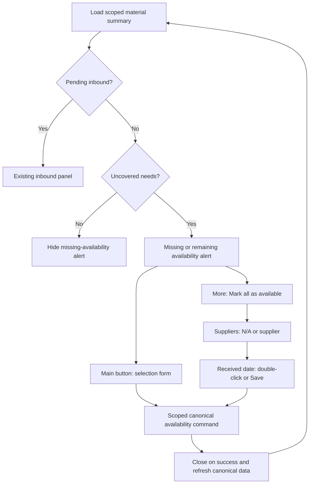
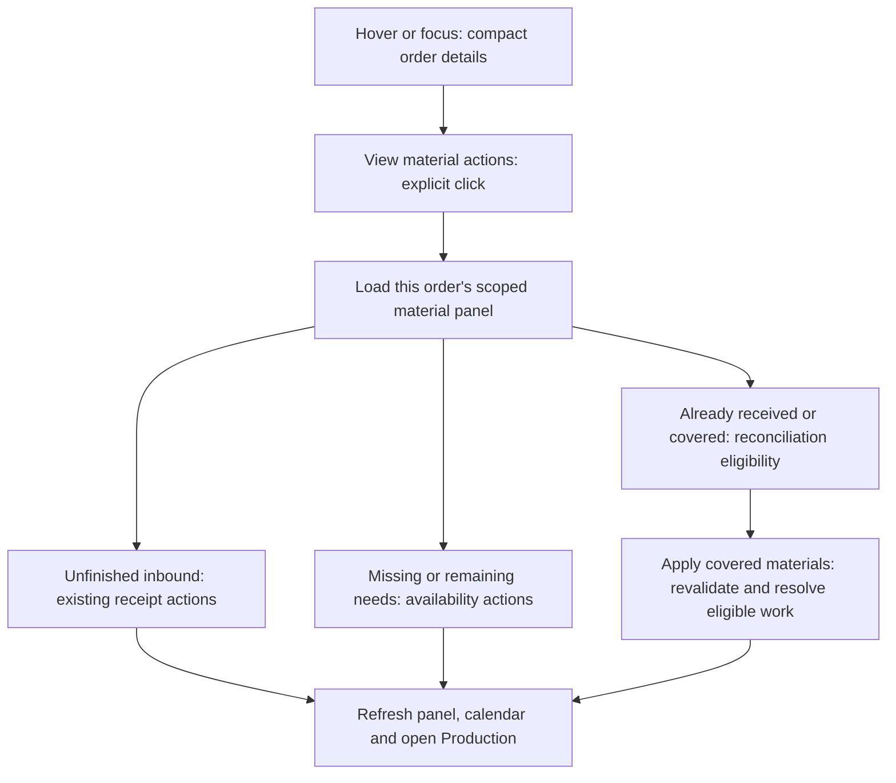

# Plan: Production missing-inbound alert and quick availability

## Type
Feature

## Status
In Progress

## Created Date
2026-09-09

## Last Updated
2026-09-09

## Goal Or Problem
Extend the existing top-of-Production inbound information with an actionable missing-inbound state. Admins and authorized production workers can select physically available items and quantities through the existing form. Add a grouped-button shortcut for marking all eligible remaining quantities available after choosing a supplier and received date.

Implementation authorized through implement-with-progress. The initial inspection did not change order, stock, submission, or permission data.

## Current Context
### Browser evidence: order 09602PC, sales ID 27100
- Production: 2-0 x 6-8 (20), 2-6 x 6-8 (16), and 2-8 x 6-8 (12) show Completed · Review pending. The expanded first assignment has 20/20 submissions. The exterior 3-0 x 6-8 item (10) is Not assigned. All four show Awaiting inbound; no order-level missing-inbound banner appears.
- Inventory: Needs 4, Inbounds 0, Not Needed 19, and 58 pending. Coverage is 0/10, 0/20, 0/16, and 0/12.
- Mark as available opens a secondary pane with four checked rows, editable quantities, optional supplier, order reference, Expected date, and locked Available status. The form was inspected and cancelled without saving.

### Existing code and constraints
- `production/v2/production-pending-inbounds.tsx` mounts at the top of `production-tab-v2.tsx`. Its empty-result branch normally returns null. A zero pending-inbound count is not proof that no inbound exists: completed, filtered, or out-of-scope inbounds are excluded.
- `packages/sales/src/production-inbound.ts` provides worker-scoped pending inbounds and receipt history. Keep the existing receipt/cancellation work and its current uncommitted changes intact.
- `inbound-create-pane.tsx` already supports `mode="mark_available"`, checkbox selection, quantity caps, and canonical inbound creation/receipt. This creates actual received inbound history, not merely a UI flag or the legacy manual-needs-fulfilled command.
- The sheet's `handleInboundCreated` currently opens inbound detail. Production-origin availability needs a different success destination: close the secondary pane and keep Production active.
- `inventories.createInboundShipmentFromDemands` requires `editOrders` for mark_available. Worker Inventory currently renders the dedicated scoped inbound panel, not the administrative inventory query/form. A UI button alone cannot enable workers safely.
- The existing create schema accepts `expectedAt`, but has no explicit received-date input. The inventory domain receiver already accepts `receivedAt` and persists it when the shipment completes; pass the new input through that existing path. Receipt and stock allocation are separate concerns: the current route also queues allocation work. Production must refresh from authoritative readiness, not optimistically assume coverage after receipt.
- Relevant Brain: inventory-backed-sales-fulfillment, sales-production-workspace, API permissions/contracts, scoped-production-inbound-receipt decision, and the active production-receipt-follow-up-and-cancel-review task. Older manual-fulfillment ADR-036 is a different operation and must not be substituted.

## Proposed Approach
### Alert state and priority
Compute an explicit, lean server summary using canonical outstanding inventory needs and actual linked inbound ownership. Do not derive material availability from submission completion or a legacy order status string.

| Current evidence | Top-of-Production behavior |
| --- | --- |
| Pending, relevant inbound exists | Existing pending-inbound panel takes priority; no duplicate missing-inbound banner. |
| No inbound exists and uncovered tracked needs remain | Show “No inbound has been created for this order” plus remaining item/quantity context. |
| Only completed/history inbounds exist and uncovered needs remain | Show “Some materials still need availability confirmation.” This handles partial Mark as available saves without falsely claiming zero historical inbounds. |
| Received stock is awaiting allocation, or unresolved issues need review | Preserve truthful allocation/review attention; do not offer to receive the same quantity again. |
| No uncovered applicable needs remain | Hide the missing-availability alert. Preserve independent receipt history and production-review information. |
| Loading, error, unsynced/unknown inventory | Loading/retry/setup state, never a false no-inbound assertion. |

Use outstanding material quantities regardless of whether production is unassigned, reported complete, or awaiting review. Respect existing cancelled/fulfilled/read-only lifecycle rules. Historical receipt rows may coexist with a remainder alert; preserve their current actions.

### Actions and interaction contract
- Admin: Open inventory navigates to this order's Needs segment; Mark as available is a grouped button with an adjacent more/ellipsis button.
- Worker: same availability group for authorized assigned scope, without requiring access to the full administrative Inventory tab. Keep existing scoped navigation where applicable.
- Main button opens the existing selection form in Production context. Users can uncheck rows or reduce quantities; it is never an immediate mark-all mutation.
- More button has accessible label “More availability actions” and exactly one top-level entry: “Mark all as available”.
- That entry opens a submenu headed “Suppliers”: “N/A” first (null supplier), followed by all selectable, non-deleted suppliers. Load the complete list on demand, using paging if required; show loading/retry/empty states. Worker supplier data contains IDs and names only.
- Selecting a supplier replaces the menu with a calendar at the same action anchor. Heading: “Received date”. Show the chosen supplier and the number of eligible items/units being marked.
- Helper: “Select a date, then double-click it to save.” Single-click selects; double-click on that same date submits once. Month navigation and supplier selection do not save. Provide “Save availability” for keyboard/touch users after date selection. Escape/outside click dismisses without saving; Back returns to suppliers.
- Busy state disables both group actions and calendar submission and announces saving. Success closes form/calendar and refreshes Production. Failure keeps selections and shows a recoverable error.
- Proposed consistency: reuse this group in Inventory/Needs as well as the new Production banner. Keep ordinary Create inbound unchanged and preserve origin-specific navigation.

### Shared command and authority
Use one canonical scoped availability command underneath form and quick action, reusing existing demand splitting, inbound creation, receiving, and allocation primitives. Do not duplicate stock-writing logic in React or invoke the legacy manual-fulfillment shortcut.

Admin scope covers this order's eligible outstanding needs. Worker scope is server-derived from authenticated active assignments and the existing receiving policy; do not grant broad editOrders or inventory configuration access. “All” means all eligible remaining quantities in that authorized scope, including rows off-screen, not selected production cards. Clearly display the scope/count; block ambiguous shared demand rather than receiving another worker's/order's stock.

Revalidate lifecycle, assignment/policy, supplier validity, outstanding quantities and linked open inbound ownership inside the transaction. If a new inbound or quantity change invalidates the reviewed snapshot, return a refresh-required result rather than silently altering the selected operation. Use a durable idempotency identity for form/quick saves and stable retries.

Add an explicit received-date contract separate from expectedAt, persist it through the canonical receiving path, and retain the actual audit creation time. Normalize the business calendar date with existing application timezone conventions; do not substitute the browser timezone. Proposed default: today selected, future dates disabled for already-received material. Keep old callers defaulting to current receipt time. Assess whether existing receipt fields suffice before proposing any schema migration.

Finish scoped Needs application/projection refresh deterministically before reporting updated material coverage, or represent a returned pending-allocation state and refresh again on job completion. A successfully committed receipt followed by a refresh failure must not prompt a duplicate receipt. Preserve current authorized production-review reconciliation rules; do not add blanket submission/payroll approval.

## Visual Plan

Calendar extension (visual-plan companion):

## Implementation Steps
- [x] 1. Establish the server summary contract: pending inbound, actual inbound presence, uncovered/actionable need quantities, allocation/review attention, and actor capabilities. Preserve cursor-independent totals and worker scope.
- [x] 2. Add/reuse a scoped availability preparation/read endpoint and mutation. Define explicit received date, reviewed quantity baseline, supplier ID/null, and idempotency identity; revalidate all authority and inventory conditions transactionally.
- [x] 3. Reuse inbound creation/receiving/allocation primitives; persist received date and durable audit/replay evidence, refresh canonical projections, and document any asynchronous completion path.
- [x] 4. Extend the top Production panel with the state-priority rules and Open inventory action. Wire a Production-origin form callback through sheet/controller/gateway composition without mounting Inventory eagerly.
- [x] 5. Reuse the selection form with scoped data/mutation adapters for workers. Preserve quantities across recoverable failures/refetches; after Production saves close the pane, restore trigger focus, and stay on Production.
- [x] 6. Build the reusable grouped availability control and menu → supplier submenu → received-date calendar flow. Include N/A, complete supplier loading, same-date double-click, keyboard/touch save, busy/error states, and count/scope text.
- [x] 7. Centralize invalidation for pending-inbound summary, open Production items/reviews, inventory overview/inbounds, sales overview/header, calendar/table/analytics, and relevant activity. Cover async allocation completion and committed-save/refetch-failure distinction.
- [x] 8. Run focused domain/API/UI/query-event tests and isolated local transactional tests; verify admin and worker browser flows at desktop/tablet/phone widths. Update behavior/contracts/permissions docs and task evidence after implementation.

## Affected Files Or Areas
Paths below are repository-relative.
- `apps/dashboard/src/components/sheets/sales-overview-sheet/production/v2/production-pending-inbounds.tsx` and tests.
- `apps/dashboard/src/components/sheets/sales-overview-sheet/production/v2/production-tab-v2.tsx`, Production gateway, `controller.tsx`, `types.ts`, and `index.tsx`.
- `apps/dashboard/src/components/sheets/sales-overview-sheet/inbound-create-pane.tsx` and shared scoped form/control helpers.
- `apps/dashboard/src/components/sales-overview-system/tabs/inventory-tab.tsx` and `lib/inventory-inbounds-utils.ts`.
- `apps/api/src/trpc/routers/sales.route.ts`, `inventories.route.ts`, and `apps/api/src/db/queries/inbound-receiving.ts`.
- `packages/sales/src/production-inbound.ts`, scoped domain helpers, policy and canonical material/projection helpers.
- `packages/inventory/src/application/inbound/inbound-demand.ts` and receipt/allocation tests.
- `apps/dashboard/src/lib/query-events/registry.ts` and tests.
- Existing `@gnd/ui` button group, dropdown, calendar/popover, and sheet primitives.

## Acceptance Criteria
- [x] Order 09602PC's observed state displays a top-level alert with 4 needs / 58 units for an authorized admin, even though three production items are reported complete.
- [x] Existing unfinished inbound information wins over missing-inbound information.
- [x] Main button opens selectable items and editable quantities for admin and authorized worker scope.
- [x] A partial save leaves truthful attention for remaining needs; complete material coverage hides only that attention, not unrelated review/history.
- [x] More menu has one item, supplier submenu begins with N/A, and supplier choice opens Received date without opening the full form.
- [x] Single-click never writes; double-click saves once with the chosen supplier/date and all eligible remaining quantities. Keyboard/touch Save is equivalent.
- [x] Both save paths close on success, remain on their originating tab, and refresh canonical Production/material data without manual reload.
- [x] General Inventory permissions are not widened; unauthorized, stale, cross-order, and out-of-assignment writes fail before side effects.
- [x] Ordinary inbound creation, receipt/cancellation history, submission approvals and stock accounting retain their established behavior.

## Test Plan
- Summary decision table: no inbound, partial coverage, completed history with remainder, unfinished inbound, zero needs, untracked/not-needed rows, loading/error, unknown projection, and cancelled/fulfilled orders.
- Scope: admin, enabled/disabled worker policy, own assignment, another worker, removed assignment, ambiguous shared components, and empty authorized scope. Check minimal supplier read permissions.
- Quantities: subset, reduced quantity, all eligible rows across pagination, already-covered rows, linked open inbound, concurrent quantity/inbound creation changes, fractional policy, invalid/zero/negative quantities.
- Date/supplier: N/A, valid/deleted supplier, past/today/future/invalid date, timezone round trip, and persisted receipt date distinct from expectedAt and audit creation time.
- Real isolated transactions: simultaneous saves, repeated double-click/retry, duplicate request key, rollback after injected failure, stock/demand/allocation/audit coherence, no duplicate payroll/review effect.
- UI: main form and quick flow, menu submenu focus, calendar navigation, one-click vs double-click, keyboard Save, touch Save, cancel/back, loading lock, error recovery, focus restoration, and no stale form reselection on refetch.
- Query events: refresh all affected active surfaces, retain missing-needs alert after partial save, and handle successful receipt with pending allocation or refresh failure accurately.
- Use local disposable fixtures for saves; the reviewed order remains unchanged unless separately requested. Run Bun focused tests, relevant package typechecks and root `bun run typecheck` for cross-layer implementation; report unrelated failures precisely. Initial planning was read-only. Current implementation validation is recorded in the linked task.

## Risks / Edge Cases
- Testing only pending-inbound count would incorrectly label completed or out-of-scope history as no inbound.
- Receiving into stock does not alone prove allocation to this order's Needs. Async allocation can otherwise leave the banner stale or invite duplicate receipt.
- Mark-all must operate on server-confirmed scope, not the current visible page or stale selections.
- Existing form effects reset selections when rows refetch; preserve deliberate user edits when extracting/reusing the form.
- User requested double-click save; avoid a calendar state transition on the first click that prevents the second click reaching the same day.
- Existing uncommitted receipt/cancellation and sales work is ongoing; integrate with current contracts without overwriting unrelated changes.

## Open Questions
No question blocks this proposed plan. Defaults for review:
- Worker availability follows the existing worker receiving policy and active assignment scope; enabling organization-wide worker authority is a separate policy decision.
- Share the grouped control with Inventory/Needs for consistent behavior.
- Received dates allow past/today, using application business-date semantics; verify the canonical timezone and stored receipt-date convention during implementation.
- Reuse current authorized review reconciliation; no new blanket approval or new cancellation semantics are implied by this request.

## Linked Task
- Task Title: Production missing-inbound alert and quick availability
- Task File: .brain/tasks/2026-09-09-production-missing-inbound-and-quick-availability.md

## Addendum — calendar material actions and covered-review reconciliation
### Latest interaction wording — 2026-09-09
The user clarified that material coverage should be synchronized to assignments in one step, with no separate “allocation needs review” step. The final user-facing action is **Sync materials to assignments**, replacing the earlier **Apply covered materials** label throughout this plan. Show one message: “Materials haven’t been applied to assignments,” followed by “Sync received materials to assignment needs and approve eligible submitted work in one step.” The review-state availability panel is replaced by this actionable panel in Production and calendar. Keep the established server eligibility/transaction rules; inconsistent quantities remain explicitly pending after eligible work is synchronized. Do not falsely report every assignment covered or silently approve excess allocation quantities. This clarification preserves all existing checklist items and ongoing work.

Requested while the original availability implementation was undergoing final verification on 2026-09-09. Preserve the original checklist, work and validation evidence; implement these extensions after the current slice. The current browser context references order 09439PC. Its business data has not been changed as part of this addendum.

### Current behavior found in code
- Calendar cards use `ProductionAttentionTooltip` / `ProductionAttentionButton` from `sales-production/order-attention.tsx`; `AttentionDetails` renders preloaded order status, material attention and scheduling lock reasons. It has no on-demand material actions yet.
- Receipt completion and the new Mark as available command invoke `reconcileProductionInboundReviews`. It re-evaluates live material evidence, validates assignment/review scope, and finalizes only eligible reviews. Thus automatic reconciliation exists after these receipt writes, but it is not a general repair of historical covered-but-pending submissions when opening Production.
- The existing availability banner hides when material needs are covered. A separate ready-for-finalization summary/action is necessary; covered needs must not be received again just to trigger review reconciliation.

### Calendar interaction
Implementation contract (Midday migration planner, implementation mode): reuse Midday's split sheet/content/form ownership and query-enabled detail loading, as inspected in `components/sheets/invoice-sheet.tsx` and `components/invoice-content.tsx` in the local reference repository. GND keeps its established custom sheet wrapper; shared material behavior lives in `availability/production-material-actions.tsx`, the covered-review control in `availability/covered-materials-action.tsx`, and the existing `inbound-create-pane.tsx` exposes an inline presentation with the same form state and mutation. Each mounted form gets a unique ID. Calendar attention owns expansion only; it must supply selected-order navigation and mount the shared panel/form on demand. API/domain ownership and query-event invalidation remain unchanged by presentation. Existing route shell, filters, table columns, selection bottom bar and calendar scheduling are not rebuilt because this extension changes only card detail actions. Required conformance checks: active-only queries, nested focus/escape, no order-open/drag from actions, admin/worker scope, partial saves, query refresh and responsive browser QA. Calendar integration and its conformance audit are complete; evidence is recorded in the linked task.

Keep the collapsed hover content compact: order/customer, meaningful status and genuine blockers. Add a full-width **View material actions** button at the bottom. Do not fetch material detail on hover alone. Clicking expands a persistent, focusable popover (not an interactive ARIA tooltip) and loads the same scoped information used at the top of Production.

The expanded section uses an inline layout with the same priority: unfinished inbound first; otherwise missing/remaining availability; plus covered-material review reconciliation where eligible. Reuse the same actions and command contracts: receive inbound, Open inventory where authorized, Mark as available form, supplier/date Mark all shortcut, and Apply covered materials. Avoid duplicating generic material-review/blocker prose already represented by these actionable rows. Keep independent scheduling/permission blockers visible.

The popover must stay open while users work with nested supplier menus, the calendar or selection form. Stop action clicks from opening the order or starting calendar dragging. Provide collapse, loading, retry, Escape/focus handling, and keyboard/touch access through the existing attention button. Load only the expanded order; collapse cancels/disables unused reads, and saving refreshes the open panel, calendar card/list and any open Production sheet.

### Completed submissions with already covered materials
Add a lean scoped summary distinguishing (1) physically received stock still requiring Needs application, (2) covered materials with eligible pending submission reviews, and (3) blocked/stale reviews needing supervisor attention. Report the eligible item/review count at the top of Production and in the expanded calendar panel.

Offer **Apply covered materials** as one action that revalidates current material quantities, order lifecycle, assignments and review eligibility, applies already-received inventory only where needed, and invokes the established review-finalization/payroll rules transactionally. It must not create a new inbound, receive stock again, create duplicate submissions/payroll, or approve a review whose assignment/evidence is stale. Return resolved/skipped counts and truthful residual attention; invalidate canonical Production lists, calendar, summaries and open details after commit.

Retain automatic reconciliation on authoritative receipt/material-application writes. Opening a tab, hovering, or expanding a popover remains read-only. The one-click action addresses previously existing covered-but-pending records when those automatic paths have not run. Preserve existing supervisor-only exceptions and re-evaluate worker eligibility using the same policy/assignment scope; do not broaden worker approval authority.

### Added implementation sequence and acceptance
- [x] Extract a reusable scoped material-actions panel/summary shared by Production and calendar, including pending inbound, missing/remaining needs and covered-review eligibility.
- [x] Add full-width View material actions expansion, lazy reads and persistent nested interactions to calendar hover/touch details.
- [x] Add Sync materials to assignments with idempotent transaction, live review validation, authoritative automatic reconciliation hooks and cross-surface refresh.
- [x] Verify lazy loading, no accidental order-open/drag, worker/admin scope, repeated clicks, covered-review/stock/payroll coherence, blocked reviews and desktop/tablet/phone behavior; update Brain evidence.

These are additions to the same ticket, not replacements for its existing availability implementation or checks.

### Observed example and extension acceptance checks
Read-only browser recheck on 2026-09-09: order **09439PC / Zalmesa** shows three linked inbounds. Its Production banner says “Received materials or allocations need review,” with **3 material items / 12 units pending**. Visible door items show **Allocation approval** and **Completed · Review pending**; the expanded 2-0 × 6-8 assignment has **1 of 1 submissions**, with one awaiting review. This confirms the reconciliation-attention example; the Production view alone does not prove every inventory need is covered. No receipt or repair was submitted.

| Extension | Observable acceptance check |
| --- | --- |
| Deferred details | Hover/focus renders the existing compact summary with a full-width View material actions button; material-detail queries begin only on expansion. |
| Inline interaction | Expanding keeps the user on the calendar. Form, supplier submenu and date picker remain usable without opening the order's Production tab or triggering drag. |
| Shared behavior | The same order and actor receive the same actionable material states and permissions in Production and expanded calendar details. |
| Covered versus pending allocation | Distinguish already committed coverage from receipt/stock needing allocation approval; do not mark received quantities available again to clear a review. |
| Safe reconciliation | Apply covered materials resolves only currently eligible work, reports residual attention, and remains safe on repeated clicks or stale data. |
| Automatic reconciliation | Authoritative receipt/material writes retain eligible automatic reconciliation; reads, hover and expansion never mutate records. |
| Refresh | Successful actions refresh the expanded panel, calendar/list and open Production details; partial results keep truthful remaining attention visible. |

Keep these checks under appended checklist items 11–14. Do not reset completed items 1–7 or close the outstanding original verification, review and commit items merely because the extension is planned.

### Final synchronization wording and interaction
The user's clarification supersedes earlier references to a separate material-review step or an **Apply covered materials** button. Show **Received materials need to be synced to assignments** with one **Sync** button in Production and expanded calendar details. Explain that it applies received coverage and approves eligible submitted work in one step. Clicking executes the synchronization directly; no review screen or second approval step is required. On success, refresh the Production list and shared material summaries. Hide the notice only when its remaining work is resolved; partial application must retain accurate remaining attention. Preserve existing checklist progress and outstanding verification.

The standalone material modal keeps Cancel and Mark as available in a fixed footer outside the scroll area. Only the form fields and item quantities scroll; the footer remains visible at narrow viewport sizes. The compact button label is **Sync**; the information above it explains synchronization to assignments.

### Final acceptance audit — 2026-09-09
All acceptance criteria above were checked against the implemented shared panels, scoped commands, query-event registry, local transactional results and browser evidence in the canonical task. Admin 09602PC shows4 needs/58 units; worker scope shows3/48. Pending inbound precedence is covered by summary tests. Disposable partial and complete saves verified origin retention, supplier/date persistence and automatic refresh. Shared form capability is backed by worker policy/assignment transaction tests; the actual worker browser correctly disables receiving under the current policy. No organization policy was changed for testing.

Calendar expansion, direct Sync, residual attention, fixed footer and desktop/tablet/phone behavior are verified. Calendar hover now waits2 seconds; leaving cancels opening, while explicit click/keyboard access stays immediate. Ordinary receipt/cancellation compatibility passes54 local database tests/494 assertions, including compensation, concurrency, provenance, stock and later payment/dispatch safeguards. Full relevant suite and two-axis review evidence are recorded in the task. Existing repository typecheck failures are documented limitations, with no changed-runtime diagnostics.
