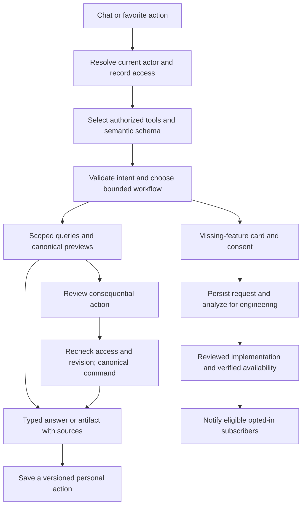

# Plan: Progressive AI Chat Platform

## Type
Feature

## Status
In Progress

## Created Date
2026-09-11

## Last Updated
2026-09-12

## Goal Or Problem
Build a Midday-inspired GND assistant that lets authorized users understand and operate the system through chat: find orders, explain status, generate PDFs, prepare orders from customer text and request images, navigate every business section, and save useful actions for reuse. Missing capabilities become explicit, consented feature requests with optional release subscriptions and AI-assisted engineering analysis.

## First MVP Scope — 2026-09-14

The first MVP is restricted to authenticated Super Admin accounts using the standard
desktop dashboard. It includes the core chat, Sales and Community reads,
schema-aware charts, supported Sales PDFs, reviewed text order creation, reusable
actions, missing-feature submission, provider/model control, self-usage visibility,
and essential recovery/disable evidence. Domain permissions, record scope,
redaction, explicit approvals, and idempotency remain mandatory for Super Admins.

Employee rollout, bulk access, employee quota administration, organization-wide
reports and exports, image/OCR order input, mobile acceptance, expanded statement
and report PDFs, and the complete feature-delivery center are post-MVP.

This is the full proposed product and engineering plan. It does not claim that the chat tools, new tables, or integrations below already exist. “DND” in the request is interpreted as this GND repository; “two calls/chains” means tool calls/tool chains. Request images mean handwritten requests, scans, and screenshots, consistent with current Sales Request direction.

## Current Context

### Repository evidence and reuse

| Area | Inspected source | Implication |
| --- | --- | --- |
| Runtime | `apps/api/package.json`, root `package.json` | Bun/Turborepo, Hono/tRPC API, existing AI SDK 6 and multiple provider adapters. Confirm installed APIs during implementation; do not copy a different SDK version blindly. |
| Database | `packages/db/src/schema/schema.prisma` | MySQL with Prisma and `relationMode = prisma`. Proposed Postgres/Neon and SaaS tenancy are separate workstreams, not available infrastructure. |
| Authorization | `apps/api/src/db/queries/user.ts`, `.brain/api/permissions.md` | Existing effective role/user grants plus operation-specific scope guards must remain authoritative. Documentation and working-tree code differ on request-level auth caching; reverify the actual implementation before relying on it. |
| Middleware | `apps/api/src/trpc/middleware/auth-permission.ts` | This wrapper currently passes context through with commented authorization logic. Its name alone is not evidence of protection; tools require explicit existing guards. |
| Existing chat components | `apps/dashboard/src/components/chat/README.md` | Current components serve channel notes/activity, not this assistant. Introduce a distinct assistant surface and preserve activity chat. |
| Sales request AI | `.brain/features/sales-request-generation.md`, `apps/api/src/services/sales-request-*`, `packages/sales/src/sales-form/request-generation/` | Reuse provider settings, published compact catalog, native `NewSalesFormSeed`, and generic initializer. Text-first backend exists; image evaluation and paste/apply UI remain deferred. |
| Documents | `.brain/features/shared-document-platform.md`, `.brain/features/sales-document-readiness.md` | Reuse `StoredDocument`, Sales PDF snapshots and readiness, storage lifecycle, and scoped retrieval. |
| Inventory/fulfillment | `.brain/features/inventory-backed-sales-fulfillment.md` | `LineItem`, component demand, `StockAllocation`, inbound records, and canonical dispatch projections own quantities; AI must not recalculate operational truth independently. |
| Community | `.brain/features/community-operations-workspace.md`, `community.prisma` | Projects, Homes, tasks, templates, invoices, builders and operational summaries already offer useful assistant entry points. Community here means construction/project operations. |
| Employees/payments | `.brain/features/employee-management-v2.md`, `.brain/features/sales-payment-v2-checkout.md` | Respect contractor document gates and existing financial commands; exposing data or creating payment effects requires its own permission. |
| Notifications/jobs | `packages/notifications/src/`, `packages/jobs/src/` | Extend existing durable delivery and background execution patterns. Do not create another independent notification stack. |

The repository has extensive unrelated in-progress changes. Planning adds documentation only and does not treat working-tree implementation as deployed proof.

### What the local Midday actually does
Reference root: `/Users/M1PRO/Documents/code/_kitchen_sink/midday`.

- `apps/api/src/chat/tools.ts`: builds a searchable tool index from MCP definitions; uses related-tool hints, cached definitions and a request-specific execution client.
- `apps/api/src/chat/assistant-runtime.ts`: uses `ToolLoopAgent`, selects up to 12 active tools and stops at 10 steps in this checkout. These are reference values, not measured GND requirements.
- `apps/api/src/mcp/tools/documents.ts`: registers tools by read/write scope and calls bounded domain queries with trusted `teamId` and validated schemas.
- `apps/api/src/rest/routers/chat.ts`: streams UI messages with server context, upload processing and rate limits.
- `apps/dashboard/src/components/chat/chat-view.tsx`: composes input, streaming conversation and an invoice canvas.

Adopt the searchable catalog, bounded orchestration, typed tools, progressive UI and domain boundaries. The inspected files do not establish a free-form SQL agent as Midday's chat architecture. GND should retain Prisma/MySQL and its own authorization model rather than importing Midday's team assumptions or database stack. Under the 2026-09-12 implementation directive and ADR-090, the request-scoped in-memory MCP adapter is required before parity release; the earliest safe tracer slice may call the same registry directly while T05 lands. Toolpick remains subject to a measured comparison with simpler domain/keyword selection, but the final selector must preserve Midday's bounded semantic discovery behavior.

External primary references checked on 2026-09-11: [AI SDK workflow patterns](https://ai-sdk.dev/docs/agents/workflows), [tool calling and approval](https://ai-sdk.dev/docs/ai-sdk-core/tools-and-tool-calling). These support bounded workflows and approval-aware tools; business authorization and durable execution still belong to GND.

## Proposed Approach

### 1. Product experience

Provide a global Assistant entry, a full-page conversation workspace and contextual “Ask about this” entry points on order, customer, inventory, project and unit pages. Thin route shells load immediately; history, favorites, tool categories and detail canvases load independently. Desktop uses a conversation with an optional artifact/detail pane. Compact screens use the existing shared sheet primitives and a keyboard-safe composer.

The top menu contains **New chat**, **History**, **Favorite actions**, **Browse tools**, **My feature requests**, and **Chat preferences**. Browse tools groups capabilities by Sales, Customers, Community, Inventory, Production, Fulfillment, Documents, Finance, Employees, and System. Each entry explains what it does, required inputs, whether it changes anything, availability, and an example. Technical tool IDs are for developer diagnostics; the normal product language is “actions.”

Chat renders typed cards for order status, paginated results, source links, clarification, draft review, approval, PDF progress/preview, saved action, missing feature, and recoverable failure. Show concise activity such as “Checking material availability” and “Preparing invoice PDF,” without displaying hidden model reasoning. Answers identify their source records, observation time, date range, currency/units and any partial or stale data.

Users can stop generation, retry a failed read, resume durable jobs, rename/archive/delete chats according to retention policy, search their own history, edit a prompt into a new branch, and give feedback. Explain that stopping text generation does not reverse a completed business action; show its persisted outcome. No mutation is automatically repeated when regenerating an answer.

Preferences include language, concise/detailed answers, timezone, default section, preferred result presentation and favorites order. Preferences cannot change authorization, accounting rules, catalog validation, or confirmation requirements. Personal memory is explicit, inspectable and removable; customer records are never silently learned as global preferences.

### UI stack clarification — Vercel AI SDK UI, AI Elements and charts

Verified against the local Midday checkout on 2026-09-11:

- `apps/dashboard/src/components/chat/chat-context.tsx` imports `useChat` from `@ai-sdk/react`: Vercel AI SDK UI is confirmed.
- Chat renders custom `ToolCallGroup`, `SourcesList`, `ThinkingIndicator`, Streamdown messages and an invoice canvas. The inspected source does not establish AI Elements provenance; copied registry components need not appear as a package dependency.
- Midday dashboard/UI packages declare Recharts 3. GND already has Recharts 2 and `packages/ui/src/components/chart.tsx`; preserve the existing GND chart boundary unless a separate upgrade is justified. Recharts usage in Midday does not establish that every chart is generated within chat.

Planned stack: AI SDK Core for model/tool orchestration; AI SDK UI (`@ai-sdk/react`) for streaming chat; selected [AI Elements](https://elements.ai-sdk.dev/docs) primitives where they fit existing `@gnd/ui` wrappers; GND domain components for order cards, approvals and PDF previews; existing Recharts/shadcn chart wrappers for visual reports. AI Elements is Vercel's shadcn-based AI interface component registry, distinct from the AI SDK UI hooks. Component selection and compatibility remain implementation work; no package is installed by this clarification.

Use [AI SDK generative UI](https://ai-sdk.dev/docs/ai-sdk-ui/generative-user-interfaces) through typed tool results: a validated result selects a known renderer and supplies authorized data, never arbitrary model-generated React/JavaScript. Support bar, line and area charts, KPI cards and paginated tables first. Display metric definition, date range, currency/unit, freshness and source links; provide an accessible table fallback and explicit empty/loading/error states. Bound points/series, preserve exact authoritative totals, and reauthorize drill-downs/exports. Model-selected display options cannot change the query's permission scope or metric semantics.

Example: “Chart weekly sales for the last three months” calls a permitted aggregate query and renders a line/bar chart from its validated result. Charts for production backlog, material shortages and Community progress follow the same contract. Visual output is part of the planned assistant; broad analytics still follow P7.

### 2. Shared tool registry and execution contract

One versioned, code-reviewed registry is the source of truth for discovery, model tool definitions, UI catalog, saved-action validation, diagnostics and future MCP exposure. Avoid separately maintained prompt lists.

Every tool defines:

| Field | Required behavior |
| --- | --- |
| Identity | Stable ID, version, human title, section, description, examples, owner module |
| Availability | Implemented/coming soon/disabled/degraded plus rollout and prerequisite resolver |
| Validation | Strict input and output schemas, size bounds, typed domain errors |
| Access | Existing operation guard, record-scope resolver, field projection, audience and entitlement |
| Effects | Read/draft/artifact/write/external-send/destructive; approval policy and idempotency rule |
| Execution | Handler using existing query/domain boundary, time/row/token budget, retry and cancellation policy |
| Composition | Related tools, typed prerequisites, output bindings, compatible versions, allowed next steps |
| Presentation | Result-card kind, record deep links, source revision, freshness and UI invalidation tags |
| Evaluation | Positive cases, forbidden cases, domain invariants, latency/cost baseline |

Discovery first intersects available tools with the actor's authorized capabilities; relevance ranking then selects a small subset and required dependencies. Recheck access inside every execution handler. An indexed description or favorite cannot grant execution. Cache immutable public definitions separately from actor-specific tool selection; never cache authorized handlers globally.

A proposed result envelope includes `status`, `data`, `sources`, `observedAt`, `revision`, `nextCursor`, `warnings`, `artifact/job references`, and `allowedNextActions`. Errors distinguish invalid input, ambiguity, missing capability, denied access, missing prerequisite, conflict, quota, degraded service, and unknown execution outcome. Redact inaccessible object existence where the domain requires it.

Use a bounded planning/execution loop. Deterministic chains handle known business workflows; model routing helps discover the correct chain and clarify inputs. Parallelize independent authorized reads only. Write dependencies execute in order. Start with a proposed maximum of 8 model steps, 12 selected definitions, 2 read retries and a 60-second foreground deadline; tune from evaluation. Long PDFs and analyses run as jobs with IDs and resumable progress.

### 3. User permission and record awareness

Resolve actor, active profile, effective grants and current organization/dealer/worker scope on the server. Never trust a chat message, browser context, recipe, attachment, model output or client-supplied permission map as authority. The page's record ID is a hint and must be checked.

Apply access at five points: catalog visibility, tool execution, row selection, output-field projection, and artifact/history retrieval. Apply it again after approval and when a background job starts or resumes. Check deactivation and revoked access. Reads in new turns use current authority; long-running flows check at each meaningful boundary.

| Audience | Example boundary |
| --- | --- |
| Sales staff | Existing order/customer permissions and canonical representative/organization scope; read permission never implies edit. |
| Production worker | Assigned-work projection only; no unassigned demand or other workers' private details. |
| Production manager | Existing management/assignment guards, material gates and quantity limits. |
| Dealer/customer | Only authenticated owned/authorized orders and allowed prices; no staff notes, margins or employee data. |
| CommunityUnit user | Unit/template slice remains allowed; install costs remain excluded, including aggregates and PDFs. |
| Finance | Existing payment/accounting permissions; sensitive balances and adjustments are independently gated. |
| Admin | Registry/settings administration is separate from executing every operational action. |

Do not equate `Organization` with SaaS tenancy. Initially bind each tool to the existing proven scope policy. Block any tool whose row ownership cannot be established. Future tenant scoping follows the separate SaaS plan and requires explicit tenant-negative tests before rollout.

Persist a concrete action proposal for consequential writes: actor, action/tool version, exact inputs, target revisions, displayed diff, expiry, nonce and idempotency identity. Confirmation is a server-validated UI event, never text the model can forge. Recompute authorization, domain preflight, price/configuration and target revisions immediately before commit. Changed proposals require fresh review. Ordinary safe reads and unsaved previews execute directly; a recipe never suppresses a write or external-send gate.

### 4. Schema-aware, SQL-efficient query design

Build a compact, versioned semantic catalog from checked-in Prisma models plus reviewed business metadata. Models alone do not explain lifecycle rules. Each domain entry declares entities, stable IDs, supported filters/operators, allowed joins and cardinality, safe fields, scope policy, soft deletion, archived-vs-deleted meaning, business metrics, units/currency/timezone, query owners and source revisions. Exclude credentials, session/token tables, provider secrets and unrestricted personal fields.

Retrieve only relevant schema/metric descriptions. The model produces a validated query intent such as:

`{ domain: "sales", metric: "ordersWithFulfillmentBlockers", filters: { ageDays: 7 }, groupBy: "reason", pageSize: 25 }`

The server validates permitted combinations, derives scope, and compiles the intent into reviewed parameterized SQL/Prisma queries. Scope must be part of every subquery and aggregate, not a filter applied after rows reach the model. Identifiers, joins, sort direction and grouping come from allowlists; parameters are bound. The first release accepts no arbitrary SQL strings.

Optimize with narrow selects, aggregate-first answers, keyset pagination, bounded date ranges, pre-aggregation before one-to-many joins, batched lookups, explicit query counts and existing canonical projections. Index proposals require representative `EXPLAIN` evidence and write-cost consideration. Cache keys include scope, permission/field policy, normalized query, source revision and catalog version. Never share customer-specific outputs via a global semantic cache. Surface replica/cache freshness if these are later introduced.

Canonical examples:

- Fulfillment status uses the sales/inventory/dispatch projection, preserving planned, packed, delivered, remaining and unresolved quantities. Never infer completion from one legacy status column.
- Financial totals use the payment ledger and its reversal/allocation rules, not a naive sum of joined Sales rows. Keep decimals exact and do not combine currencies.
- Community project summaries aggregate Homes/tasks/invoices separately before joining; avoid duplicating invoice amounts per task.
- Ambiguous order numbers resolve through a bounded authorized picker. Never select the first matching customer or order silently.

Later analyst mode may accept a richer query AST. If free-form generated SQL is evaluated, it remains a separately gated experiment using a restricted read-only connection/view set, SQL parser allowlists, prohibited functions/statements, parameter binding, query-plan checks, statement timeouts, row/byte limits, cancellation and scope enforcement by construction. A SELECT prefix or prompt instruction is insufficient. MySQL currently provides no assumed Postgres RLS defense; no model-authored SQL writes are permitted. AI can propose new query templates and indexes for engineering review.

### 5. Initial and broader capability catalog

All IDs below are proposed chat tools. “Reuse” identifies an existing business foundation, not a finished assistant adapter. Phase references match the implementation checklist.

| Section | Proposed tools and purpose | Foundation / rollout |
| --- | --- | --- |
| System discovery | `system.searchTools` find authorized actions; `system.explainCapability` explain inputs/availability; `system.navigate` return safe app links; `system.help` retrieve versioned help | New registry; P1 |
| Sales reads | `sales.findOrders` resolve references/filters; `sales.getOrderStatus` summarize canonical status; `sales.explainBlockers` explain missing materials/approvals; `sales.getTimeline` show attributable history | Existing sales/control queries; P2 |
| Sales planning | `sales.compareQuotes` show scoped differences; `sales.findStaleQuotes` list follow-up candidates; `sales.explainPrice` explain authorized component/tier totals | Canonical pricing, never inferred; P4/P7 |
| Order drafting | `sales.draftFromRequest` create native seed from text; `sales.draftFromRequestImage` later image extraction; `sales.validateDraft` resolve authoritative config; `sales.openDraft` open editable review; `sales.createOrder` commit through canonical save | Existing Request AI + missing UI integration; P4, images gated |
| Sales changes | `sales.proposeChange` preview differences; `sales.applyChange` commit reviewed changes; `sales.copyAsDraft` reuse a prior order with current validation; `sales.prepareCancellation` show domain impact | Existing command boundaries must be audited; P7 |
| Customers/dealers | `customers.search` disambiguate; `customers.getOverview` recent orders/activity; `customers.prepareCreate` / `customers.create` preview/save; `customers.findDuplicates` suggest review; `dealers.getRequestStatus` show request state | Customer/dealer APIs; reads P2, writes P7 |
| PDFs/documents | `documents.list` scoped files; `documents.get` authorized retrieval; `documents.prepareSalesPdf` readiness/current snapshot; `documents.generatePdf` job; `documents.getJobStatus` progress; `documents.prepareMessage` recipient/content preview; `documents.send` explicit send | StoredDocument/PDF/notification authorities; P3, send P7 |
| Community | `community.findProjects`, `community.getProjectOverview`, `community.findUnits`, `community.getUnitOverview`, `community.getProductionStatus`, `community.getInvoiceSummary`, `community.checkTemplateReadiness` | Existing project/unit summaries and permissions; P2/P7 |
| Community actions | `community.prepareUnit`, `community.createUnit`, `community.prepareProductionUpdate`, `community.applyProductionUpdate`, `community.prepareJob`, `community.submitJob`, `community.generateUnitDocuments` | Existing unit/template/job flows, contractor gates; P7 |
| Inventory | `inventory.searchProducts`, `inventory.getAvailability`, `inventory.explainShortage`, `inventory.findInbound`, `inventory.getInboundStatus`, `inventory.getSupplierSummary` | Inventory-owned demand/stock projections; P2/P7 |
| Inventory actions | `inventory.prepareInbound`, `inventory.createInbound`, `inventory.prepareReceipt`, `inventory.receive`, `inventory.proposeAdjustment`, `inventory.applyAdjustment` | Receipt/allocation/stock transaction authorities; P7 high-risk gate |
| Production | `production.myAssignments`, `production.getQueue`, `production.explainMaterialReadiness`, `production.getSchedule`, `production.prepareAssignment`, `production.assign`, `production.prepareSubmission`, `production.submit` | Worker vs manager scope, material review, canonical quantities; reads P2, writes P7 |
| Fulfillment | `fulfillment.getOrderOverview`, `fulfillment.getTrip`, `fulfillment.explainReadiness`, `fulfillment.getExceptions`, `fulfillment.preparePlan`, `fulfillment.createPlan`, `fulfillment.openProofWorkflow` | Existing dispatch/packing/proof flows; never synthesize proof or completion; P2/P7 |
| Finance | `finance.getAuthorizedBalance`, `finance.getPaymentStatus`, `finance.getAging`, `finance.generateStatement`, `finance.preparePaymentLink`, `finance.createPaymentLink`, `finance.explainReconciliationIssue` | Existing ledger/payment commands; P2/P3/P7. Refunds/adjustments later, independently reviewed. |
| Employees/contractors | `employees.findAuthorizedProfile`, `employees.getDocumentReadiness`, `employees.myJobs`, `employees.getJobStatus`, `employees.prepareJobSubmission` | Existing employee/job/document gates; P7 |
| Management analytics | `reports.salesSummary`, `reports.fulfillmentBottlenecks`, `reports.productionThroughput`, `reports.inventoryExposure`, `reports.communityProgress`, `reports.comparePeriods`, `reports.export` | Reviewed semantic metrics and bounded queries; P7 |
| Personal actions | `actions.suggestSave`, `actions.save`, `actions.list`, `actions.previewRun`, `actions.run`, `actions.update`, `actions.remove` | New recipe metadata, existing registered tools; P5 |
| Feature requests | `features.prepareRequest`, `features.submitRequest`, `features.listMine`, `features.subscribe`, `features.unsubscribe`; admin `features.analyze`, `features.triage`, `features.publishAvailability` | New intake/review, existing notification/jobs; P6 |
| Proactive assistance | `watchers.prepare`, `watchers.create`, `watchers.pause`, `watchers.list`, `watchers.remove` for saved read queries and meaningful change alerts | Durable scheduled execution and current permissions; P7 |

Broader suggestions: morning work brief by role; cross-section “why is this order stuck?” investigations; natural-language filters that open the normal workspace; accessible voice input with reviewed transcription; multilingual request extraction; spreadsheet export from authorized reports; document comparison and missing-field explanations; anomaly queues with evidence; demand/reorder suggestions; project completion risk; customer follow-up drafts; contextual onboarding; saved dashboard widgets from read recipes. Forecasts must display assumptions and backtest results. External email/WhatsApp/SMS and supplier messages require reviewed recipient/content and existing send policy. No external account connections are prerequisites for the initial assistant.

### 6. Example tool chains

1. **“Where is order 09602PC?”** Resolve authorized order → get canonical fulfillment overview → fetch relevant blocker detail → present status, evidence time and order link. If scope or quantity evidence is unresolved, say so.
2. **“Generate this customer's invoice PDF.”** Resolve customer/order → validate document access and readiness → reuse current snapshot or enqueue canonical generation → show progress → retrieve authorized artifact. Generating a PDF never silently sends it.
3. **“Create an order from this request.”** Parse text → generate native seed with published catalog revision → initialize through normal form rules → show unresolved fields and current pricing → user reviews editable draft → canonical save with idempotency → return persisted order link. An unclear dimension, customer, service price or delivery charge blocks the relevant commitment.
4. **“Which units are waiting on production?”** Resolve project → scoped unit/task aggregate → bounded list and summary → optional authorized unit detail. Install costs remain absent for CommunityUnit users.
5. **“Check late orders and make a report.”** Run scoped saved metric → generate report artifact → offer Save action. Scheduling and external sharing are separate choices.

### 7. Missing-feature request experience

Only the registry/classifier's genuine `not_implemented` outcome produces:

> This feature isn't available yet. Would you like to notify the developers?
>
> Requested feature: [editable one-sentence summary]
>
> [ ] Notify me when this feature is ready to use
>
> **Notify developers**    **Not now**

The release checkbox starts unchecked and is independent of submission. The user can review a minimal request payload; do not include an entire chat, attachment or customer record by default. “Not now” sends nothing and does not create a developer ticket. Submitting creates a durable in-app request once, acknowledges its ID, and queues analysis/delivery. If the transport is delayed, report “Request saved; developer notification pending,” not delivered.

An unavailable permission produces the existing access path; a disabled module identifies a prerequisite; a service outage offers retry; missing information asks for clarification. Unsupported language alone is not a missing product feature. Deduplication operates within an authorized scope and allows related requests to join a canonical capability while preserving each user's subscription/privacy. A failed tool search must not automatically prove a feature does not exist; try a bounded category lookup or offer neutral feedback.

Request states: submitted → analyzing → needs clarification / triaged → planned → building → testing → available; alternatives duplicate, declined, cancelled. Analysis failure is retryable and never loses the request. Users see truthful status without a fabricated ETA.

AI engineering analysis runs asynchronously with a curated, versioned engineering knowledge bundle derived from Brain, domain contracts, registry and semantic schema. It produces: normalized need, existing-tool alternatives, affected domains, required inputs/outputs, permission/row/field changes, proposed queries/indexes, command dependencies, migration impact, UI cards, acceptance cases, risks, size/confidence and open questions. Attach exact knowledge/catalog versions and label inferred paths. It may suggest a Brain plan or developer ticket; a reviewed engineering workflow owns repository edits and releases. Customer request text never becomes trusted developer instructions, arbitrary shell execution, database access or automatic production deployment.

An authorized developer links the request to a real capability/version and explicitly publishes availability after acceptance and rollout checks. A transactional outbox creates one release notice per request/subscriber/release. Recheck consent and current access before sending; disabled or inaccessible releases are not announced as usable. Unsubscribe is immediate; delivery retries are deduplicated and observable. Default proposed developer inbox and release channel are in-app notifications; external routing remains an explicit configuration choice.

### 8. Personal reusable actions

After a successful repeatable action, offer **Save as reusable action** without interrupting every conversation. The save sheet suggests an editable name, description, section, parameter fields and defaults, the steps/effects, and whether it belongs to this user. Example: “My delayed orders” with `minimumAgeDays = 7` and dynamic current-user scope.

Store a validated recipe referencing approved versioned tool IDs and typed bindings. Do not store executable AI-generated code, SQL, credentials, hidden reasoning, signed links, approval tokens or a captured authorization context. Keep a simple prompt shortcut distinct from a deterministic multi-step recipe in the UI. Saving an action does not make it a new platform capability.

Clicking a favorite opens any required parameter inputs, appends a clear request to the chat, and runs it automatically for safe read/draft work. Writes prepare a fresh review. “This week” resolves at run time in the user's timezone, with the resolved dates visible. Stored record IDs are reauthorized. Successful earlier outputs are not reused as current facts.

Support reorder, rename, edit, duplicate, remove, last-run/result status and version history. Registry changes run compatibility validation; incompatible recipes show “Needs update” and a repair preview. Team sharing/publishing is a later permission-controlled option; recipients execute with their own authority. A schedule requires explicit frequency, timezone, change criteria and notification consent, and does not silently arise from saving a favorite.

### 9. Proposed persistence and API surfaces

Names below are proposed logical entities, to be reconciled with existing schema conventions before adding models. Business records remain in their current domain tables.

| Proposed entity | Ownership, fields and important constraints |
| --- | --- |
| AssistantConversation | Owner user, resolved access scope reference, title, preferences, timestamps, archive/delete state; index owner/scope/updatedAt/id. |
| AssistantMessage | Conversation, server sequence, validated content parts, client request ID, redacted source refs; unique conversation/sequence and scoped request identity. |
| AssistantRun | Conversation, actor, request identity, catalog/model versions, status, budget/usage, checkpoints; unique scoped run request ID. |
| AssistantToolExecution | Run/step/tool/version, input fingerprint, redacted result refs, status, duration, effect/idempotency key; unique run/step, durable mutation outcome. |
| AssistantActionProposal | Run/actor, exact versioned payload hash, target revision, expiry, confirmed/consumed state; single-use transition with transaction-safe claims. |
| AssistantSavedAction | Owner, optional later sharing scope, title/order, versioned recipe, parameter schema, revision, compatibility status; optimistic version checks. |
| AssistantPreference | User and resolved scope, presentation preferences only; unique user/scope. |
| AssistantFeatureRequest | Requester/scope, reviewed summary, minimal evidence, state, deduplication key, analysis and knowledge versions, linked capability/release. |
| AssistantFeatureSubscription | Request/user/channel consent, subscribed/unsubscribed timestamps; unique request/user/channel. |
| AssistantFeatureEvent | Immutable attributable lifecycle transitions and analysis attempts; unique transition identity. |
| Notification outbox link | Reuse/extend existing notification delivery patterns; unique request/subscriber/release/channel identity. |
| AssistantWatch (P7) | Owner, compatible read recipe revision, schedule/timezone, last evidence fingerprint, consent and paused state. |

Attachments and generated files reference `StoredDocument`. Its ownership vocabulary may need an additive conversation/request owner type; verify rather than inventing a parallel blob store. Conversation deletion follows a defined retention policy, deletes owned uploads when safe and removes access to content, while minimally retained audit evidence follows business retention. Orphan cleanup and scope-consistency checks matter because the current Prisma relation mode does not supply physical FK enforcement.

Proposed transport: a thin authenticated streaming `POST` chat route under the API's verified REST mount; tRPC routers for conversation CRUD/history, catalog/search, preferences, recipes, proposals/confirm, request/subscription management and admin triage. Exact route filenames and mount prefix are implementation discoveries. Browser requests provide IDs/intent only; the API derives actor/scope. Chat history is server-authoritative: reject forged assistant/tool outputs, oversized parts and conversation ownership mismatches. Stream events include durable run/sequence IDs for reconnect, deduplication and terminal-state retrieval. CSRF/origin protections must match the session transport.

### 10. Reliability, privacy, cost and observability

- Separate model response status from business action status. Persist effect identities and results; a network timeout after commit yields “checking outcome,” never an automatic new write.
- No database transaction spans a model call or human wait. Use short canonical transactions with revision checks, leases where needed and durable outbox delivery.
- Resume dependent chains from verified checkpoints; do not replay completed payment/order effects. Compensations are domain-approved operations, not model improvisation.
- Treat uploads, OCR, database notes, retrieved help and feature requests as untrusted content. They cannot install tools, override system instructions or change access. Validate MIME/size/pages, authorized document ownership, parser limits and allowed download origins.
- Bound conversation context with server summaries carrying authorized source references. Recheck sources after revocation; avoid replaying stale sensitive result payloads to the model or browser. History and shared links require current owner/access policy. Summaries cannot grant permission or stand in for fresh business data.
- Use configured provider allowlists and server-only credentials. Reuse Sales Request patterns but separate chat workload settings and quotas so changing chat does not silently alter extraction. Fallback must be explicitly configured and schema-compatible; no hidden switch to another provider for sensitive data.
- Track run/tool IDs, model/catalog versions, selected tool count, retrieval accuracy, query duration/count/rows, cache hits, token usage, estimated versus billed cost, approvals/conflicts, effect outcomes and notification delivery. Default logs contain metadata rather than raw customer prompts.
- Add per-user/scope quotas, upload limits, concurrency caps, per-run cost ceilings and administrative kill switches per tool/provider. A quota failure preserves drafts and saved requests.
- Proposed pilot targets: visible progress within 1 second excluding upload transfer; ordinary lookup p95 under 5 seconds; first visible PDF job status within 2 seconds. Measure model and domain portions separately. These are targets, not existing performance claims.

## Visual Plan

## UI-first delivery amendment — 2026-09-12

User explicitly requested UI first and screenshots. Build a clearly labeled, session-only interactive assistant preview at `/assistant` before backend work. Use synthetic fixtures and existing UI/chart wrappers; do not expose real records or claim live AI, permissions, PDF generation, notification delivery or durable favorites. The companion task tracks this UI slice separately; P1–P7 backend gates remain incomplete.

## Ticket Roadmap — 2026-09-12

The plan is now decomposed into 20 dedicated Brain tickets. The verified Midday behavior-to-ticket mapping is maintained in [Progressive AI Chat — Midday Parity Contract](../features/progressive-ai-chat-midday-parity.md). Midday parity is the foundation in T01–T09; GND domain packs and requested extensions follow in T10–T20.

| Wave | Tickets | Exit condition |
| --- | --- | --- |
| A — Contract and safety spine | T01, T17 | Architecture, tool contract, effect levels, permissions, proposal/idempotency rules are reviewable. |
| B — Live Midday-parity core | T02–T06 | Trusted history, protected stream, bounded runtime, searchable MCP registry, and live dashboard shell work end to end with one safe tool. |
| C — Midday-parity interaction | T07–T09 | Suggestions, uploads, integrations/web search, streaming renderers, sources, tool progress, deep links, invalidation, and canvas are verified. |
| D — GND operational value | T10–T14 | Sales/customer and operations reads, PDFs, request-to-order drafts, schema-aware analytics, and typed charts pass scoped evaluations. |
| E — Progressive product layer | T15–T16 | Favorites/preferences and missing-feature intake/analysis/release subscriptions are durable and permission-safe. |
| F — Access, governance, admin operations, and production rollout | T19, T20, T18 | Individual enablement, usage/limits, complete admin and feature-delivery operations, evaluations, observability, recovery, canaries, rollback, and authenticated acceptance pass. |

Ticket ordering is dependency-driven. T17 starts beside T01 and gates every operational tool pilot. T02 can begin after T01 while T17 is built. T07–T09 can proceed once the live core contracts stabilize. Read-only domain packs precede artifacts, drafts, and confirmed writes.

### Dedicated tickets

1. [T01 — Freeze Midday parity and GND boundaries](../tasks/2026-09-12-progressive-ai-chat-platform/2026-09-12-progressive-ai-chat-01-midday-parity-contract.md)
2. [T02 — Persist conversations, runs, and trusted history](../tasks/2026-09-12-progressive-ai-chat-platform/2026-09-12-progressive-ai-chat-02-data-model-history.md)
3. [T03 — Build the protected streaming chat endpoint](../tasks/2026-09-12-progressive-ai-chat-platform/2026-09-12-progressive-ai-chat-03-streaming-endpoint.md)
4. [T04 — Implement bounded agent runtime and contextual prompt](../tasks/2026-09-12-progressive-ai-chat-platform/2026-09-12-progressive-ai-chat-04-agent-runtime-prompt.md)
5. [T05 — Build MCP tool registry and semantic selection](../tasks/2026-09-12-progressive-ai-chat-platform/2026-09-12-progressive-ai-chat-05-mcp-tool-registry.md)
6. [T06 — Connect the dashboard chat shell and AI SDK state](../tasks/2026-09-12-progressive-ai-chat-platform/2026-09-12-progressive-ai-chat-06-dashboard-shell-state.md)
7. [T07 — Add composer suggestions, uploads, and integrations](../tasks/2026-09-12-progressive-ai-chat-platform/2026-09-12-progressive-ai-chat-07-composer-uploads-integrations.md)
8. [T08 — Render streaming messages, sources, and tool progress](../tasks/2026-09-12-progressive-ai-chat-platform/2026-09-12-progressive-ai-chat-08-streaming-renderers.md)
9. [T09 — Add artifact canvas, entity links, and query invalidation](../tasks/2026-09-12-progressive-ai-chat-platform/2026-09-12-progressive-ai-chat-09-artifact-canvas-invalidation.md)
10. [T10 — Ship Sales and customer read tools](../tasks/2026-09-12-progressive-ai-chat-platform/2026-09-12-progressive-ai-chat-10-sales-customer-read-tools.md)
11. [T11 — Add production, inventory, fulfillment, and Community reads](../tasks/2026-09-12-progressive-ai-chat-platform/2026-09-12-progressive-ai-chat-11-operations-community-tools.md)
12. [T12 — Generate and manage PDF artifacts](../tasks/2026-09-12-progressive-ai-chat-platform/2026-09-12-progressive-ai-chat-12-pdf-artifact-workflows.md)
13. [T13 — Draft and create orders from customer requests](../tasks/2026-09-12-progressive-ai-chat-platform/2026-09-12-progressive-ai-chat-13-order-draft-creation.md)
14. [T14 — Build schema-aware analytics and charts](../tasks/2026-09-12-progressive-ai-chat-platform/2026-09-12-progressive-ai-chat-14-schema-aware-analytics.md)
15. [T15 — Add favorites, reusable actions, and preferences](../tasks/2026-09-12-progressive-ai-chat-platform/2026-09-12-progressive-ai-chat-15-saved-actions-preferences.md)
16. [T16 — Intake missing features and notify subscribers](../tasks/2026-09-12-progressive-ai-chat-platform/2026-09-12-progressive-ai-chat-16-feature-intake-notifications.md)
17. [T17 — Enforce approval, authorization, and idempotency](../tasks/2026-09-12-progressive-ai-chat-platform/2026-09-12-progressive-ai-chat-17-approval-security-idempotency.md)
18. [T18 — Operationalize reliability, evaluations, and rollout](../tasks/2026-09-12-progressive-ai-chat-platform/2026-09-12-progressive-ai-chat-18-reliability-evals-rollout.md)
19. [T19 — Control individual access, usage, quotas, and admin governance](../tasks/2026-09-12-progressive-ai-chat-platform/2026-09-12-progressive-ai-chat-19-access-usage-admin-governance.md)
20. [T20 — Build the assistant admin and feature delivery center](../tasks/2026-09-12-progressive-ai-chat-platform/2026-09-13-progressive-ai-chat-20-admin-feature-delivery-center.md)

## Implementation Steps

All implementation boxes are intentionally unchecked. Deliver schema → API → UI → validation → polish within each phase. Phase 1 precedes all others; P3/P4 build on P2; P5/P6 can follow the P1 contract independently; P7 depends on production evidence from prior phases.

### P1 — Foundation and an end-to-end chat slice

- [ ] Inventory actual domain guards, routes and data ownership; create a per-tool permission matrix with denied-user fixtures.
- [ ] Define registry, schemas, capability states, result cards and semantic-catalog format; document adopted decisions in an ADR.
- [x] Add minimal conversation/message/run/execution/proposal persistence with uniqueness, retention and indexes.
- [ ] Run project-owned local schema commands, record migration evidence and do not reset drifted databases to force success.
- [ ] Build protected catalog/discovery and one safe tool through the full streaming path.
- [ ] Implement trusted history, bounded agent loop, cancellation, durable terminal status, quotas and provider configuration.
- [ ] Build shell-first assistant workspace, composer, progress, history, error/retry states and accessible result rendering.
- [x] Verify unauthorized conversation access, forged tool history, and reconnect persistence; tool/result authorization and metadata-only logging continue in T03–T05 and T17.

### P2 — Useful operational reads

- [ ] Add order search/status/blockers/timeline through canonical Sales projections.
- [ ] Add customer lookup, production assignments, fulfillment overview and material/inbound status reads.
- [ ] Add first Community project/unit summaries with restricted-user field tests.
- [ ] Implement semantic query intent/compiler with allowlisted metrics, scope and keyset pagination.
- [ ] Add source links, freshness, ambiguity pickers, partial-result and unresolved-status cards; define typed chart/table/KPI renderers using existing chart wrappers.
- [ ] Benchmark representative query plans, query counts and token payloads; apply only evidence-supported indexes.
- [ ] Complete curated question/answer and negative-access evaluations; release to a limited internal audience.

### P3 — PDFs and artifact workflow

- [ ] Wrap existing document access/readiness/current-snapshot resolution for Sales PDFs.
- [ ] Add durable generation jobs, progress, retries, cancel/outcome semantics and scoped download/preview.
- [ ] Link uploads/results to StoredDocument and reconcile failed or orphaned artifacts.
- [ ] Add authorized statement/report PDFs only after each underlying query is approved.
- [ ] Verify stale source revisions, blocked readiness, denied downloads and reconnect after successful generation.
- [ ] Confirm generated artifacts match normal app output; PDF generation alone never sends a message.

### P4 — Text-to-order drafts, then evaluated request images

- [ ] Expose existing Sales Request generation as a typed preview tool using published configuration.
- [ ] Connect the generic native seed initializer and existing form bootstrap to an editable chat draft canvas.
- [ ] Present source evidence, unresolved fields, services/delivery, authoritative pricing and catalog revision.
- [ ] Implement apply/edit/discard behavior without duplicating the form or pricing engine.
- [ ] Connect explicit reviewed creation through canonical save with current permission/revision checks and idempotency.
- [ ] Verify persisted save/reopen and exact parity with manually entered orders; measure live provider extraction separately from mock tests.
- [ ] Add request-image input only after text acceptance: secure upload, OCR/evidence mapping and quality rejection.
- [ ] Evaluate handwriting, scans, screenshots, multilingual text, conflicting quantities and illegible fields; never guess missing specifications.

### P5 — Preferences and favorite actions

- [ ] Add scoped chat preferences and explicit, removable personal memory.
- [ ] Implement successful-action save suggestion and recipe preview with typed parameters and effects.
- [ ] Add favorite menu, reorder/edit/duplicate/remove and automatic read/draft execution after parameter entry.
- [ ] Validate all recipe steps, dependency bindings and tool versions at save and run time.
- [ ] Recheck record access and retain confirmation for each consequential action on every run.
- [ ] Test relative dates, retired tools, revoked permissions and incompatible recipe migration.

### P6 — Feature intake, AI analysis and release subscriptions

- [ ] Implement capability classification separating missing feature, access denial, prerequisites, outages and ambiguity.
- [ ] Build editable missing-feature card, Notify developers / Not now buttons and independent unchecked release checkbox.
- [ ] Persist deduplicated intake and consent transactionally; acknowledge durable receipt accurately.
- [ ] Build bounded, retryable analysis jobs using a curated engineering knowledge snapshot with cited versions.
- [ ] Add authorized developer inbox, merge/triage/status controls, clarification and analysis review.
- [ ] Link requests to accepted capability/release versions; publish availability only after real rollout checks.
- [ ] Deliver release notices through deduplicated outbox with current consent/access checks and unsubscribe.
- [ ] Test double clicks, duplicate requests, analysis failure, delivery outage, decline, revoked access and zero-send Not now.

### P7 — Broader workflows and scale

- [ ] Prioritize expanded catalog by observed demand, completion rate, hours saved and implementation risk.
- [ ] Add Community unit/job/document actions with template, install-cost and contractor gates.
- [ ] Add reviewed production, inventory and fulfillment commands one authority boundary at a time.
- [ ] Add financial read/report capabilities; separately review payment links, sends and any later financial mutations.
- [ ] Add reviewed cross-domain metrics, interactive charts and exports with metric definitions, currency rules, accessible table fallbacks and join correctness tests.
- [ ] Add explicitly configured read-only watches with meaningful-change notifications, timezone/DST and duplicate-run protection.
- [ ] Add team-shared recipes, dealer/mobile surfaces and optional voice only after access and UX acceptance per audience.
- [ ] Evaluate advanced query AST, retrieval indexing or MCP adapters only when measured usage justifies complexity.
- [ ] Run cost/latency/load and adversarial regressions, per-tool canary rollout and kill-switch/rollback exercises.

## Affected Files Or Areas

Existing authorities to reuse:
- `apps/api/src/db/queries/`, `apps/api/src/trpc/routers/`, `apps/api/src/schemas/` and existing REST routing.
- `apps/api/src/db/queries/user.ts` and domain-specific authority helpers.
- `apps/api/src/services/sales-request-*`, `packages/settings/src/sales-request-ai-settings.ts`.
- `packages/sales/src/sales-form/`, sales control/payment/PDF boundaries; `packages/inventory`, `packages/community`, `packages/contractor-accounting`.
- `packages/db/src/schema/`, `packages/documents`, `packages/notifications`, `packages/jobs`, `packages/cache`.
- `apps/dashboard/src/app/`, new assistant-specific components/hooks; `packages/ui` primitives.

Proposed additions: API `chat/` orchestration and `schemas/chat.ts`; assistant-specific query modules; additive Prisma assistant schema; dashboard `components/assistant/`; job tasks for feature analysis and assistant artifacts. Use a focused shared package only when multiple runtimes need its contracts/registry; keep the initial implementation in appropriate existing layers and avoid cross-app imports. Exact exports and paths must be settled against nearby files at implementation time.

Brain updates during implementation: `.brain/features/progressive-ai-chat-platform.md`, `.brain/api/endpoints.md`, `.brain/api/contracts.md`, `.brain/api/permissions.md`, `.brain/database/schema.md`, `.brain/database/relationships.md`, `.brain/database/migrations.md`, accepted ADRs, and the linked task/progress. This planning task leaves current-state API/database documentation unchanged because no contract or model has been implemented.

## Acceptance Criteria

- An authorized pilot user can ask about an order and receive current canonical status with a usable source link; denied rows and fields never reach the model or response.
- Every discoverable executable capability has one versioned registry definition, tested access policy, strict schemas and observable execution outcome.
- PDF generation uses normal document readiness/storage and reports blocked, pending and completed outcomes honestly.
- Text-generated orders flow through the native form initializer and canonical save; unresolved business inputs prevent unsafe commitment. Image support is advertised only after its own acceptance.
- Favorite actions appear in the top menu, append a human-readable request, use fresh inputs/data/access, and preserve consequential-action review.
- A genuine missing capability displays both buttons and independent release checkbox. Declining sends nothing; confirmed submission is durable and deduplicated.
- AI produces a versioned engineering proposal for submitted requests; it cannot independently activate new tools or deploy code.
- Release notifications reach only opted-in, still-authorized users for a verified available release, once per release identity.
- SQL/Prisma query execution is bounded, parameterized, scoped and driven by reviewed metrics. Model-created SQL cannot mutate business records.
- Tool failures, disconnects, retries and stale confirmations never duplicate order/payment/stock effects or claim unverified success.

## Test Plan

Use representative synthetic fixtures and existing domain tests before any limited local persistence smoke tests. Do not use real customer prompts for provider evaluation without a separately authorized data policy.

| Test class | Required evidence |
| --- | --- |
| Authorization | Role and user grants; worker assignment; dealer ownership; CommunityUnit field redaction; cross-organization IDs; revoked users; forbidden aggregates, history, recipes, jobs and artifacts. |
| Registry/routing | Correct tool recall; missing capability classification; no unauthorized definition leakage; bounded search fallback; correct dependency discovery. |
| Query correctness | Soft deletes/archives, timezone boundaries, decimals, many-to-many multiplication, pagination stability, canonical status parity and no out-of-scope subqueries. |
| Mutation safety | Forged/replayed/expired approvals; revision conflicts; permission change after preview; concurrent identical requests; timeout after commit; restart at each chain checkpoint. |
| Extraction | Existing native-seed fixtures plus customer ambiguity, custom/service/delivery evidence, changing catalog, image legibility and true save/reopen. |
| Requests/notifications | Not now, unchecked/checked subscription, duplicate merge privacy, failed analysis, outbox retry, unsubscribe and release eligibility. |
| Product | Keyboard/screen reader, narrow screens, progressive rendering, stop/retry/resume, typed cards, favorite parameter entry and no duplicate send on reconnect. |
| Abuse/resilience | Prompt injection in attachments/notes, forged stream/tool parts, upload limits, invalid URLs, provider/cache/job outages and quotas. |
| Evaluation/operations | Task success and unsafe-action rate by tool; retrieval recall; measured tokens/cost; query plans; p50/p95 latency; no sensitive data in normal logs. |

Zero authorization leaks, duplicate consequential effects, or unresolved-spec order saves are release blockers. Proposed pilot quality gate: at least 95% successful supported lookup tasks on an agreed representative corpus; unsupported and forbidden cases are scored separately. Establish extraction thresholds with the existing evaluation suite and product review rather than reusing the lookup threshold.

Run narrow Bun tests/typechecks for touched layers, then `bun run typecheck` and the relevant lint/build for broad shared changes. Record pre-existing failures separately. Schema changes require the repository's `bun run db:migrate` and `bun run db:push` workflow against local development; hosted production requires the printed fingerprint confirmation and remains outside this planning task.

## Risks / Edge Cases

- Database and auth documentation can lag active working-tree changes; confirm executable authorities before implementation.
- A schema catalog without business semantics produces plausible but wrong status, quantities and financial totals.
- Persistent transcripts and generated PDFs can retain sensitive data after role changes; history/artifact policy is part of access design.
- Saved recipes and subscriptions are long-lived attack surfaces for stale permissions and retired versions.
- Multi-step writes cannot be treated as one long database transaction; partial effects require explicit outcome and recovery.
- Embedding retrieval, provider fallback and indiscriminate schema prompts can add cost and expose unnecessary metadata.
- Notification delivery and release availability are separate states; publishing code does not prove the feature is enabled for a subscriber.
- Existing Postgres/SaaS plans may later change scope and query adapters; isolate those boundaries without making this feature depend on unimplemented infrastructure.
- Customer product photos do not reliably establish order specifications. Product-image recognition would be a distinct capability and evaluation plan.

## Open Questions

Nonblocking proposed defaults: dashboard/internal users first; private personal actions; in-app developer inbox/release notices; text order input before images; template/AST SQL; canonical form review before order creation. These defaults permit a concrete implementation sequence without claiming product approval.

- TODO: Confirm the first pilot roles and the highest-value five everyday questions with operational users.
- TODO: Select owners for developer triage, release publication and each domain's tool acceptance.
- TODO: Agree chat/upload retention and provider data handling, per-user budgets and intended environments.
- TODO: Confirm whether developer notifications also need an existing backlog integration or external channel.
- TODO: Set rollout flags and exact scope mapping for every initial tool; block any unresolved ownership boundary.
- TODO: Confirm whether the user also intends product-photo interpretation beyond request screenshots/handwriting.
- TODO: Reconcile timing with existing Sales Request UI/image deferrals and Postgres/SaaS workstreams.

## Linked Task
- Task Title: Progressive AI Chat Platform
- Task File: .brain/tasks/2026-09-12-progressive-ai-chat-platform/2026-09-11-progressive-ai-chat-platform.md

## Dashboard navigation clarification — 2026-09-12
User requires normal dashboard navigation with no separate assistant header. Removed the assistant header and moved chat actions beside the composer. Added the Assistant preview link to Sales navigation under existing Sales view/edit grants. `/assistant` continues to inherit the normal sidebar layout/header. The standalone development route is only a synthetic test fixture. Existing chat behavior is preserved. Browser confirmed header removal; full authenticated-shell verification remains pending.
