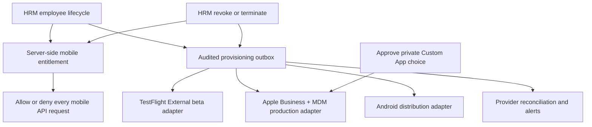

# Plan: HRM-Managed Mobile Membership And Private Distribution (Cancelled)

## Type
Feature

## Status
Cancelled

## Created Date
2026-09-15

## Last Updated
2026-09-15

## Goal Or Problem
Make HRM the source of truth for granting and revoking GND employee mobile access, with auditable dashboard operations and automated distribution-provider reconciliation. Restrict both application data and, for the durable iOS release, app acquisition to the intended company workforce without giving ordinary employees Apple developer-portal permissions.

## Current Context
- **Superseding product decision (2026-09-15):** the owner chose a public,
  globally available GND Millwork App Store release and no internal TestFlight
  distribution. This proposed private Custom App/Apple Business/MDM onboarding
  plan is cancelled; do not implement its distribution-provider phases. Its
  server-side HRM authorization/offboarding ideas may inform a separately
  approved future feature, but public distribution does not require Apple
  membership provisioning for ordinary employees. Current release authority is
  ADR-098 and the public App Store runbook.
- GND has `Users.accessRevokedAt`/`deletedAt`; HRM revoke/delete clears legacy and web sessions. The current mobile request model and manual invitation adapter cover REQUESTED through INSTALLED, but INSTALLED is terminal and there is no durable access-grant/revocation or provider reconciliation lifecycle.
- TestFlight Internal Testing is for up to 100 App Store Connect users with app access; External Testing is the ordinary-employee beta route. Neither is durable production distribution. Apple documents private Custom App distribution through Apple Business for specified organization IDs. An unlisted public app is still obtainable by anyone with its link.
- Apple's Developer organization `ZEROES AND ONE TECH HUB NIG LIMITED` (Team `ZXC78SPCV4`) is the seller/signing team; its Team ID is not an Apple Business organization ID. GND's existing `Organization` entity means office/location, not legal-company membership. ADR-052's `TenantMembership` is proposed, not a dependency that can be assumed implemented.
- The iOS app record `GND Millwork` / `com.gnd.prodesk` / Apple app ID `6811442922` exists and has not been approved for public or private production distribution. Clean store build `6` exists in EAS; Apple upload remains a separately gated action.
- Existing Brain references: `features/employee-mobile-access.md`, `features/employee-management-v2.md`, `decisions/ADR-091-internal-ios-testflight-and-audited-mobile-access.md`, `decisions/ADR-052-multi-tenant-company-boundary-and-shared-sales-configuration.md`.

## Proposed Approach
Separate three authorities: HRM employment/authorization, Apple beta membership for release testing, and Apple Business/MDM app assignment for permanent private distribution. HRM revocation must block API data and invalidate sessions first; Apple/MDM offboarding follows through a retryable, auditable provider operation. Ordinary staff never become App Store Connect users simply to install GND.

Prefer an Apple Business private Custom App for production, targeted at the verified Apple Business organization ID, with MDM-managed app licenses for automated assignment/removal. Keep TestFlight External Testing as a limited beta bridge for regular staff. Reserve TestFlight Internal/ASC team membership for actual release operators or developer/tester staff who need portal access. Before selecting private distribution, verify Apple Business enrollment, supported region, organization ID, managed-device/BYOD policy, MDM provider, app-review requirements, and whether the existing app record is still eligible; the Account Holder must approve the irreversible public-versus-private choice before first approval.

## Visual Plan

## Implementation Steps
1. **Decision and inventory.** Establish the authoritative workforce definition (employees, managers, contractors/drivers, release operators), permitted devices/BYOD policy, approver roles, SLA, and whether HRM request approval or HRM employment alone grants mobile use. Verify Apple Business organization ID separately from Team ID; inspect existing Apple Business/MDM/identity-provider integrations and app distribution setting read-only. Confirm private Custom App feasibility before any App Store approval.
2. **Server-side entitlement and immediate offboarding.** Add a platform-scoped mobile entitlement (`IOS`, `ANDROID`) keyed by the existing employee ID, with grant/revoke actor, reason, effective dates, revision, and an append-only event ledger. Gate mobile sign-in/session renewal and every mobile API entry point on active employee + current entitlement; do not trust the dashboard, build availability, request status, or cached client role. On HRM revoke/delete, atomically revoke entitlements, bump authorization revision, terminate mobile/web/legacy sessions, and deny reads/writes immediately. Restoration requires a new explicit review rather than silently replaying stale invitations.
3. **HRM dashboard lifecycle.** Extend the existing employee management and Support > Mobile App surfaces with per-platform eligibility, request/approval, target distribution track, invitation/assignment state, suspension/revocation, and clear mismatch/error states. Separate the employee-facing REQUESTED/APPROVED/INVITED/ACCEPTED/INSTALLED history from provider operational states such as PENDING, SENT, CONFIRMED, FAILED, RETRYING, REVOKED; permit cancellation/offboarding after INSTALLED. Require a dedicated HRM mobile-access permission or Super Admin, step-up/second approver for bulk grants/revocations, server-derived actor, reason, and immutable audit events.
4. **Safe automation boundary.** Use an outbox/job adapter with idempotency keys, exact provider/employee/app IDs, encrypted server-side credentials only, least-privilege API roles, rate-limit/backoff handling, dead-letter review, reconciliation, and dry-run preview. No Apple password/OTP or API key in browser requests, mobile code, HRM records, or logs. Do not equate email strings with Apple identity until the match is verified; store opaque provider IDs and detect collisions, changed email, pending invites, and manual portal changes.
5. **Beta bridge.** After separately approved App Store Connect API credentials are available, automate External TestFlight tester invitation/group removal for ordinary employee beta cohorts where Apple API coverage and role permissions are verified. Keep Internal TestFlight/ASC user-invitation automation opt-in for named release operators only; limit role and app visibility, prevent privilege escalation, reconcile pending invitations and accepted users, and remove only app access or company team membership that GND automation owns. Never delete unrelated ASC users or grant everyone portal access. First external beta may require Apple's beta review.
6. **Production private distribution.** After Apple Business enrollment and MDM/provider selection, configure the app as a private Custom App for the correct Business organization ID (Account Holder decision gate). Obtain app licenses, connect Apple Business content token to MDM, map HRM eligibility to MDM-managed user/device assignment, and reconcile installs/removals. Favor managed assignment over redemption codes because redeemed codes cannot be reassigned. On offboarding, revoke license/remove managed app where device policy allows; still deny backend access immediately because Apple may leave a binary installed or provider revocation may lag.
7. **Android parity.** Keep existing Android build scripts/distribution intact; make dashboard APK downloads and any future managed Android assignment depend on the same live entitlement. Document that copied APK files cannot be remotely erased, so runtime authorization is the security boundary. Introduce an Android provider adapter only after identifying the actual managed-distribution service.
8. **Migration, rollout, and validation.** Migrate existing request records without auto-granting from INSTALLED; reconcile known invited staff manually, then pilot one joiner, one revocation, one reinstatement, one provider failure, and one device replacement. Run schema/API/auth/permission tests, negative mobile API tests, dashboard tests, job idempotency/retry tests, production iOS/Android checks, and a staged offboarding drill. Publish runbooks for failed provider calls, stale invites, credential rotation, Apple Business/MDM outage, and emergency HRM-only lockout. Update Brain schema/API/feature docs and record the final distribution/provider decision in a new ADR.

## Affected Files Or Areas
- `packages/db/src/schema/mobile-access.prisma` and additive migration(s); HRM user lifecycle and session tables.
- `apps/api/src/db/queries/mobile-access.ts`, `apps/api/src/db/queries/hrm.ts`, `apps/api/src/trpc/routers/mobile-access.route.ts`, mobile authentication/session/API guards, worker/jobs and provider adapters.
- `apps/dashboard/src/components/settings/app-download-support-page.tsx`, HRM employee list/detail and permission controls; `apps/mobile/src/lib/mobile-auth.ts` and relevant session/error UI.
- `apps/mobile/eas.json`, release runbook, and App Store Connect distribution metadata only after separately approved external action.
- TODO: Apple Business organization ID, MDM provider, identity provider, Android managed-distribution provider, approved secret storage, and final staff/device policy.

## Acceptance Criteria
- A terminated/revoked employee receives no GND mobile API data even if the app remains installed, the Apple invitation remains pending, or a provider call fails.
- Grants and revocations are permission-gated, reasoned, append-only-audited, idempotent, reversible only by explicit review, and visible in HRM with provider reconciliation status.
- Ordinary employees do not need App Store Connect team access. TestFlight is used only for beta cohorts; approved production iOS acquisition is restricted to the selected Apple Business organization(s).
- Provider mutations can be previewed, retried, reconciled, and stopped without duplicate invitations or deletion of non-GND-owned Apple users.
- Android build/distribution behavior remains intact; iOS store signing/EAS linkage is unchanged.
- Focused negative authorization, lifecycle, provider failure, and joiner/leaver tests pass; operational runbooks and Brain documentation are updated.

## Test Plan
- Unit: entitlement policy, status transitions, permission checks, provider identity matching, outbox idempotency/backoff, and conflicting lifecycle events.
- Integration: revoke while TestFlight invite is pending, after INSTALLED, during MDM outage, after employee email change, and with two concurrent admins; confirm immediate API denial and eventual provider convergence.
- Security: anonymous/non-employee/contractor (per approved policy)/revoked callers, stale session, forged employee/provider IDs, direct API calls despite hidden UI, and secrets absent from responses/logs.
- Release: Android scripts unchanged, iOS `distribution: store`, TestFlight beta route, and verified private Custom App visibility/MDM assignment after explicit Apple actions.

## Risks / Edge Cases
- Private-versus-public App Store distribution cannot be switched after app approval without a new app record/binary; decide before first approval.
- Team ID is not the Apple Business organization ID; wrong targeting could disclose the binary to another organization or block GND.
- TestFlight Internal membership conveys App Store Connect access and is capped; it is unsuitable for routine company-wide onboarding.
- SCIM sync can automate Apple Business identities only if an appropriate identity provider is already authoritative; it is not a substitute for MDM app-license assignment or GND runtime authorization.
- Apple/MDM revocation can lag or leave installed binaries; backend denial is the immediate control.
- Legacy HRM `Organization` means office, and future tenant work is proposed; avoid using office membership as the legal-company security boundary.
- Provider account/API credentials, app distribution choice, license acquisition, account permission changes, build upload, and tester invitations remain separate action-time user gates.

## Open Questions
- The private-distribution open questions below are historical and no longer
  gate the current public release. Public account registration versus
  company-account-only use remains a separate product decision.
- TODO: Is the intended workforce employees/managers only, or also active contractors and drivers who currently use mobile workflows?
- TODO: Does GND already have an Apple Business account and organization ID, and which MDM is used for company devices or BYOD?
- TODO: Is an identity provider already authoritative for HRM, and should HRM provision it or consume it?
- TODO: Who may approve access, may managers grant their reports, and is two-person approval required for bulk changes?
- TODO: Is the production target a private Custom App for one company, or a public/unlisted binary with authentication-only restriction? The latter does not restrict download.

## Linked Task
- Task Title: HRM-Managed Mobile Membership And Private Distribution
- Task File: .brain/tasks/2026-09-15-hrm-managed-mobile-membership-and-private-distribution.md

## Primary Sources
- [Apple distribution methods](https://developer.apple.com/help/app-store-connect/manage-your-apps-availability/set-distribution-methods)
- [Apple TestFlight internal testers](https://developer.apple.com/help/app-store-connect/test-a-beta-version/add-internal-testers)
- [App Store Connect API](https://developer.apple.com/documentation/appstoreconnectapi/)
- [Apple Business Custom Apps](https://support.apple.com/en-md/guide/apple-business-manager/axm58ba3112a/web)
- [Apple Business app licenses](https://support.apple.com/en-gb/guide/business/axme19b23f7f/web)
- [Apple managed-app revocation](https://support.apple.com/en-ng/guide/deployment/dep575bfed86/web)
- [Apple Business identity sync](https://support.apple.com/en-gb/guide/business/axm526a05814/web)
