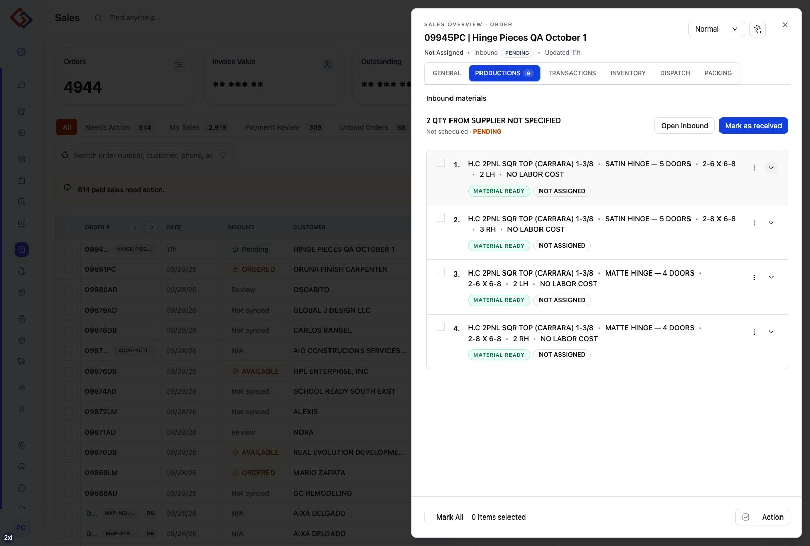

# Order 09945PC production count correction — 2026-10-02

## Result

The local order now opens Productions with 9 required doors, 0 assigned and 0 completed. Four current size rows are displayed: satin 2 LH + 3 RH and matte 2 LH + 2 RH. The browser remains on the corrected Production tab.

## Cause and changes

The requirement controls had positive planned `itemTotal`/`qty` values but `total` defaulted to zero. The shared pipeline reader previously preferred that zero, disabling the tab. Requirement rows now read planned `itemTotal` first; progress rows retain authoritative zero totals, so this cannot fabricate packing or production progress.

Reused house package references also included four old foreign door rows (11 extra doors). Canonical control reconstruction now selects doors owned by the order and applies the existing ownership helper. The production detail reader selects ownership and filters the same rows before presentation.

## Local repair

Executed existing `calibrateSalesOrder` for sale 33347 / order 09945PC, guarded by the local database fingerprint and expected four owned door IDs. Rebuilt derived controls and order-list summary through the existing transaction/lock workflow. No assignment, submission, receipt, reservation or inbound command was executed.

`repair-proof.json` records controls before/after, the resulting snapshot, four displayed UIDs and `protectedStateUnchanged: true`. Prices, order metadata, inventory allocations/demands and assignment records compared equal before/after. This repairs only this local order; no hosted repair, deployment or bulk backfill was performed.

## Verification

- Regression tests initially reproduced the zero-count and foreign-door failures before the fixes.
- 34 tests across seven files pass, with 76 assertions: pipeline quantities, tab counts, control reconstruction, production details, initial scope, audit retention and post-save sync. See `tests.log`.
- Scoped Biome and `git diff --check` pass. Existing legacy formatting in the large control modules was preserved.
- Sales package typecheck reports six unrelated diagnostics in assistant queries, workflow-stock, copy-sales and dealer-pricing-surface; no changed implementation file has a diagnostic. See `typecheck.log`.
- Browser opened the enabled Productions tab and displayed all four current size rows. Two hydration attribute warnings remain in the existing page shell/table (`aria-hidden`/`data-aria-hidden`); no changes to that unrelated presentation were made.

## Brain impact

Updated Sales Overview and production-workspace feature behavior, internal contract semantics, the bug record, completed tasks and progress. No schema, migration, permission or new endpoint change; no new architecture decision beyond applying the existing canonical calibration and ownership policy.
